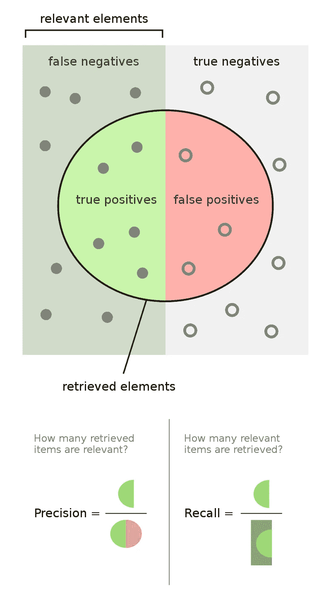
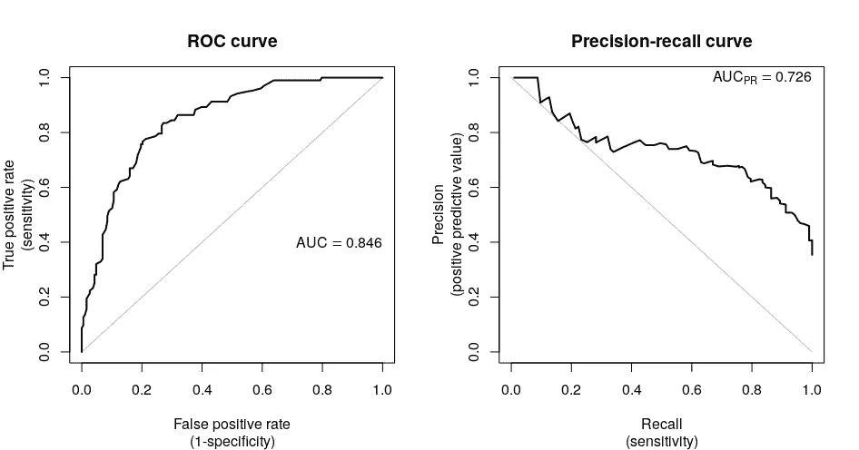

# 勇敢学习机器学习：深入探讨 F1 分数、召回率、精确度和 ROC 曲线

> 原文：[`towardsdatascience.com/courage-to-learn-ml-a-deeper-dive-into-f1-recall-precision-and-roc-curves-d5c0a46e5eb7`](https://towardsdatascience.com/courage-to-learn-ml-a-deeper-dive-into-f1-recall-precision-and-roc-curves-d5c0a46e5eb7)

## F1 分数：你对不平衡数据的关键指标——但你真的知道为什么吗？

 [Amy Ma](https://amyma101.medium.com/?source=post_page-----d5c0a46e5eb7--------------------------------)

·发表于[Towards Data Science](https://towardsdatascience.com/?source=post_page-----d5c0a46e5eb7--------------------------------) ·阅读时间 12 分钟·2023 年 12 月 17 日

--

我们将使用排序衣物的类比来说明召回率和精确度的核心概念；照片由[Ace Maxwell](https://unsplash.com/@acedibwai?utm_source=medium&utm_medium=referral)提供，来源于[Unsplash](https://unsplash.com/?utm_source=medium&utm_medium=referral)

欢迎回到我们‘[勇敢学习机器学习](http://towardsdatascience.com/tagged/courage-to-learn-ml)’系列的旅程中。在本节中，我们将探索度量指标的细微世界。许多资源介绍了这些指标或深入探讨其数学方面，但这些‘简单’数学背后的逻辑有时可能仍然不透明。对于那些刚接触这个话题的人，我建议查看 Shervin 的详细文章以及[neptune.ai](https://neptune.ai/blog/performance-metrics-in-machine-learning-complete-guide)提供的全面指南。

在典型的数据科学面试准备中，处理不平衡数据时，通常首选的指标是 F1 分数，它被称为召回率和精确度的调和均值。然而，为什么 F1 分数特别适用于这种情况的理由往往没有解释。本文致力于揭示这些理由，帮助你理解在不同情境下选择特定指标的原因。

正如往常一样，本篇文章将概述我们要解决的所有问题。如果你一直在思考这些问题，你来对地方了：

+   精确度和召回率到底是什么，我们如何直观地理解它们？

+   为什么精确度和召回率很重要，它们为什么经常看起来相互冲突？是否可以同时达到这两者的高水平？

+   什么是 F1 分数，我们为什么将其计算为召回率和精确度的调和平均数？

+   为什么 F1 分数常用于不平衡数据？它只在这些情况下有用吗？

+   当正类是多数时，F1 分数的解释会有什么变化？

+   PR 曲线和 ROC 曲线有什么区别，我们应该什么时候优先使用其中之一？

在对这些指标有了基本了解后，我们的学习者向正在忙于洗衣的导师提出了第一个问题：

## 我正在开发一个游戏推荐系统。它旨在根据用户的偏好和生活方式推荐视频游戏。但我发现它主要推荐流行游戏，比如今年的 TGA 游戏《博德之门》，用户错过了他们寻找的冷门和经典游戏。我该如何解决这个问题？我应该更改算法还是使用 LLM，考虑到它的强大功能？

[Nick Hamze](https://unsplash.com/@nickhamze?utm_source=medium&utm_medium=referral) 的照片，来自 [Unsplash](https://unsplash.com/?utm_source=medium&utm_medium=referral)

让我们不要急于得出你需要最先进算法的结论。相反，让我们探讨一下为什么你的模型没有按预期表现。看起来你的模型在 Precision@k 上得分很高，但 Recall@k 很低。

为了更好地理解这些指标，让我们逐一解析：

+   *Precision@k = (相关的前 k 个推荐数量)/(推荐的项目总数)*。简单来说，它衡量了你模型推荐的游戏中实际对用户相关的数量。

+   *Recall@k = (相关的前 k 个推荐数量)/(所有相关项目的总数)*。这告诉我们相关游戏中有多少实际出现在你的前 k 个推荐中。

从中可以看出，用户经常能在你的推荐中找到相关游戏，但并不是所有相关游戏都能出现在你的前 k 个列表中。需要注意的是，推荐的项目是你模型预测为相关的项目，这可以被视为‘预测为相关的项目数量’。

## 等等，你是建议我使用召回率和精确度来评估我的模型吗？但召回率和精确度主要用于不平衡数据，不是吗？它们的调和平均数 F1 分数也是如此。

你已经掌握了精确度和召回率的一个重要方面，并理解了为什么准确率并不总是可靠。然而，你对召回率和精确度的看法似乎有些局限，不应将它们仅限于处理不平衡数据的场景。让我们把这个问题分解成更小的部分，从以下开始：

## 精确度和召回率是什么？

**精确度衡量了模型的正预测的准确性**，计算公式为：

*Precision = 正确预测为正类的样本数量 / 预测为正类的样本总数 = 真正例 / (真正例 + 假正例)*

另一方面，**召回率评估模型识别所有正例的能力**，计算方法如下：

*召回率 = 正确预测为正的样本数量 / 实际正样本总数 = 真正例 / (真正例 + 假负例)*

> *记住 TP 和 TN 的一个快速提示：第一个字母（True/False）表示你的预测是否正确，而第二个字母（Positive/Negative）则指的是* ***预测的*** *标签。因此，真正例（true positive）意味着‘正确预测为正’，而假负例（false negative）则是‘错误预测为负……实际上是正的！’*
> 
> *预测为正的总数量是* ***真正例*** *(TP) 和假* ***正例*** *(FP) 的总和。*

来源: [`upload.wikimedia.org/wikipedia/commons/thumb/2/26/Precisionrecall.svg/800px-Precisionrecall.svg.png`](https://upload.wikimedia.org/wikipedia/commons/thumb/2/26/Precisionrecall.svg/800px-Precisionrecall.svg.png)

让我提供**一个直观的例子**来理解这两个术语：假设我在整理衣物，我的目标是从堆积的衣物中挑选出所有脏衣物进行洗涤。在这种情况下，精确度指的是我能多准确地识别出一件衣物是否脏。同时，召回率则衡量我能正确识别出多少实际的脏衣物。

那么，我们的下一个问题是：

## 为什么我们关心精确度和召回率，它们为何经常看起来互相冲突？是否可能同时拥有高精确度和高召回率？

**精确度和召回率的重要性在于它们的互补性质。** 再次使用衣物分类的类比。我的目标有两个：首先，确保所有脏衣物都被挑选出来，其次，避免不必要的洗涤。将其与指标联系起来，精确度就像是我正确识别脏衣物并通过不洗干净的衣物来节省精力。而召回率则评估我成功收集所有脏衣物的能力。

为了澄清，我们来看看两个极端的情况：

+   如果只关注高精确度，我会非常挑剔，只选择明显有污渍的衣物进行洗涤。这意味着可能会忽略一些不太明显的污垢，比如只有一点猫毛的衬衫。因此，我只会洗涤一小部分衣物，留下些脏衣物（因此召回率低）。

+   如果我优先考虑高召回率，我会在没有分类的情况下洗涤所有衣物。这确保了所有脏衣物都被清洗，但也意味着清洁的衣物也会被洗涤（导致精确度低）。

无论你处理什么类型的衣物，你可以看到，选择的指标确实会影响我们的（模型的）行为。**召回率和精确度衡量了不同的方面，同时优化这两个指标是具有挑战性的**。这就是为什么在分类中，我们谈论它们之间的权衡。它们共同作用，以确保我们的模型准确预测，同时捕捉到所有正例。

接下来，让我们深入探讨：

## 什么是 F1 分数，为什么它被计算为召回率和精确率的调和平均数？

大多数数据科学面试指南建议通过使用 F1 分数来处理不平衡数据，F1 分数是召回率和精确率的调和平均数。但通常，它们没有解释为什么 F1 分数在这些情况下有效。

那么，为什么使用 F1 分数？在模型评估中，我们关注的是平衡精确率和召回率——我们希望正确的预测和全面的覆盖。单独监控这两个指标可能很繁琐，因此更喜欢一个反映这种平衡的单一指标。简单平均并没有揭示平衡的很多信息；高分数仍可能掩盖不平衡。然而，F1 分数中使用的调和平均数对极端值的惩罚更为严重。如果召回率或精确率较低，它将显著降低 F1 分数。

考虑两个假设的案例以理解为什么我们使用调和平均数而不是简单平均数：

+   **场景 A**: 精确率 = 0.9，召回率 = 0.1

+   **场景 B**: 精确率 = 0.5，召回率 = 0.5（更平衡的情况）

**简单平均计算**:

+   场景 A: (0.9 + 0.1) / 2 = 0.5

+   场景 B: (0.5 + 0.5) / 2 = 0.5

**调和平均计算**（F1 分数）:

+   场景 A: 2 * (0.9 * 0.1) / (0.9 + 0.1) = 0.18

+   场景 B: 2 * (0.5 * 0.5) / (0.5 + 0.5) = 0.5

尽管这两个场景的平均值相同，但简单平均掩盖了场景 A 的较差召回率。**另一方面，调和平均数提供了对精确率和召回率之间平衡的更准确反映。** 更高的 F1 分数表明更好的平衡。

## 那么……为什么 F1 分数常用于不平衡数据，它的使用是否仅限于这些场景？

让我们探讨不平衡数据的挑战，这在二分类问题中很常见。在这里，一个类别通常样本数量远少于另一个类别，并且代表了稀有但重要的案例（如客户流失或癌症诊断）。这些稀有案例通常有更高的后果，准确识别它们至关重要。我们需要一个不仅能做出准确预测的模型，还能有效识别这些稀有案例。**这一要求使我们需要在精确率和召回率之间寻求平衡，而 F1 分数成为一个便捷的工具。** 它提供了一个反映这种平衡的单一数字，使其在不平衡数据集中成为首选指标。F1 分数的价值在于它能准确描绘模型在识别少数类别方面的效果。

然而，F1 分数的有用性并不限于不平衡数据集。**它在任何需要平衡精确率和召回率的地方也很相关，即使是在平衡的数据集中。** F1 分数仍然是平衡精确率和召回率的重要指标，并且简化了模型比较。

除了 F1 分数之外，其他指标在评估不平衡数据的模型表现时也很有用。

## 我听说过 F1、精确度和召回率是非对称的指标，这意味着它们取决于哪个类别被标记为正类。当正类实际上是多数类时，F1 分数的解释会发生什么变化？

好问题。为了回答这个问题，我们可以考虑一下，如果将多数类视为正类，召回率和精确度会如何变化。由于大多数样本将被预测为正类，获得高召回率变得更容易。

但这里有一个问题：**高精确度在这种情况下可能具有误导性**。由于多数类较大，仅仅通过始终预测多数类就容易获得高精确度。将多数类转为正类后，我们忽视了模型处理稀有类的能力，特别是在不平衡数据的情况下。**因此，精确度和召回率之间的平衡不再保证模型的有效性，因为其重点已发生转移。** 这意味着即使模型在识别少数类方面表现不佳，它仍可能显示出高 F1 分数。

当正类占据多数时，高 F1 分数可能无法真实反映模型识别少数类的能力。这可能仅仅意味着模型经常预测多数类。

在这种情况下，明智的做法是包括其他不那么偏向多数类的指标，比如负类（少数类）的召回率，以便全面了解模型的性能。

## F1 分数有哪些局限性？我们还可以使用哪些其他指标来评估不平衡数据上的模型性能？

你知道，我们经常以类似回归的方式来处理分类问题。我的意思是，一些算法预测的是概率，而不仅仅是类别。对于这些算法，你需要设置一个阈值。**但 F1 分数并不能真正展示模型在不同阈值下的表现。** 这就是 ROC 曲线或精确度-召回率曲线发挥作用的地方，它们帮助我们评估在各种阈值下的表现。

我们进行分类的方式往往是类似回归的。我的意思是，有些算法会预测概率而不是类别。对于这些模型，我们需要选择一个阈值。**然而，F1 分数无法提供与不同阈值相关的模型性能的说明。** 因此，我们可以使用 ROC 曲线或精确度-召回率曲线来考虑模型在不同阈值下的表现。此外，曲线下面积（AUC）指标作为一个单一的数字总结，方便在多个模型之间进行比较。AUC 的范围从 1（表示完美的分类器）到 0（表示最差的分类器）。值得注意的是，AUC 为 0.5 表示性能等同于随机猜测，此时在所有阈值下真正正类率（TPR）和假正类率（FPR）是相等的。

> 一个有趣的问题是
> 
> **AUC（曲线下面积）值为 0.5 如何等同于分类器进行随机猜测？**
> 
> 当 AUC 等于 0.5 时，ROC 曲线由连接图中点 (0,0) 和 (1,1) 的对角线表示。这条对角线意味着对于这个分类器，我们在所有阈值下 TPR = FPR。简单来说，正确识别一个正例的概率与错误地将其标记为负例的概率完全相同。因此，对于任何给定的正例，分类器正确预测的概率是 50%，类似于掷硬币的随机性。这种与随机性的等同凸显了为什么 AUC 为 0.5 被认为表示模型的表现不比随机猜测好。

当面对不平衡的数据时，我们可以使用精确率-召回率曲线来观察模型在不同阈值下平衡精确率和召回率的表现。

**总结一下，** 对于某些场景，我们希望模型能够很好地平衡召回率和精确率。这就是为什么我们使用 F1 分数作为一个单一的度量标准，F1 分数是召回率和精确率的调和均值。但是，在数据不平衡的情况下，特别是在我们更关注少数类别的表现时，F1 分数变得特别重要，因为实现平衡更具挑战性。其他有用的工具包括 ROC 曲线和 PR（精确率-召回率）曲线。

因此，对于你的游戏推荐系统，考虑使用多个指标。这样，你可以更好地评估模型如何检索相关项目（召回率）以及确保这些项目确实相关（精确率）。你可以一起评估 precision@k 和 recall@k，计算 f1@k，或者绘制 PR 曲线。

**在实践中，选择模型指标时必须根据实际错误的成本，** 例如，召回率是否比精确率对你更重要。使用多个指标可以更全面地了解模型的表现。记住，**关键是将你的指标与模型的业务或应用目标对齐。**

在结束这篇文章之前，还有一个话题我想提一下：

## PR 曲线和 ROC 曲线之间有什么区别？在什么情况下你应该选择其中一个而不是另一个？

大多数数据科学面试指南建议在数据不平衡时使用 PR 曲线而不是 ROC 曲线，但通常不会解释何时选择 ROC 曲线。虽然我不会在这里详细说明如何绘制这些曲线（有关这一点，请查看 StatQuest with Josh Starmer 的出色解释 [这里](https://www.youtube.com/watch?v=4jRBRDbJemM)），但我们要了解这些曲线是通过改变阈值并计算两个指标（PR 的精确率和召回率，或 ROC 的 TPR 和 FPR）绘制的。这两条曲线在二分类中代表了不同的平衡：

ROC 曲线与 PR 曲线的样本计算。来源：[`modtools.files.wordpress.com/2020/01/roc_pr-1.png?w=946`](https://modtools.files.wordpress.com/2020/01/roc_pr-1.png?w=946)

ROC 曲线侧重于 TPR 和 FPR；PR 曲线则侧重于精确率和召回率：

+   TPR（召回率）= 正确预测为正类的样本数量 / 总实际正样本数量。

+   FPR = 错误分类为正类的样本数量 / 总实际负样本数量。

虽然精度和召回率仅关注模型在正类上的表现，TPR 和 FPR 提供了预测能力的更广泛视角（正确的正类 vs. 错误分类的样本）。

**ROC 曲线对数据分布的敏感性较低，因为 FPR 使用负类的大小。** 如果负类是多数类，即使有很多负预测，FPR 值也可能保持较低，因为负类的规模更大。这意味着 ROC 曲线对数据不平衡的影响较小。另一方面，PR 曲线使用预测的正类来计算精度，对正类更为敏感。

这意味着什么？这意味着**在比较不同数据集上的模型性能时，ROC 曲线比 PR 曲线提供了更稳定的指标，并能更好地反映模型的性能。** 因此，与其单纯记住 PR 曲线适用于不平衡数据，重要的是认识到 ROC 曲线提供了一致的度量，受数据分布影响较小。

在我们即将进行的会议中，导师与学习者的组合将深入探讨常见的损失函数，通过信息理论和 MLE 的视角探讨交叉熵。如果你喜欢这个系列，请记住你的互动——点赞、评论和关注——不仅仅是支持，它们是推动这个系列不断前进的动力，并激励我持续分享。

本系列的其他文章：

+   勇敢学习机器学习：揭开 L1 和 L2 正则化的神秘面纱（第一部分）

+   勇敢学习机器学习：揭开 L1 和 L2 正则化的神秘面纱（第二部分）

+   勇敢学习机器学习：揭开 L1 和 L2 正则化的神秘面纱（第三部分）

+   勇敢学习机器学习：揭开 L1 和 L2 正则化的神秘面纱（第四部分）

+   勇敢学习机器学习：解码似然性、MLE 和 MAP

如果你喜欢这篇文章，你可以在[LinkedIn](https://www.linkedin.com/in/yujingma45/)找到我，请随时与我联系，提出你的问题和建议！
