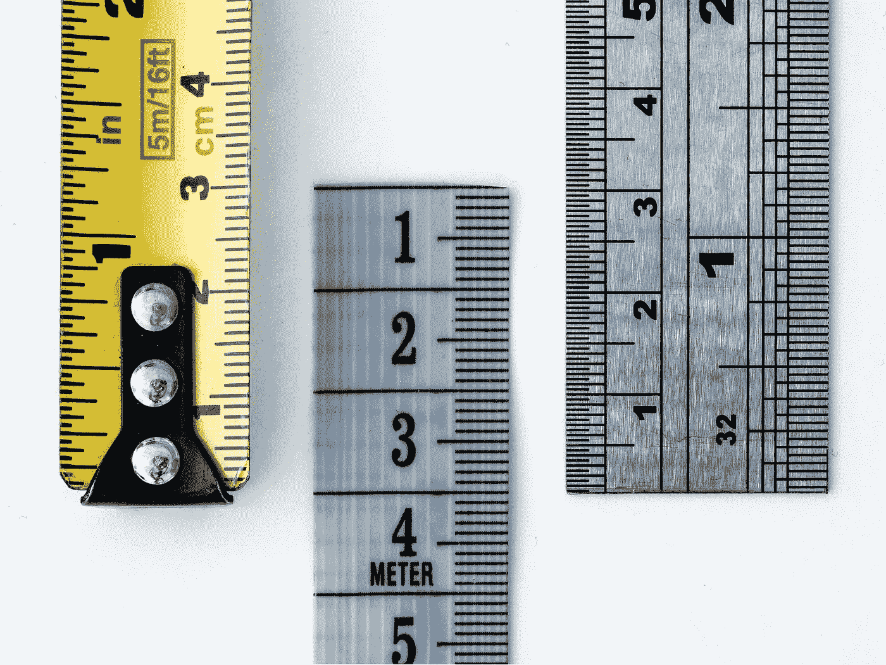

# 勇敢学习机器学习：最常见损失函数的深入指南

> 原文：[`towardsdatascience.com/courage-to-learn-ml-an-in-depth-guide-to-the-most-common-loss-functions-84a6b07cca17?source=collection_archive---------3-----------------------#2023-12-28`](https://towardsdatascience.com/courage-to-learn-ml-an-in-depth-guide-to-the-most-common-loss-functions-84a6b07cca17?source=collection_archive---------3-----------------------#2023-12-28)

## MSE、对数损失、交叉熵、RMSE，以及流行损失函数的基础原则

 [Amy Ma](https://amyma101.medium.com/?source=post_page-----84a6b07cca17--------------------------------)

·

[关注](https://medium.com/m/signin?actionUrl=https%3A%2F%2Fmedium.com%2F_%2Fsubscribe%2Fuser%2Fd6d8df787b&operation=register&redirect=https%3A%2F%2Ftowardsdatascience.com%2Fcourage-to-learn-ml-an-in-depth-guide-to-the-most-common-loss-functions-84a6b07cca17&user=Amy+Ma&userId=d6d8df787b&source=post_page-d6d8df787b----84a6b07cca17---------------------post_header-----------) 发表在 [Towards Data Science](https://towardsdatascience.com/?source=post_page-----84a6b07cca17--------------------------------) ·13 min 阅读·2023 年 12 月 28 日

--

图片由 [William Warby](https://unsplash.com/@wwarby?utm_source=medium&utm_medium=referral) 提供，来源于 [Unsplash](https://unsplash.com/?utm_source=medium&utm_medium=referral)

欢迎回来！在‘[勇敢学习机器学习](http://towardsdatascience.com/tagged/courage-to-learn-ml)’系列中，我们一一征服机器学习的挑战。今天，我们将深入探讨损失函数的世界：这些无声的超级英雄指导我们的模型从错误中学习。在这篇文章中，我们将涵盖以下主题：

+   什么是损失函数？

+   损失函数和指标之间的区别

+   从两个角度解释**均方误差**（MSE）和**平均绝对误差**（MAE）

+   设计损失函数时的三个基本思想

+   利用这三个基本思想来解读**均方误差**（MSE）、**对数损失**和**交叉熵损失**

+   **对数损失**和**交叉熵损失**之间的联系

+   实践中如何处理多个损失函数（目标）

+   **均方误差**（MSE）和**均方根误差**（RMSE）之间的区别

# 损失函数是什么？它们在机器学习模型中为何重要？

损失函数在评估模型学习过程中的有效性方面至关重要，就像考试或…
