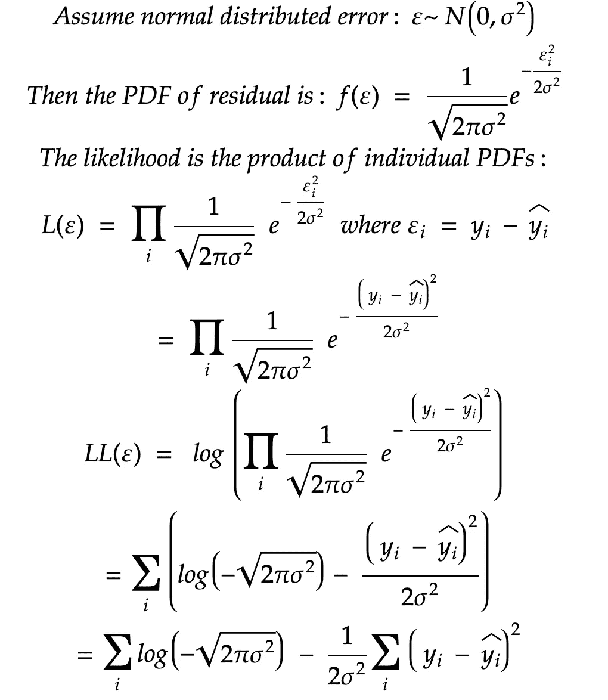

# 勇敢学习机器学习：最常见损失函数的深入指南

> 原文：[`towardsdatascience.com/courage-to-learn-ml-an-in-depth-guide-to-the-most-common-loss-functions-84a6b07cca17`](https://towardsdatascience.com/courage-to-learn-ml-an-in-depth-guide-to-the-most-common-loss-functions-84a6b07cca17)

## MSE、对数损失、交叉熵、RMSE 以及流行损失函数的基础原理

 [Amy Ma](https://amyma101.medium.com/?source=post_page-----84a6b07cca17--------------------------------)

·发表于[Towards Data Science](https://towardsdatascience.com/?source=post_page-----84a6b07cca17--------------------------------) ·13 分钟阅读·2023 年 12 月 28 日

--

由[William Warby](https://unsplash.com/@wwarby?utm_source=medium&utm_medium=referral)拍摄，[Unsplash](https://unsplash.com/?utm_source=medium&utm_medium=referral)

欢迎回来！在‘[勇敢学习机器学习](http://towardsdatascience.com/tagged/courage-to-learn-ml)’系列中，我们一步一步征服机器学习的恐惧。今天，我们将深入探讨损失函数的世界：这些默默无闻的超级英雄引导我们的模型从错误中学习。在这篇文章中，我们将涵盖以下主题：

+   什么是损失函数？

+   损失函数与指标之间的区别

+   从两个角度解释 MSE 和 MAE

+   设计损失函数时的三个基本概念

+   运用这三个基本概念来解释 MSE、对数损失和交叉熵损失

+   对数损失与交叉熵损失之间的关系

+   如何在实践中处理多个损失函数（目标）

+   MSE 和 RMSE 的区别

# 什么是损失函数，它们在机器学习模型中为什么重要？

损失函数在评估模型在学习过程中的有效性方面至关重要，类似于考试或标准。它们作为模型预测与真实标签（即‘正确’答案）之间偏差的指标。通常，损失函数通过衡量模型预测和实际标签之间的差异来评估性能。这种差距的评估向模型提供了关于其参数（如权重或系数）需要调整的程度，以便更准确地捕捉数据中的潜在模式。

机器学习中存在不同的损失函数。这些因素包括预测任务的性质，如回归或分类，目标变量的分布，例如使用 Focal Loss 处理不平衡数据集，以及算法的具体学习方法，如在 SVM 中应用铰链损失。理解和选择合适的损失函数非常重要，因为它直接影响模型如何从数据中学习。

学习机器学习时，应了解最流行的损失函数。例如，均方误差（MSE）和平均绝对误差（MAE）在回归问题中常用，而交叉熵是分类任务中最常用的损失函数。

# 损失函数和度量指标有何不同，损失函数在何种情况下也可以作为度量指标？

关于损失函数也可以作为度量指标的说法可能会误导。损失函数和度量指标都用于评估模型性能，但在不同的阶段和目的下：

+   **损失函数**：这些函数在**模型学习过程中使用**，以指导模型的调整。它们需要是**可微分的**，以便进行优化。例如，均方误差（MSE）和平均绝对误差（MAE）是回归模型中常见的损失函数。

+   **度量指标**：这些**评估模型训练后的表现**。度量指标应该是**可解释的**，并提供关于模型有效性的清晰见解。虽然一些度量指标，如准确率，可能比较直接，但其他如 F1 得分则涉及阈值决策且不可微分，使其不太适合作为学习指导。

值得注意的是，一些度量指标，如 MSE 和 MAE，由于其可微分性和可解释性，可以既作为损失函数也作为度量指标。然而，**并非所有的度量指标都适合作为损失函数**，主要是因为损失函数需要可微分性以用于优化。

实际中，应始终仔细选择损失函数和度量指标**一起**用于学习，并确保学习和评估**朝着相同方向对齐**。这种对齐确保了模型的优化和评估**基于相同标准**，这些标准反映了应用的最终目标。

> **作者注：** 需要明确的是，使用 F1 分数作为机器学习模型的损失函数并非完全不可行。在我持续的研究中，我遇到了一些创新方法，解决了通常与 F1 分数相关的不可微分性问题。例如，Ashref Maiza 的 [帖子](https://medium.com/r?url=https%3A%2F%2Ftowardsdatascience.com%2Fthe-unknown-benefits-of-using-a-soft-f1-loss-in-classification-systems-753902c0105d) 介绍了一种 F1 分数的可微分近似方法。这种方法通过使用似然概念“软化”精确度和召回率，而不是设置任意阈值。此外，一些在线讨论，如 [这个讨论](https://datascience.stackexchange.com/questions/66581/is-it-possible-to-make-f1-score-differentiable-and-use-it-directly-as-a-loss-fun)，也探讨了类似的主题。
> 
> 挑战在于 F1 分数的固有特性。尽管它是一个高度信息量的指标，但选择合适的损失函数来在相同标准下有效优化模型可能会很复杂。此外，调整阈值增加了另一层复杂性。我对这个话题非常感兴趣。如果你有见解或经验可以分享，请随时与我联系。我渴望扩展我的理解并参与进一步的讨论。

# 你提到 MSE 和 MAE 是回归问题中的典型指标。它们是什么以及何时使用它们？

在回归问题中，预测值是连续值，目标是最小化模型预测值与实际值之间的差异。为了评估模型在把握潜在模式方面的有效性，我们使用均方误差 (MSE) 和平均绝对误差 (MAE) 等指标。这两个指标都量化了预测值和实际值之间的差距，但它们使用不同的评估方法。

MSE 的定义为：

这里，y_i 是实际值，y_hat_i 是预测值，n 是观察值的数量。

MSE 计算预测值和实际值之间平方差的平均值，这相当于预测值与真实标签之间的欧几里得距离（l2 范数）。

另一方面，MAE 的定义为：

在这里，实际值和预测值之间的绝对差异被平均，这对应于曼哈顿距离（l1 范数）。换句话说，MAE 计算估计值与实际值之间的平均距离，**不考虑方向**（正或负）。

> 我们在讨论 l1 和 l2 正则化时谈到了 Lp 范数和不同的距离 [`medium.com/p/1bb171e43b35`](https://medium.com/p/1bb171e43b35)。

MSE 和 MAE 的主要区别在于它们对**异常值**的响应。MSE 通过平方错误放大并赋予较大错误更多权重，使其对异常值敏感。**如果较大错误在你的问题上下文中更为重要，这很有用。** 然而，MAE 对所有错误赋予相等的权重，使其对异常值和非正态误差分布更为鲁棒。

选择 MSE 还是 MAE 应基于训练数据的特性和模型中较大错误的影响。当我们希望对较大错误进行重罚时，MSE 更为合适，而当我们希望平等对待所有错误时，MAE 则更为适用。

# 我明白 MSE 中平方差异会放大错误，从而对异常值给予更多关注。还有其他观点或方面可以帮助区分这两种指标吗？

当然，还有另一种视角可以理解 MSE（均方误差）和 MAE（平均绝对误差）之间的差异，超越它们对异常值的处理。假设你需要预测一个值‘y’而没有任何额外的特征（没有‘X’）。在这种情况下，最简单的模型将对所有输入预测一个常数值。

使用 MSE 作为损失函数时，**最小化 MSE 的常数是目标值的均值**。这是因为均值是使所有点的平方差之和最小的中心点。另一方面，如果使用 MAE，目标值的中位数就是最小化常数。与均值不同，中位数对极端值或异常值的影响较小。

在道格拉斯·亚当斯的《银河系漫游指南》中，42 是生命、宇宙和一切的**终极答案**。谁知道呢，也许 42 还是缩小你的损失函数的魔法数字——但这完全取决于你的损失函数是什么！图像由 ChatGPT 创建

这种对异常值敏感度的差异源于均值和中位数的计算方式。均值考虑了每个值的大小，使其更容易受到异常值的影响。而中位数只关心值的顺序，因此无论数据集的极端值如何，都能保持其位置。中位数的这种内在特性使得 MAE 对异常值具有更强的鲁棒性，提供了 MSE 和 MAE 在建模环境下不同表现的另一种解释。

> 你可以在 Shubham Dhingra 的文章中找到关于均值如何最小化 MSE 以及中位数如何最小化 MAE 的解释。

我们讨论了 MSE 和 MAE 如何测量误差，但事情远不止于此。不同的任务需要不同的方式来衡量我们的模型表现如何。这就是损失函数的作用所在，背后有三个基本思想。理解这些思想将帮助你为任何工作选择合适的损失函数。那么，让我们从最重要的问题开始：

# 设计任何损失函数的三个基本思想是什么？

在设计损失函数时，通常有三个基本思想指导这一过程：

1.  **最小化残差**：关键是减少残差，即预测值与实际值之间的差异。为了处理负误差和正误差，我们通常会对这些残差进行平方，如**最小二乘法**中所见。这种方法，通过求和平方残差，在回归问题中因其简单性和有效性而成为主流。

1.  **最大化似然（MLE）**：这里的目标是调整模型参数以最大化观察到的数据的似然，使模型尽可能代表潜在过程。这种**概率方法**在逻辑回归和神经网络等模型中至关重要，在这些模型中，将模型拟合到数据分布上是关键。

1.  **区分信号与噪声**：这一原则源于**信息论**，涉及将有价值的数据（信号）与无关的数据（噪声）分开。基于这一思想的方法，专注于熵和不纯度，在分类任务中至关重要，并构成了决策树等算法的基础。

此外，重要的是要认识到**某些损失函数是针对特定算法量身定制的**，例如 SVM 的铰链损失，这表明算法的性质也在损失函数设计中发挥作用。此外，**数据的性质会影响损失函数的选择**。例如，在训练数据不平衡的情况下，我们可能会将损失函数调整为类平衡损失或选择焦点损失。

现在，掌握了这些基本概念后，让我们应用它们进行解释性分析，以增强我们的理解。通过这种方法，我们可以尝试解决以下问题：

# 我们如何应用最大似然估计（MLE）和最小二乘法来增强对 MSE 的理解？

首先，让我们用最小二乘法来分解均方误差（MSE）。最小二乘估计（LSE）方法通过**最小化残差的平方和**来找到最佳的模型拟合。在线性回归（处理连续输出）中，残差是预测值与实际标签之间的差异。MSE，即均方误差，本质上是这些平方差异的平均值。因此，最小二乘法旨在最小化 MSE（考虑到这个平均步骤），使得 MSE 成为该方法的合适损失函数。

接下来，从最大似然估计（MLE）的角度看，**在假设线性回归的情况下，我们通常假设残差服从正态分布**。这允许我们将观察数据的似然性建模为单个概率密度函数（PDF）的乘积。为了简化，我们对这种似然性取自然对数，将其转化为单个 PDF 对数的和。需要注意的是，我们使用密度函数用于连续变量，而不是概率质量函数用于离散变量。

注意：似然计算在离散变量和连续变量之间有所不同。离散变量使用概率质量函数，而连续变量使用概率密度函数。有关 MLE 的更多信息，请参阅我的 [上一篇文章](https://medium.com/p/65218b2c2b99)。

当我们检查对数似然时，它包含两个部分：一个常数成分和一个变量成分，后者计算真实标签与预测之间的平方差。**为了最大化这种对数似然，我们专注于最小化变量成分，这本质上是平方残差的总和**。在实际线性回归的背景下，这种最小化等同于最小化 MSE，尤其是当我们考虑到由正态分布假设引起的缩放因子 1/2*σ*² 时。

总之，MSE 可以从最小二乘估计（LSE）和 MLE 两种角度推导和理解，每种方法提供了一个独特的视角来探讨 MSE 在回归分析中的重要性和应用。

# 所以 MSE 是回归问题中常见的损失函数。但我可以将它用于分类问题吗？比如逻辑回归？

MSE 虽然在回归中很常见，但对于分类任务，如逻辑回归，并不理想。**主要原因是输出的性质不匹配**：逻辑回归预测的是概率，而 MSE 假设的是连续数值。这种不一致导致了理论和实际应用中的挑战。

实际上，**MSE 在与逻辑回归结合时会产生非凸的损失面，逻辑回归通常使用 sigmoid 激活函数**。这种非凸性意味着误差面有多个局部最小值，使得像梯度下降这样的优化算法难以找到全局最小值。基本上，算法可能会在局部最小值处“卡住”，导致模型性能次优。

此外，**将 MSE 与 sigmoid 函数结合可能导致梯度变得非常小**，特别是对于极端输入值。这会导致“梯度消失”问题，使得模型停止学习或学习非常缓慢，因为模型参数的更新变得微不足道。

因此，对于分类问题，尤其是像逻辑回归这样的二分类问题，MSE 并不是一个理想的损失函数。

# 那么，什么是适用于逻辑回归或更一般分类问题的良好损失函数呢？

好的，让我们深入探讨逻辑回归的损失函数世界，看看如何应用一些基本的设计理念来更好地理解它们。

首先，让我们看看**最小二乘法**。这里的核心思想是最小化模型输出与真实标签之间的差距。一种简单的方法是设定一个阈值，将逻辑回归的概率输出转换为二元标签，然后将这些标签与真实标签进行比较。如果我们选择 0.5 作为分类甜甜圈和百吉饼的阈值，我们将大于 0.5 的预测标记为甜甜圈，小于 0.5 的标记为百吉饼，然后计算不匹配的数量。这种方法称为**0–1 损失**，它直接对应于准确度，但由于其不可导性和非凸性，未被用作训练的损失函数，使得其在梯度下降等优化方法中不够实用。它更多的是一种概念上的方法，而非实际的损失函数。

当我第一次访问美国时，我无法分辨甜甜圈和百吉饼之间的区别。一个区分甜甜圈和百吉饼的分类器可能会很有用。图像由 ChatGPT 创建

接下来，让我们使用**最大似然估计（MLE）**的概念。在逻辑回归中，MLE 试图找到最大化实际观察数据概率的权重和偏置。假设我们的目标是找到一组最大化对数似然的权重和偏置，其中似然 *L* 是观察每个结果的个体概率的乘积。我们**假设我们的数据点是独立的，并且每个点都遵循伯努利分布**。

所以我们有了对数损失函数：

最后，让我们引入一些**信息论**的概念，将逻辑回归视为一个信号捕获机器。在这种方法中，我们使用熵和交叉熵等概念来评估我们模型捕获的信息。熵度量事件的不确定性或惊讶程度。交叉熵衡量我们模型的预测概率分布与实际真实分布的匹配程度。这里的目标是最小化交叉熵，这类似于最小化 KL 散度。虽然 KL 散度在严格意义上不是一种“距离”，但它表示我们的模型预测与实际标签之间的偏差程度。

Softmax 是我写作列表中的另一个主题。来源：*https://towardsdatascience.com/cross-entropy-loss-function-f38c4ec8643e*

因此，通过应用三种不同的设计原则，我们已经制定了各种适合逻辑回归和更广泛分类挑战的损失函数。

特别有趣的是，尽管起源于不同的角度，**对数损失和交叉熵损失在二分类的背景下本质上是相同的**。这种收敛发生在只有两个可能结果的情况下；在这些条件下，交叉熵轻松简化并转化为对数损失。理解这种转变对于理解这些理论概念的相互作用和实际应用至关重要：

从交叉熵损失推导对数损失。来源：*https://towardsdatascience.com/cross-entropy-loss-function-f38c4ec8643e*

> **作者注：** 未来，我计划深入研究信息理论这一迷人的领域——这一主题令人惊讶地既直观又在现实应用中非常实用。在此之前，我强烈推荐 Kiprono Elijah Koech 的文章作为该主题的优秀资源。敬请关注更多内容！

# 在实际场景中，应该如何处理需要最小化多个损失函数的情况？

在模型中管理多个损失函数时，平衡它们可能会面临挑战，因为它们可能会冲突。一种常见的方法是创建这些损失函数的加权和，为每个损失函数分配特定的权重。然而，这会引入新的超参数（权重），需要仔细调整。调整这些权重意味着需要重新训练模型，这可能是耗时的，并且可能会影响模型的可解释性和性能。

或者，一种基于约束的方法也可以有效。例如，在 SVM 中，我们的目标是最大化间隔（减少方差）同时最小化分类误差（减少偏差）。这可以通过将间隔最大化作为约束，使用拉格朗日乘数等技术，并专注于最小化分类误差来实现。这种方法需要坚实的数学基础和深思熟虑的约束制定。

第三个选项是解耦目标，为每个目标构建单独的模型，然后将它们的结果进行组合。这种方法简化了模型开发和维护，因为每个模型可以独立监控和重新训练。它还提供了响应目标或业务目标变化的灵活性。然而，重要的是要考虑这些模型的组合结果如何与整体目标对齐。

然而，重要的是要理解 GAN 中的对抗性损失不仅仅是鉴别器和生成器损失的组合。这是因为两个网络处于响应性互动中，相互学习和适应，而不是独立优化它们的损失。

在我们结束之前，我想解决一个简单但实用的问题：

# 为什么我们有时更倾向于使用 RMSE（均方根误差）而不是 MSE？

MSE（均方误差）在某些情况下由于其可解释性，通常优于 MSE（均方误差）。通过取 MSE 的平方根，RMSE 将误差单位转换回数据的原始单位。这使得 RMSE 更加直观，并且可以直接与分析数据的尺度进行比较。例如，如果你在预测房价，RMSE 提供了一个与价格本身相同单位的误差指标，使得理解误差的大小更为容易。

此外，**RMSE 对较大误差比 RMAE（均方绝对误差）更为敏感，因为平方根转换**，强调了比 RMAE 更显著的偏差。这在较大误差更不受欢迎的情况下尤其有用。

*(除非另有说明，所有图片均由作者提供)*

如果你喜欢[这个系列](http://towardsdatascience.com/tagged/courage-to-learn-ml)，记住你的互动——点赞、评论和关注——不仅仅是支持；它们是推动这个系列持续更新和激励我继续分享的动力。

本系列的其他文章：

+   勇敢学习机器学习：解密 L1 和 L2 正则化（第一部分）

+   勇敢学习机器学习：解码似然性、MLE 和 MAP

+   [勇敢学习机器学习：深入探讨 F1、召回率、精确度和 ROC 曲线](https://medium.com/p/d5c0a46e5eb7)

***如果你喜欢这篇文章，可以在*** [***LinkedIn***](https://www.linkedin.com/in/amyma101/)***找到我。***
