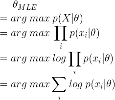
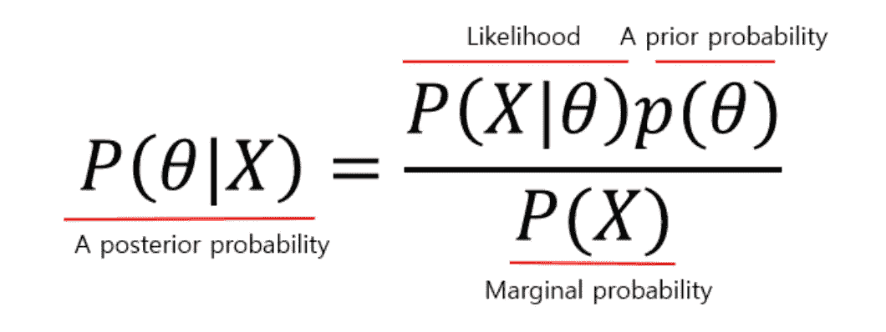
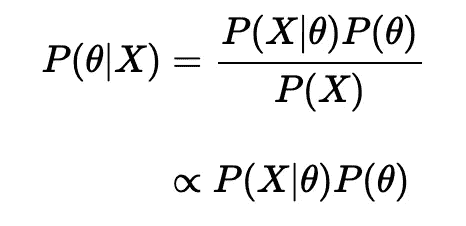
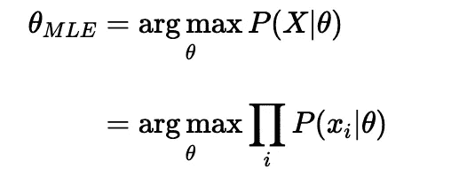
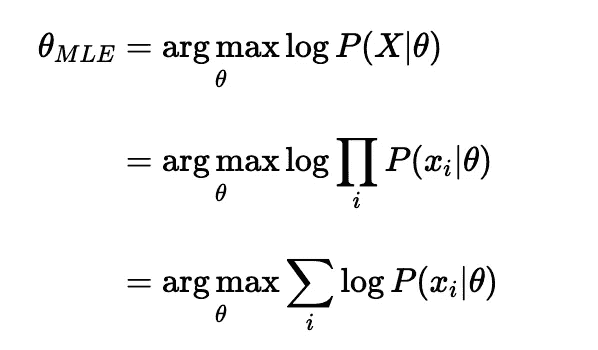
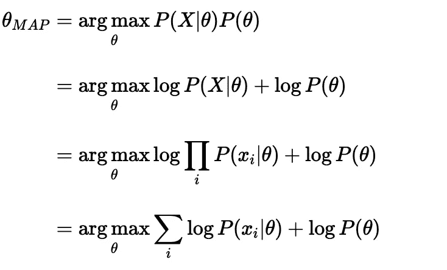

# 勇敢学习机器学习：解码似然、MLE 和 MAP

> 原文：[`towardsdatascience.com/courage-to-learn-ml-decoding-likelihood-mle-and-map-65218b2c2b99`](https://towardsdatascience.com/courage-to-learn-ml-decoding-likelihood-mle-and-map-65218b2c2b99)

## 《猫粮偏好之尾》

 [Amy Ma](https://amyma101.medium.com/?source=post_page-----65218b2c2b99--------------------------------)

·发表于[Towards Data Science](https://towardsdatascience.com/?source=post_page-----65218b2c2b99--------------------------------) ·10 分钟阅读·2023 年 12 月 3 日

--

图片来源：[Anastasiia Rozumna](https://unsplash.com/@rozumna?utm_source=medium&utm_medium=referral) 在[Unsplash](https://unsplash.com/?utm_source=medium&utm_medium=referral)

欢迎来到‘勇敢学习机器学习’。本系列旨在简化复杂的机器学习概念，以轻松且信息丰富的对话呈现，类似于《[勇气不被讨厌](https://www.goodreads.com/book/show/43306206-the-courage-to-be-disliked)》的风格，但专注于机器学习。

在本系列的这一部分，我们的导师-学习者二人组深入探讨 MLE 和 MAP 等统计概念。这一讨论将为我们提供一个新的视角，审视我们之前对 L1 和 L2 正则化的探索。为了完整理解，建议在阅读《勇敢学习机器学习：揭示 L1 和 L2 正则化》的第四部分之前阅读本篇文章。

本文旨在用问答形式解答可能遇到的基本问题。如往常一样，如果你有类似的问题，恭喜你来对地方了：

+   ‘似然’到底是什么？

+   似然与概率的区别

+   为什么在机器学习中，似然如此重要？

+   什么是 MLE（最大似然估计）？

+   什么是 MAP（**最大后验估计**）？

+   MLE 与最小二乘法的区别

+   MLE 与 MAP 之间的联系和区别

# **‘似然’到底是什么？**

似然，或者更具体地说**似然函数**，是一个统计学概念，用于评估在不同模型参数集下观察到给定数据的概率。它被称为似然（函数），因为它是一个量化观察当前数据在不同统计模型参数值下的可能性的函数。

# **似然看起来类似于概率。它是概率的一种形式吗？如果不是，它与概率有何不同？**

概率和似然在统计学中是根本不同的概念。**概率测量的是在已知参数或分布的情况下，观察到特定结果的可能性。** 在这种情况下，参数或分布是已知的，我们关注的是预测各种结果的概率。**而似然则衡量一组潜在参数如何解释观察到的结果。** 在这种设置下，结果已经被观察到，我们试图理解什么样的潜在参数或条件可能导致这些结果。

以一个直观的例子来说明，考虑一下我家猫 Bubble 更喜欢鸡肉而不是牛肉的情况。

我家的猫 Bubble 的照片

当我购买猫粮时，我会选择更多鸡肉味的罐头，因为我知道她更可能喜欢它们并且吃完。这是概率的应用，我利用对 Bubble 偏好的了解来预测未来的结果。然而，Bubble 的偏好不是她明确表达的。我通过观察她过去六年的饮食习惯得出了这个结论。注意到她总是吃更多的鸡肉而不是牛肉，表明她更可能喜欢鸡肉。这个推断过程是使用似然的一个例子。

**重要的是要注意，在统计学中，似然是一个函数。** 这个函数计算的是特定参数集最适合解释观察数据的概率。与概率不同，似然函数的值不一定总和为 1。这是因为概率涉及的是给定参数下所有可能结果的总和，必须为 1，而似然涉及的是给定观察数据下不同参数集的可能性。

# 似然在机器学习的背景下为什么很重要？

理解似然在机器学习背景下的应用需要我们考虑如何评估模型结果。从本质上讲，我们需要一套规则来判断不同的参数集。测量模型当前参数解释观察数据的效果主要有两种方法：

第一个方法涉及使用基于差异的方法。我们比较每个真实标签与相应的预测，并尝试找到一组**最小化这些差异**的模型参数。这是最小二乘法的基本思想，它侧重于误差最小化。

第二种方法是似然，特别是最大似然估计（MLE），在其中发挥作用。MLE 试图找到一组使观测数据最有可能的参数。换句话说，通过观察数据，**我们选择最大化观察当前数据集似然的参数。** 这种方法超越了仅仅最小化误差的层面；它考虑了概率并对参数估计中的不确定性进行建模。

在最大似然估计（MLE）中，基本假设是模型的最佳参数是那些最大化观察到的数据集似然的参数。

总结而言，虽然最小二乘法和 MLE 在方法上有所不同——一个是误差最小化的，另一个是概率性的——但这两者在机器学习工具箱中对于参数估计和模型评估都是必不可少的。我们将在未来的帖子中深入探讨这些方法，讨论它们的区别和联系。

# 能否提供一个直观的例子来对比这两种评估方法（MLE 与最小二乘法）？

考虑到我的猫 Bubble 对食物的偏好，假设我最初认为她喜欢鸡肉和牛肉一样多。为了使用最小二乘法测试这一点，我会通过购买相等数量的鸡肉和牛肉口味罐头来收集数据。当 Bubble 吃东西时，我会记录她每种食物的消费量。然后，最小二乘法将帮助我通过最小化我的预测（平等偏好）与实际消费模式（真实标签）之间的差异（平方误差）来调整我的初始假设（参数）。

对于 MLE 方法，我会先观察 Bubble 随时间的进食习惯，而不是从对她的偏好的假设开始。根据这些数据，我会使用 MLE 找到使观测数据最有可能的参数值（在这种情况下，鸡肉或牛肉的偏好）。例如，如果 Bubble 一直选择鸡肉而不是牛肉，MLE 方法将确定鸡肉偏好的更高概率。

# 所以 MLE 使用似然来选择参数。它们的数学表示是什么？

在最大似然估计（MLE）中，主要目标是确定最有可能生成观测数据的参数集（*θ*）。这个过程涉及定义**似然函数，记作 *L*(*θ*) 或 *L*(*θ*∣*x*)，其中 *x* 表示观测数据。** 似然函数计算在模型参数为 *θ* 的情况下，观察到给定数据 *x* 的概率。

MLE 的本质是找到最大化似然函数的参数值。在数学上，这就是它的表示和计算过程：

本文将通过随后的问题深入探讨这个方程。

# 等一下……我们将似然定义为 L(θ) = p(x|θ)，表示在给定一组参数 *θ* 的情况下观察到数据 *x* 的概率。但是早些时候我们提到过似然涉及到有一组观察数据，然后为一组参数计算似然。难道它不应该是 L(θ) = p(θ|x) 吗？

在理解 MLE 时，区分似然函数和概率是至关重要的。似然函数，记作 *L*(*θ*)，并不等同于概率 p(θ∣x)。

p(θ∣x) 表示在给定观察到的数据 x 的情况下，参数值 θ 的概率（这是贝叶斯推断中的核心概念），而 L(θ) 则是关于似然函数的，它评估不同参数值在解释观察到的数据时的可能性。

计算似然函数时，我们使用在给定特定参数值 θ 的情况下观察数据 x 的概率，记作 p(x∣θ)。这个概率函数用于评估不同参数设置的适用性。因此，在 MLE 中，我们有 L(θ)=p(x∣θ)。重要的是正确解释这个方程：等号在这里意味着我们使用概率 p(x∣θ) 来计算似然 L(θ)；**这并不意味着 L(θ) 和 p(x∣θ) 直接等价**

总结来说，**L(θ) 量化了参数 θ 解释数据 x 的效果，而 p(θ∣x) 则是观察到数据后的参数概率**。理解这一点对于掌握 MLE 的原理及其在统计建模中的应用至关重要。

# 但是，使用 p(θ|x) 是否不会提供更直接的评估，以确定哪一组参数更好，而不是依赖于似然函数呢？

很高兴你注意到了这一重要区别。从理论上讲，计算不同参数集（θ）的 ( p(θ|x) ) 并选择概率最高的那个确实可以直接评估哪一组参数更好。这可以通过 **贝叶斯定理** 实现，该定理有助于计算后验概率 ( p(θ|x) )。

为了计算这个后验概率，我们需要考虑三个关键要素：

+   **似然 ( p(x|θ) )**：这表示在给定一组参数的情况下，观察到的数据的概率。*这是最大似然估计（MLE）的基础，侧重于参数解释观察到的数据的效果。*

+   **先验 ( p(θ) )**：这反映了我们在观察到任何数据之前对参数的初始信念。这是贝叶斯推断中的一个重要部分，其中先验知识关于参数分布被纳入考虑。

+   **边际似然或证据 ( p(x) )**：这衡量了在所有可能参数集下观察到数据的概率，基本上评估了在不做特定参数假设的情况下观察数据的概率。

在实际应用中，边际似然 ( p(x) ) 通常可以忽略，特别是在比较不同参数集时，因为它保持不变且不影响相对比较。

使用贝叶斯定理，我们发现后验 ( p(θ|x) ) **与** 似然函数和先验函数的乘积成正比，( p(x|θ)* p(θ) )。

这意味着在比较不同的参数集时，我们必须同时考虑对参数的先验信念和似然，即观察数据如何修改我们的信念。与 MLE 相似，**在 MAP（最大后验估计）中，我们寻求最大化后验，以找到最佳的模型参数集，综合考虑先验知识和观察数据。**

# 所以，MAP 融入了一个额外的元素，即我们对参数的先验信念。

正确。MAP 确实使用了额外的信息，即我们对参数的先验信念。让我们再次用我的猫 Bubble 的例子来说明。在 MAP 的背景下，当确定 Bubble 喜欢的食物口味——牛肉还是鸡肉时，我会考虑来自饲养员的提示。饲养员提到 Bubble 喜欢吃煮鸡胸肉，因此这一信息形成了我对 Bubble 可能偏爱鸡肉口味的先验信念。因此，在最初选择她的食物时，我会倾向于购买更多的鸡肉口味的食物。这种将饲养员的见解融入 MAP 估计的方法就代表了 MAP 中的‘先验’。

# **我理解 MAP 和 MLE 是相关的，其中 MAP 加入了我们对参数的假设。你能提供一个更简单的例子来展示这两种方法之间的区别和联系吗？**

*为了演示 MAP 和 MLE 之间的联系，我将介绍一些数学公式。虽然本讨论的目标是通过对话直观地解释机器学习概念，但展示这些函数将有所帮助。不要担心复杂性，这些公式只是突出 MAP 相较于 MLE 提供的额外见解，以便更清晰地理解。*

**最大似然估计 (MLE) 侧重于识别使观察数据 x 最有可能的参数集 θ。** 它通过最大化似然函数 P(X|θ) 实现这一目标。

然而，直接最大化概率的乘积（这些概率通常小于 1）可能由于计算下溢——一种数字变得过于微小以至于无法准确表示的情况——而不切实际。为了克服这一问题，我们使用对数，将乘积转化为和。由于对数函数是单调递增的，最大化一个函数等同于最大化其对数。因此，MLE 公式通常涉及概率对数的和。

另一方面，**最大后验估计（MAP）旨在最大化后验概率。** 运用贝叶斯定理，我们发现最大化后验概率等同于最大化先验概率 P(θ)和似然的乘积。与 MLE 一样，我们引入对数来简化计算，将乘积转换为和。

MLE 与 MAP 之间的主要区别在于 MAP 中包含了先验 P(θ)。**这一附加因素意味着在 MAP 中，似然被先验有效地加权，基于我们对参数的先验信念影响估计。** 相比之下，MLE 不包含这种先验，仅关注从观测数据中得出的似然。

# 看起来 MAP 可能优于 MLE。那么我们为什么不总是选择 MAP 呢？

MAP 估计包含了我们对参数分布的先验知识。但这并不 inherently 使它优于 MLE。需要考虑几个因素：

+   **关于参数分布的假设并不总是可用的。** 在假设参数分布为均匀的情况下，MAP 和 MLE 会产生等效的结果。

+   **MLE 的计算简单性通常使它成为更实际的选择。** 虽然 MAP 提供了全面的贝叶斯方法，但它的计算复杂度较高。

+   **MAP 的有效性在很大程度上依赖于选择适当的先验。** 选择不准确的先验可能会导致 MAP 在识别最佳参数集时计算成本增加。

在我们的下一节中，我们的导师-学习者团队将回到深入探讨 L1 和 L2 正则化。掌握了 MLE 和 MAP 的基本知识后，我们将能够从全新的视角查看[L1 和 L2 正则化](https://yujing-ma45.medium.com/understanding-l1-l2-regularization-part-1-9c7affe6f920)。期待在下一篇文章中见到你！

本系列中的其他文章：

+   学习机器学习的勇气：解密 L1 和 L2 正则化（第一部分）

+   学习机器学习的勇气：解密 L1 和 L2 正则化（第二部分）

+   学习机器学习的勇气：解密 L1 和 L2 正则化（第三部分）

+   ***如果你喜欢这篇文章，可以在*** [***LinkedIn***](https://www.linkedin.com/in/amyma101/)***找到我。***

**参考文献：**

 [## MLE 与 MAP：最大似然估计与最大后验估计之间的联系

### 在这篇文章中，我们将看到最大似然估计（MLE）和最大后验估计（MAP）之间的区别…

[最大似然估计 (MLE) 与最大后验估计 (MAP) 之间的区别](https://agustinus.kristia.de/techblog/2017/01/01/mle-vs-map/?source=post_page-----65218b2c2b99--------------------------------)  

### 最大似然估计 (MLE) 和最大后验估计 (MAP) 之间的区别

[最大似然估计 (MLE) 和最大后验估计 (MAP) 之间的区别 - Amir Masoud](https://www.sefidian.com/2022/06/21/difference-between-maximum-likelihood-estimation-mle-and-maximum-a-posteriori-map/?source=post_page-----65218b2c2b99--------------------------------)  

### 在统计数据分析中，“似然”是一个关键概念，它与…关系密切，但具有重要区别  

[似然函数是什么，它在粒子物理学中的应用](https://ep-news.web.cern.ch/what-likelihood-function-and-how-it-used-particle-physics?source=post_page-----65218b2c2b99--------------------------------)  
