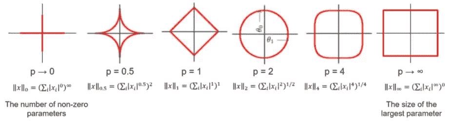
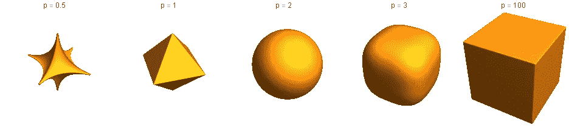
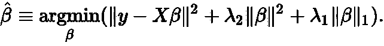

# 勇敢学习机器学习：揭开 L1 和 L2 正则化的面纱（第三部分）

> 原文：[`towardsdatascience.com/courage-to-learn-ml-demystifying-l1-l2-regularization-part-3-ee27cd4b557a?source=collection_archive---------3-----------------------#2023-11-29`](https://towardsdatascience.com/courage-to-learn-ml-demystifying-l1-l2-regularization-part-3-ee27cd4b557a?source=collection_archive---------3-----------------------#2023-11-29)

## 为什么 L0.5、L3 和 L4 正则化不常见

 [Amy Ma](https://amyma101.medium.com/?source=post_page-----ee27cd4b557a--------------------------------)

·

[关注](https://medium.com/m/signin?actionUrl=https%3A%2F%2Fmedium.com%2F_%2Fsubscribe%2Fuser%2Fd6d8df787b&operation=register&redirect=https%3A%2F%2Ftowardsdatascience.com%2Fcourage-to-learn-ml-demystifying-l1-l2-regularization-part-3-ee27cd4b557a&user=Amy+Ma&userId=d6d8df787b&source=post_page-d6d8df787b----ee27cd4b557a---------------------post_header-----------) 发表在 [Towards Data Science](https://towardsdatascience.com/?source=post_page-----ee27cd4b557a--------------------------------) · 6 分钟阅读·2023 年 11 月 29 日

--

照片由 [Kelvin Han](https://unsplash.com/@kelvinhan?utm_source=medium&utm_medium=referral) 提供，来源于 [Unsplash](https://unsplash.com/?utm_source=medium&utm_medium=referral)

欢迎回到《勇敢学习机器学习：揭开 L1 和 L2 正则化的面纱》系列的第三篇文章。在之前的文章中，我们探讨了 [正则化的目的](https://yujing-ma45.medium.com/understanding-l1-l2-regularization-part-1-9c7affe6f920) 和 通过拉格朗日乘子解读 L1 和 L2 方法

继续我们的旅程，我们的导师-学习者二人组将进一步探讨使用拉格朗日乘数的 L1 和 L2 正则化。

在本文中，我们将探讨一些可能引起你兴趣的问题。如果你对这些话题感到困惑，你来对地方了：

+   为什么没有 L0.5 正则化？

+   既然大多数深度学习问题都是非凸的，我们为什么关心一个问题是否是非凸问题？

+   为什么像 L3 和 L4 这样的范数不常用？

+   L1 和 L2 正则化可以结合使用吗？这样做有什么优点和缺点？

# 根据我们上次讨论的问题，我查阅了 Lp 范数，发现 p 的值可以是大于 0 的任何数字。为什么不使用 0 和 1 之间的 p 值？为什么没有 L0.5 正则化？

我很高兴你提了这个问题。直接说，我们通常避免 *p* 小于 1 的值，因为它们会导致非凸优化问题。让我通过一张展示不同 *p* 值的 Lp 范数形状的图像来说明这一点。仔细看看 **当 p=0.5 时，你会注意到形状明显是非凸的**。

不同 p 值的 Lp 范数形状。来源: [`lh5.googleusercontent.com/EoX3sngY7YnzCGY9CyMX0tEaNuKD3_ZiF4Fp3HQqbyqPtXks2TAbpTj5e4tiDv-U9PT0MAarRrPv6ClJ06C0HXQZKHeK40ZpVgRKke8-Ac0TAqdI7vWFdCXjK4taR40bdSdhGkWB`](https://lh5.googleusercontent.com/EoX3sngY7YnzCGY9CyMX0tEaNuKD3_ZiF4Fp3HQqbyqPtXks2TAbpTj5e4tiDv-U9PT0MAarRrPv6ClJ06C0HXQZKHeK40ZpVgRKke8-Ac0TAqdI7vWFdCXjK4taR40bdSdhGkWB)

当我们查看 3D 表示时，情况变得更加清晰，假设我们正在优化三个权重。在这种情况下，很明显问题不是凸的，边界上出现了许多局部最小值。

来源: [`ekamperi.github.io/images/lp_norms_3d.png`](https://ekamperi.github.io/images/lp_norms_3d.png)

我们通常避免在机器学习中使用非凸问题的原因是它们的复杂性。对于凸问题，你可以保证得到全局最小值——这使得解决起来一般更容易。另一方面，非凸问题通常有多个局部最小值，并且可能计算密集且不可预测。正是这些挑战我们在 ML 中试图避免。

当我们使用拉格朗日乘数等技术来优化具有特定约束的函数时，**这些约束必须是凸函数。这确保了将它们添加到原始问题中不会改变其基本性质，从而使问题更难解决。** 这一点至关重要；否则，添加约束可能会使原始问题更加困难。

# 为什么我们在这里关注一个问题或约束是否是非凸问题？难道大多数深度学习问题不是非凸的吗？

你的问题涉及了深度学习中的一个有趣方面。虽然我们并不偏爱非凸问题，但更准确地说是**我们经常在深度学习领域遇到并必须处理这些问题**。原因如下：

1.  **深度学习模型的性质导致非凸损失面**：大多数深度学习模型，特别是具有隐藏层的神经网络，固有地具有非凸损失函数。这是由于这些模型内部发生的复杂非线性变换。非线性变换与参数空间的高维度的结合通常导致一个非凸的损失面。

1.  **局部最小值在深度学习中不再是问题**：在深度学习中典型的高维空间中，局部最小值不像在低维空间中那样成问题。研究表明，深度学习中的许多局部最小值与全局最小值的值接近。此外，鞍点——梯度为零但既不是极大值也不是极小值的点——在这样的空间中更为常见，并且是更大的挑战。

1.  **存在更有效的高级优化技术来处理非凸空间。** 高级优化技术，如随机梯度下降（SGD）及其变体，在这些非凸空间中特别有效地找到良好的解决方案。虽然这些解决方案可能不是全局最小值，但它们通常足够好，可以在实际任务中实现高性能。

尽管深度学习模型是非凸的，但它们在捕捉大型数据集中的复杂模式和关系方面表现出色。此外，对非凸函数的研究持续推进，增强了我们的理解。展望未来，我们有可能以更高效的方式处理非凸问题，减少担忧。

# 为什么我们不考虑使用更高的范数，如 L3 和 L4，进行正则化？

回忆一下我们之前讨论的图像，该图像展示了不同*p*值下 Lp 范数的形状。随着*p*的增加，Lp 范数的形状会发生变化。例如，在*p = 3*时，它类似于一个圆角矩形，而当*p*接近无穷大时，它形成一个完美的正方形。

不同 p 值下的 Lp 范数的形状。来源：[`lh5.googleusercontent.com/EoX3sngY7YnzCGY9CyMX0tEaNuKD3_ZiF4Fp3HQqbyqPtXks2TAbpTj5e4tiDv-U9PT0MAarRrPv6ClJ06C0HXQZKHeK40ZpVgRKke8-Ac0TAqdI7vWFdCXjK4taR40bdSdhGkWB`](https://lh5.googleusercontent.com/EoX3sngY7YnzCGY9CyMX0tEaNuKD3_ZiF4Fp3HQqbyqPtXks2TAbpTj5e4tiDv-U9PT0MAarRrPv6ClJ06C0HXQZKHeK40ZpVgRKke8-Ac0TAqdI7vWFdCXjK4taR40bdSdhGkWB)

在我们的优化问题背景下，考虑更高的范数如 L3 或 L4。类似于 L2 正则化，其中损失函数和约束轮廓在圆角处交叉，这些更高的范数将鼓励权重接近零，就像 L2 正则化一样。（如果这部分不清楚，请随时回顾 [第二部分](https://yujing-ma45.medium.com/courage-to-learn-ml-unraveling-l1-l2-regularization-part-2-1bb171e43b35) 以获取更详细的解释。）基于这一声明，我们可以讨论 L3 和 L4 范数不常用的两个关键原因：

1.  **L3 和 L4 范数表现出与 L2 相似的效果，而没有提供显著的新优势（使权重接近 0）。** 相比之下，L1 正则化会将权重归零并引入稀疏性，有利于特征选择。

1.  **计算复杂性是另一个重要方面。** 正则化会影响优化过程的复杂性。L3 和 L4 范数比 L2 的计算负担更重，使它们在大多数机器学习应用中不够可行。

总结来说，虽然理论上可以使用 L3 和 L4 范数，但它们并没有比 L1 或 L2 正则化提供独特的好处，而且它们的计算低效使得它们不太实用。

# **是否可以结合 L1 和 L2 正则化？**

是的，确实可以结合 L1 和 L2 正则化，这种技术通常称为弹性网正则化。这种方法将 L1（lasso）和 L2（ridge）正则化的特性融合在一起，既有用又有挑战。

弹性网正则化是 L1 和 L2 正则化项的线性组合。它将 L1 和 L2 范数都添加到损失函数中。因此，它有两个需要调整的参数，lambda1 和 lambda2。

弹性网正则化。来源：[`wikimedia.org/api/rest_v1/media/math/render/svg/a66c7bfcf201d515eb71dd0aed5c8553ce990b6e`](https://wikimedia.org/api/rest_v1/media/math/render/svg/a66c7bfcf201d515eb71dd0aed5c8553ce990b6e)

# 使用弹性网正则化的好处是什么？如果有的话，为什么我们不更频繁地使用它？

通过结合这两种正则化技术，弹性网可以提高模型的泛化能力，比单独使用 L1 或 L2 更有效地减少过拟合的风险。

让我们分解一下它的优点：

1.  **弹性网提供的稳定性比 L1 更强。** L1 正则化可能导致稀疏模型，这对特征选择有用。但在某些情况下它也可能不稳定。例如，L1 正则化可能在高度相关的变量中任意选择特征（同时使其他系数变为 0）。而弹性网可以在这些变量之间更均匀地分配权重。

1.  **L2 比 L1 正则化更稳定，但不鼓励稀疏性。** 弹性网旨在平衡这两个方面，可能导致更稳健的模型。

然而，**弹性网正则化引入了一个额外的超参数，需要细致的调整**。在 L1 和 L2 正则化之间取得适当的平衡，并实现最佳模型性能需要**增加计算工作量**。这种额外的复杂性是它不常用的原因。

在下一次会议中，我们将从全新的角度探索 L1 和 L2 正则化，*深入探讨*贝叶斯先验信念以加深理解。暂时先停在这里——期待我们的下一次讨论！

本系列中的其他帖子：

+   勇敢学习机器学习：揭开 L1 和 L2 正则化的神秘面纱（第一部分）

+   勇敢学习机器学习：揭开 L1 和 L2 正则化的神秘面纱（第二部分）

+   ***如果你喜欢这篇文章，可以在*** [***LinkedIn***](https://www.linkedin.com/in/amyma101/)***上找到我。***

**参考：**

[通过迭代软阈值的弹性网正则化](https://web.mit.edu/lrosasco/www/contents/code/ENcode.html#descr)

[链接 3](https://kevinbinz.com/2019/06/09/regularization/?source=post_page-----ee27cd4b557a--------------------------------) [## 正则化介绍

### 部分内容：机器学习序列 后续内容：偏差与方差，梯度下降 内容摘要：1100 字，11 分钟…

[链接 1](https://kevinbinz.com/2019/06/09/regularization/?source=post_page-----ee27cd4b557a--------------------------------) [链接 2](https://ekamperi.github.io/machine%20learning/2019/10/19/norms-in-machine-learning.html?source=post_page-----ee27cd4b557a--------------------------------) [## 规范和机器学习

### 介绍了机器学习和优化中的规范，强调 LASSO 和岭回归。

[链接 4](https://ekamperi.github.io/machine%20learning/2019/10/19/norms-in-machine-learning.html?source=post_page-----ee27cd4b557a--------------------------------)
