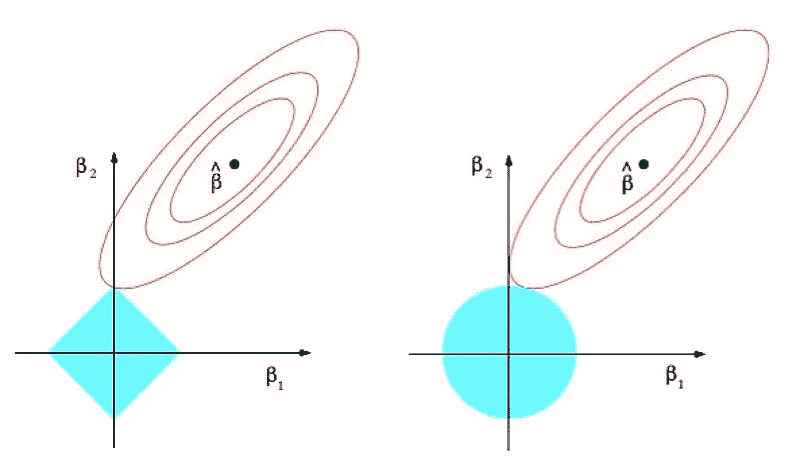
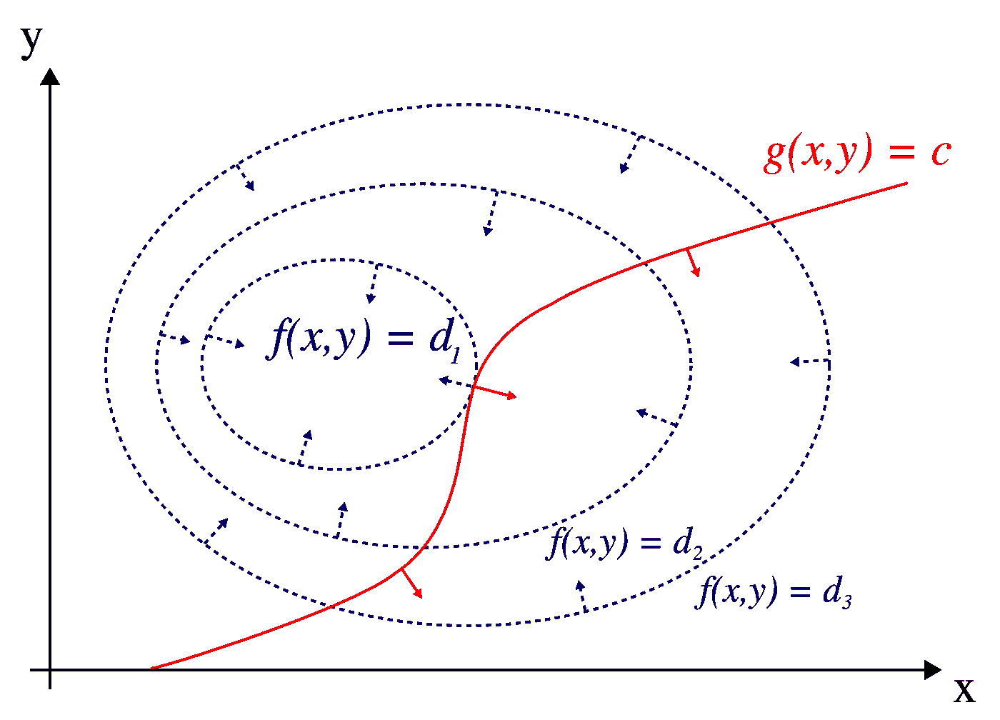
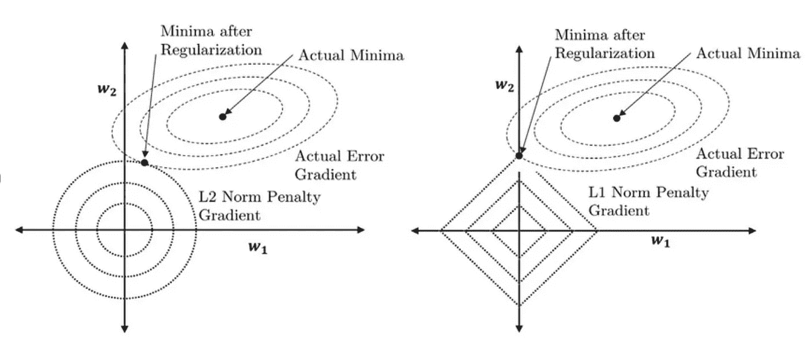

# 学习机器学习的勇气：揭开 L1 与 L2 正则化的神秘面纱（第二部分）

> 原文：[`towardsdatascience.com/courage-to-learn-ml-unraveling-l1-l2-regularization-part-2-1bb171e43b35`](https://towardsdatascience.com/courage-to-learn-ml-unraveling-l1-l2-regularization-part-2-1bb171e43b35)

## 揭示拉格朗日乘子背后的 L1 稀疏性直觉

 [Amy Ma](https://amyma101.medium.com/?source=post_page-----1bb171e43b35--------------------------------)

·发表于 [Towards Data Science](https://towardsdatascience.com/?source=post_page-----1bb171e43b35--------------------------------) ·阅读时间 6 分钟·2023 年 11 月 25 日

--

欢迎回到‘学习机器学习的勇气：揭开 L1 与 L2 正则化的神秘面纱’，第二部分。在 [我们之前的讨论](https://medium.com/@yujing-ma45/understanding-l1-l2-regularization-part-1-9c7affe6f920) 中，我们探讨了较小系数的好处及通过权重惩罚技术获得这些系数的方法。现在，在这篇续集中，我们的导师和学习者将进一步深入 L1 和 L2 正则化的领域。

如果你曾经思考过这些问题，你来对地方了：

+   L1 和 L2 正则化名称背后的原因是什么？

+   我们如何解读经典的 L1 和 L2 正则化图？

+   拉格朗日乘子是什么，我们如何直观地理解它们？

+   应用拉格朗日乘子来理解 L1 稀疏性。

你的参与——点赞、评论和关注——不仅仅是提升士气；它推动了我们的发现之旅！那么，让我们开始吧。

图片由 [Aarón Blanco Tejedor](https://unsplash.com/@the_meaning_of_love?utm_source=medium&utm_medium=referral) 提供，来源于 [Unsplash](https://unsplash.com/?utm_source=medium&utm_medium=referral)

# 为什么它们被称为 L1 和 L2 正则化？

L1 和 L2 正则化的名称直接源于 Lp 范数的概念。Lp 范数代表了计算空间中某点到原点距离的不同方式。例如，L1 范数，也称为曼哈顿距离，计算距离时使用坐标的绝对值，如∣*x*∣+∣*y*∣。另一方面，L2 范数，或称为欧几里得距离，则计算为平方值和的平方根，即 sqrt(x² + y²)。

在机器学习中的正则化背景下，这些范数用于创建添加到损失函数中的惩罚项。你可以将 Lp 正则化视为测量模型权重在高维空间中与原点的总距离。范数的选择会影响惩罚的性质：L1 范数倾向于使一些系数为零，从而有效地选择更重要的特征，而 L2 范数则将系数缩小到接近零，确保没有单一特征对模型的影响过大。

因此，L1 和 L2 正则化的名称来源于这些数学范数——L1 范数和 L2 范数——因为它们将各自的距离计算作为惩罚施加于模型的权重。这有助于控制过拟合。

# **我在学习 L1 和 L2 正则化时经常遇到下面的图表，但我发现很难解读。您能帮忙澄清一下它表示什么吗？**

传统但令人困惑的 L1 和 L2 正则化图表在教科书中常见…… 来源: [`commons.wikimedia.org/wiki/File:Regularization.jpg`](https://commons.wikimedia.org/wiki/File:Regularization.jpg)

好的，让我们一步一步地解析这张图。首先，理解其不同元素的意义是至关重要的。假设我们的损失函数由两个权重 w1 和 w2 定义（在图中我们用 beta 代替 w，但它们表示相同的概念）。图表的轴表示这些我们希望优化的权重。

在没有任何权重惩罚的情况下，我们的目标是找到使损失函数最小化的 w1 和 w2 值。你可以将这个函数的景观想象成一个山谷或盆地，在图中通过椭圆轮廓来表示。

现在，让我们深入了解惩罚。L1 范数，呈菱形，基本上测量了 w1 和 w2 到原点的曼哈顿距离。L2 范数形成一个圆，表示权重的平方和。

椭圆轮廓的中心表示目标函数的全局最小值，在那里我们找到理想的权重。L1 和 L2 形状（菱形和圆形）在原点的中心，其中所有权重为零，突出显示了最小权重惩罚的情况。随着惩罚项强度的增加，模型的权重会趋近于零。这个图表是理解这些动态以及惩罚对权重影响的视觉指南。

# 明白了。所以…… 图表展示了由权重创建的一个维度，而两个不同的形状分别表示目标函数和惩罚。我们应该如何解读标记为 w*的交点？这个点意味着什么？

要全面理解上述图表，必须掌握拉格朗日乘子这一优化关键工具。拉格朗日乘子有助于在特定约束条件下找到函数的最优点（最大值或最小值）。

想象一下你正在登山，目标是到达山顶。虽然有多条路径，但为了安全，你必须沿着指定的安全路径行走。在这里，到达山顶代表了优化问题，而安全路径则象征着约束。

从数学上讲，假设你有一个函数 f(x, y)需要优化。这一优化必须遵守一个约束，由另一个函数 g(x, y) = 0 表示。

拉格朗日乘子 2D。来源：[`upload.wikimedia.org/wikipedia/commons/b/bf/LagrangeMultipliers2D.svg`](https://upload.wikimedia.org/wikipedia/commons/b/bf/LagrangeMultipliers2D.svg)

在维基百科的‘拉格朗日乘子 2D’图中，蓝色轮廓表示 f(x, y)（山的地形），而红色曲线表示约束。这两者的交点，虽然不是 f(x, y)轮廓上的最高点，但代表了在给定约束下的最优解。拉格朗日乘子通过将目标函数与其约束合并来解决这个问题。换句话说，拉格朗日乘子会帮助你更容易找到这个点。

# 所以，如果我们回到 L1 和 L2 图，你是否暗示菱形和圆形代表约束？这是否意味着它们交点的切点本质上是满足这些约束下 f(x, y)的最大值的最佳点？

正确！L1 和 L2 正则化技术的确可以被可视化为分别施加菱形和圆形的约束。因此，这个图帮助我们理解这些正则化方法如何影响函数的优化，通常是机器学习模型中的损失函数。

L2（左）和 L1（右）正则化的更好示例。来源：[`www.researchgate.net/figure/Parameter-norm-penalties-L2-norm-regularization-left-and-L1-norm-regularization_fig2_355020694`](https://www.researchgate.net/figure/Parameter-norm-penalties-L2-norm-regularization-left-and-L1-norm-regularization_fig2_355020694)

1.  **L1 正则化（菱形形状）**：L1 范数创建了一个菱形约束。这种形状的特点是**沿轴的尖角**。当优化过程（如梯度下降）在这个菱形内寻找最小化损失函数的点时，它更可能碰到这些角落。在这些角落，模型的一个权重（参数）变为零，而其他权重保持非零**。L1 范数的这种特性导致了模型参数的稀疏性，这意味着某些权重为零。这种稀疏性对特征选择非常有用，因为它有效地从模型中移除了一些特征。**

1.  **L2 正则化（圆形约束）**：另一方面，L2 范数创建了一个圆形的约束。**圆的平滑、圆润的特性意味着优化过程不太可能在权重为零的坐标轴上找到解决方案。** 相反，L2 范数倾向于均匀地缩小权重，而不一定将任何权重驱动为零。这通过防止权重过大来控制模型复杂性，从而帮助避免过拟合。然而，与 L1 范数不同，它不会导致模型参数的稀疏性。

请记住，拉格朗日乘数并不是掌握 L1 和 L2 正则化的唯一方法。我们在这里休息一下，我将在下一期中回答更多的问题。很快见！

本系列的其他文章：

+   [勇敢学习机器学习：揭示 L1 和 L2 正则化（第一部分）](https://medium.com/@yujing-ma45/understanding-l1-l2-regularization-part-1-9c7affe6f920)

+   勇敢学习机器学习： [揭示](https://medium.com/@yujing-ma45/understanding-l1-l2-regularization-part-1-9c7affe6f920) L1 和 L2 正则化（第三部分）

***如果你喜欢这篇文章，你可以在*** [***LinkedIn***](https://www.linkedin.com/in/amyma101/)***上找到我。***
