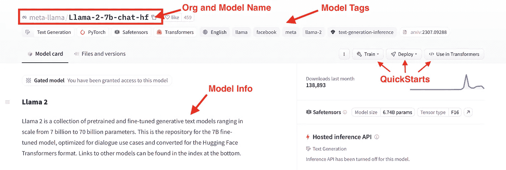
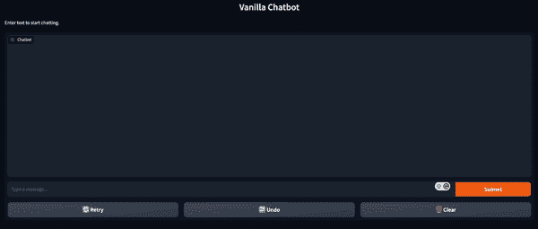
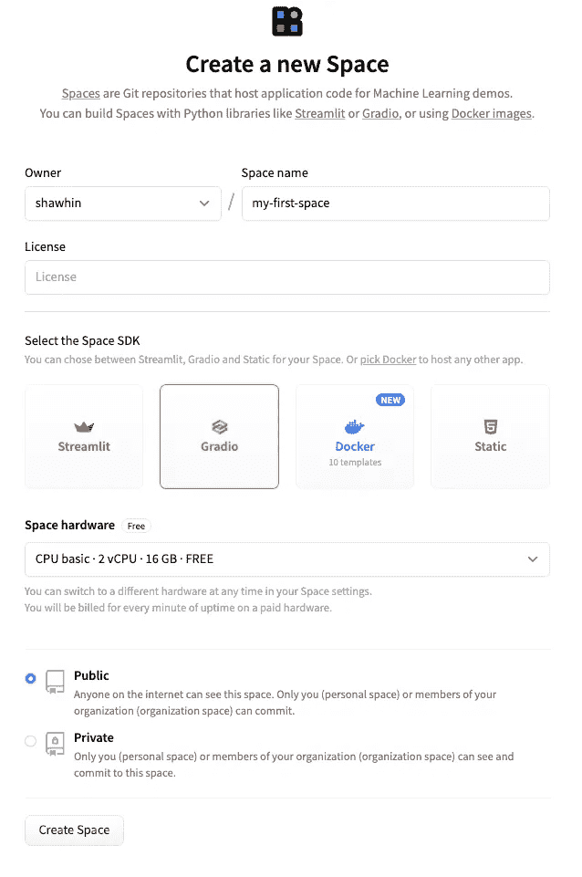

# 破解 Hugging Face Transformers 库

> 原文：[`towardsdatascience.com/cracking-open-the-hugging-face-transformers-library-350aa0ef0161`](https://towardsdatascience.com/cracking-open-the-hugging-face-transformers-library-350aa0ef0161)

## 使用开源 LLMs 的快速入门指南

[](https://shawhin.medium.com/?source=post_page-----350aa0ef0161--------------------------------)[](https://towardsdatascience.com/?source=post_page-----350aa0ef0161--------------------------------) [Shaw Talebi](https://shawhin.medium.com/?source=post_page-----350aa0ef0161--------------------------------)

·发布于 [Towards Data Science](https://towardsdatascience.com/?source=post_page-----350aa0ef0161--------------------------------) ·10 分钟阅读·2023 年 8 月 5 日

--

这是一个关于实践中使用大型语言模型（LLMs）的系列文章中的第 3 篇。在这里，我将为 Hugging Face Transformers 库提供一个适合初学者的指南，该库提供了一种简单且无成本的方式来使用各种开源语言模型。我将从回顾关键概念开始，然后深入示例 Python 代码。


照片由 [Jéan Béller](https://unsplash.com/@chinatravelchannel?utm_source=medium&utm_medium=referral) 提供，发布在 [Unsplash](https://unsplash.com/?utm_source=medium&utm_medium=referral)

在本系列的上一篇文章中，我们探索了 OpenAI Python API，并用它制作了一个定制的聊天机器人。然而，该 API 的一个缺点是 API 调用需要付费，这可能在某些用例中不太适用。

在这些情况下，转向开源解决方案可能会很有优势。一种流行的方法是通过**Hugging Face**的 Transformers 库来实现。

# **Hugging Face 是什么？**

**Hugging Face** 是一家**已经成为开源机器学习（ML）主要中心的 AI 公司**。他们的平台有 3 个主要元素，允许用户访问和分享机器学习资源。

首先是他们快速增长的预训练开源 ML **模型**库，用于自然语言处理（NLP）、计算机视觉等。第二是他们的**数据集**库，用于训练几乎任何任务的 ML 模型。第三，也是最后，是**Spaces**，这是一个由 Hugging Face 托管的开源 ML 应用集合。

这些资源的力量在于它们是社区生成的，利用了开源的所有优势（即免费、大量的工具、多样的资源和快速的创新步伐）。虽然这些使得构建强大的 ML 项目比以往更容易，但 Hugging Face 生态系统的另一个关键元素是——Transformers 库。

# 🤗**Transformers**

**Transformers** 是一个 **使下载和训练最先进的 ML 模型变得简单的 Python 库**。虽然它最初是为开发语言模型而创建的，但它的功能已经扩展到包括计算机视觉、音频处理等模型。

这个库的两个主要优点是，**一**，它能够轻松与 Hugging Face（前面提到的）的 Models、Datasets 和 Spaces 仓库集成，**二**，这个库支持其他流行的 ML 框架，如 PyTorch 和 TensorFlow。

这使得下载、训练和部署机器学习模型和应用程序变得简单而灵活。

## **Pipeline()**

使用这个库的最简单方法是通过 *pipeline()* 函数，它将 NLP（和其他）任务抽象成 1 行代码。例如，如果我们想做情感分析，我们需要选择一个模型，对输入文本进行分词，经过模型处理，然后解码数值输出以确定情感标签（积极或消极）。

虽然这看起来有很多步骤，但我们可以通过 *pipeline()* 函数在 1 行代码中完成所有这些步骤，如下面的代码片段所示。

```py
pipeline(task="sentiment-analysis")("Love this!")

# output -> [{'label': 'POSITIVE', 'score': 0.9998745918273926}]
```

当然，情感分析并不是我们在这里唯一能做的事情。几乎任何 NLP 任务都可以用这种方式完成，例如摘要、翻译、问答、特征提取（即文本嵌入）、文本生成、零样本分类等 —— *有关内置任务的完整列表，请查看* [*pipeline() 文档*](https://huggingface.co/docs/transformers/main_classes/pipelines#transformers.pipeline.task)。

在上述示例代码中，由于我们没有指定模型，因此使用了默认的情感分析模型（即 *distilbert-base-uncased-finetuned-sst-2-english*）。然而，如果我们想更明确一些，可以使用以下代码行。

```py
pipeline(task="sentiment-analysis", 
        model='distilbert-base-uncased-finetuned-sst-2-english')("Love this!")

# ouput -> [{'label': 'POSITIVE', 'score': 0.9998745918273926}]
```

Transformers 库的最大优点之一是我们可以通过简单地更改传递给 *pipeline()* 函数的模型名称，轻松使用 Hugging Face 的 [Models repository](https://huggingface.co/models?pipeline_tag=text-classification&sort=trending) 上的任何 28,000 多个文本分类模型。

## **模型**

在 [Hugging Face](https://huggingface.co/models) 上有大量的预训练模型（截至写作时为 277,528 个）。几乎所有这些模型都可以通过 Transformers 轻松使用，使用与上述代码块中相同的语法。

然而，Hugging Face 上的模型**不仅仅用于 Transformers 库。** 还有其他流行机器学习框架的模型，如 PyTorch、Tensorflow、Jax。这使得 Hugging Face 的模型库对超越 Transformers 库的机器学习从业者也很有用。

要了解浏览代码库的样子，我们可以考虑一个例子。假设我们需要一个可以进行文本生成的模型，但我们希望它可以通过 Transformers 库使用，这样我们就能用一行代码来实现（如上所示）。我们可以轻松地使用“任务”和“库”过滤器来查看符合这些条件的所有模型。

一个符合这些标准的模型是新发布的 Llama 2。更具体地说，*Llama-2–7b-chat-hf*，这是 Llama 2 系列中的一个模型，具有大约 70 亿个参数，优化用于聊天，并且采用 Hugging Face Transformers 格式。我们可以通过它的**模型卡**获得更多有关该模型的信息，如下图所示。



浏览[Llama-2–7b-chat-hf 模型卡](https://huggingface.co/meta-llama/Llama-2-70b-chat-hf)。图片由作者提供。

# **安装** 🤗**Transformers（使用 Conda）**

现在我们对 Hugging Face 和 Transformers 库提供的资源有了基本了解，让我们看看如何使用它们。我们从安装库和其他依赖项开始。

Hugging Face 在其网站上提供了一个[安装指南](https://huggingface.co/docs/transformers/installation)。因此，我不会在这里（不熟练地）重复那个指南。不过，我会提供一个简短的 2 步指南，说明**如何为下面的示例代码设置 conda 环境**。

**步骤 1)** 第一步是下载位于[GitHub 仓库](https://github.com/ShawhinT/YouTube-Blog/tree/main/LLMs/hugging-face)的 hf-env.yml 文件。你可以直接下载文件或克隆整个仓库。

**步骤 2)** 接下来，在你的终端（或 anaconda 命令提示符）中，你可以使用以下命令基于 hf-env.yml 创建一个新的 conda 环境。

```py
>>> cd <directory with hf-env.yml>

>>> conda env create --file hf-env.yml
```

这可能需要几分钟来安装，但一旦完成，你应该就可以开始使用了！

# **示例代码：使用** 🤗**Transformers 进行 NLP**

在安装了必要的库之后，让我们进入一些示例代码。这里我们将调查**3 个 NLP 用例**，即**情感分析、摘要和对话文本生成**，使用*pipeline()*函数。

在最后，我们将使用 Gradio 快速生成一个用户界面（UI）来处理这些用例，并将其作为应用部署在 Hugging Face Spaces 上。所有示例代码都可以在[GitHub 仓库](https://github.com/ShawhinT/YouTube-Blog/tree/main/LLMs/hugging-face)上找到。

## **情感分析**

我们开始情感分析。回忆一下我们之前使用 pipeline 函数来完成类似下面的代码块的操作，其中我们创建了一个分类器，可以将输入文本标记为正面或负面。

```py
from transformers import pipeline

classifier = pipeline(task="sentiment-analysis", \
                      model="distilbert-base-uncased-finetuned-sst-2-english")

classifier("Hate this.")

# output -> [{'label': 'NEGATIVE', 'score': 0.9997110962867737}]
```

为了更进一步，我们可以将文本列表传递给分类器进行批处理，而不是逐个处理。

```py
text_list = ["This is great", \
             "Thanks for nothing", \
             "You've got to work on your face", \
             "You're beautiful, never change!"]

classifier(text_list)

# output -> [{'label': 'POSITIVE', 'score': 0.9998785257339478},
# {'label': 'POSITIVE', 'score': 0.9680058360099792},
# {'label': 'NEGATIVE', 'score': 0.8776106238365173},
# {'label': 'POSITIVE', 'score': 0.9998120665550232}]
```

然而，Hugging Face 上的文本分类模型不仅限于正面-负面情感。例如，SamLowe 的“*roberta-base-go_emotions*”模型生成了一套类别标签。我们可以像下面的代码片段所示一样轻松地将此模型应用于文本。

```py
classifier = pipeline(task="text-classification", \
                      model="SamLowe/roberta-base-go_emotions", top_k=None)

classifier(text_list[0])

# output -> [[{'label': 'admiration', 'score': 0.9526104927062988},
#  {'label': 'approval', 'score': 0.03047208860516548},
#  {'label': 'neutral', 'score': 0.015236231498420238},
#  {'label': 'excitement', 'score': 0.006063772831112146},
#  {'label': 'gratitude', 'score': 0.005296189337968826},
#  {'label': 'joy', 'score': 0.004475208930671215},
#  ... and many more
```

## **总结**

我们还可以将 *pipeline()* 函数用于文本总结。虽然这与情感分析是完全不同的任务，但语法几乎是相同的。

我们首先加载一个总结模型。然后传入一些文本以及几个输入参数。

```py
summarizer = pipeline("summarization", model="facebook/bart-large-cnn")

text = """
Hugging Face is an AI company that has become a major hub for open-source machine learning. 
Their platform has 3 major elements which allow users to access and share machine learning resources. 
First, is their rapidly growing repository of pre-trained open-source machine learning models for things such as natural language processing (NLP), computer vision, and more. 
Second, is their library of datasets for training machine learning models for almost any task. 
Third, and finally, is Spaces which is a collection of open-source ML apps.

The power of these resources is that they are community generated, which leverages all the benefits of open source i.e. cost-free, wide diversity of tools, high quality resources, and rapid pace of innovation. 
While these make building powerful ML projects more accessible than before, there is another key element of the Hugging Face ecosystem—their Transformers library.
"""
summarized_text = summarizer(text, min_length=5, max_length=140)[0]['summary_text']
print(summarized_text)

# output -> 'Hugging Face is an AI company that has become a major hub for 
# open-source machine learning. They have 3 major elements which allow users 
# to access and share machine learning resources.' 
```

对于更复杂的用例，可能需要连续使用多个模型。例如，我们可以对总结后的文本应用情感分析以加快运行时间。

```py
classifier(summarized_text)

# output -> [[{'label': 'neutral', 'score': 0.9101783633232117},  
# {'label': 'approval', 'score': 0.08781372010707855},  
# {'label': 'realization', 'score': 0.023256294429302216},  
# {'label': 'annoyance', 'score': 0.006623792927712202},  
# {'label': 'admiration', 'score': 0.004981081001460552},  
# {'label': 'disapproval', 'score': 0.004730119835585356},  
# {'label': 'optimism', 'score': 0.0033590723760426044},  
# ... and many more
```

## **对话式**

最后，我们可以使用专门开发的模型来生成对话文本。由于对话需要将过去的提示和响应传递到后续的模型响应中，因此语法在这里略有不同。不过，我们首先使用 *pipeline()* 函数来实例化我们的模型。

```py
chatbot = pipeline(model="facebook/blenderbot-400M-distill")
```

接下来，我们可以使用 *Conversation()* 类来处理来回对话。我们用用户提示初始化它，然后将其传递给前一个代码块中的聊天机器人模型。

```py
from transformers import Conversation

conversation = Conversation("Hi I'm Shaw, how are you?")
conversation = chatbot(conversation)
print(conversation)

# output -> Conversation id: 9248ee7d-2a58-4355-9fba-525189fae206 
# user >> Hi I'm Shaw, how are you? 
# bot >>  I'm doing well. How are you doing this evening? I just got home from work. 
```

为了保持对话进行，我们可以使用 *add_user_input()* 方法向对话中添加另一个提示。然后我们将对话对象传递回聊天机器人。

```py
conversation.add_user_input("Where do you work?")
conversation = chatbot(conversation)
print(conversation)

# output -> Conversation id: 9248ee7d-2a58-4355-9fba-525189fae206 
# user >> Hi I'm Shaw, how are you? 
# bot >>  I'm doing well. How are you doing this evening? I just got home from work.
# user >> Where do you work? 
# bot >>  I work at a grocery store. What about you? What do you do for a living? 
```

## **使用 Gradio 的聊天机器人界面**

虽然我们通过 Transformer 库获得了基本的聊天机器人功能，但这与聊天机器人交互的方式并不方便。为了使交互更直观，我们可以使用 **Gradio** 来 **用几行 Python 代码启动前端**。

这可以通过下面的代码完成。在顶部，我们初始化两个列表，分别用于存储用户消息和模型响应。然后我们定义一个函数，该函数将接收用户提示并生成聊天机器人输出。接下来，我们使用 Gradio 的*ChatInterface()* 类创建聊天界面。最后，我们启动应用程序。

```py
message_list = []
response_list = []

def vanilla_chatbot(message, history):
    conversation = Conversation(text=message, past_user_inputs=message_list, generated_responses=response_list)
    conversation = chatbot(conversation)

    return conversation.generated_responses[-1]

demo_chatbot = gr.ChatInterface(vanilla_chatbot, title="Vanilla Chatbot", description="Enter text to start chatting.")

demo_chatbot.launch()
```

这将通过本地 URL 启动用户界面。如果窗口没有自动打开，您可以直接将 URL 复制并粘贴到浏览器中。



Gradio 界面。动图由作者提供。

## **Hugging Face Spaces**

为了更进一步，我们可以通过 **Hugging Face Spaces** 快速部署此用户界面。这些是 **由 Hugging Face 托管并由计算资源增强的 Git 仓库**。根据使用情况，有免费和付费选项可供选择。在这里我们将坚持使用免费选项。

要创建一个新的 Space，我们首先访问 [Spaces 页面](https://huggingface.co/spaces) 并点击“创建新空间”。然后，通过给 Space 命名（例如“my-first-space”）并选择 Gradio 作为 SDK 来配置 Space。然后点击“创建 Space”。



Hugging Face Space 配置。图片由作者提供。

接下来，我们需要将 app.py 和 requirements.txt 文件上传到 Space。app.py 文件包含了我们用于生成 Gradio UI 的代码，而 requirements.txt 文件指定了应用程序的依赖项。这个示例的文件可以在 [GitHub 仓库](https://github.com/ShawhinT/YouTube-Blog/tree/main/LLMs/hugging-face/my-first-space) 和 [Hugging Face Space](https://huggingface.co/spaces/shawhin/my-first-space/tree/main) 中找到。

最后，我们将代码推送到 Space，就像我们推送到 GitHub 一样。最终结果是一个托管在 Hugging Face Spaces 上的公开应用程序。

**应用链接**: [`huggingface.co/spaces/shawhin/my-first-space`](https://huggingface.co/spaces/shawhin/my-first-space)

# **结论**

Hugging Face 已成为开源语言模型和机器学习的代名词。他们生态系统的最大优势在于为小型开发者、研究人员和爱好者提供了强大的机器学习资源。

尽管我们在这篇文章中覆盖了很多内容，但我们仅仅触及了 Hugging Face 生态系统所能做的皮毛。在本系列的未来文章中，我们将深入探讨更多高级用例，并介绍 [如何微调模型](https://medium.com/towards-data-science/fine-tuning-large-language-models-llms-23473d763b91) 使用 🤗Transformers。

👉 **更多关于 LLMs**: 介绍 | [OpenAI API](https://medium.com/towards-data-science/cracking-open-the-openai-python-api-230e4cae7971) | [提示工程](https://medium.com/towards-data-science/prompt-engineering-how-to-trick-ai-into-solving-your-problems-7ce1ed3b553f) |

[微调](https://medium.com/towards-data-science/fine-tuning-large-language-models-llms-23473d763b91) | 构建 LLM | QLoRA | [RAG](https://medium.com/towards-data-science/how-to-improve-llms-with-rag-abdc132f76ac) | 文本嵌入


[Shaw Talebi](https://shawhin.medium.com/?source=post_page-----350aa0ef0161--------------------------------)

## 大型语言模型 (LLMs)

[查看列表](https://shawhin.medium.com/list/large-language-models-llms-8e009ae3054c?source=post_page-----350aa0ef0161--------------------------------)13 个故事

# 资源

**联系**: [我的网站](https://shawhintalebi.com/) | [预约电话](https://calendly.com/shawhintalebi) | [向我提问](https://shawhintalebi.com/contact/)

**社交媒体**: [YouTube 🎥](https://www.youtube.com/channel/UCa9gErQ9AE5jT2DZLjXBIdA) | [LinkedIn](https://www.linkedin.com/in/shawhintalebi/) | [Twitter](https://twitter.com/ShawhinT)

**支持**: [请我喝咖啡](https://www.buymeacoffee.com/shawhint) ☕️

[](https://shawhin.medium.com/subscribe?source=post_page-----350aa0ef0161--------------------------------) [## 免费获取我写的每一个新故事

### 免费获取我写的每一个新故事 附言：我不会与任何人分享你的电子邮件 注册后，你将创建一个…

shawhin.medium.com](https://shawhin.medium.com/subscribe?source=post_page-----350aa0ef0161--------------------------------)

[1] Hugging Face — [`huggingface.co/`](https://huggingface.co/)

[2] Hugging Face 课程 — [`huggingface.co/learn/nlp-course/chapter1/1`](https://huggingface.co/learn/nlp-course/chapter1/1)
