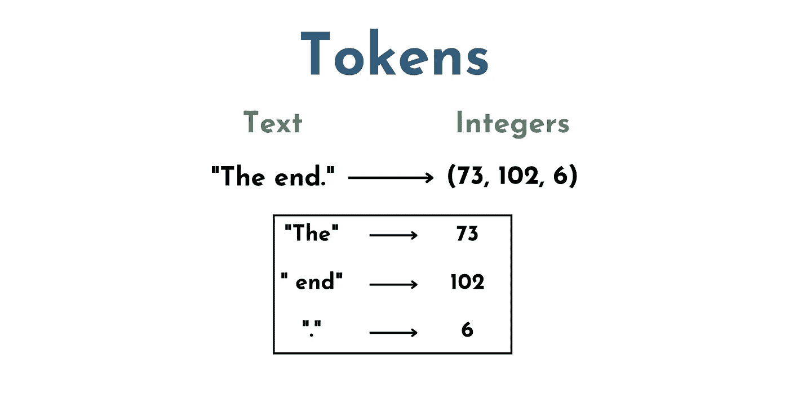

# 破解 OpenAI（Python）API

> 原文：[`towardsdatascience.com/cracking-open-the-openai-python-api-230e4cae7971`](https://towardsdatascience.com/cracking-open-the-openai-python-api-230e4cae7971)

## **一个完整的初学者友好介绍，附示例代码**

[](https://shawhin.medium.com/?source=post_page-----230e4cae7971--------------------------------)[](https://towardsdatascience.com/?source=post_page-----230e4cae7971--------------------------------) [Shaw Talebi](https://shawhin.medium.com/?source=post_page-----230e4cae7971--------------------------------)

·发布于[Towards Data Science](https://towardsdatascience.com/?source=post_page-----230e4cae7971--------------------------------) ·阅读时间 12 分钟·2023 年 7 月 21 日

--


图片由[Martin Sanchez](https://unsplash.com/@martinsanchez?utm_source=medium&utm_medium=referral)提供，来源于[Unsplash](https://unsplash.com/?utm_source=medium&utm_medium=referral)

这是关于在实践中使用大型语言模型（LLMs）的系列文章的第二篇。这里我提供了一个适合初学者的 OpenAI API 介绍。这使你能够超越像 ChatGPT 这样的限制性聊天界面，并为你的独特用例更好地利用 LLMs。下面提供了 Python 示例代码和[GitHub 仓库](https://github.com/ShawhinT/YouTube-Blog/tree/main/LLMs/openai-api)。

## 目录：

1.  什么是 API？

1.  OpenAI 的（Python）API

1.  开始使用（4 个步骤）

1.  示例代码

在第一篇文章中，我描述了**提示工程**作为**使用 LLMs 的最便捷方法**。最简单（也是最流行）的方法是通过像 ChatGPT 这样的工具，它们提供了直观、无需成本和无需编码的 LLM 交互方式。

[](/a-practical-introduction-to-llms-65194dda1148?source=post_page-----230e4cae7971--------------------------------) ## LLMs 的实用入门

### 实践中使用 LLMs 的 3 个层次

towardsdatascience.com

然而，这种**使用简便性是有代价的**。即聊天界面具有限制，且不适用于许多实际应用场景，例如构建自己的客户支持机器人、实时分析客户评论情感等。

在这些情况下，我们可以将提示工程进一步推进，通过*编程方式*与 LLMs 互动。实现这一点的一种方法是通过 API。

# **1) 什么是 API？**

**应用程序编程接口（API）**允许你以编程方式与远程应用程序进行交互。虽然这可能听起来技术性很强且有些吓人，但其实非常简单。考虑以下类比。

想象一下你对在萨尔瓦多那个夏天吃的[普普萨](https://en.wikipedia.org/wiki/Pupusa)产生了强烈的渴望。不幸的是，你回到了家里，不知道在哪里可以找到好的萨尔瓦多食物。然而，你有一个超级吃货朋友，他知道城里每一家餐馆。

所以，你给你的朋友发了短信。

> “城里有好的普普萨店吗？”

然后，几分钟后，你会收到回复。

> “是的！萨尔瓦多风味的餐厅有最棒的普普萨！”

虽然这似乎与 API 无关，但这基本上就是它们的工作原理。你向远程应用程序发送一个**请求**，即给你的超级吃货朋友发短信。然后，远程应用程序会返回一个**响应**，即你朋友的回复。


API 工作的可视化类比。图片由作者提供。

API 与上述类比之间的区别在于，你不是用手机的短信应用发送请求，而是使用你喜欢的编程语言，例如 Python、JavaScript、Ruby、Java 等。如果你正在开发需要外部信息的软件，这非常好，因为信息检索可以自动化。

# **2) OpenAI 的（Python）API**

我们可以使用 API 与大型语言模型进行交互。一个流行的 API 是 OpenAI 的 API，你可以使用 Python 向 OpenAI 发送和接收提示，而不是在 ChatGPT 网络界面中输入提示。


API 调用到 OpenAI 的可视化。图片由作者提供。

这使得几乎任何人都可以访问最先进的 LLM（和其他 ML 模型），而无需提供运行它们所需的计算资源。当然，缺点是 OpenAI 并不是出于慈善目的提供这些服务。每次 API 调用都会收费，但稍后会详细说明。

API 的一些**显著特性**（ChatGPT 不提供）如下。

+   **可定制的系统消息**（对于 ChatGPT，这设置为类似于“*我是 ChatGPT，一个由 OpenAI 训练的大型语言模型，基于 GPT-3.5 架构。我的知识基于截至 2021 年 9 月的信息。今天的日期是 2023 年 7 月 13 日。*”的内容）

+   **调整输入参数**，如最大响应长度、响应数量和温度（即响应的“随机性”）。

+   在提示中**包含图像**和**其他文件类型**。

+   提取对下游任务有帮助的词语**嵌入**。

+   **输入音频**以进行转录或翻译。

+   模型**微调**功能

OpenAI API 提供了[多个模型](https://platform.openai.com/docs/models)供选择。选择哪个*最佳*模型取决于你的具体用例。下面是当前可用模型的列表[[1](https://platform.openai.com/docs/models)]。


列出了截至 2023 年 7 月的 OpenAI API 可用模型。图像由作者提供。[[1](https://platform.openai.com/docs/models)]

***注意***：上述每项内容都有一组模型，模型的大小和成本各不相同。查看* [*文档*](https://platform.openai.com/docs/models) *获取最新信息。*

## **定价与 Token**

虽然 OpenAI API 为开发者提供了对最先进机器学习模型的便捷访问，但一个明显的缺点是**需要付费**。定价是按 token 计算的（不，我不是指 NFTs 或其他你在游戏厅用的东西）。

**Token**，在 LLM 的上下文中，本质上是**代表一组单词和字符的一组数字**。例如，“The” 可能是一个 token，“ end”（带空格）可能是另一个，"." 也是一个。

因此，文本 “The End.” 将由 3 个 token 组成，例如（73, 102, 6）。



这是一个玩具示例，展示了文本与整数之间的一种可能的 token 映射。图像由作者提供。

这是一个关键步骤，因为**LLM（即神经网络）不直接“理解”文本**。文本必须转换为数字表示，以便模型可以对输入执行数学操作。因此，需要进行 token 化步骤。

API 调用的价格取决于提示中使用的 token 数量和所调用的模型。每个模型的价格可以在 [OpenAI 的网站](https://openai.com/pricing) 上找到。

# **3) 开始使用（4 步骤）**

现在我们对 OpenAI API 有了基本了解，让我们看看如何使用它。在开始编码之前，我们需要设置四件事。

## **3.1) 创建账户（前 3 个月有 $5 的 API 额度）**

1.  要创建账户，请访问 [OpenAI API 概览页面](https://platform.openai.com/overview)，并点击右上角的“注册”

1.  *注意* — 如果你以前使用过 ChatGPT，那么你可能已经有一个 OpenAI 帐户。如果是，请点击“登录”

## **3.2) 添加支付方式**

1.  如果你的账户已经超过 3 个月，或者免费的 $5 API 额度不够用，你需要在调用 API 之前添加支付方式。

1.  点击你的头像并选择管理账户选项。

1.  然后点击“账单”标签，再点击“支付方式”来添加支付方式。

## **3.3) 设置使用限制**

1.  接下来，我建议设置使用限制，以**避免被账单超出预算**。

1.  为此，请转到“账单”标签下的“使用限制”。在这里你可以设置“软限制”和“硬限制”。

1.  如果你达到每月的**软限制**，OpenAI 会向你发送**电子邮件通知**。

1.  如果你达到了**硬限制**，任何额外的 API **请求将被拒绝**（因此，你不会被额外收费）。

## **3.4) 获取 API 秘钥**

1.  点击“查看 API 密钥”

1.  如果这是你第一次使用，你需要创建一个新的秘钥。为此，点击“创建新的秘钥”

1.  接下来，你可以给你的密钥一个自定义名称。我在这里使用了“my-first-key”。

1.  然后，点击“创建密钥”

# **4) 示例代码：聊天完成 API**

所有设置完成后，我们（终于）准备好进行第一次 API 调用。这里我们将使用 [openai Python 库](https://github.com/openai/openai-python)，它使将 OpenAI 的模型集成到你的 Python 代码中变得非常简单。你可以通过 [pip](https://pypi.org/project/openai/) 下载这个包。下面的示例代码（以及额外代码）可以在 [GitHub 仓库](https://github.com/ShawhinT/YouTube-Blog/tree/main/LLMs/openai-api)中找到。

***关于 Completions API 废弃的快速说明* —** OpenAI 正在从自由形式的提示范式转向基于聊天的 API 调用。根据 OpenAI 的博客，基于聊天的范式提供了更好的响应，鉴于其结构化提示界面，相比于以前的范式 [[2](https://openai.com/blog/gpt-4-api-general-availability)]。

虽然旧版 OpenAI（GPT-3）模型仍然可以通过“自由形式”范式使用，但更近期（和更强大的）模型（即 GPT-3.5-turbo 和 GPT-4）只能通过基于聊天的调用获得。

让我们从一个超级简单的 API 调用开始。这里我们将**两个输入**传递给***openai.ChatCompletions.create()*** 方法，即**model**和**messages**。

1.  **model** — 定义了我们想要使用的语言模型的名称（我们可以从本文前面列出的模型中选择。）

1.  **消息** — 将“前面的”聊天对话设置为字典列表。这些字典有两个键值对（例如 {“role”: “user”, “content”: “Listen to your”}）。**首先**，“role”定义了*谁在讲话*（例如 “role”:”user”）。这可以是“用户”、“助手”或“系统”。**其次**，“content”定义了*角色在说什么*（例如 “content”: “Listen to your”）。虽然这可能比自由形式的提示界面更具限制性，但我们可以通过创意输入消息来优化特定用例的响应（稍后会详细说明）。

这是我们第一次在 Python 中调用 API 的样子。

```py
import openai
from sk import my_sk # importing secret key from external file
import time

# imported secret key (or just copy-paste it here)
openai.api_key = my_sk 

# create a chat completion
chat_completion = openai.ChatCompletion.create(model="gpt-3.5-turbo", 
                    messages=[{"role": "user", "content": "Listen to your"}])
```

API 响应存储在*chat_completion*变量中。打印*chat_completion*，我们看到它像一个包含 6 个键值对的字典。

```py
{'id': 'chatcmpl-7dk1Jkf5SDm2422nYRPL9x0QrlhI4',
 'object': 'chat.completion',
 'created': 1689706049,
 'model': 'gpt-3.5-turbo-0613',
 'choices': [<OpenAIObject at 0x7f9d1a862b80> JSON: {
    "index": 0,
    "message": {
      "role": "assistant",
      "content": "heart."
    },
    "finish_reason": "stop"
  }],
 'usage': <OpenAIObject at 0x7f9d1a862c70> JSON: {
   "prompt_tokens": 10,
   "completion_tokens": 2,
   "total_tokens": 12
 }}
```

每个字段的含义列在下面。

+   **‘Id’** = API 响应的唯一 ID

+   **‘Object’** = 发送响应的 API 对象的名称

+   **‘Created’** = 处理 API 请求时的 Unix 时间戳

+   **‘Model’** = 使用的模型名称

+   **‘Choices’** = 模型响应格式为 JSON（即类似字典的形式）

+   **‘Usage’** = 以 JSON 格式（即类似字典的形式）显示的令牌计数元数据

然而，我们在这里最关心的是‘**Choices**’字段，因为这是**模型响应存储的位置**。在这种情况下，我们看到“助手”角色用消息*“****heart.”*作出响应。

太好了！我们完成了第一次 API 调用。现在，让我们开始调整模型输入参数。

## max_tokens

首先，我们可以使用*max_tokens*输入参数设置模型响应中允许的**最大令牌数**。这在许多情况下都可能是有帮助的。在这种情况下，我只想要一个单词的响应，因此我将其设置为 1 个令牌。

```py
# setting max number of tokens

# create a chat completion
chat_completion = openai.ChatCompletion.create(model="gpt-3.5-turbo", 
                    messages=[{"role": "user", "content": "Listen to your"}],
                    max_tokens = 1)

# print the chat completion
print(chat_completion.choices[0].message.content)

"""
Output:
>>> heart 
"""
```

## n

接下来，我们可以设置我们希望从模型中接收的**响应数量**。这在许多情况下都可能是有帮助的。例如，如果我们希望生成一组响应，从中选择我们最喜欢的一个。

```py
# setting number of completions

# create a chat completion
chat_completion = openai.ChatCompletion.create(model="gpt-3.5-turbo", 
                                messages=[{"role": "user", "content": "Listen to your"}],
                                max_tokens = 2,
                                n=5)

# print the chat completion
for i in range(len(chat_completion.choices)):
    print(chat_completion.choices[i].message.content)

"""
Ouput:
>>> heart.
>>> heart and
>>> heart.
>>>
>>> heart,
>>>
>>> heart,
"""
```

注意到**并非所有的完成都是相同的**。这可能是好事也可能是坏事，具体取决于使用案例（例如创意使用案例与过程自动化使用案例）。因此，为给定的提示调整聊天完成的*多样性*可能是有利的。

## temperature

结果表明，我们可以通过调整**温度**参数来实现这一点。简而言之，这**调整了聊天完成的“随机性”**。此参数的值**范围从 0 到 2**，其中 0 使完成更可预测，而 2 则使其不那么可预测[[3](https://platform.openai.com/docs/api-reference/chat/create)]。

从概念上讲，我们可以认为 temp=0 将默认生成最可能的下一个词，而 temp=2 将生成相对不太可能的完成。让我们看看这是什么样的。

```py
# temperature=0

# create a chat completion
chat_completion = openai.ChatCompletion.create(model="gpt-3.5-turbo", 
                                messages=[{"role": "user", "content": "Listen to your"}],
                                max_tokens = 2,
                                n=5,
                                temperature=0)

# print the chat completion
for i in range(len(chat_completion.choices)):
    print(chat_completion.choices[i].message.content)

"""
Output:
>>> heart.
>>> heart.
>>> heart.
>>> heart.
>>> heart.
"""
```

正如预期的那样，当 temp=0 时，所有 5 个完成是相同的，并产生“非常可能”的结果。现在让我们看看当我们**提高温度**时会发生什么。

```py
# temperature=2

# create a chat completion
chat_completion = openai.ChatCompletion.create(model="gpt-3.5-turbo", 
                                messages=[{"role": "user", "content": "Listen to your"}],
                                max_tokens = 2,
                                n=5,
                                temperature=2)

# print the chat completion
for i in range(len(chat_completion.choices)):
    print(chat_completion.choices[i].message.content)

"""
Output:
>>> judgment
>>> Advice
>>> .inner awareness
>>> heart.
>>>
>>> ging ist
"""
```

再次如预期的那样，temp=2 时的聊天完成更加多样化，且“出乎意料”。

## 消息角色：歌词完成助手

最后，我们可以利用这种基于聊天的提示范式中的不同角色来进一步调整语言模型的响应。

回顾一下，我们可以在提示中包含来自 3 个不同角色的内容：**系统**、**用户**和**助手**。**系统**消息**设置了模型完成的上下文（或任务）** *例如“你是一个友好的聊天机器人，不想摧毁所有人类”或“将用户提示总结为最多 10 个词”。*

**用户**和**助手**消息可以至少以两种方式使用。**一种**，生成**上下文学习**的示例；**另一种**，存储和更新**对话历史**以供实时聊天机器人使用。这里我们将使用这两种方式来创建一个歌词完成助手。

我们首先设置**系统消息**为 *“我是 Roxette 歌词完成助手。当给出一行歌词时，我将提供歌曲中的下一行。”* 然后，提供**两个用户和助手消息的示例**。接着使用与之前示例中相同的**用户提示**即 *“听听你的”*。

这在代码中是这样的。

```py
# initial prompt with system message and 2 task examples
messages_list = [{"role":"system", "content": "I am Roxette lyric completion assistant. When given a line from a song, I will provide the next line in the song."},
                 {"role":"user", "content": "I know there's something in the wake of your smile"},
                 {"role":"assistant", "content": "I get a notion from the look in your eyes, yeah"},
                 {"role":"user", "content": "You've built a love but that love falls apart"},
                 {"role":"assistant", "content": "Your little piece of Heaven turns too dark"},
                 {"role":"user", "content": "Listen to your"}]

# sequentially generate 4 chat completions
for i in range(4):
    # create a chat completion
    chat_completion = openai.ChatCompletion.create(model="gpt-3.5-turbo", 
                                    messages=messages_list,
                                    max_tokens = 15,
                                    n=1,
                                    temperature=0)

    # print the chat completion
    print(chat_completion.choices[0].message.content)

    new_message = {"role":"assistant", "content":chat_completion.choices[0].message.content} # append new message to message list
    messages_list.append(new_message)
    time.sleep(0.1)

"""
Output:
>>> Heart when he's calling for you
>>> Listen to your heart, there's nothing else you can do
>>> I don't know where you're going and I don't know why
>>> But listen to your heart before you tell him goodbye
"""
```

比较与[实际歌词](https://www.azlyrics.com/lyrics/roxette/listentoyourheart.html)的输出，我们看到它们完全匹配。这是由于我们提供给模型的所有不同输入的组合。

要查看当我们“*增加温度*”时的效果，请查看 [GitHub](https://github.com/ShawhinT/YouTube-Blog/blob/main/LLMs/openai-api/openai-api-demo.ipynb) 上的附加代码。 (警告：会变得有些奇怪)

# 结论

在这里，我提供了一个适合初学者的 OpenAI Python API 指南，其中包含示例代码。使用 OpenAI 的 API 最大的好处是你可以使用强大的 LLMs，而不必担心计算资源的配置。然而，**缺点**是 **API 调用需要付费**，以及与第三方（OpenAI）共享某些类型数据的潜在 **安全问题**。

为了避免这些缺点，我们可以转向开源的 LLM 解决方案。这将是本系列中 [下一篇文章](https://medium.com/towards-data-science/cracking-open-the-hugging-face-transformers-library-350aa0ef0161) 的重点，我们将在其中探索 Hugging Face Transformers 库。

👉 **更多关于 LLMs 的内容**: 简介 | [Hugging Face Transformers](https://medium.com/towards-data-science/cracking-open-the-hugging-face-transformers-library-350aa0ef0161) | [Prompt Engineering](https://medium.com/towards-data-science/prompt-engineering-how-to-trick-ai-into-solving-your-problems-7ce1ed3b553f) | [微调](https://medium.com/towards-data-science/fine-tuning-large-language-models-llms-23473d763b91) | 构建 LLM | QLoRA | [RAG](https://medium.com/towards-data-science/how-to-improve-llms-with-rag-abdc132f76ac) | 文本嵌入


[Shaw Talebi](https://shawhin.medium.com/?source=post_page-----230e4cae7971--------------------------------)

## 大型语言模型（LLMs）

[查看列表](https://shawhin.medium.com/list/large-language-models-llms-8e009ae3054c?source=post_page-----230e4cae7971--------------------------------)13 篇故事

# 资源

**联系**: [我的网站](https://shawhintalebi.com/) | [预约电话](https://calendly.com/shawhintalebi) | [问我任何问题](https://shawhintalebi.com/contact/)

**社交媒体**: [YouTube 🎥](https://www.youtube.com/channel/UCa9gErQ9AE5jT2DZLjXBIdA) | [LinkedIn](https://www.linkedin.com/in/shawhintalebi/) | [Twitter](https://twitter.com/ShawhinT)

**支持**: [请我喝咖啡](https://www.buymeacoffee.com/shawhint) ☕️

[](https://shawhin.medium.com/subscribe?source=post_page-----230e4cae7971--------------------------------) [## 免费获取我写的每一篇新故事

### 免费获取我写的每一篇新故事 P.S. 我不会将你的电子邮件分享给任何人 注册后，你将创建一个…

shawhin.medium.com](https://shawhin.medium.com/subscribe?source=post_page-----230e4cae7971--------------------------------)

[1] [OpenAI 模型文档](https://platform.openai.com/docs/models)

[2] [GPT-4 可用性与完成 API 废弃](https://openai.com/blog/gpt-4-api-general-availability)

[3] 温度定义来自于 [API 参考](https://platform.openai.com/docs/api-reference/chat/create)
