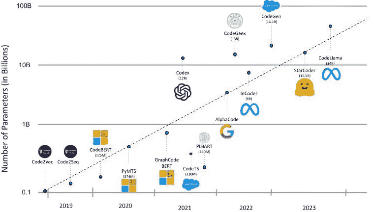
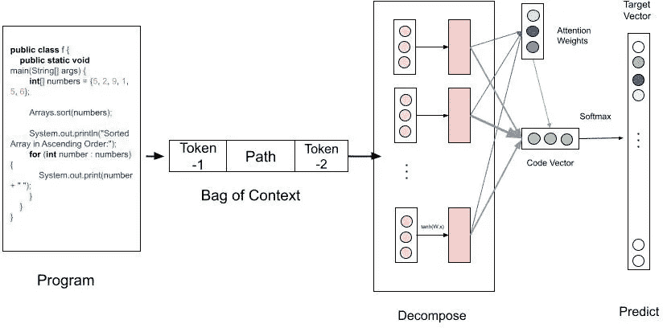
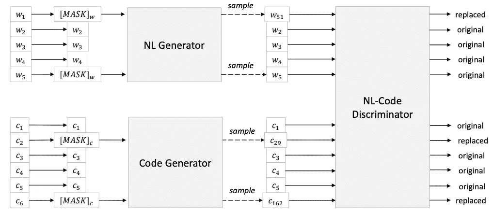
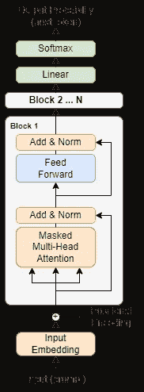
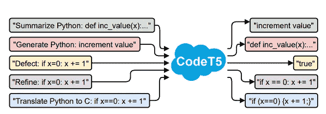
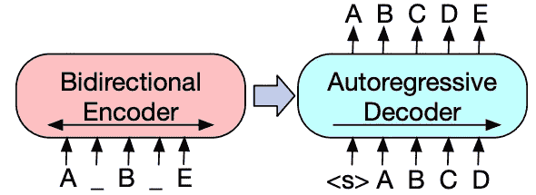
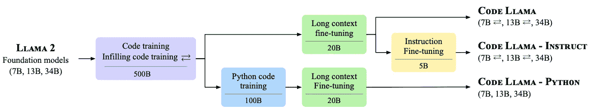

# 破解代码 LLMs

> 原文：[`towardsdatascience.com/cracking-the-code-llms-354505c53295?source=collection_archive---------4-----------------------#2023-11-03`](https://towardsdatascience.com/cracking-the-code-llms-354505c53295?source=collection_archive---------4-----------------------#2023-11-03)

## 代码 LLM 如何从 RNN 发展到 Transformer

 [Shubham Agarwal](https://medium.com/@agarwal.shubham166?source=post_page-----354505c53295--------------------------------)

·

[关注](https://medium.com/m/signin?actionUrl=https%3A%2F%2Fmedium.com%2F_%2Fsubscribe%2Fuser%2Fdd67f0fc7318&operation=register&redirect=https%3A%2F%2Ftowardsdatascience.com%2Fcracking-the-code-llms-354505c53295&user=Shubham+Agarwal&userId=dd67f0fc7318&source=post_page-dd67f0fc7318----354505c53295---------------------post_header-----------) 发表在 [Towards Data Science](https://towardsdatascience.com/?source=post_page-----354505c53295--------------------------------) ·7 分钟阅读·2023 年 11 月 3 日

--

照片由 [Markus Spiske](https://unsplash.com/@markusspiske?utm_source=medium&utm_medium=referral) 提供，发布在 [Unsplash](https://unsplash.com/?utm_source=medium&utm_medium=referral)

# 介绍

近年来，语言模型经历了显著的演变，尤其是 Transformer 的引入，这一变革彻底改变了我们处理日常任务的方式，如写电子邮件、创建文档、搜索网络，甚至编程。随着研究人员将大型语言模型应用于代码智能任务，一个新的领域——**神经代码智能**应运而生。这个领域旨在通过解决代码总结、生成和翻译等任务，提高编程效率，减少软件行业中的人为错误。

Code Llama 的最新发布，Meta AI 开发的用于代码生成和理解的先进模型，本文回顾了从 RNN 到 Transformers 的大型语言模型（LLMs）在代码领域的演变历程。

Fig-1：大型语言模型（LLMs）在代码领域的时间线。图片由作者提供。

# Code2Vec，2018

这是语言模型首次尝试理解代码的一个尝试。[Code2Vec](https://arxiv.org/pdf/1803.09473.pdf)旨在将代码片段表示为嵌入。这些嵌入捕获了代码的语义和结构信息，使它们在代码分类、检索和理解等各种软件工程任务中非常有用。

模型尝试从代码片段中预测方法名称，通过编码良好命名的标记和抽象语法树（AST）路径，并应用神经注意力将它们聚合成固定长度的向量表示。

Fig-2：Code2Vec 模型架构：程序首先被分解为上下文袋，其中包括标记和 AST 路径，然后通过完全连接层和注意力层生成代码向量。图片灵感来自 Uri Alon 等人的原始论文[Code2Vec](https://arxiv.org/pdf/1803.09473.pdf)

**训练集**：1400 万个 Java 程序示例

**模型架构**：RNN + 前馈网络

**创新**：

+   **基于路径的注意力模型** - 作者提出了一种新颖的神经网络架构，使用代码片段的抽象语法树（AST）中的句法路径作为输入特征。模型学习为每个路径分配不同的注意力权重，并将它们聚合成单一的代码向量。代码向量可以用来预测片段的标签分布，或者衡量片段之间的相似性和类比。

> 您可以在[这里](https://code2vec.org/)尝试该模型。

# CodeBERT，2020

[CodeBERT](https://arxiv.org/pdf/2002.08155.pdf)，由微软研究团队开发，代表了大型语言模型（LLMs）在代码领域的重大进展，引入了多模态数据预训练，结合了基于 Transformer 的 BERT 模型中的自然语言和编程语言（NL + PL）。该模型在包括双模数据点对和单模数据点的多样数据集上进行训练，用于掩码语言建模（MLM）和替换令牌检测（RTD）任务。CodeBERT 在多个领域展现出了卓越的性能，特别在自然语言代码搜索和代码到文档生成方面表现突出。

图-3：CodeBERT 模型预训练使用替换标记检测（RTD）任务。自然语言生成和代码生成器将标记替换为不同的标记，CodeBERT 模型被训练以分类每个标记是被替换的还是原始的。图片来自 Feng 等人，[CodeBERT](https://arxiv.org/pdf/2002.08155.pdf)

**训练数据集：** [Codesearch Net 数据集](https://paperswithcode.com/dataset/codesearchnet) - 210 万双模态数据点（自然语言 + 编程语言），640 万单模态数据点（6 种语言 — Python、Java、Javascript、PHP、Ruby、Go）

**参数规模：** 125M

**模型架构：** RoBERTa-base

**新颖性：**

+   **双模态训练：** CodeBERT 引入了一种创新的训练方法，涵盖了自然语言和编程语言标记。这种双模态训练技术通过考虑人类可读描述与编程语言元素之间的复杂互动，增强了模型理解和生成代码的能力。

+   **代码的替换标记检测（RTD）任务：** CodeBERT 预训练使用了替换标记检测（RTD），而不是下一句预测（NSP），这显示了更好的性能。

# Codex，2021

[Codex](https://arxiv.org/abs/2107.03374)是首批成功的代码 LLM 之一，能够从文档字符串或自然语言提示中生成高准确度的代码，是广泛使用的[Github Copilot](https://github.com/features/copilot)的前身。由 OpenAI 团队开发，Codex 使用了 GPT3 架构和分词器，并在大量的 GitHub 代码库上进行预训练。这个大型语言模型有 12B 参数，在 2021 年是最先进的模型，首次通过率在[human-eval 数据集](https://github.com/openai/human-eval)上解决了 28.8%的问题。

在独立 Python 函数上的进一步微调（而不是包括配置、类实现等的完整代码），显示了显著的改进，并能够解决**37.7%的 human-eval 数据集**问题。

图-4：用于 Codex GPT 模型的仅解码器 Transformer 架构。图像灵感来自 Vaswani 等人原始的[Transformer 论文](https://arxiv.org/abs/1706.03762)。

**训练数据集：** 159GB 来自 54M GitHub 代码库的 Python 文件。

**参数规模：** 12B（Codex-12B）

**模型架构：** GPT3

**新颖性：**

+   这是首批成功的模型之一，擅长从自然语言提示中生成代码。该模型在大量的 GitHub 代码库上进行训练。

+   该模型的作者还创建了一个新的数据集，**“**[**HumanEval**](https://github.com/openai/human-eval)**”**，用于对代码生成任务进行基准测试。该数据集包含 164 个手写编程问题及单元测试。

> 在 OpenAI Playground [这里](https://platform.openai.com/playground)尝试 Codex 模型

# CodeT5，2021

[Code-T5](https://arxiv.org/pdf/2109.00859.pdf) 是一种基于 T5 架构的**编码器-解码器模型**，与 CodeBERT（仅编码器）和 Codex（仅解码器）模型不同。它引入了一种独特的标识符感知去噪预训练任务，帮助模型区分和恢复代码中的标识符，增强对结构的理解。

Code-T5 通过多任务学习，在代码缺陷检测、克隆检测、代码翻译和优化等任务中表现出色，所需数据较少，可以更快进行微调。然而，它使用 CodeBleu 分数进行评估，而不是与 HumanEval 数据集进行基准测试。

图-5：展示 CodeT5 在各种代码理解和生成任务中的卓越表现。图像来源于 Wang 等人的论文，[CodeT5](https://arxiv.org/pdf/2109.00859.pdf)

**训练数据集**：[Codesearch Net 数据集](https://paperswithcode.com/dataset/codesearchnet)（与 CodeBERT 相同）

**参数大小**：220M

**模型架构**：[T5](https://jmlr.org/papers/volume21/20-074/20-074.pdf)（编码器-解码器架构）

**新颖性：**

+   **编码器-解码器模式**：首批支持代码理解和代码生成任务的编码器-解码器代码大模型之一。

+   提出了新颖的预训练目标**标识符感知去噪**，学习代码的标记类型信息和结构。这种方法训练模型区分标识符（变量名、函数名）和 PL 关键字（如 if、while 等），并在它们被掩盖时恢复它们。

+   **微调阶段的多任务学习**：同时对各种代码相关任务进行微调，如代码缺陷检测、克隆检测、代码翻译、优化等。

# PLBart, 2021

[PLBART，即程序和语言 BART](https://arxiv.org/pdf/2103.06333.pdf) 模型利用 BART 模型架构来自动化一系列软件工程任务，包括代码摘要、生成和翻译，属于 PLUG（程序和语言理解与生成）的范畴。

它引入了一种去噪序列到序列建模方法，以增强程序和语言理解，战略性地结合了 BERT 和 GPT 模型的优势。这通过将双向编码器与自回归解码器相结合，实现了对上下文的更全面理解和多功能生成过程。该模型采用了三种去噪策略，包括**标记掩盖、标记删除和标记填充**，有效地训练和微调其能力。

图-6：可视化 BART 模型（PLBART 也使用）架构的插图，具有双向编码器和自回归解码器。图像来自 Lewis 等人的原始 [BART 论文](https://arxiv.org/pdf/1910.13461.pdf)。

**训练数据集**：从 Github、Stackoverflow 收集的 2M Java 和 Python 函数及其自然语言描述（[代码](https://huggingface.co/docs/transformers/model_doc/plbart)）。

**参数规模**：140M（6 个编码器层 + 6 个解码器层 + 编码器和解码器上的附加归一化层）

**模型架构**： [BART](https://arxiv.org/abs/1910.13461)

**新颖性**：

+   **去噪自编码器方法**：采用去噪自编码器方法，通过有效利用编码器和解码器的双向和自回归特性，结合 BERT 和 GPT 模型的优势，增强了代码理解和生成能力。

+   **多样的去噪策略**：提出多种去噪策略，如标记掩蔽、标记删除和标记填充。这些去噪技术的多样性提高了模型在噪声数据中学习的鲁棒性和效果，促进了代码理解和生成的改进。

> 不是所有模型都使用相同的基准来评估性能。PLBART 的作者没有在 HumanEval 上评估模型性能，而其他大多数模型则使用该数据集进行基准测试。

# Code Llama，2023

[Code Llama](https://arxiv.org/abs/2308.12950)是 Meta 发布的最新 Code LLM，在多个基准数据集上超过了所有现有的开源模型。它在[HumanEval 数据集](https://github.com/openai/human-eval)上的得分为 53%，在 MBPP 数据集上的得分为 55%（只有 GPT-4 表现更好）。这些进步归因于 16K 的较长上下文长度（是 Llama2 的 4 倍）和在程序和自然语言上额外训练的 500B 标记的预训练 Llama 2。

该模型最适合代码生成和填充任务，并且在基于 IDE 的软件开发过程中可以作为最佳的副驾驶。Code Llama 模型家族有 3 种类型的模型—

1.  Code Llama

1.  Code Llama Python

1.  Code Llama-Instruct

每种都有 3 种尺寸——**7B、13B 和 34B**

图-7：Code Llama 训练和微调流程，以预训练的 Llama-2 模型为输入。图像来源于原始[Code Llama 论文](https://arxiv.org/abs/2308.12950)。

**训练数据集**：500B 标记 + 额外 100B 标记用于 Code Llama Python，基于公开代码

**模型架构**：Llama 2

**参数规模**：有 3 种尺寸——7B、13B 和 34B。

**新颖性**：

+   提出了一个处理长序列的微调步骤，称为**长上下文微调**，将上下文长度增加到 16,384（是 Llama 2 上下文长度 4096 的 4 倍）

+   **指令微调和自我指令**：少数几个执行指令微调的模型之一，使用明确的指令或提示进行微调。作者提出了一种新颖的执行反馈方法来构建自我指令数据集，而不是创建昂贵的人类反馈数据。

# 结论

Open AI 的创始人之一**Andrej Karapathy**最近称 Transformer 是[人工智能领域的最佳创意](https://www.youtube.com/watch?v=9uw3F6rndnA)。他补充说，Transformer 像是一种通用的可微分计算机，它同时具有——表现力、可优化性和高效性（[X 帖子](https://twitter.com/karpathy/status/1582807367988654081)）。从过去 3-4 年 Transformer 带来的变革可以看出，Transformer 模型具有巨大潜力，可以进一步改变我们作为软件工程师编程的方式，我认为这只是一个开始。

# 更多关注我吧！

我是 LinkedIn 的 Staff ML Engineer。你可以通过[LinkedIn](https://www.linkedin.com/in/shubham166/)或[Twitter](https://twitter.com/ShubhhamAgarwal)关注我。你也可以通过[Topmate.io](https://topmate.io/shubham_agarwal166)与我快速聊天。
