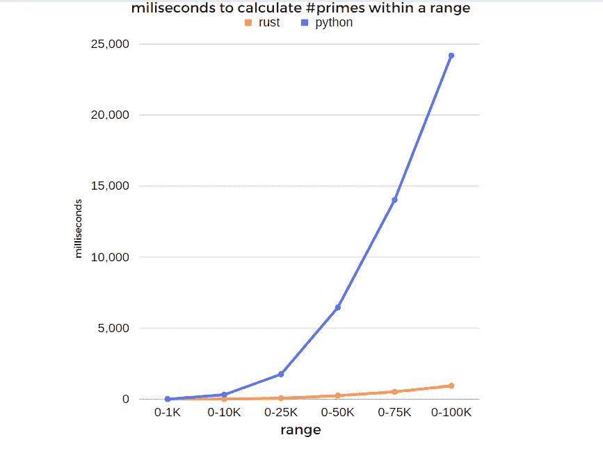

# 用 3 步创建一个带有超级快速 Rust 代码的 Python 包

> 原文：[`towardsdatascience.com/create-a-python-package-with-super-fast-rust-code-in-3-steps-a27389629beb`](https://towardsdatascience.com/create-a-python-package-with-super-fast-rust-code-in-3-steps-a27389629beb)

## *通过一个包含 Rust 代码的包来扩展你的 Python 代码，实现 >150 倍的性能提升！*

[Mike Huls](https://mikehuls.medium.com/?source=post_page-----a27389629beb--------------------------------) [Mike Huls](https://mikehuls.medium.com/?source=post_page-----a27389629beb--------------------------------)

·发表于 [Towards Data Science](https://towardsdatascience.com/?source=post_page-----a27389629beb--------------------------------) ·阅读时间 9 分钟·2023 年 2 月 24 日

--


这 Python 变得有点 Rusty 了！（图片来自 Dall-e 2！）

Python 是一种相对容易上手的语言，与一些其他语言相比，编写代码的速度非常快。然而，这种易用性也有一个缺点：速度被牺牲了。有时候 Python 就是太慢了！

为了解决这个问题，我们将把部分 Python 代码用 Rust 重写，并将这些代码作为 Python 包导入到原项目中。我们最终得到一个超级快速的 Python 包，可以像其他包一样导入和使用。作为额外奖励，我们将对我们的 Rust Python 包进行多进程处理，最终得到一个大约快 150 倍的函数。让我们开始编程吧！

# 概述

本文简要总结了我们将要做的事情。我们将分 6 步解决这个问题（其中第 2、3 和 4 步专门用于实际编写包）：

1.  检查我们的慢函数；为什么它这么慢？

1.  准备我们的项目

1.  我们将这个函数用 Rust 重写

1.  编译 Rust 代码并将其放入 Python 包中

1.  将 Python 包导入到我们的项目中

1.  基准测试 Python 函数与 Rust 函数的性能

我们将使用一个名为 `maturin` 的 Python 包。这个包将编译我们的 Rust 代码并将其转换为一个包。结果将像其他 Python 包一样，我们可以导入并使用（比如 `pandas`）。

[## 用 OpenCV 毁灭 Duck Hunt — 初学者的图像分析](https://towardsdatascience.com/image-analysis-for-beginners-destroying-duck-hunt-with-opencv-e19a27fd8b6?source=post_page-----a27389629beb--------------------------------)

### 编写能够打破每个 Duck Hunt 高分的代码

[towardsdatascience.com](https://towardsdatascience.com/image-analysis-for-beginners-destroying-duck-hunt-with-opencv-e19a27fd8b6?source=post_page-----a27389629beb--------------------------------)

# 1\. 检查我们的慢函数

首先我们要了解为什么我们的函数很慢。假设我们的项目需要一个函数来计算两个数字之间的质数数量：

```py
def primecounter_py(range_from:int, range_til:int) -> (int, int):
  """ Returns the number of found prime numbers using range"""
  check_count = 0
  prime_count = 0
  range_from = range_from if range_from >= 2 else 2
  for num in range(range_from, range_til + 1):
    for divnum in range(2, num):
      check_count += 1
      if ((num % divnum) == 0):
        break
    else:
      prime_count += 1
  return prime_count, check_count
```

> 请注意：
> 
> 这个函数中质数检查的数量其实并不必要，但它允许我们在文章的后面部分比较 Python 和 Rust。
> 
> 本文中的 Python 代码和 Rust 代码远未优化以查找质数。重要的是演示我们可以使用 Rust 优化 Python 的小块代码，并比较这些函数的性能。

如果你插入 `primecounter_py(10, 20)`，它会返回 `4`（11、13、17 和 19 是质数），以及函数已执行的质数检查数量。这些小范围执行非常迅速，但当我们使用更大的范围时，你会看到性能开始下降：

```py
range      milliseconds
1-1K                  4
1-10K               310
1-25K              1754
1-50K              6456
1-75K             14019
1-100K            24194
```

你会看到，随着输入规模增加十倍，持续时间增加得更多。换句话说：范围越大，相对变慢的程度也越明显。

[](/keep-your-code-secure-by-using-environment-variables-and-env-files-4688a70ea286?source=post_page-----a27389629beb--------------------------------) ## 通过使用环境变量和 env 文件来保护你的代码

### 安全加载包含我们应用程序所需的所有机密数据的文件，如密码、令牌等。

towardsdatascience.com

## 为什么 primecounter_py 函数很慢？

代码可能因为多种原因变慢。它可以是 I/O 相关的，例如等待 API、硬件相关的，或基于 Python 作为一种语言的设计。在本文中是最后一种情况。Python 的设计方式及其处理变量的方式，使得它**使用起来非常简单**，但你会遭受**小的速度损失**，这种损失在需要进行大量计算时变得明显。好消息是；**这个函数非常适合用 Rust 进行优化**。

如果你对 Python 的局限性感兴趣，我推荐阅读下面的文章。它解释了由于 Python 的设计方式导致的慢速原因和潜在解决方案。

[](/why-is-python-so-slow-and-how-to-speed-it-up-485b5a84154e?source=post_page-----a27389629beb--------------------------------) ## 为什么 Python 很慢以及如何加速

### 观察一下底层，看看 Python 的瓶颈在哪里。

towardsdatascience.com

## 并发是问题所在吗？

同时做多件事可以解决许多速度问题。在我们的例子中，我们可以选择使用多个进程将所有任务分配到多个核心上，而不是默认的 1 个。尽管如此，我们仍然选择使用 Rust 进行优化，因为如你将在本文末尾看到的，我们也可以对更快的函数进行多进程处理。

许多涉及大量 I/O 的情况可以通过 [**使用线程**](https://mikehuls.medium.com/multi-tasking-in-python-speed-up-your-program-10x-by-executing-things-simultaneously-4b4fc7ee71e)（例如等待 API）来优化？查看 [**这篇文章**](https://mikehuls.medium.com/advanced-multi-tasking-in-python-applying-and-benchmarking-threadpools-and-processpools-90452e0f7d40) 或下面的文章，了解如何利用多个 CPU 提高执行速度。

[](/applying-python-multiprocessing-in-2-lines-of-code-3ced521bac8f?source=post_page-----a27389629beb--------------------------------) ## 使用 Python 多处理库实现 2 行代码

### 何时以及如何使用多个核心以实现更快的执行速度

towardsdatascience.com

# 2\. 准备我们的项目

这是我们安装依赖并创建所有需要的文件和文件夹以编写 Rust 代码并将其编译为包的部分。

[](/thread-your-python-program-with-two-lines-of-code-3b474407dbb8?source=post_page-----a27389629beb--------------------------------) ## 使用两行代码线程化你的 Python 程序

### 通过同时执行多个任务加速你的程序

towardsdatascience.com

## **a. 创建虚拟环境**

创建一个虚拟环境并激活它。然后安装`maturin`；这个包将帮助我们将 Rust 代码转换为 Python 包：

```py
python -m venv venv
source venv/bin/activate
pip install maturin
```

[](/virtual-environments-for-absolute-beginners-what-is-it-and-how-to-create-one-examples-a48da8982d4b?source=post_page-----a27389629beb--------------------------------) ## 面向绝对初学者的虚拟环境——什么是虚拟环境以及如何创建一个（+ 示例）

### 深入探讨 Python 虚拟环境、pip 以及如何避免纠缠的依赖关系

towardsdatascience.com

## **b. Rust 文件和文件夹**

我们将创建一个名为`my_rust_module`的目录，该目录将包含我们的 Rust 代码，并进入该目录。

```py
mkdir my_rust_module
cd my_rust_module
```

## **c. 初始化 maturin**

然后我们调用`maturin init`。它会显示一些选项。选择`pyo3`。Maturin 现在创建了一些文件夹和文件。你的项目现在应该是这样的：

```py
my_folder
 |- venv
 |- my_rust_module
   |- .github
   |- src
    |- lib.rs
   |- .gitignore
   |- Cargo.toml
   |- pyproject.toml
```

最重要的文件是`/my_rust_module/src/lib.rs`。这个文件将包含我们即将转化为 Python 包的 Rust 代码。

请注意，`maturin`还创建了一个`Cargo.toml`。这是我们项目的配置文件。它还包含了我们所有的依赖（如`requirements.txt`）。在我的情况下，我已经将它编辑成如下：

```py
[package]
name = "my_rust_module"
version = "0.1.0"
edition = "2021"
# See more keys and their definitions at https://doc.rust-lang.org/cargo/reference/manifest.html
[lib]
name = "my_rust_module"
crate-type = ["cdylib"]
[dependencies]
pyo3 = { version = "0.17.3", features = ["extension-module"] }
```

[](/create-a-fast-auto-documented-maintainable-and-easy-to-use-python-api-in-5-lines-of-code-with-4e574c00f70e?source=post_page-----a27389629beb--------------------------------) ## 用 5 行代码创建一个快速的自动文档化、可维护且易于使用的 Python API…

### 非常适合（缺乏经验的）开发者，他们只需要一个完整、可用、快速且安全的 API

towardsdatascience.com

# 3\. 用 Rust 重新编写函数

我们现在准备在 Rust 中重建我们的 Python 函数。我们不会深入探讨 Rust 语法，而是更关注如何使 Rust 代码与 Python 配合工作。我们将首先创建一个纯 Rust 函数，然后将其放入一个可以在 Python 中 `import` 并使用的包中。

如果你从未见过 Rust 代码，那么下面的代码可能会有些令人困惑。最重要的是，下面的 `primecounter` 函数是纯 Rust 代码；它与 Python 无关。打开 `/my_rust_module/src/lib.rs`，并填入以下内容：

```py
use pyo3::prelude::*;

#[pyfunction]
fn primecounter(range_from:u64, range_til:u64) -> (u32, u32) {
 /* Returns the number of found prime numbers between [range_from] and [range_til] """ */
 let mut prime_count:u32 = 0;
 let mut check_count:u32 = 0;
 let _from:u64 = if range_from < 2 { 2 } else { range_from };
 let mut prime_found:bool;

  for num in _from..=range_til {
    prime_found = false;
    for divnum in 2..num {
      check_count += 1;
      if num % divnum == 0 {
        prime_found = true;
        break;
      }
    }
    if !prime_found {
      prime_count += 1;
    }
  }
  return (prime_count, check_count)
}

/// Put the function in a Python module
#[pymodule]
fn my_rust_module(_py: Python, m: &PyModule) -> PyResult<()> {
    m.add_function(wrap_pyfunction!(primecounter, m)?)?;
    Ok(())
}
```

让我们梳理一下最重要的内容：

1.  `primecounter` 函数是纯 Rust 代码

1.  `primecounter` 函数被 `#[pyfunction]` 装饰。这表明我们想将它转换为一个 Python 函数

1.  在最后几行中，我们构建了一个 pymodule。`my_rust_module` 函数将 Rust 代码打包成一个 Python 模块。

[](/args-vs-kwargs-which-is-the-fastest-way-to-call-a-function-in-python-afb2e817120?source=post_page-----a27389629beb--------------------------------) ## Args 与 kwargs：哪种是调用 Python 函数的最快方式？

### `timeit` 模块的清晰演示

towardsdatascience.com

# 4\. Rust 代码 -> Python 包

这部分可能看起来最难，但在 `maturin` 包的帮助下，它变得非常简单。只需调用

`maturin build --release`。

这将编译所有 Rust 代码，并将其打包成一个 Python 包，最终位于此目录：`your_project_dir/my_rust_module/target/wheels`。我们将在下一部分安装该 wheel。

***对于 Windows 用户：*** *在下面的示例中，我在 Debian 环境中工作（通过 Windows WSL）。这使得使用 Rust 编译代码变得稍微容易一些，因为我们需要的编译器已经安装好。在 Windows 上构建也是可能的，但你可能会收到类似于* `*需要 Microsoft Visual C++ 14.0 或更高版本*`* 的消息。这意味着你没有编译器。你可以通过安装可以从* [*这里*](https://visualstudio.microsoft.com/visual-cpp-build-tools)* 下载的 C++ 构建工具来解决此问题。*

[](/sqlalchemy-for-absolute-beginners-22227a287ef3?source=post_page-----a27389629beb--------------------------------) ## SQLAlchemy 入门

### 创建数据库引擎并从 Python 执行 SQL

towardsdatascience.com

# 5\. 导入我们的 Rusty Python 包

我们可以直接 `pip install` 我们在上一部分创建的 wheel：

```py
pip install target/wheels/my_rust_module-0.1.0-cp39-cp39-manylinux_2_28_x86_64.whl
```

然后只需导入我们的模块并使用这个函数：

```py
import my_rust_module

primecount, eval_count = my_rust_module.primecounter(range_from=0, range_til=500)
# returns 95 22279
```

[](/write-your-own-c-extension-to-speed-up-python-x100-626bb9d166e7?source=post_page-----a27389629beb--------------------------------) ## 编写自己的 C 扩展以将 Python 提速 100 倍

### 如何编写、编译、打包和导入你自己超级快速的 C 模块到 Python 中

towardsdatascience.com

# 6\. 基准测试 Rust 与 Python 函数

让我们查看一下我们的函数比较。我们将调用 Python 和 Rust 版本的 `primecounter` 函数并测量它们的时间。我们还调用了具有多个参数的函数。结果如下：

```py
range   Py ms   py e/sec    rs ms   rs e/sec
1-1K        4      17.6M     0.19       417M
1-10K     310      18.6M       12       481M
1-25K    1754      18.5M       66       489M
1-50K    6456      18.8M      248       488M
1-75K   14019      18.7M      519       505M
1-100K  24194      18.8M      937       485M
```

我们的 Python 和 Rust 函数都返回结果和它们评估的数字的计数。在上面的概述中你会看到，在每秒评估次数方面，**Rust 比 Python 快了 27 倍**。



在 Rust 中计算素数比在 Python 中快得多（图片由作者提供）

上面的图表清晰地显示了执行时间的差异。

[](/run-code-after-your-program-exits-with-pythons-atexit-82a0069b486a?source=post_page-----a27389629beb--------------------------------) ## 使用 Python 的 AtExit 在程序退出后运行代码

### 注册在脚本结束或出错后运行的清理函数

towardsdatascience.com

# 7\. 附加：多进程处理以获得更高速度

当然，你可以对这个新的 Python 包进行多进程处理！下面的代码会在所有核心上分配我们需要评估的所有数字：

```py
# batch size is determined by the range divided over the amount of available CPU's 
batch_size = math.ceil((range_til - range_from) / mp.cpu_count())

# The lines below divide the ranges over all available CPU's. 
# A range of 0 - 10 will be divided over 4 cpu's like:
# [(0, 2), (3, 5), (6, 8), (9, 9)]
number_list = list(range(range_from, range_til))
number_list = [number_list[i * batch_size:(i + 1) * batch_size] for i in range((len(number_list) + batch_size - 1) // batch_size)]
number_list_from_til = [(min(chunk), max(chunk)) for chunk in number_list]

primecount = 0
eval_count = 0
with mp.Pool() as 
    results = mp_pool.starmap(my_rust_module.primecounter, number_list_from_til)
    for _count, _evals in results:
        primecount += _count
        eval_count += _evals
```

让我们再次尝试寻找 0 到 100K 之间的所有素数。根据我们当前的算法，这意味着我们需要进行将近五亿次检查。正如下面的概述所示，Rust 在 0.88 秒内完成这些检查。使用多进程处理，这个过程在 0.16 秒内完成；**快了 5.5 倍**，每秒进行**28 亿**次计算。

```py
 calculations     duration    calculations/sec
rust:            455.19M    882.03 ms          516.1M/sec
rust MP:         455.19M    160.62 ms            2.8B/sec
```

与我们最初的（单进程）Python 函数相比，我们将每秒的计算次数从 1880 万增加到 28 亿。这意味着我们的函数现在大约**快了 150 倍**。

[](/secure-your-docker-images-with-docker-secrets-f2b92ec398a0?source=post_page-----a27389629beb--------------------------------) [## 使用 Docker Secrets 保护你的 Docker 镜像

### 添加 Docker secrets 以防止 Docker 镜像泄露密码

[secure-your-docker-images-with-docker-secrets](https://towardsdatascience.com/secure-your-docker-images-with-docker-secrets-f2b92ec398a0?source=post_page-----a27389629beb--------------------------------)

# 结论

正如我们在这篇文章中所见，扩展 Python 与 Rust 并不那么困难。如果你知道何时以及如何应用这种技术，你真的可以提高程序的执行速度。

我希望这篇文章能像我期望的那样清晰，但如果不是，请告诉我我可以做些什么来进一步澄清。同时，查看我关于各种编程相关主题的[其他文章](https://mikehuls.com/articles?tags=python)：

+   [绝对初学者的 Git: 通过视频游戏理解 Git](https://mikehuls.medium.com/git-for-absolute-beginners-understanding-git-with-the-help-of-a-video-game-88826054459a)

+   [创建并发布你自己的 Python 包](https://mikehuls.medium.com/create-and-publish-your-own-python-package-ea45bee41cdc)

+   [用 Python 编写家庭入侵者系统 / 动态检测器](https://mikehuls.medium.com/coding-a-home-intruder-system-motion-detector-with-python-22f5ba8bcca0)

快乐编程！

— 迈克

*附言: 喜欢我正在做的事吗？* [*关注我！*](https://mikehuls.medium.com/membership)

[## 通过我的推荐链接加入 Medium - Mike Huls](https://mikehuls.medium.com/membership?source=post_page-----a27389629beb--------------------------------)

### 阅读迈克·赫尔斯（Mike Huls）和 Medium 上成千上万其他作者的每一个故事。你的会员费直接支持迈克……

[mikehuls.medium.com](https://mikehuls.medium.com/membership?source=post_page-----a27389629beb--------------------------------)
