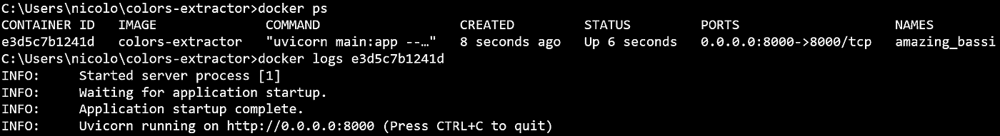

# 创建并部署一个提取图像主要颜色的 REST API

> 原文：[`towardsdatascience.com/create-and-deploy-a-rest-api-extracting-predominant-colors-from-images-a44b94cc3d46`](https://towardsdatascience.com/create-and-deploy-a-rest-api-extracting-predominant-colors-from-images-a44b94cc3d46)

## 使用无监督机器学习、FastAPI 和 Docker

[](https://nicolo-albanese.medium.com/?source=post_page-----a44b94cc3d46--------------------------------)[](https://towardsdatascience.com/?source=post_page-----a44b94cc3d46--------------------------------) [Nicolo Cosimo Albanese](https://nicolo-albanese.medium.com/?source=post_page-----a44b94cc3d46--------------------------------)

·发布于 [Towards Data Science](https://towardsdatascience.com/?source=post_page-----a44b94cc3d46--------------------------------) ·阅读时间 15 分钟·2023 年 9 月 26 日

--


图片由作者提供。

# 目录

1.  问题陈述

1.  从图像中提取颜色

1.  项目结构

1.  代码

1.  部署 Docker 容器

1.  让我们尝试一下！

1.  API 文档

1.  结论

1.  许可证声明

# 1\. 问题陈述

让我们设想一个**制造设施**的控制室，其中生产的产品需要自动分类。例如，根据颜色，货物可能会被重新导向滚筒输送机的不同分支，以进行进一步处理或包装。

否则，我们也可以设想一个**在线零售商**试图通过添加*按颜色搜索*功能来增强用户体验。客户可以更容易地找到特定颜色的衣物，从而简化他们对感兴趣产品的访问。

或者，就像作者一样，你可以将自己想象成一位**IT 顾问**，实现一个简单、快速且可重用的工具，用于从输入图像中生成适用于演示文稿、图表和应用程序的色彩调色板。

这些只是从图片中提取主要颜色如何提升操作效率或增强客户体验的几个示例。

在这篇博客文章中，我们使用 Python 实现从给定图片中提取主要颜色。然后，我们使用 FastAPI 和 Docker 将解决方案打包并部署为服务。

本帖的目的是分享一个关于部署轻量且自洽服务的端到端示例，该服务利用机器学习技术实现商业目的。这样的服务可以轻松集成到[microservice architecture](https://microservices.io/index.html)中。

# 2\. 从图像中提取颜色

数字图像本质上是一个二维的像素网格。[像素](https://en.wikipedia.org/wiki/Pixel)是图像中最小的显示单元，携带关于颜色的信息。常用的颜色表示方法是[RGB 颜色模型](https://en.wikipedia.org/wiki/RGB_color_model)。这一加法模型使用三种原色——红色、绿色和蓝色（因此称为 RGB）组合，创造出丰富的颜色。每种原色的强度由一个 8 位值表示。因此，每个像素有三个强度值，分别对应三种原色，范围从 0 到 255：


加法 RGB 颜色模型。来源于 [维基百科](https://it.wikipedia.org/wiki/RGB#/media/File:AdditiveColor.svg)。

我们可以通过聚类从图像中提取主要颜色。简而言之，聚类技术尝试将相似的对象分组。在聚类方法中，我们将使用[K-Means](https://en.wikipedia.org/wiki/K-means_clustering)算法。它旨在通过最小化数据点与各自组中心（质心）之间的平方距离之和来创建“紧凑”的组。我们可以选择要创建的组/簇数量 `k`。在我们的案例中，数据点是每个像素的 RGB 值。模型训练后，我们可以将质心视为图像中主要颜色的代表。

让我们进入实践，创建一个 `ColorAnalyzer` 类，接受输入图像并提取其主要颜色。该类将具有以下方法：

+   `load_image` 从本地路径或 URL 加载图像到二维数组。

+   `is_url` 检查输入路径是否为 URL。

+   `preprocess_image` 调整图像大小以提高处理速度。

+   `find_clusters` 应用 K-Means 聚类以提取重要颜色作为质心。

+   `sort_clusters_by_size` 按簇大小降序排序颜色。

+   `plot_image` 显示原始输入图像（已调整大小）。

+   `plot_3d_clusters` 显示簇的三维图。观察结果显示其质心（主要）颜色。

+   `plot_predominant_colors` 绘制一张按图像中颜色出现频率排序的条形图。

+   `get_predominant_colors` 返回主要颜色的 JSON 对象列表。

```py
import cv2
from PIL import Image
from sklearn.cluster import KMeans
import matplotlib.pyplot as plt
import numpy as np
import requests
import json
from urllib.parse import urlparse
from io import BytesIO

class ColorAnalyzer:
    '''
    This class analyzes the predominant colors in an image 
    using K-Means clustering based on the RGB color paradigm.

    Attributes:
        url_or_path (str): The URL or local file path of the image.
        num_clusters (int): The number of clusters to identify as predominant colors.
        scaling_factor (int): The percentage by which to scale the image for preprocessing.
        image (numpy.ndarray): The loaded and preprocessed image.
        pixels (numpy.ndarray): Reshaped image data for clustering.
        image_rgb (numpy.ndarray): Resized image in RGB format.
        centroids (numpy.ndarray): Centroids (predominant colors) obtained through clustering.
        percentages (numpy.ndarray): Percentage of pixels belonging to each cluster.
        labels (numpy.ndarray): Labels indicating cluster membership for each pixel.
        sorted_colors (numpy.ndarray): Predominant colors sorted by cluster size.
        sorted_percentages (numpy.ndarray): Percentages of pixels per cluster, sorted by cluster size.
    '''
    def __init__(self, url_or_path, num_clusters=4, scaling_factor=10):
        '''
        Initializes the ImageColorAnalyzer with the provided parameters.

        Args:
            url_or_path (str): The URL or local file path of the image.
            num_clusters (int, optional): The number of clusters to identify as predominant colors (default is 5).
            scaling_factor (int, optional): The percentage by which to scale the image for preprocessing (default is 10).
        '''
        self.url_or_path = url_or_path
        self.num_clusters = num_clusters
        self.scaling_factor = scaling_factor
        self.image = self.load_image()
        self.pixels, self.image_rgb = self.preprocess_image()
        self.centroids, self.percentages, self.labels = self.find_clusters()
        self.sorted_colors, self.sorted_percentages = self.sort_clusters_by_size()

    def load_image(self):
        '''
        Load the image into a 2D array from the local path or URL.

        Returns:
            numpy.ndarray: The loaded image.

        Raises:
            Exception: If the URL does not exist or is broken, or if the image path is invalid.
        '''
        # If the input image path is a URL 
        if self.is_url():

            # Get the response
            response = requests.get(self.url_or_path)

            # If there is a problem in getting the response..
            if response.status_code != 200:

                # ..raise an exception
                raise Exception('URL does not exist or it is broken.')

            # Try to extract the image from the URL
            try:

                # Get PIL image object file from the response 
                image = Image.open(BytesIO(response.content))

                # Convert image from PIL to OpenCV format
                image = cv2.cvtColor(np.array(image), cv2.COLOR_RGB2BGR)

            # If an error occurs in processing the URL..
            except:

                # ..raise an exception
                raise Exception('URL may not contain an image.')

        # If the input image path is not a URL
        else:

            # Try to load the image
            try:

                # Load the image from a local path
                image = cv2.imread(self.url_or_path)

            # If there is a problem reading the local path..
            except:

                # ..raise an exception
                raise Exception('Invalid image path.')

        # return the loaded image
        return image

    def is_url(self):
        '''
        Check if the input path is URL.

        Returns:
            bool: True if the path is a URL, False otherwise.
        '''
        # Return True if the path is a URL, False otherwise
        return 'http' in urlparse(self.url_or_path).scheme

    def preprocess_image(self):
        '''
        Resize the image to improve processing speed.

        Returns:
            tuple: 
                Resized image data for clustering
                Image for plotting.
        '''
        # Resize the image by the scaling factor for performances
        width = int(self.image.shape[1] * self.scaling_factor / 100)
        height = int(self.image.shape[0] * self.scaling_factor / 100)
        resized_img = cv2.resize(
            self.image, (width, height), interpolation=cv2.INTER_AREA)

        # Convert the image back to RGB
        image_rgb = cv2.cvtColor(resized_img, cv2.COLOR_BGR2RGB)

        # Extract pixels as 2D array for clustering
        pixels = image_rgb.reshape(-1, 3)

        # Return array for clustering and image for plotting
        return pixels, image_rgb

    def find_clusters(self):
        '''
        Find predominant colors through clustering.

        Returns:
            tuple: 
                centroids (predominant colors)
                percentages of pixels per cluster
                labels of each point.           
        '''
        # Instantiate clustering model
        kmeans = KMeans(n_clusters=self.num_clusters, n_init=10)

        # Fit the model on the image and get labels
        labels = kmeans.fit_predict(self.pixels)

        # Get centroids (predominant colors)
        centroids = kmeans.cluster_centers_.round(0).astype(int)

        # Get percentage of pixels belonging to each cluster
        percentages = np.bincount(labels) / len(self.pixels) * 100

        # Return:
        #   - centroids 
        #   - percentage of pixels per cluster        
        #   - labels of each point
        return centroids, percentages, labels

    def sort_clusters_by_size(self):
        '''
        Sort predominant colors and percentages 
        of pixels per cluster by cluster size 
        in descending order.

        Returns:
            tuple: 
                Predominant colors sorted by cluster size
                Percentages of pixels per cluster sorted by cluster size.
        '''
        sorted_indices = np.argsort(self.percentages)[::-1]
        sorted_colors = self.centroids[sorted_indices]
        sorted_percentages = self.percentages[sorted_indices]
        return sorted_colors, sorted_percentages

    def plot_image(self):
        '''
        Plot the preprocessed image (resized).
        '''
        plt.imshow(self.image_rgb)
        plt.title('Preprocessed Image')
        plt.axis('off')
        plt.show()

    def plot_3d_clusters(self, width=15, height=12):
        '''
        Plot a 3D visualization of the clustering.

        Args:
            width (int, optional): Width of the plot (default is 15).
            height (int, optional): Height of the plot (default is 12).
        '''
        # Prepare figure
        fig = plt.figure(figsize=(width, height))
        ax = fig.add_subplot(111, projection='3d')

        # Plot point labels with their cluster's color
        for label, color in zip(np.unique(self.labels), self.centroids):
            cluster_pixels = self.pixels[self.labels == label]
            r, g, b = color
            ax.scatter(cluster_pixels[:, 0], 
                       cluster_pixels[:, 1], 
                       cluster_pixels[:, 2], 
                       c=[[r/255, g/255, b/255]],  
                       label=f'Cluster {label+1}')

        # Display title, axis labels and legend
        ax.set_title('3D Cluster Visualization')
        ax.set_xlabel('r')
        ax.set_ylabel('g')
        ax.set_zlabel('b')
        plt.legend()
        plt.show()

    def plot_predominant_colors(self, width=12, height=8):
        '''
        Plot a bar chart of predominant colors 
        ordered by presence in the picture.

        Args:
            width (int, optional): Width of the plot (default is 12).
            height (int, optional): Height of the plot (default is 8).
        '''
        # Prepare color labels for the plot
        color_labels = [f'Color {i+1}' for i in range(self.num_clusters)]

        # Prepare figure
        plt.figure(figsize=(width, height))

        # Plot bars
        bars = plt.bar(color_labels, 
                       self.sorted_percentages, 
                       color=self.sorted_colors / 255.0, 
                       edgecolor='black')

        # Add percentage of each bar on the plot
        for bar, percentage in zip(bars, 
                                   self.sorted_percentages):
            plt.text(
                bar.get_x() + bar.get_width() / 2,
                bar.get_height(), 
                f'{percentage:.2f}%', 
                ha='center', 
                va='bottom')

        # Display title and axis labels
        plt.title(f'Top {self.num_clusters} Predominant Colors')
        plt.xlabel('Colors')
        plt.ylabel('Percentage of Pixels')
        plt.xticks(rotation=45)
        plt.show()

    def get_predominant_colors(self):
        '''
        Return a list of predominant colors.
        Each color is a JSON object with RGB code and percentage.
        '''
        # Prepare output list
        colors_json = []

        # For each predominant color
        for color, percentage in zip(self.sorted_colors, 
                                     self.sorted_percentages):
            # Get the RGB code
            r, g, b = color

            # Prepare JSON object
            color_entry = {'color': {'R': f'{r}', 
                                     'G': f'{g}', 
                                     'B': f'{b}'}, 
                           'percentage': f'{percentage:.2f}%'}

            # Append JSON object to color list
            colors_json.append(color_entry)

        # Return the results
        return colors_json
```

我们可以使用 Python notebook 测试我们的类：

+   使用指向在线图像的输入 URL 实例化类：

```py
colors_extractor = ColorAnalyzer(
  'https://fastly.picsum.photos/id/63/5000/2813.jpg?hmac=HvaeSK6WT-G9bYF_CyB2m1ARQirL8UMnygdU9W6PDvM',
  num_clusters=4)
```

+   绘制原始图像（已调整大小）：

```py
colors_extractor.plot_image()
```


图片由作者提供。

+   绘制最主要颜色的条形图：

```py
colors_extractor.plot_predominant_colors()
```


图片由作者提供。

+   显示获得的簇：

```py
colors_extractor.plot_3d_clusters()
```


图片由作者提供。

+   返回提取颜色的 JSON 对象列表：

```py
print(json.dumps(
    colors_extractor.get_predominant_colors(), 
    indent=3)
)
```

```py
[
   {
      "color": {
         "R": "140",
         "G": "15",
         "B": "19"
      },
      "percentage": "54.56%"
   },
   {
      "color": {
         "R": "231",
         "G": "37",
         "B": "47"
      },
      "percentage": "35.55%"
   },
   {
      "color": {
         "R": "163",
         "G": "111",
         "B": "63"
      },
      "percentage": "6.78%"
   },
   {
      "color": {
         "R": "211",
         "G": "201",
         "B": "186"
      },
      "percentage": "3.11%"
   }
]
```

我们可以对任何输入图像（URL 或本地路径）重复这一过程，并检查结果。例如：

```py
# Different image
colors_extractor = ColorAnalyzer(
  'https://fastly.picsum.photos/id/165/2000/1333.jpg?hmac=KK4nT-Drh_vgMxg3hb7rOd6peHRIYmxMg0IEyxlTVFg',
  num_clusters=4) 

# Plot resized original image
colors_extractor.plot_image()

# 3D plot of the centroids and data points
colors_extractor.plot_3d_clusters()

# Bar chart of predominant colors
colors_extractor.plot_predominant_colors()

# Predominant colors as list of JSON
print(json.dumps(
    colors_extractor.get_predominant_colors(), 
    indent=3)
)
```


图片由作者提供。

如何创建一个在请求时提供图像分析功能的 Web 服务？我们需要将我们的笔记本转换为一个暴露 REST API 的 Python 项目。

# 3\. 项目结构

让我们介绍一下项目的主要组成部分：

1.  [REST API](https://www.redhat.com/en/topics/api/what-is-a-rest-api)：[REST](https://en.wikipedia.org/wiki/REST)（表述性状态转移）API 是一种设计应用程序的架构风格。它使用标准的 HTTP 方法（GET、POST 等）来允许不同系统之间的通信。在我们的案例中，我们希望通过 HTTP 请求使客户端能够请求从输入图像中提取主要颜色。我们将使用[FastAPI](https://fastapi.tiangolo.com/)来构建 API 服务。

1.  [Docker](https://docs.docker.com/)：一个允许在隔离容器中构建、部署和运行应用程序的平台。使用 Docker 将帮助我们将所有用于颜色提取任务所需的依赖项打包在一起，确保一致性、可移植性并消除操作上的麻烦（*我使用的是哪个 Python 版本？我安装了所有包吗？我需要什么版本的 OpenCV？*）。


REST API。图像由作者提供。

我们可以将项目结构如下：

```py
colors-extractor/
├── api/
│   ├── __init__.py
│   └── endpoints.py
├── dto/
│   ├── __init__.py
│   └── image_data.py
├── service/
│   ├── __init__.py
│   └── image_analyzer.py
├── notebooks/
│   └── extract_colors.ipynb
├── main.py
├── requirements.txt
├── Dockerfile
└── README.md
```

+   `README.md`：项目文档，以 Markdown 格式编写。

+   `requirements.txt`：运行项目所需的 Python 依赖项列表。

+   `Dockerfile`：包含所有组装 Docker 镜像命令的文本文件，即用于项目的隔离环境。

+   `main.py`：我们应用程序的入口点。

+   `api/`：包含 REST API 端点定义的子文件夹。在我们的简单示例中，我们只有一个端点用于请求颜色提取。

+   `dto/`：包含在 API 服务请求和响应中使用的数据类的子文件夹。名称`dto`源自[数据传输对象](https://en.wikipedia.org/wiki/Data_transfer_object)，因为这些类代表客户端和服务之间的接口。

+   `service/`：包含应用程序逻辑的子文件夹。在我们的示例中，`ColorAnalyzer`类提供图像处理能力。

+   `notebooks/`：包含笔记本实验的子文件夹。

在不同模块（`dto/`、`api/`、`service/`）中分离数据（或*模型*）、端点定义（或*控制器*）和应用程序逻辑（或*服务*）是一种保证清晰性、可维护性和可重用性的方法。这也促进了更清洁的架构，并简化了后续开发。读者可以参考[MVC 设计模式](https://en.wikipedia.org/wiki/Model%E2%80%93view%E2%80%93controller)以获取更多信息。

# 4\. 代码

让我们开始查看`main.py`。在我们的入口点中，我们：

+   创建 FastAPI 应用程序：`app = FastAPI()`。

+   启用 CORS 以通过`add_middleware`方法允许客户端调用 Web 服务。

+   为根端点（`"/"`）定义一个`GET`请求处理程序，返回一个简单的消息。

+   在我们的 api 模块中包含一个路由器，并使用`"api/"`前缀。该前缀将成为最终端点的一部分，如下所示：`"http://<host>:<port>/api/<endpoint>"`。

```py
from fastapi import FastAPI
from fastapi.middleware.cors import CORSMiddleware
from api.endpoints import router as api_router

# Create a FastAPI application instance
app = FastAPI()

app.add_middleware(
    CORSMiddleware,            # Add Cross-Origin Resource Sharing (CORS) middleware to handle browser security restrictions
    allow_origins = ['*'],     # Allow requests from all origins (insecure, for development only)
    allow_credentials = True,  # Allow credentials like cookies in the requests
    allow_methods = ['*'],     # Allow all HTTP methods (GET, POST, etc.)
    allow_headers = ['*'],     # Allow all headers in requests
)

# Define a GET request handler for the root endpoint ('/')
@app.get('/')
# Define an asynchronous function for the root endpoint
async def root():
    # Return a JSON response with a message
    return {'message': 'API for color extraction from images.'}

# Include the API router with a prefix of '/api'
app.include_router(api_router, prefix='/api')
```

端点的定义在`api`模块中。在`"api/endpoints.py"`文件内，我们：

+   为 FastAPI 应用程序创建路由器：`router = APIRouter()`，该路由器在`main.py`中被导入。

+   为`/colors`端点定义一个`POST`请求。应用程序期望一个`ColorExtractionRequest`类的请求，并返回一个`ColorExtractionResponse`类的响应。这两个对象在`dto`模块中定义。

+   在接收到请求后，会实例化一个`ColorAnalyzer`对象，并将颜色提取结果作为响应返回给用户。

```py
from fastapi import APIRouter, HTTPException
from service.image_analyzer import ColorAnalyzer
from dto.image_data import ColorExtractionRequest, ColorExtractionResponse
import logging 

# Define the router for the FastAPI app
router = APIRouter()

# Logging configuration
logging.basicConfig(
    format = '%(levelname)s:     %(asctime)s, %(module)s, %(processName)s, %(message)s', 
    level = logging.INFO)

# Instantiate logger
logger = logging.getLogger(__name__)

# Define a POST request handler for the '/colors' endpoint
@router.post(
        '/colors',                                 # Endpoint name
        response_model = ColorExtractionResponse,  # Data model for the response 
        tags = ['Colors Extraction']               # Tag used for documentation
        )
# Define an asynchronous function accepting a 'ColorExtractionRequest' as request body
async def colors(input_data: ColorExtractionRequest):
    '''
    Analyze an image and return predominant colors.

    Parameters:
      - input_data[ColorExtractionRequest]: Request data including 'url_or_path' (str) and 'num_clusters' (int, optional).

    Returns:
      - ImageAnalysisResponse: Response data containing a list of predominant colors.

    Example Usage:
      - Send a POST request with JSON data containing the 'url_or_path' parameter to extract colors from an image.
    '''

    # Log request information
    logger.info(f'Analysis for image key: {input_data.url_or_path}.')
    logger.info(f'Requested colors: {input_data.num_clusters}.')

    # Perform the color extraction
    try:

        # Instantiate the ColorAnalyzer class for image processing
        color_json = ColorAnalyzer(
                input_data.url_or_path, 
                input_data.num_clusters
            ).get_predominant_colors()

        logger.info(f'Analysis completed.')

        # Return the predominant colors
        return {'predominant_colors': color_json}

    # If an error occurs
    except Exception as e:

        # Log the error message 
        logger.error(f'Exception in image processing: {str(e)}.')

        # Raise an exception
        raise HTTPException(status_code = 500, detail = str(e))
```

让我们探索请求和响应的数据模型。其类定义在`dto`模块中，位于`dto/image_data.py`文件内：

```py
from pydantic import BaseModel
from typing import List

class Color(BaseModel):
    '''
    Color representation as RGB values.
    '''
    R: int
    G: int
    B: int

class ColorInfo(BaseModel):
    '''
    Information about a color: RGB and percentage of pixels across image.
    '''
    color: Color
    percentage: str

class ColorExtractionRequest(BaseModel):
    '''
    Colors extraction request.
    '''
    url_or_path: str
    num_clusters: int = 4 # Default to 4 most predominant colors if not provided

class ColorExtractionResponse(BaseModel):
    '''
    Color extraction response from an image analysis request.
    '''
    predominant_colors: List[ColorInfo]
```

这个数据模型很简单。简而言之，该服务：

+   接受一个输入的 URL 或路径，以及一个期望的集群数量/主要颜色。

+   返回一个由 RGB 值和图像中属于该集群的像素百分比组成的 JSON 对象列表。

有趣的是，定义`pydantic`类不仅提高了可读性和维护性，还简化了利用 FastAPI 框架生成 API 文档的过程（更多内容见后续段落）。

现在，我们只需要定义一个 Docker 镜像并部署 Docker 容器。

# 5\. 部署 Docker 容器

让我们观察项目根目录中的`Dockerfile`。此文本文件包含了为我们的项目创建 Docker 镜像的所有命令。具体如下：

+   `FROM python:3.8-slim`将基础镜像设置为起始点。

+   `WORKDIR /colors-extractor`将容器内的工作目录设置为`/colors-extractor`。

+   `COPY requirements.txt requirements.txt`将依赖项从本地机器复制到容器内的`WORKDIR`。

+   `RUN pip install -r requirements.txt`在 Docker 容器中安装 requirements.txt 中列出的 Python 依赖项。

+   `COPY . .`将项目文件从本地机器复制到容器中。我们在安装依赖项后再执行此操作，因为 Docker 通过分层后续命令创建镜像。如果我们只是更新代码库，根据当前命令的顺序，Docker 引擎不会重新安装所有依赖项。

+   `EXPOSE 8000`暴露了 8000 端口，我们的 FastAPI 应用程序就在这个端口上运行。

+   `CMD [“uvicorn”, `main:app`, “--host”, “0.0.0.0”, “--port”, “8000”]`是容器启动时运行的命令。在这种情况下，我们指示容器使用 Uvicorn 运行 FastAPI 应用程序。映射`main:app`设置了我们应用程序的正确入口点，即`main.py`。

```py
# Use the official Python image as the base image
FROM python:3.8-slim

# Set the working directory
WORKDIR /colors-extractor

# Copy the requirements.txt file and install dependencies
COPY requirements.txt requirements.txt
RUN pip install -r requirements.txt

# Copy the project files into the container
COPY . .

# Expose the port that the FastAPI app will listen on
EXPOSE 8000

# Command to run the FastAPI app using Uvicorn (handled by Dockerfile)
CMD ["uvicorn", "main:app", "--host", "0.0.0.0", "--port", "8000"]
```

要在本地部署 Docker 容器，从命令行：

```py
# Move into the project directory
cd colors-extractor

# Create Docker image
docker build -t colors-extractor .

# Execute Docker container
docker run -d -p 8000:8000 colors-extractor
```

我们可以通过以下方式展示运行中的容器：

```py
docker ps
```

使用此命令，我们可以获取与我们的应用程序相关联的容器 ID，并使用它来检查日志：

```py
docker logs <container_id>
```

日志确认应用程序正在运行：



图片由作者提供。

# 6\. 让我们试试吧！

让我们记住端点结构：

+   `main.py`声明了一个带有`/api`前缀的路由器指向`api`模块。

+   `api`模块在`endpoints.py`文件中定义了一个用于`/colors`端点的`POST`请求处理程序。

+   运行端口是`8000`。

因此，我们应该执行一个`POST`请求到：

+   `[`localhost:8000/api/colors`](http://localhost:8000/api/colors.)`

要测试服务，我们可以使用[curl](https://curl.se/)或[Postman](https://www.postman.com/)等工具：

```py
curl --location 'http://localhost:8000/api/colors' \
--header 'Content-Type: application/json' \
--data '{
    "url_or_path": "https://fastly.picsum.photos/id/63/5000/2813.jpg?hmac=HvaeSK6WT-G9bYF_CyB2m1ARQirL8UMnygdU9W6PDvM",
    "num_clusters": 3
}'
```

结果：

```py
{
  "predominant_colors": [
    {
      "color": {
        "R": 140,
        "G": 16,
        "B": 19
      },
      "percentage": "54.97%"
    },
    {
      "color": {
        "R": 231,
        "G": 37,
        "B": 47
      },
      "percentage": "35.55%"
    },
{
      "color": {
        "R": 180,
        "G": 142,
        "B": 104
      },
      "percentage": "9.47%"
    }
  ]
}
```

同样地，使用 Postman：


使用 Postman 测试服务。图片由作者提供。

我们可以再次检查容器以验证日志中是否存在我们的测试调用：


日志。图片由作者提供。

# 7\. API 文档

FastAPI 会自动提供已实现 API 的文档。默认情况下，它可以在以下地址访问：

+   `[`<host>:<port>/docs`](http://localhost:8000/api/colors.)`

访问该 URL，我们可以找到一个完全记录我们端点的网页用户界面（[Swagger UI](https://github.com/swagger-api/swagger-ui)）：


API 文档。图片由作者提供。

请求和响应的数据模型在网页界面的`Schemas`部分下，并且它填充了在`dto`模块中定义的`pydantic`模型，并与路由器的处理程序相关联：


数据模型。图片由作者提供。

# 8\. 结论

在这篇博客文章中，我们分享了利用以下内容逐步实现服务的过程：

+   无监督机器学习技术用于实现业务目标，即从图像中提取主要颜色。

+   FastAPI 用来将解决方案作为 REST API 提供服务。

+   使用 Docker 进行隔离和一致的部署。

我们的目标是展示一个全面的示例，可以轻松地重用和扩展以将机器学习模型部署为 REST API。

本博客的完整代码可以在[GitHub](https://github.com/NicoloAlbanese/colors-extractor/tree/main)上找到。

# **9\. 许可声明**

为撰写此文章，我们使用了两张图片：

+   “[*棕色草地背景的山景*](https://unsplash.com/photos/xjXz8GKXcTI)”由[Linh Nguyen](https://unsplash.com/@bylinhnguyen)拍摄。

+   “[*白色陶瓷杯装满咖啡*](https://unsplash.com/photos/ZJsseAxEcqM)”由[Justin Leibow](https://unsplash.com/@justinleibow)拍摄。

两个来源均可在[Unsplash 许可证](https://unsplash.com/license)下免费用于个人和商业用途。我们使用[Picsum](https://picsum.photos/)（[GitHub repo](https://github.com/DMarby/picsum-photos)）生成了图像 URL，且其使用[MIT 许可证](https://github.com/DMarby/picsum-photos/blob/main/LICENSE.md)。
