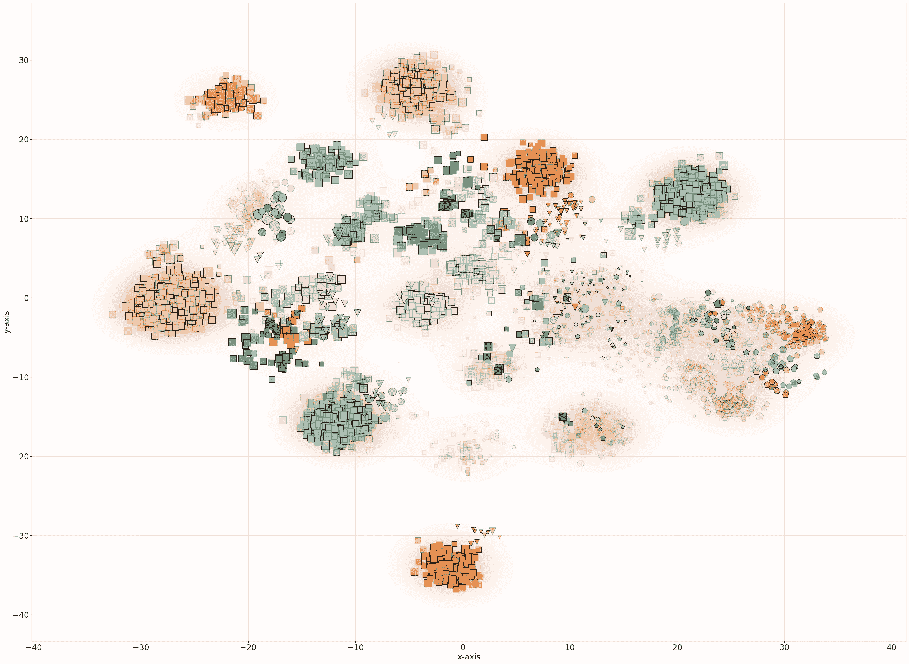

# 创建和探索数据科学中的角色与薪资概况

> 原文：[`towardsdatascience.com/create-and-explore-the-landscape-of-roles-and-salaries-in-data-science-926092f616ca?source=collection_archive---------3-----------------------#2023-06-08`](https://towardsdatascience.com/create-and-explore-the-landscape-of-roles-and-salaries-in-data-science-926092f616ca?source=collection_archive---------3-----------------------#2023-06-08)

## 本教程讲解如何使用分类数据创建概况，并进行无监督分析以获得更深入的洞察

 [Erdogan Taskesen](https://erdogant.medium.com/?source=post_page-----926092f616ca--------------------------------)

·

[关注](https://medium.com/m/signin?actionUrl=https%3A%2F%2Fmedium.com%2F_%2Fsubscribe%2Fuser%2F4e636e2ef813&operation=register&redirect=https%3A%2F%2Ftowardsdatascience.com%2Fcreate-and-explore-the-landscape-of-roles-and-salaries-in-data-science-926092f616ca&user=Erdogan+Taskesen&userId=4e636e2ef813&source=post_page-4e636e2ef813----926092f616ca---------------------post_header-----------) 发表于 [Towards Data Science](https://towardsdatascience.com/?source=post_page-----926092f616ca--------------------------------) ·14 分钟阅读·2023 年 6 月 8 日

--

图片由作者提供。

数据科学领域正在不断发展，新的角色和职能不断被创造出来。传统的*数据科学*角色正在演变成几十种新角色，从*数据工程师、机器学习工程师、产品数据分析师、研究科学家、云数据工程师*等，还有很多其他角色。***在这篇博客中，我们将加载数据科学薪资数据集，并创建一个景观以检验角色如何根据地点、远程工作、职位、经验水平以及薪资关系等因素相互关联。*** 我将演示如何创建这样的景观以及如何使用无监督聚类方法深入分析样本。聚类分析使用库*clusteval*执行，而散点图则使用[*scatterd*](https://github.com/erdogant/scatterd)和*d3blocks*创建，以实现交互式图表。

# 介绍

数据科学是当今数字化领域中变化最快的领域之一。数据科学家的角色是解决复杂问题并推动基于数据的决策。基本知识包括统计技术、机器学习算法和数据可视化。但是……
