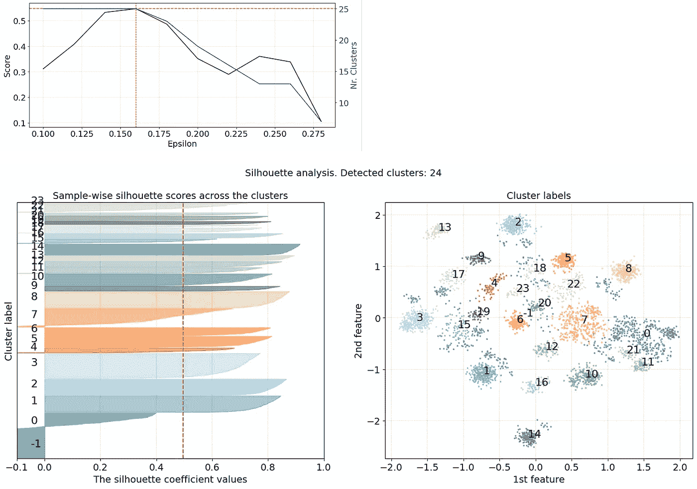

# 创建和探索数据科学中角色和薪资的图景

> 原文：[`towardsdatascience.com/create-and-explore-the-landscape-of-roles-and-salaries-in-data-science-926092f616ca`](https://towardsdatascience.com/create-and-explore-the-landscape-of-roles-and-salaries-in-data-science-926092f616ca)

## 一个关于如何使用分类数据创建图景并进行无监督分析以获取更深入见解的教程

[](https://erdogant.medium.com/?source=post_page-----926092f616ca--------------------------------)[](https://towardsdatascience.com/?source=post_page-----926092f616ca--------------------------------) [Erdogan Taskesen](https://erdogant.medium.com/?source=post_page-----926092f616ca--------------------------------)

·发表于 [Towards Data Science](https://towardsdatascience.com/?source=post_page-----926092f616ca--------------------------------) ·阅读时间 14 分钟·2023 年 6 月 8 日

--


图片由作者提供。

数据科学领域在不断发展，新角色和职能也随之产生。传统的*数据科学*角色正在演变为数十种新角色，包括*数据工程师、机器学习工程师、产品数据分析师、研究科学家、云数据工程师*等等。***在这篇博客中，我们将加载数据科学薪资数据集，并创建一个图景，以检查各角色如何根据地点、远程工作、职位名称、经验水平以及与薪资的关系相互关联。*** 我将演示如何创建这样的图景以及如何使用无监督聚类更深入地分析样本。聚类分析使用库*clusteval*进行，而散点图则使用[*scatterd*](https://github.com/erdogant/scatterd)和*d3blocks*来生成交互式图表。

# 介绍

数据科学是当今数字环境中变化最快的领域之一。数据科学家的角色是解决复杂问题并推动基于数据的决策。基本知识包括统计技术、机器学习算法和数据可视化。但在创建产品时，还需要深入了解工程学，以及数据治理、伦理和隐私等方面。作为数据科学家所需的专业知识取决于具体的角色描述和业务等因素。现在有很多新角色，比如*数据工程师、机器学习工程师、产品数据分析师、研究科学家、云数据工程师*等。每个角色也会随着经验水平的不同而变化。入门级职位通常涉及在资深数据科学家的指导下工作，协助数据预处理，并参与模型开发。随着你的进步，中级角色要求对统计分析、特征工程和算法选择有更深入的理解。资深数据科学家通常领导项目，指导初级团队成员，并参与战略规划。

数据科学领域的薪资因经验、行业、国家和高级资格而异。多年来，*地点*在数据科学机会和薪酬中扮演了非常重要的角色。像硅谷、纽约市和旧金山这样的科技中心提供高薪职位。然而，近年来，从不同地点远程工作变得技术上更容易且被更广泛接受。***让我们看看是否可以通过数据科学薪资数据集来确认这些趋势。***

*如果你觉得这篇文章有帮助，欢迎你* [*关注我*](http://erdogant.medium.com/) *，因为我会写更多类似的话题。如果你考虑购买 Medium 会员，你可以通过使用我的* [*推荐链接*](https://medium.com/@erdogant/membership)*来稍微支持我的工作。这个价格和一杯咖啡差不多，但可以让你每月阅读无限量的文章！*

# 用于分析的库。

我们将使用七个库来帮助加载数据集、执行预处理步骤、分析数据、创建可视化，并构建数据科学环境。如果你想深入了解细节，我推荐阅读下面的博客。

```py
# Easy import of data sets
pip install datazets

# One-hot encoding
pip install df2onehot

# PCA analysis. Create explainable biplots
pip install pca

# Clustering with automatic evaluation
pip install clusteval

# Making beautifull scatter plots
pip install scatterd

# Making beautifull interactive scatter plots
pip install d3blocks

# HNET for association analysis for the clusterlabels
pip install hnet
```

[](/what-are-pca-loadings-and-biplots-9a7897f2e559?source=post_page-----926092f616ca--------------------------------) ## 什么是 PCA 载荷，如何有效使用 Biplots？

### 一份实用指南，帮助你充分利用主成分分析

towardsdatascience.com [](/from-data-to-clusters-when-is-your-clustering-good-enough-5895440a978a?source=post_page-----926092f616ca--------------------------------) [## 从数据到集群：你的聚类何时足够好？

### 使用聚类方法可以发现合理的聚类和隐藏的宝石，但你需要正确的聚类评估…

[从数据到聚类：你的聚类够好吗？](https://towardsdatascience.com/from-data-to-clusters-when-is-your-clustering-good-enough-5895440a978a?source=post_page-----926092f616ca--------------------------------) [从聚类到洞察：下一步](https://towardsdatascience.com/from-clusters-to-insights-the-next-step-1c166814e0c6?source=post_page-----926092f616ca--------------------------------) [## 从聚类到洞察：下一步

### 学习如何定量检测哪些特征驱动了聚类的形成

[从聚类到洞察：下一步](https://towardsdatascience.com/from-clusters-to-insights-the-next-step-1c166814e0c6?source=post_page-----926092f616ca--------------------------------) [如何通过使用 D3js 和 Python 使散点图更具互动性](https://towardsdatascience.com/get-the-most-out-of-your-scatterplot-by-making-it-interactive-using-d3js-19939e3b046?source=post_page-----926092f616ca--------------------------------) [## 通过使用 D3js 和 Python 使散点图发挥最大的作用。

### 散点图非常有用，特别是当它们具有缩放和刷选功能时。

[如何通过使用 D3js 和 Python 使散点图更具互动性](https://towardsdatascience.com/get-the-most-out-of-your-scatterplot-by-making-it-interactive-using-d3js-19939e3b046?source=post_page-----926092f616ca--------------------------------) [探索和理解你的数据，通过重要关联网络](https://towardsdatascience.com/explore-and-understand-your-data-with-a-network-of-significant-associations-9a03cf79d254?source=post_page-----926092f616ca--------------------------------) [## 探索和理解你的数据，通过重要关联网络。

### 探索以理解你的数据可能会决定一个项目是失败还是成功完成！

[探索和理解你的数据，通过重要关联网络](https://towardsdatascience.com/explore-and-understand-your-data-with-a-network-of-significant-associations-9a03cf79d254?source=post_page-----926092f616ca--------------------------------)

# 数据科学薪资数据集

[数据科学薪资数据集](https://ai-jobs.net/salaries/download/)来源于 ai-jobs.net [1]，并且也作为 Kaggle 竞赛 [2] 公开。数据集包含 4134 个样本的 11 个特征。这些样本来自全球，每周更新，从 2020 年到现在（大约 2023 年初）。数据集已公开发布，供免费使用。让我们加载数据，查看变量。

```py
# Import library
import datazets as dz
# Get the data science salary data set
df = dz.get('ds_salaries.zip')

# The features are as following
df.columns

# 'work_year'          > The year the salary was paid.
# 'experience_level'   > The experience level in the job during the year.
# 'employment_type'    > Type of employment: Part-time, full time, contract or freelance.
# 'job_title'          > Name of the role.
# 'salary'             > Total gross salary amount paid.
# 'salary_currency'    > Currency of the salary paid (ISO 4217 code).
# 'salary_in_usd'      > Converted salary in USD.
# 'employee_residence' > Primary country of residence.
# 'remote_ratio'       > Remote work: less than 20%, partially, more than 80%
# 'company_location'   > Country of the employer's main office.
# 'company_size'       > Average number of people that worked for the company during the year.

# Selection of only European countries
# countries_europe = ['SM', 'DE', 'GB', 'ES', 'FR', 'RU', 'IT', 'NL', 'CH', 'CF', 'FI', 'UA', 'IE', 'GR', 'MK', 'RO', 'AL', 'LT', 'BA', 'LV', 'EE', 'AM', 'HR', 'SI', 'PT', 'HU', 'AT', 'SK', 'CZ', 'DK', 'BE', 'MD', 'MT']
# df['europe'] = np.isin(df['company_location'], countries_europe)
```

图 1 展示了顶级职位的摘要以及薪资分布。顶部的两个面板是全球范围的，而底部的两个面板仅针对欧洲。尽管这些图表很有信息量，但它们展示的是平均值，并且不清楚地点、经验水平、远程工作、国家等在特定上下文中的关系。例如：*一名为小公司远程工作的入门级数据工程师的薪资是否与其他属性的有经验的数据工程师相似？* 这些问题可以通过下节展示的分析得到更好的回答。


图 1\. 排名前列的职位名称。上面两个面板是全球统计数据，而下面两个面板是欧洲的统计数据。（图片由作者提供）

## 预处理

数据科学薪资数据集是一个混合数据集，包含连续变量和分类变量。我们将进行无监督分析，并创建数据科学的全景图。但在进行任何预处理之前，我们需要去除冗余特征，例如 `salary_currency` 和 `salary`，以防止多重共线性问题。此外，我们将从数据集中排除 `salary_in_usd` 变量，并将其作为目标变量 `y` 存储，因为我们不希望由于薪资本身而发生分组。基于聚类结果，我们可以调查任何检测到的分组是否与薪资相关。清理后的数据集包含 8 个特征和相同的 4134 个样本。

```py
# Store salary in separate target variable.
y = df['salary_in_usd']

# Remove redundant variables
df.drop(labels=['salary_currency', 'salary', 'salary_in_usd'], inplace=True, axis=1)

# Make the catagorical variables better to understand.
df['experience_level'] = df['experience_level'].replace({'EN':'Entry-level', 'MI':'Junior Mid-level', 'SE':'Intermediate Senior-level', 'EX':'Expert Executive-level / Director'}, regex=True)
df['employment_type'] = df['employment_type'].replace({'PT':'Part-time', 'FT':'Full-time', 'CT':'Contract', 'FL':'Freelance'}, regex=True)
df['company_size'] = df['company_size'].replace({'S':'Small (less than 50)', 'M':'Medium (50 to 250)', 'L':'Large (>250)'}, regex=True)
df['remote_ratio'] = df['remote_ratio'].replace({0:'No remote', 50:'Partially remote', 100:'>80% remote'}, regex=True)
df['work_year'] = df['work_year'].astype(str)

df.shape
# (4134, 8)
```

下一步是将所有测量值转换为相同的单位。为了做到这一点，我们将仔细执行独热编码，并处理我们可能无意中引入的多重共线性。*换句话说，当我们将任何分类变量转换为多个独热变量时，我们引入了一个偏差，使得我们可以基于来自同一分类列的两个或更多特征完美预测一个特征（即独热编码特征的总和始终为一）。这被称为虚拟陷阱，我们可以通过简单地删除一个列来打破线性链条，从而防止它。* `df2onehot` 包含虚拟陷阱保护功能。此功能比仅仅删除每个类别的一个独热列稍微高级一些，因为它仅在由于其他清理操作（如每个独热特征的样本最小数或布尔特征中的 `False` 状态的移除）导致线性链条尚未断裂时才移除一个独热列。

```py
# Import library
from df2onehot import df2onehot

# One hot encoding and removing any multicollinearity to prevent the dummy trap.
dfhot = df2onehot(df,
                  remove_multicollinearity=True,
                  y_min=5,
                  verbose=4)['onehot']

print(dfhot)
#       work_year_2021  ...  company_size_Small (less than 50)
# 0              False  ...                              False
# 1              False  ...                              False
# 2              False  ...                              False
# 3              False  ...                              False
# 4              False  ...                              False
#              ...  ...                                ...
# 4129           False  ...                              False
# 4130            True  ...                              False
# 4131           False  ...                               True
# 4132           False  ...                              False
# 4133            True  ...                              False

# [4134 rows x 115 columns]
```

在我们的案例中，我们将删除包含少于 5 个样本的独热编码特征（`y_min=5`），并删除多重共线性以防止虚拟陷阱（`remove_multicollinearity=True`）。这将产生 115 个独热编码特征，适用于相同的 4134 个样本。

# PCA 分析显示，薪资受经验水平、公司规模和地点的驱动。

我们将使用 PCA 分析预处理的数据集，并确定样本如何根据载荷和视觉检查相互关联。请参见下面的代码部分了解如何执行 PCA 分析。更多细节请阅读这篇文章。样本与特征载荷关系的结果显示在双变量图中（图 2）。花时间理解它，因为它包含大量信息。首先，这个二维空间中的每一个点代表 4134 个样本中的一个，两个点之间的距离描述了它们在 115 个特征上的相似性。两点越接近，点在某种程度上越相似。图的背景显示了带有红色光晕的密度图，高密度和低密度区域以这种方式突出显示。每个点的大小是薪资，薪资越高，点的大小越大。颜色基于`job_title`，标记设置为`experience_level`。

```py
# Import library
from pca import pca
# Initialize
model = pca(normalize=False)
# Fit model using PCA
model.fit_transform(dfhot)

# Make biplot
model.biplot(labels=df['job_title'],
             s=y/500,
             marker=df['experience_level'],
             n_feat=10,
             density=True,
             fontsize=0,
             jitter=0.05,
             alpha=0.8,
             color_arrow='#000000',
             arrowdict={'color_text': '#000000', 'fontsize': 32},
             figsize=(40, 30),
             verbose=4,
             )
```


图 2\. 数据科学薪资数据集的双变量图。样本按职位标题着色，标记表示经验水平，点的大小基于薪资（美元）。(图像由作者提供)。

如果我们查看图 2，可以看到第一个主成分解释了 18.9%的方差，第二个主成分解释了 14.7%。这表明前两个主成分捕捉了数据中大部分的解释方差，这使得进一步解释样本关系和载荷是值得的。载荷（黑色箭头）描述了哪些原始特征对主成分中的方差负责。最大的载荷来自`work_year`类别，它将数据分成两个烟斗状的形状（左下到右上），而`experience level`和`company size`则形成了指向右上角的长尾。

形状较大的样本表示较高的薪资，并且似乎聚集在一起（左下）。许多左下角的样本具有矩形形状，这表示*资历经验水平*。向右上角的尾部移动时，点变得较小（相对较低的薪资）并且形状混合，表示各种经验水平。为了视觉检查，我们可以应用不同的颜色，如图 3 所示。总体来看，我们可以看到样本按年份聚类，并且呈烟斗状。随着时间的推移，可以观察到经验水平、公司规模和远程工作模式。

```py
# Import library
from scatterd import scatterd

# Create various scatter plots with different coloring.
model.scatter(labels=df['company_size'],
             s=y/500,
             marker=df['experience_level'],
             density=True,
             fontsize=20,
             jitter=0.05,
             alpha=0.8,
             figsize=(40, 30),
             verbose=4,
             grid=True,
             legend=True,
             )
```


图 3\. 四个面板中样本以不同的颜色显示。A. 样本按年份着色。B. 样本按经验水平着色。C. 样本按远程工作着色。D. 样本按公司规模着色。(图像由作者提供)。

当我们根据国家对样本进行着色时（图 4），欧洲的国家主要出现在尾部（灰色）。*这些结果表明，高薪资主要集中在欧洲以外的地区，具有高级经验水平，并且在大型公司工作。远程工作似乎没有影响。这一趋势在 2020 年至 2023 年间似乎也没有改变。*


图 4\. 欧洲地区的样本以灰色标记。标记设置为职位名称。（图片由作者提供）

# 创建数据科学角色和薪资的全景。

为了创建全景，我们将使用 t-分布随机邻域嵌入（t-SNE）。在预处理步骤中，`work_year` 列被移除，以避免按年份进行分离（跨年份的模式非常相似）。在 t-SNE 嵌入后，我们可以使用 `scatterd` 库在二维空间中散布数据点。该库突出显示密集区域（`density=True`），并提供对较少密集区域的透明度（`gradient=opaque`），使散点图保持整洁。全景现在可以在图 5 中找到。与前一部分一样，样本按职位名称着色，标记设置为经验水平，点的大小基于美元薪资。

```py
# Import libraries
from scatterd import scatterd
from sklearn.manifold import TSNE

# Remove work year from dataframe
df.drop(labels=['work_year'], inplace=True, axis=1)

# Create new one hot matrix without work year
dfhot = df2onehot(df, remove_multicollinearity=True, y_min=5, verbose=4)['onehot']

# Feature embedding using tSNE
X = TSNE(n_components=2, init='pca', perplexity=100).fit_transform(dfhot.values)

# Import library
fig, ax = scatterd(X[:, 0],
                   X[:, 1],
                   marker=df['experience_level'],
                   s=y/500,
                   labels=df['job_title'],
                   fontsize=0,
                   density=True,
                   args_density={'alpha': 0.4},
                   gradient='opaque',
                   edgecolor='#000000',
                   jitter=1,
                   grid=True,
                   legend=False,
                   figsize=(40, 30),
                   )
```


图 5\. 数据科学全景。样本按职位名称着色，标记设置为经验水平，点的大小基于美元薪资。（图片由作者提供）

# 驱动特征的检测。

为了确定哪些特征驱动样本的分组，我们需要调查全景中的分组情况（图 5）。我们将分两部分解决这个问题，首先进行聚类，然后进行富集分析。两个步骤都可以使用 `clusteval` 库来完成。让我们加载库并开始对数据进行聚类。

聚类方法是 `DBSCAN`，评估方法是 `Silhouette score`。在 `clusteval` 中，对 DBSCAN 的 epsilon 参数进行网格搜索，并使用最佳的 Silhouette 评分进行聚类。在我们的案例中，我们检测到了 24 个簇（簇 0 到 23）。结果显示在下面的代码部分和图 6 中，展示了 epsilon 的网格搜索以及 Silhouette 系数。有关更多细节，建议阅读博客：*从数据到簇：你的聚类何时足够好？*

```py
# Import library
from clusteval import clusteval

# Initialize clusteval
ce = clusteval(cluster='dbscan', metric='euclidean', linkage='complete', min_clust=7, normalize=True, verbose='info')

# Cluster evaluation
results = ce.fit(X)
```



图 6\. 上面的面板展示了 DBSCAN 的网格搜索优化。左下角的面板展示了各个簇的样本轮廓系数。右下角的面板显示了输入数据集的簇标签（图片由作者提供）。

对于检测到的集群标签，我们可以使用富集分析分析驱动集群的特征。阅读 *从集群到洞察；下一步*获取更多详细信息。下面的代码部分描述了哪些特征与每个集群标签显著相关。我们可以手动探索这些结果，也可以制作一个散点图，将前 *n* 个特征叠加在散点图中（图 7 和 8）。

```py
# Compute enrichment for each of the cluster labels
ce.enrichment(df)

# Show the significantly associated catagories for the cluster labels
print(ce.results['enrichment'])

#                 category_label              P  ...     category_name           Padj
# 0                  Entry-level   8.988604e-31  ...  experience_level   5.954950e-27
# 1             Junior Mid-level  3.818216e-294  ...  experience_level  2.547895e-290
# 2    Intermediate Senior-level   5.812236e-51  ...  experience_level   3.857000e-47
# 3             Junior Mid-level   4.519280e-43  ...  experience_level   2.997639e-39
# 4             Junior Mid-level   1.477602e-68  ...  experience_level   9.821622e-65
# ..                         ...            ...  ...               ...            ...
# 146         Medium (50 to 250)   6.991347e-12  ...      company_size   4.603802e-08
# 147               Large (>250)   1.424008e-61  ...      company_size   9.459684e-58
# 148       Small (less than 50)   1.487384e-55  ...      company_size   9.874743e-52
# 149         Medium (50 to 250)   4.985496e-22  ...      company_size   3.296410e-18
# 150         Medium (50 to 250)   1.461693e-06  ...      company_size   9.553627e-03

# [151 rows x 11 columns]

# Create scatter plot with enrichment results.
ce.scatter(n_feat=4, s=y/500, jitter=0.05, fontsize=14, density=True, params_scatterd={'marker':df['experience_level'], 'gradient':'opaque', 'dpi':200}, figsize=(40,30))

# Create dense areas with enrichment results.
ce.scatter(n_feat=4, s=0, jitter=0.05, fontsize=14, density=True, params_scatterd={'marker':df['experience_level'], 'gradient':'opaque', 'dpi':200}, figsize=(40,30))
```


图 7\. tSNE 嵌入的散点图，显示了集群标签和每个集群的显著相关特征（图片由作者提供）。


图 8\. 仅绘制每个集群显著相关特征的密度图。（图片由作者提供）。

# 使用 D3Blocks 进行互动可视化。

作为最终练习，我们将为 2D PCA 和 t-SNE 嵌入创建一个互动散点图。这有助于更好地理解单个样本的分布情况，缩放和平移可以帮助调查单个样本和/或组。

+   [查看这里的全球互动数据科学全景图。](https://erdogant.github.io/docs/d3blocks/data_science_landscape.html)

+   [查看这里的欧洲互动全景图。](https://erdogant.github.io/docs/d3blocks/data_science_landscape_europe.html)

```py
# Import libraries
from scatterd import scatterd, jitter_func
from d3blocks import D3Blocks, normalize
import numpy as np

# Initialize
d3 = D3Blocks()

tooltip = []
for i in range(0, df.shape[0]):
    tip = '<br>'.join(list(map(lambda x: x[0].replace('_', ' ').title()+': '+x[1], np.array(list(zip(df.columns, df.iloc[i,:].values))))))
    tip = tip + '<br>' + 'Salary: $' + str(y[i])
    tooltip.append(tip)

# Set all propreties
d3.scatter(jitter_func(X[:,0], jitter=1),      # tSNE x-coordinates
           jitter_func(X[:,1], jitter=1),      # tSNE y-coordinates 
           x1=jitter_func(model.results['PC']['PC1'].values, jitter=0.05), # PC1 x-coordinates
           y1=jitter_func(model.results['PC']['PC2'].values, jitter=0.05), # PC2 y-coordinates
           color=df['job_title'].values,       # Color on job title
           tooltip=tooltip,                    # Tooltip
           size=normalize(y.values, minscale=1, maxscale=25), # Node size on salary.
           opacity='opaque',                   # Create a tidy scatterplot by only highlighting dense areas
           stroke='#000000',                   # Edge color is black
           cmap='tab20',                       # Colormap
           scale=True,                         # Scale the datapoints
           label_radio=['tSNE', 'PCA'],
           figsize=[1024, 768],
           filepath='Data_science_landscape.html',
           )
```


图 9\. 全球互动数据科学全景图。使用 D3Blocks 创建。（图片由作者提供）。

# 最后的总结。

我们开始这个研究以利用数据科学薪资数据集考察数据科学领域的趋势。***我们可以得出结论：薪资较高的工作主要集中在欧洲以外，具有高级经验水平，并且在大型公司工作。远程工作似乎没有影响。这一趋势在 2020 年到 2023 年间保持不变。*** 我们创建了一个互动数据科学全景图，并使用富集分析分析了集群。互动散点图使用 *D3blocks 库*创建。我希望你在阅读这篇博客时感到愉快并有所收获。请记住，有两个重要的特征没有包含在数据集中：*幸福感和与家人朋友共度的时间*。—— *没有什么是永恒的，享受当下。*

*保持安全。保持清醒。*

***干杯，E.***

*如果你觉得这篇文章对你有帮助，欢迎* [*关注我*](http://erdogant.medium.com/) *，因为我会写更多类似的内容。如果你考虑购买 Medium 会员，可以通过使用我的* [*推荐链接*](https://medium.com/@erdogant/membership)*支持我的工作。这与一杯咖啡的价格相同，但这允许你每月阅读无限数量的文章！*

# 软件

+   [Scatterd 文档页面](https://erdogant.github.io/scatterd)

+   [Clusteval 文档页面](https://erdogant.github.io/clusteval)

+   [D3Blocks 文档页面](https://d3blocks.github.io/d3blocks/)

+   [PCA 文档页面](https://erdogant.github.io/pca/pages/html/index.html)

# 让我们连接吧！

+   [在 LinkedIn 上与我连接](https://www.linkedin.com/in/erdogant/)

+   [在 Github 上关注我](https://github.com/erdogant)

+   [在 Medium 上关注我](https://erdogant.medium.com/)

# 参考文献

1.  [`ai-jobs.net/salaries/download/`](https://ai-jobs.net/salaries/download/) ([CC0: 公众领域](https://creativecommons.org/publicdomain/zero/1.0/))

1.  [*2020–2023 年全球 AI、ML、数据薪资趋势*](https://www.kaggle.com/datasets/nguyenthicamlai/ai-ml-data-salaries)

1.  *用 Python 创建美丽的独立交互式 D3 图表* Medium，2022

1.  *从数据到簇：你的聚类效果何时足够好？* Medium，2023

1.  *从簇到洞察：下一步**,* Medium，2022

1.  *通过使用 D3js 和 Python 使散点图交互化，从中获得最大收益*，Medium*，* 2022 年 11 月

1.  *t-SNE、UMAP、PCA 和其他映射的定量比较* Medium，2022
