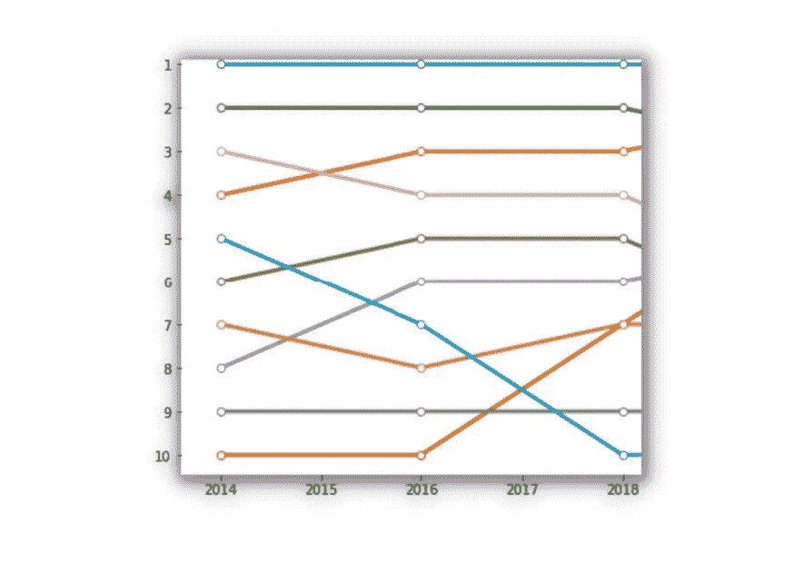
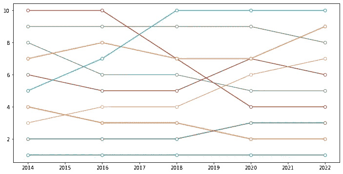

# 使用 Matplotlib 创建凸形图

> 原文：[`towardsdatascience.com/create-bump-charts-with-matplotlib-431b0e6fcb90`](https://towardsdatascience.com/create-bump-charts-with-matplotlib-431b0e6fcb90)

## 仅使用 Matplotlib 探索排名随时间的变化

[](https://medium.com/@bruno.ponne?source=post_page-----431b0e6fcb90--------------------------------)[](https://towardsdatascience.com/?source=post_page-----431b0e6fcb90--------------------------------) [Bruno Ponne](https://medium.com/@bruno.ponne?source=post_page-----431b0e6fcb90--------------------------------)

·发布于[数据科学前沿](https://towardsdatascience.com/?source=post_page-----431b0e6fcb90--------------------------------) ·6 分钟阅读·2023 年 3 月 13 日

--


图片由[blueberry Maki](https://unsplash.com/@yukkien?utm_source=medium&utm_medium=referral)提供，来源于[Unsplash](https://unsplash.com/?utm_source=medium&utm_medium=referral)

> 没有什么比变化更稳定的了。*鲍勃·迪伦*

当我还是青少年时，我喜欢查看 Billboard 上最受欢迎的歌曲，尽管我的口味通常与 Billboard 展示的内容不同。通常，我最喜欢的歌曲最终未能进入前列。尽管如此，这对我来说仍然是一个获取新歌和好歌的极佳来源。我甚至喜欢查看过去哪些歌曲曾经流行。例如，我发现，在我出生的那一周，即 1987 年 8 月，[*I Still Haven’t Found What I’m Looking For*](https://www.youtube.com/watch?v=e3-5YC_oHjE) 是[Hot Billboard 100](https://www.billboard.com/charts/hot-100/1987-08-08/)的第一名！

人类总是在比较、评估和排名生活的各个方面。2023 年最好的足球队是什么？2022 年最好的网球运动员是谁，去年在 GitHub 上使用最多的编程语言是什么？我们想知道现在的趋势是什么。但正如生活中的一切一样，排名总是在变化。

在本课程中，你将学习如何使用基础的[Matplotlib](https://matplotlib.org/)，无需额外的库来显示排名的变化。作为示例，你将使用[Octoverse Report 2022](https://octoverse.github.com/2022/top-programming-languages)发布的数据，该报告分析了 2022 年最受欢迎的编程语言。

## 1\. 什么是**凸形图**？

凸形图类似于折线图，但专注于探索排名随时间的变化。例如，想象一下下图中的每条线代表一位歌手的受欢迎程度排名。这条线及其颜色代表歌手，x 轴代表年份，y 轴代表排名。



作者使用 Matplotlib 创建的图像

## 2\. 我们的竞争对手：编程语言

根据[Octoverse](https://octoverse.github.com/)，在 2022 年，程序员在 GitHub 上使用了大约 500 种语言来开发软件。JavaScript 是使用最广泛的语言，其次是 Python，我们将使用它来构建我们的气泡图。

报告还揭示了[Hashicorp 配置语言](https://www.ibm.com/topics/terraform)（HCL）是 GitHub 上增长最快的语言，反映了云基础设施的扩展。Rust 和 Typescript 分别位居增长的第二和第三。

有几种排名使用不同的数据和方法来估计每种语言的位置。另一个排名是[Stack Overflow 2020 开发者调查](https://insights.stackoverflow.com/survey/2020#technology-programming-scripting-and-markup-languages-professional-developers)，它提供了类似但不完全相同的结果。这篇文章将使用 Octoverse 数据作为示例。

为了更容易复现，数据是通过代码生成并存储在字典列表中，如下所示。

```py
years_list = list(range(2014,2023,2))

list_programming = [

{
    'Name' : ["Javascript" for i in range(5)],
    'Year' : years_list,
    'Rank' : [1,1,1,1,1]
},

{
    'Name' : ["Python" for i in range(5)],
    'Year' : years_list,
    'Rank' : [4,3,3,2,2]
},

{
    'Name' : ["Java" for i in range(5)],
    'Year' : years_list,
    'Rank' : [2,2,2,3,3]
},

{
    'Name' : ["Typescript" for i in range(5)],
    'Year' : years_list,
    'Rank' : [10,10,7,4,4]
},

{
    'Name' : ["C#" for i in range(5)],
    'Year' : years_list,
    'Rank' : [8,6,6,5,5]
},

{
    'Name' : ["C++" for i in range(5)],
    'Year' : years_list,
    'Rank' : [6,5,5,7,6]
},

{
    'Name' : ["PHP" for i in range(5)],
    'Year' : years_list,
    'Rank' : [3,4,4,6,7]
},

{
    'Name' : ["Shell" for i in range(5)],
    'Year' : years_list,
    'Rank' : [9,9,9,9,8]
},

{
    'Name' : ["C" for i in range(5)],
    'Year' : years_list,
    'Rank' : [7,8,7,7,9]
},

{
    'Name' : ["Ruby" for i in range(5)],
    'Year' : years_list,
    'Rank' : [5,7,10,10,10]
}

]
```

## 3\. Matplotlib 子图方法

有几种方法可以用 Matplotlib 创建图形，但为了获得灵活性，建议使用`subplots()`。此方法创建两个对象：一个`Figure`类的对象和一个`Axes`类的对象。`Figure`对象将是你的图形的容器，而`Axes`对象将是图形本身。


作者创建的图像

下面的代码加载所需的库，并创建刚才提到的两个对象。

```py
import matplotlib.pyplot as plt
import numpy as np

fig, ax = plt.subplots()
```

## 4\. 设置图形大小

在 Matplotlib 中，你可以使用`plt.rcParams["figure.figsize"]`改变图形的大小。我们将其设置为宽 12 英寸，高 6 英寸。

```py
plt.rcParams["figure.figsize"] = (12,6)
```

## 5\. 为每种编程语言调用绘图方法

对于列表中的每个字典，我们将调用 *ax* 的`plot`方法，指定 x 轴上的年份和 y 轴上的排名。此外，你可以选择标记和线条的样式，“o-”表示我们希望使用点作为标记的线条。请注意，标记的面颜色设置为白色，这意味着点是填充白色的。

结果几乎符合我们的期望，但仍需要进一步调整。

```py
for element in list_programming:
  ax.plot(element["Year"], 
          element["Rank"], 
          "o-",                       # format of marker / format of line
          markerfacecolor="white")
```



作者使用 Matplotlib 创建的图像

## 6\. 反转 y 轴和设置轴刻度

最好将排名第一的语言放在图表的顶部。此外，我们希望所有排名数字都显示在 y 轴上。

我们可以使用命令`plt.gca().invert_yaxis()`来实现。此外，我们可以通过将带有值的[NumPy](https://numpy.org/)数组传递给`plt.yticks()`来设置 y 刻度。NumPy 数组可以通过`np.arange()`创建。

```py
plt.gca().invert_yaxis()
plt.yticks(np.arange(1, 11, 1))
```

## 7\. 标记线条

我们需要确定每条线对应的编程语言。为此，我们可以使用*ax* `*annotate*`方法。它接收的第一个参数是我们想要注释的文本。我们将使用`list_programming["Name"][0]`来获取语言名称。

`xy`参数是我们希望注释的点。在我们的案例中，它是每条线的末端。`xytext`参数是我们希望添加文本的点。注意`xytext`几乎与`xy`相同，但在 x 轴上稍微向右。最后，`va`表示垂直对齐。

```py
ax.annotate(element["Name"][0], 
              xy=(2022, element["Rank"][4]), 
              xytext=(2022.2,element["Rank"][4]), 
              va="center")
```

## 8\. 在 Matplotlib 中更改线宽

表示每种语言路径的线条相对较细，我们可以通过在`plot method`中的`linewidth`参数来增加其宽度。

## 9\. 清除图形

为了使图形更清晰，可以隐藏图形的框架。为此，请注意每个`Axes`对象有 4 个脊柱。一个脊柱是图形框架的一侧。我们可以用 for 循环迭代它们，并将它们的可见性属性设置为`False`。查看下面的所有这些调整。

```py
for element in list_programming:
  ax.plot(element["Year"], 
          element["Rank"], 
          "o-", # format of marker / format of line
          markerfacecolor="white",
          linewidth=3)
  ax.annotate(element["Name"][0], 
              xy=(2022, element["Rank"][4]), 
              xytext=(2022.2,element["Rank"][4]), 
              va="center")

plt.gca().invert_yaxis()
plt.yticks(np.arange(1, 11, 1))

for spine in ax.spines.values():
    spine.set_visible(False)
```


图片由作者使用 Matplotlib 创建

要好得多，是不是？

这个碰撞图不需要任何额外的库。此外，Matplotlib 允许你以多种方式自定义它！在[这篇文章](https://www.codingthepast.com/2023/02/11/Use-Matplotlib-line-plot-to-create-visualizations.html)中，我展示了使用 Matplotlib 绘制引人注目的可视化图形的进一步建议。

## 10\. 2022 年排名前十的编程语言

现在我们可以清晰地看到编程语言在过去十年中的演变情况。

自 2014 年以来，JavaScript 一直保持领先地位。根据[伯克利训练营](https://bootcamp.berkeley.edu/blog/most-in-demand-programming-languages/)，JavaScript 的流行是因为大多数网页浏览器都使用它。2014 年，Python 是第四大使用语言，自那时以来，Python 的受欢迎程度不断增长。如今，它是 GitHub 上第二大使用语言。最后，Java 的受欢迎程度有所下降，但仍然是第三大使用语言。

## 结论

在这篇文章中，你学会了用基本的 Matplotlib 图形显示排名变化。为此，不需要额外的库，只需理解 Matplotlib 对象及如何自定义它们以展示你的数据。

如果你喜欢这篇文章，**关注我**以了解更多数据可视化的内容！
