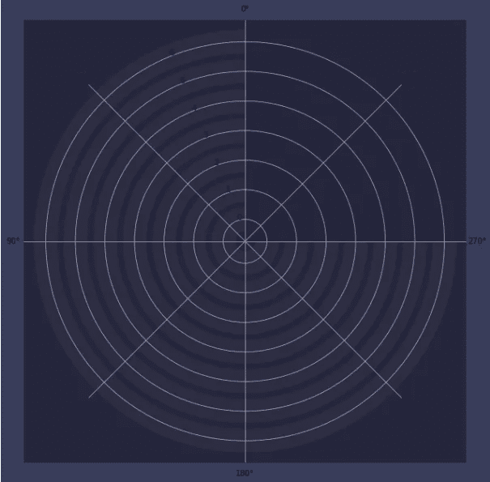

# 使用 Matplotlib 创建引人注目的径向条形图

> 原文：[`towardsdatascience.com/create-eye-catching-radial-bar-charts-with-matplotlib-fd03ff732048`](https://towardsdatascience.com/create-eye-catching-radial-bar-charts-with-matplotlib-fd03ff732048)

## 在 Python 中轻松创建视觉上吸引人的圆形条形图

[](https://andymcdonaldgeo.medium.com/?source=post_page-----fd03ff732048--------------------------------)[](https://towardsdatascience.com/?source=post_page-----fd03ff732048--------------------------------) [Andy McDonald](https://andymcdonaldgeo.medium.com/?source=post_page-----fd03ff732048--------------------------------)

·发布于 [Towards Data Science](https://towardsdatascience.com/?source=post_page-----fd03ff732048--------------------------------) ·阅读时间 9 分钟·2023 年 3 月 6 日

--


使用 matplotlib 创建的径向条形图。图像由作者提供。

径向条形图是传统条形图的一个视觉上吸引人的替代方案。数据在极坐标系统中绘制，而不是常规的笛卡尔坐标系统。这使得条形可以用环形表示，而不是垂直条形。

如果你希望吸引读者的注意力，径向条形图可以成为演示文稿或海报中一个很棒且视觉上吸引人的图形。然而，与许多数据可视化一样，它们也有自己的缺点。其中一个问题是它们可能很难解释。这是因为我们的视觉系统在比较类别之间的值时更擅长解释直线。此外，径向条形图中心的环形比外围的环形更难以读取和比较。

本文将展示如何使用 [matplotlib](https://matplotlib.org/) 库从 [Python](https://www.python.org/) 创建一个视觉上吸引人的径向条形图。

当提到 [matplotlib](https://matplotlib.org/) 时，大多数人会想到基本的图表，这些图表格式不佳，需要多行笨拙或令人困惑的代码才能显示出良好的图表。

# 使用 Matplotlib 创建径向条形图

## 导入库和加载数据

创建径向条形图的第一步是导入我们将要使用的库。在本教程中，我们需要导入 [matplotlib](https://matplotlib.org/)、[pandas](https://pandas.pydata.org/) 和 [numpy](https://numpy.org/)。

```py
import matplotlib.pyplot as plt
import pandas as pd
import numpy as np
```

导入库之后，我们可以加载或创建一些数据。在 Python 中，最常见的数据存储格式之一是 pandas 数据框。

数据可以通过 `pd.read_csv()` 函数从 CSV 文件加载到数据框中，也可以通过列表或字典手动创建。

在本教程中，我们将使用虚拟岩性数据创建一个数据框。我们将有多种岩性和每种岩性在特定间隔内出现的计数。

为了创建我们的数据框，我们首先创建一个包含两个键 `LITH` 和 `COUNT` 的字典，每个项的值将是包含岩性名称和每种岩性的计数的列表。

```py
lith_dict = {'LITH': ['Shale', 'Sandstone', 
                      'Sandstone/Shale', 'Chalk', 
                      'Limestone', 'Marl', 'Tuff'],
             'COUNT': [40,65, 40, 35, 
                            40, 70, 50]}

df = pd.DataFrame.from_dict(lith_dict)
```

一旦数据加载完成，我们需要找出两件事：

+   我们的 `COUNT` 列的最大值。这将给出我们环的最大值。

+   数据框中的总条目数

```py
max_value_full_ring = max(df['COUNT'])
data_len = len(df)
```

## 选择颜色和设置标签

创建径向条形图的下一步是定义将显示的颜色和标签。

```py
ring_colours = ['#2f4b7c', '#665191', '#a05195','#d45087',
               '#f95d6a','#ff7c43','#ffa600']
```

为图表选择颜色可能非常主观。

选择有效的图表颜色调色板时，有许多工具和文章可以帮助你。大多数基于颜色理论。

对于这个图表，我基于以下网站的颜色：

[## 数据可视化颜色选择器

### 使用调色板选择器创建一系列视觉上等距的颜色。这对于许多数据…

[www.learnui.design](https://www.learnui.design/tools/data-color-picker.html?source=post_page-----fd03ff732048--------------------------------)

该工具允许你在构建调色板时选择多达 8 种颜色，并且还允许你复制十六进制代码，然后可以直接粘贴到你的代码中。


来自 [数据可视化颜色选择器](https://www.learnui.design/tools/data-color-picker.html) 的调色板生成器工具。图像由作者提供。

为了设置标签，我们需要创建一个列表推导式，该推导式遍历岩性名称和计数。然后，这些内容会以 `Lithology (Count)` 格式的字符串形式连接在一起。

此外，在字符串的开头，我们可以添加几个空格。这是一种在标签和环的起始位置之间添加一些填充的简单方法。

```py
ring_labels =  [f'   {x} ({v}) ' for x, v in zip(list(df['LITH']), 
                                                 list(df['COUNT']))]
```

当我们检查 `ring_labels` 变量时，我们得到以下列表：

```py
['   Shale (40) ',
 '   Sandstone (65) ',
 '   Sandstone/Shale (40) ',
 '   Chalk (35) ',
 '   Limestone (40) ',
 '   Marl (70) ',
 '   Tuff (50) ']
```

## 使用 Matplotlib 创建径向条形图图形

现在数据已经加载完毕，我们可以专注于构建图表。

要创建图表，我们首先像创建其他 matplotlib 图表一样创建图形。我们还将传入几个参数到 `plt.figure()` 调用中。第一个是图形大小，我们将其设置为 10 x 10。这可以设置为你想要的任何大小，但这个大小在屏幕上查看时效果很好。

接下来，我们将传入 `linewidth` 和 `edgecolor` 参数。这些将为我们的图表添加一个 10 px 的边框，该边框的颜色与图表背景略有不同。

最后，我们将把`facecolor`设置为非常深的蓝色。

```py
fig = plt.figure(figsize=(10,10), linewidth=10,
                 edgecolor='#393d5c', 
                 facecolor='#25253c')
```

如果我们运行上述代码，我们将看到显示的方形图形，具有我们的边框和主图形背景。


径向条形图的背景和边框。图像由作者提供。

## 添加极坐标轴

下一步是向我们的图表添加一个使用极坐标而非笛卡尔坐标的坐标轴。

但是，在添加坐标轴之前，我们首先需要创建坐标轴的形状。

这通过创建一个名为`rect`的变量并将其分配给一个包含 4 个数字的列表来完成。这些数字代表起始位置（x 和 y 坐标）、高度和宽度。

如果我们想给径向条形图添加一些填充，我们需要将宽度和高度参数设置为小于 1 的值。在这种情况下，我们将其设置为 0.8，表示占用 80%的可用宽度和高度。

```py
rect = [0.1,0.1,0.8,0.8]
```

然后，我们可以使用`fig.add_axes`创建一个新坐标轴，并传入`rect`列表，同时将极坐标参数设置为真，并去除坐标轴框架。

随后，我们需要将径向条形设置为从图表的顶部开始，即北方（N），并且我们将设置条形逆时针辐射。如果我们希望条形顺时针辐射，则需要将`set_theta_direction()`更改为-1。

```py
# Add axis for radial backgrounds
ax_polar_bg = fig.add_axes(rect, polar=True, frameon=False)
# Start bars at top of plot
ax_polar_bg.set_theta_zero_location('N')
# Make bars go counter-clockwise. 
ax_polar_bg.set_theta_direction(1)
```

## 向径向条形图中添加微弱的背景环

为了给我们的图表增加一些视觉趣味，我们将添加一些从 0 到最大值的微弱条形。这会给人一种条形尚未填充的错觉。

```py
# Loop through each entry in the dataframe and plot a grey
# ring to create the background for each one
for i in range(data_len):
    ax_polar_bg.barh(i, max_value_full_ring*1.5*np.pi/max_value_full_ring, 
                     color='grey', 
                     alpha=0.1)
```

由于我们希望在图表的右上角留出空间用于标签，我们将设置条形仅完成 3/4 的圆圈。这是通过以下代码完成的，这段代码传递给`ax_polar_bg.barh`调用。

```py
max_value_full_ring*1.5*np.pi/max_value_full_ring
```

如果我们此时运行代码，我们将看到如下图表和径向条形图的初步效果。



径向条形图显示数据添加前的极坐标轴。图像由作者提供。

我们可以通过调用`.axis()`并传入单词`'off'`来隐藏极坐标轴。

```py
# Hide all axis items
ax_polar_bg.axis('off')
```

当我们重新运行代码时，我们会看到一个干净的图表，其中包含空的径向条。


微弱的径向条显示 0 到 100%的范围，用于创建背景。图像由作者提供。

## 向径向条形图中添加彩色环

现在我们准备为图表添加一些颜色。

为此，我们将向图形中添加一个新坐标轴，其代码与添加微弱背景条形的代码非常相似。

在`set_rgrids()`函数中，我们将传入一个包含 0 到 6 的列表。这些数字代表径向网格线的半径。此外，我们还将传入标签，并在此函数中设置它们的外观。为了使标签出现在图表的右上角并且靠近环的起始点，我们需要将角度设置为 0。

一旦设置好径向网格，我们需要遍历数据框中的每个类别，并使用 matplotlib 中的 `barh()` 函数向图表添加一个圆环。

与前一节代码类似，我们只希望圆环走到 3/4 的位置，因此我们需要将 pi 乘以 1.5，而不是 2。

```py
 # Add axis for radial chart for each entry in the dataframe
ax_polar = fig.add_axes(rect, polar=True, frameon=False)
ax_polar.set_theta_zero_location('N')
ax_polar.set_theta_direction(1)
ax_polar.set_rgrids([0, 1, 2, 3, 4, 5, 6], 
                    labels=ring_labels, 
                    angle=0, 
                    fontsize=14, fontweight='bold',
                    color='white', verticalalignment='center')

# Loop through each entry in the dataframe and create a coloured 
# ring for each entry
for i in range(data_len):
    ax_polar.barh(i, list(df['COUNT'])[i]*1.5*np.pi/max_value_full_ring, 
                  color=ring_colours[i])
```

当我们现在运行代码时，我们将得到以下图形，这个图形完成度为 95%。


带有极坐标网格线和刻度标签的径向条形图。图片由作者提供。

## 隐藏 Matplotlib 极坐标图中的极坐标网格线

最后，我们需要去除极坐标网格线、刻度和相关标签。可以这样做：

```py
# Hide all grid elements for the    
ax_polar.grid(False)
ax_polar.tick_params(axis='both', left=False, bottom=False, 
                   labelbottom=False, labelleft=True)

plt.show()
```

然后生成我们的最终径向条形图。


使用 matplotlib 生成的最终径向条形图。图片由作者提供。

# 生成径向条形图的完整 Python 代码

这是生成上述径向条形图的完整 Python 代码，使用 matplotlib。

```py
import matplotlib.pyplot as plt
import pandas as pd
import numpy as np

#Load data into pandas dataframe

lith_dict = {'LITH': ['Shale', 'Sandstone', 
                      'Sandstone/Shale', 'Chalk', 
                      'Limestone', 'Marl', 'Tuff'],
             'COUNT': [40,65, 40, 35, 
                            40, 70, 50]}

df = pd.DataFrame.from_dict(lith_dict)

# Get key properties for colours and labels
max_value_full_ring = max(df['COUNT'])

ring_colours = ['#2f4b7c', '#665191', '#a05195','#d45087',
               '#f95d6a','#ff7c43','#ffa600']

ring_labels = [f'   {x} ({v}) ' for x, v in zip(list(df['LITH']), 
                                                 list(df['COUNT']))]
data_len = len(df)

# Begin creating the figure
fig = plt.figure(figsize=(10,10), linewidth=10,
                 edgecolor='#393d5c', 
                 facecolor='#25253c')

rect = [0.1,0.1,0.8,0.8]

# Add axis for radial backgrounds
ax_polar_bg = fig.add_axes(rect, polar=True, frameon=False)
ax_polar_bg.set_theta_zero_location('N')
ax_polar_bg.set_theta_direction(1)

# Loop through each entry in the dataframe and plot a grey
# ring to create the background for each one
for i in range(data_len):
    ax_polar_bg.barh(i, max_value_full_ring*1.5*np.pi/max_value_full_ring, 
                     color='grey', 
                     alpha=0.1)
# Hide all axis items
ax_polar_bg.axis('off')

# Add axis for radial chart for each entry in the dataframe
ax_polar = fig.add_axes(rect, polar=True, frameon=False)
ax_polar.set_theta_zero_location('N')
ax_polar.set_theta_direction(1)
ax_polar.set_rgrids([0, 1, 2, 3, 4, 5, 6], 
                    labels=ring_labels, 
                    angle=0, 
                    fontsize=14, fontweight='bold',
                    color='white', verticalalignment='center')

# Loop through each entry in the dataframe and create a coloured 
# ring for each entry
for i in range(data_len):
    ax_polar.barh(i, list(df['COUNT'])[i]*1.5*np.pi/max_value_full_ring, 
                  color=ring_colours[i])

# Hide all grid elements for the    
ax_polar.grid(False)
ax_polar.tick_params(axis='both', left=False, bottom=False, 
                   labelbottom=False, labelleft=True)

plt.show()
```

# 总结

径向条形图提供了比传统条形图更具视觉吸引力的替代方案，并且可以轻松地使用 Python 的 matplotlib 库创建。在本文中，我们已经展示了如何从头开始使用 matplotlib 构建一个引人注目的径向条形图，它可以轻松用于海报展示或信息图表中。

*感谢阅读。在离开之前，你应该订阅我的内容，并将我的文章送到你的邮箱。* [***你可以在这里订阅！***](https://andymcdonaldgeo.medium.com/subscribe)*或者，你可以* [***注册我的新闻通讯***](https://fabulous-founder-2965.ck.page/2ca286e572) *以免费获取额外的内容。*

*其次，你可以获得完整的 Medium 体验，并通过注册会员支持我和其他成千上万的作者。每月仅需 $5，你就可以完全访问所有精彩的 Medium 文章，并有机会通过你的写作赚取收入。如果你通过* [***我的链接***](https://andymcdonaldgeo.medium.com/membership)***注册***，*你将直接通过部分费用支持我，并且不会多花费。如果你这样做，非常感谢你的支持！*
