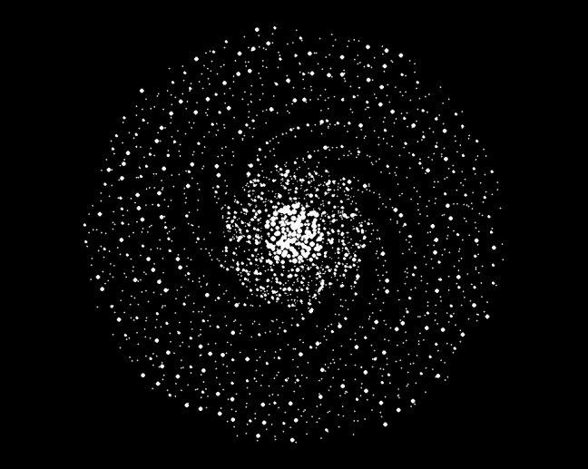

# 用 Tkinter 创建银河艺术

> 原文：[`towardsdatascience.com/create-galactic-art-with-tkinter-e0418a59b215`](https://towardsdatascience.com/create-galactic-art-with-tkinter-e0418a59b215)

## 用对数螺旋模拟大自然

[](https://medium.com/@lee_vaughan?source=post_page-----e0418a59b215--------------------------------)[](https://towardsdatascience.com/?source=post_page-----e0418a59b215--------------------------------) [Lee Vaughan](https://medium.com/@lee_vaughan?source=post_page-----e0418a59b215--------------------------------)

·发表在 [Towards Data Science](https://towardsdatascience.com/?source=post_page-----e0418a59b215--------------------------------) ·11 min 阅读·2023 年 9 月 30 日

--


螺旋星系模型（作者提供）

我们世界的奇妙之处在于它可以用数学来描述。这种联系如此紧密，以至于麻省理工学院的物理学家马克斯·特格马克相信，宇宙不仅仅是*用数学来描述的*，而且在某种意义上，它*就是*数学，因为我们都是一个巨大的数学对象的一部分 [1]。

这意味着许多看似复杂的物体——跨越令人困惑的尺度——可以简化为简单的方程。为什么飓风看起来像一个星系？为什么鹦鹉螺壳中的图案在松果中重复？答案是数学。


自然界中的对数螺旋示例（摘自“Python 科学工具” [2]）

除了外观，上面图片中的物体还有一个共同点：它们都*生长*，而自然界中的生长是*几何级数*。几何增长的螺旋被称为*对数螺旋*，因为在描述它们的方程中使用了自然对数的底数（*e*）。虽然通常被称为*对数螺旋*，但它们在自然界中的普遍存在使它们获得了另一个称号：*spira mirabilis* — “奇迹螺旋”。

在这个*快速成功的数据科学*项目中，我们将使用对数螺旋和 Python 的*Tkinter* GUI 模块来模拟一个螺旋星系。在此过程中，我们将生成一些吸引人且独特的数字艺术作品。

# 对数螺旋的极坐标方程

模拟螺旋星系主要是模拟*螺旋臂*。每个螺旋臂可以*用对数螺旋*来*近似*。


螺旋星系的示意图（作者提供）

因为螺旋从中心点或 *极点* 辐射出来，你可以用 *极坐标* 更容易地绘制它们。在这个系统中，熟悉的笛卡尔坐标系中的 (*x, y*) 坐标被 (*r,* Ɵ) 替代，其中 *r* 是距离中心的距离，Ɵ（theta）是 *r* 和 x 轴之间的角度。极点的坐标是 (0, 0)。


极坐标系示例（来自“Impractical Python Projects” [3]）

对数螺旋的极坐标方程是：


其中 *r* 是半径（从原点的距离），Ɵ 是从 x 轴逆时针测量的角度，*e* 是自然对数的底数，*a* 是控制大小的缩放因子，*b* 是控制螺旋的“开口度”和增长方向的增长因子。

# 编程策略

为了模拟一个四臂螺旋星系，我们可以使用前面的公式绘制一个螺旋，然后旋转并重新绘制螺旋三次。我们将用各种大小的标记构建螺旋，这些标记将代表星星。虽然这些标记对于单个星星来说规模过大，但它们将捕捉银河的整体亮度模式（见标题图片）。

为了捕捉银河的“背景光辉”，我们将随机分布一些小“星星”在银河盘周围。

# Tkinter 库

我们将用 `tkinter`（发音为“tee-kay-inter”）绘制我们的银河模拟。这是开发 Python 桌面应用程序的默认 GUI 库。尽管主要设计用于窗口、按钮和滚动条等 GUI 元素，`tkinter` 还可以生成图表、屏保、简单游戏等。

作为标准 Python 发行版的一部分，`tkinter` 在所有操作系统上都是可移植的，无需安装外部库。你可以在 [这里](https://docs.python.org/3/library/tk.html) 找到官方在线文档。

# 代码

以下代码是在 Spyder IDE 中编写的。你可以从这个 [Gist](https://gist.github.com/rlvaugh/e7a6411e12594ea6d8c57addaacbd9db) 下载完整脚本。

## 导入库和分配常量

我们需要使用的所有库都属于 Python 标准库，因此无需安装任何东西。除了 `tkinter`，我们还需要 `math` 模块来处理方程，`random` 模块来随机生成星星的位置。后者将使模拟 *随机*，因此每次都稍有不同和独特，以防你想制作一些 NFT。

```py
import math
import tkinter as tk
from random import randint, uniform, random

# Set the scaling factor for the galaxy:
SCALE = 225
```

`SCALE` 常量将改变我们银河的大小。大数值将增加盘的直径，小数值将减少它。

## 设置 tkinter 显示画布

以下代码创建了一个带有 *画布* 的 `tkinter` 窗口，你可以在上面绘制东西。这里将出现银河模拟。

```py
# set-up tkinter display canvas:
root = tk.Tk()
root.title("A Spiral Galaxy")
c = tk.Canvas(root, width=1000, height=800, bg='black')
c.grid()
c.configure(scrollregion=(-500, -400, 500, 400))
```

我们首先创建一个名为`root`的窗口。这是一个*顶级*窗口，包含其他所有内容。在命名窗口后，我们将一个*小部件*（“Windows 小工具”）添加到根窗口。这个`Canvas`小部件被分配给变量`c`，是一个用于图形和其他复杂布局的通用小部件，它将包含我们所有的绘图对象。

接下来，我们在`c`上调用`grid()`几何管理器，并通过配置画布以使用`scrollregion`来完成。这段代码通过使用画布宽度和高度的*一半*将原点坐标(0, 0)设置为画布的*中心*。我们需要这个设置来用极坐标绘制银河的螺旋臂。没有它，默认原点将是画布的左上角。

## 定义绘制螺旋臂的函数

接下来，我们将定义一个使用对数螺旋方程绘制单个螺旋臂的函数。这个螺旋可能是神奇的，但大部分魔力在于调整初始的基础螺旋以“充实”臂部。我们将通过改变星星的大小和位置，并为每个臂部复制螺旋并稍微向后移动，同时减弱其星星的亮度来实现。这会创建*前导*和*后续*边缘。

```py
def build_spiral(b, r, rot_fac, fuz_fac, arm):
    """Build a spiral arm for tkinter display with Logarithmic spiral formula.

    b = growth factor: negative = spiral to left; larger = more open
    r = radius
    rot_fac = rotation factor for spiral arm
    fuz_fac = fuzz factor to randomly shift star positions 
    arm = spiral arm (0 = leading edge, 1 = trailing stars)
    """
    spiral_stars = []
    fuzz = int(0.030 * abs(r))  # Scalable initial amount to shift locations
    for i in range(0, 800, 2):  # Use range(520) for central "hole"
        theta = math.radians(-i)
        x = r * math.exp(b*theta) * math.cos(theta - math.pi * rot_fac)\
            - randint(-fuzz, fuzz) * fuz_fac
        y = r * math.exp(b*theta) * math.sin(theta - math.pi * rot_fac)\
            - randint(-fuzz, fuzz) * fuz_fac
        spiral_stars.append((x, y))

    for x, y in spiral_stars:
        if arm == 0 and int(x % 2) == 0:
            c.create_text(x, y, 
                          fill='white', 
                          font=('Helvetica', '6'), 
                          text='*')
        elif arm == 0 and int(x % 2) != 0:
            c.create_text(x, y, 
                          fill='white', 
                          font=('Helvetica', '5'), 
                          text='*')
        elif arm == 1:
            c.create_text(x, y, 
                          fill='white', 
                          font=('Helvetica', '5'), 
                          text='.')
```

在这里，我们定义了一个具有五个参数的函数。前两个`b`和`r`来自螺旋方程。接下来的是`rot_fac`，它是旋转因子，让你可以围绕中心点移动螺旋，以便在不同的位置生成新的螺旋臂。

模糊因子`fuz_fac`允许你调整星星从螺旋线中心移动的距离。最后，`arm`参数让你指定*前导*臂或*后续*臂的微弱星星。后续臂将被*移动* —— 即稍微*落在*前导臂的后面 —— 并且其星星将更小（更暗）。

为了启动该功能，我们初始化一个空列表，称为`spiral_stars`，用于保存星星的坐标。接下来，我们将一个`fuzz`变量赋值为一个任意常数乘以`r`（半径）值的绝对值。这表示一个用于移动星星的起始点，我们将用`fuz_fac`模糊因子稍后进行修改。它还确保了*位移量*与显示器的大小*可扩展*。

单独使用对数螺旋方程会产生*排成一行*的星星，如下图的左侧两个面板所示。“模糊”会使星星在螺旋线的两侧来回移动。你可以在图的最右侧面板中看到对亮星的效果。


通过移动螺旋和改变星星位置来填充螺旋臂（摘自“非实用的 Python 项目” [3]）

下一步是绘制螺旋线。我们使用一系列值来表示方程中的Ɵ。你可以调整这些值以产生不同的结果（毕竟这是艺术）。

接下来，我们循环遍历 Ɵ 值并应用对数螺旋方程，将随机化的`fuzz`值（乘以`fuzz_factor`）加到结果中。我们通过将坐标追加到列表中来完成循环。

后续，我们将多次调用这个函数，并指定旋转因子（`rot_fac`）变量，它将使螺旋在中心周围移动。在程序构建四个主要的螺旋臂后，它将使用`rot_fac`构建四个*新的*螺旋臂，略微偏离前四个，以产生一条条暗淡的、拖尾的星星带。你可以在之前图的最右面板中看到这些星星；它们是每条亮星弧的左侧的暗淡星星弧。

在构建了星星位置列表后，我们循环遍历它，使用条件语句选择前导和后随的螺旋臂。虽然`tkinter`有绘制圆形（使用`create_oval()`方法）的能力，但我发现标点符号在微小尺度下效果更好。因此，我们使用了`create_text()`方法。

> 如前所述，这些星星对象只是为了视觉冲击。它们的大小和数量都不按比例计算。为了更真实，它们会小得多，并且数量会多得多（超过 1000 亿！）。

## 星星雾霾散布

螺旋臂之间的空间并不是没有星星，所以我们需要一个函数在整个银河模型中随机分布点。把这些点看作是你在银河照片中看到的“雾霾”或“光晕”。

首先，我们需要一个函数来生成随机的极坐标。

```py
def random_polar_coordinates(scale_factor):
    """Generate uniform random x,y point within a 2-D disc."""
    n = random()
    theta = uniform(0, 2 * math.pi)
    x = round(math.sqrt(n) * math.cos(theta) * scale_factor)
    y = round(math.sqrt(n) * math.sin(theta) * scale_factor)
    return x, y
```

这个函数以我们之前定义的`SCALE`常量作为唯一参数。然后，它选择一个 0.0 到 1.0 之间的浮点值，并将其赋值给一个名为`n`的变量。

接下来，它从 0 到 360 度（2π是 360 度的弧度等效值）的均匀分布中随机选择`theta`。

最后，它会计算单位圆盘上的 x 和 y 值，得到-1 到 1 之间的值，然后将这些值乘以比例因子，将结果缩放到我们银河系模型的大小。

下一个函数在显示上绘制雾霾星星。它以我们的比例因子常量和一个整数乘数（`density`）作为参数，后者用于增加或减少随机星星的基础数量。所以，如果你希望雾霾更浓而不是轻微的雾霾，就增加`density`参数的值。

```py
def star_haze(scale_factor, density):
    """Randomly distribute faint stars in the galactic disc.

    SCALE = scaled galactic disc radius
    density = multiplier to vary the number of stars posted
    """
    for _ in range(0, scale_factor * density):
        x, y = random_polar_coordinates(scale_factor)
        c.create_text(x, y, 
                      fill='white', 
                      font=('Helvetica', '3'), 
                      text='.')
```

为了绘制这些星星，我们使用了和螺旋臂相同的`tkinter`方法`create_text()`。这是有星星雾霾和没有星星雾霾的结果。


没有雾霾（左）和有雾霾（右）（作者）

你可以发挥创造力来处理雾霾。例如，增加密度并将其着色为灰色，或者使用循环来变化它们的大小和颜色。然而，不要使用绿色，因为宇宙中没有绿色的星星！

## 定义一个函数来构建显示

现在我们将定义一个函数来构建四个主要的螺旋臂并分布星云。每个螺旋臂将包括对之前定义的`build_spiral()`函数的两次调用：一次用于前缘的明亮星星（`arm=0`），一次用于后缘的较暗星星（`arm=1`）。

随意调整参数。我建议一次更改一个，以便更好地判断它们的影响。

```py
def build_galaxy():
    """Generate the galaxy display with tkinter."""
    b=0.3
    fuz_fac=1.5

    # Build leading and trailing spiral arms:
    build_spiral(b=b, r=SCALE, rot_fac=2, fuz_fac=fuz_fac, arm=0)
    build_spiral(b=b, r=SCALE, rot_fac=1.91, fuz_fac=fuz_fac, arm=1)

    build_spiral(b=b, r=-SCALE, rot_fac=2, fuz_fac=fuz_fac, arm=0)
    build_spiral(b=b, r=-SCALE, rot_fac=-2.09, fuz_fac=fuz_fac, arm=1)

    build_spiral(b=b, r=-SCALE, rot_fac=0.5, fuz_fac=fuz_fac, arm=0)
    build_spiral(b=b, r=-SCALE, rot_fac=0.4, fuz_fac=fuz_fac, arm=1)

    build_spiral(b=b, r=-SCALE, rot_fac=-0.5, fuz_fac=fuz_fac, arm=0)
    build_spiral(b=b, r=-SCALE, rot_fac=-0.6, fuz_fac=fuz_fac, arm=1)

    # Distribute star haze:
    star_haze(SCALE, density=30)

    # run tkinter loop:
    root.mainloop()

build_galaxy()
```


`build_galaxy()`函数的输出（作者提供）

在调用`build_galaxy()`函数后，应该会弹出一个外部窗口（或显示为任务栏上的图标）。你需要在再次调用函数之前关闭这个窗口。

如前所述，每个显示效果都是绝对独特的。为了增加深度和趣味，可以尝试将前缘（`arm=0`）的一半星星更改为浅蓝色或类似颜色。


输出结果，其中一半主要螺旋臂星星为浅蓝色（作者提供）

# 不要局限于对数螺旋

从数字艺术的角度来看，构建类银河物体的方法不仅仅限于对数螺旋，还有更多可以*利用*模型做的事情。以下是我书中的一些例子，[《不切实际的 Python 项目》](https://a.co/d/3xXtEOK)[3]*。*

## 一个遥远的银河系

以下模型灵感来源于 Alexandre Devert 在 [Marmakoide 的博客](http://blog.marmakoide.org/?m=201204)上的帖子，“在圆盘和球体上分布点” [4]。



一个遥远的虚构银河系（作者提供）

## 大胆前行

银河系的半径大约是 50,000 光年。当我们的比例因子（`SCALE`）设置为 200 时，每个像素代表约 250 光年（50,000 / 200）。知道这一点后，我们可以想象星际迷航联邦在其前 100 年中可能探索了多少银河系，假设他们在 4 级曲速下的平均速度为 100 倍光速：


星际迷航联邦在前 100 年内以 4 级曲速扩展的情况（来源：《不切实际的 Python 项目》 [3]）

对于这个模拟，我使用了 200 的比例因子和地球坐标（130, 80）。

## 无法测量的天堂

我们的无线电传输当前形成一个围绕地球的扩展球体，直径约为 230 光年。那基本上是前面图像中最小的星星之一的大小。正如卡尔·萨根所描述的，地球“只是悬浮在阳光中的一粒尘埃。”

当你考虑到这一点时，你会开始欣赏我们银河系的宏大和空旷。天文学家甚至有一个词来描述这个：*拉尼 akea*，夏威夷语意为“无法测量的天堂”。

# 摘要

利用 Python、`tkinter`和一个简单的方程，我们将一个螺旋星系模型转变为一些引人注目的数字艺术，这帮助我们设想自己在宇宙中的位置。这个模型具有多个调整参数和随机基础，让你创造出美丽且独特的艺术作品。

# 参考文献

1.  Tegmark, Max, 2014, “宇宙是由数学构成的吗？” *科学美国人*，[`www.scientificamerican.com/article/is-the-universe-made-of-math-excerpt/`](https://www.scientificamerican.com/article/is-the-universe-made-of-math-excerpt/).

1.  Vaughan, Lee, 2023, [*科学家的 Python 工具：Anaconda、JupyterLab 和 Python 科学库入门*](https://a.co/d/1SfWbGf)，No Starch Press，旧金山。

1.  Vaughan, Lee, 2018, [*不切实际的 Python 项目：有趣的编程活动让你更聪明*](https://a.co/d/5e2NG9b)，No Starch Press，旧金山。

1.  Devert, Alexandre, 2012, “在圆盘和球体上分布点，” *Marmakoide’s Blog*，[`blog.marmakoide.org/?m=201204`](http://blog.marmakoide.org/?m=201204).

# 谢谢！

感谢阅读，请关注我以获取更多*快速成功的数据科学*项目更新。
