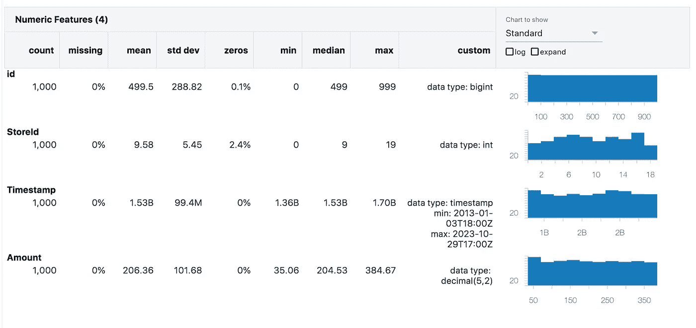
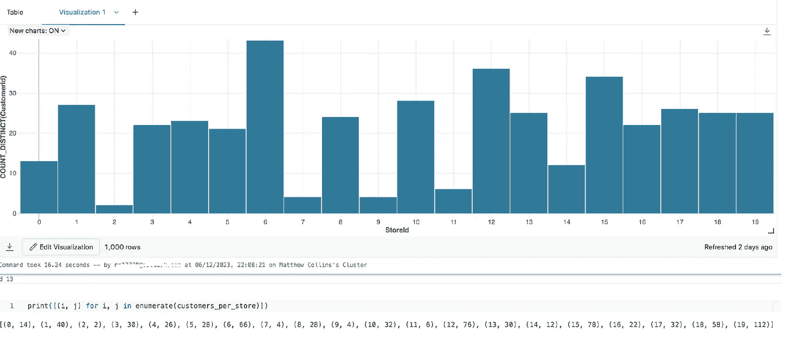
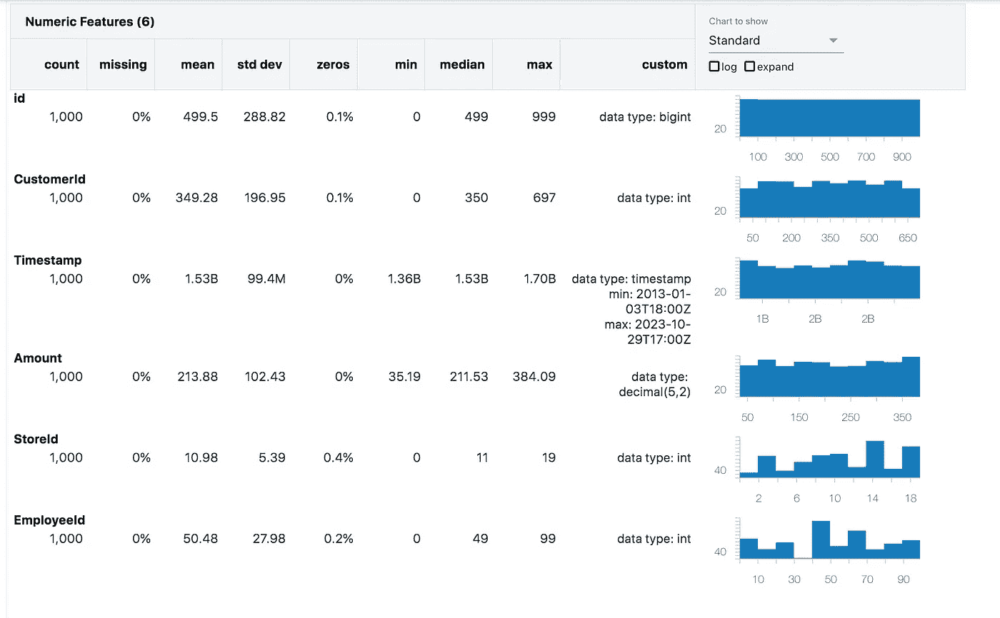
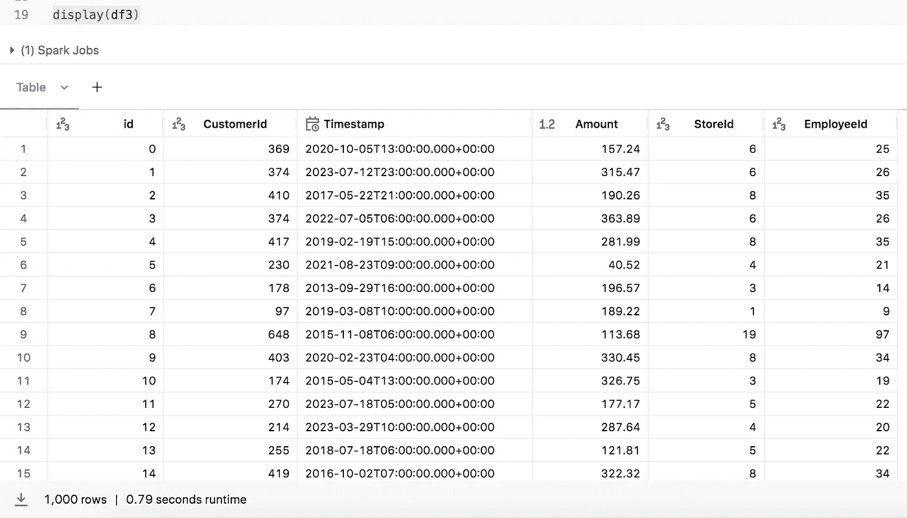

# 使用 PySpark UDFs 在合成表中创建多对一关系

> 原文：[`towardsdatascience.com/create-many-to-one-relationships-between-columns-in-a-synthetic-table-with-pyspark-udfs-41e39d97c936?source=collection_archive---------3-----------------------#2023-12-09`](https://towardsdatascience.com/create-many-to-one-relationships-between-columns-in-a-synthetic-table-with-pyspark-udfs-41e39d97c936?source=collection_archive---------3-----------------------#2023-12-09)

## 利用一些简单的方程在测试表中生成相关列。

 [Matt Collins](https://medium.com/@mc12338?source=post_page-----41e39d97c936--------------------------------)

·

[关注](https://medium.com/m/signin?actionUrl=https%3A%2F%2Fmedium.com%2F_%2Fsubscribe%2Fuser%2Fd1970f1605f1&operation=register&redirect=https%3A%2F%2Ftowardsdatascience.com%2Fcreate-many-to-one-relationships-between-columns-in-a-synthetic-table-with-pyspark-udfs-41e39d97c936&user=Matt+Collins&userId=d1970f1605f1&source=post_page-d1970f1605f1----41e39d97c936---------------------post_header-----------) 发表在 [Towards Data Science](https://towardsdatascience.com/?source=post_page-----41e39d97c936--------------------------------) ·7 分钟阅读·2023 年 12 月 9 日

--

使用 DALL-E 3 生成的图像

我最近一直在使用 Databricks Labs 数据生成器从头开始创建完全合成的数据集。在此过程中，我研究了围绕不同商店、员工和客户构建销售数据。因此，我想在我人为填充的列之间创建关系，例如将员工和客户映射到某个商店。

通过使用 PySpark UDF 和一些逻辑，我们可以生成遵循多对一关系的相关列。通过一点魔法，我们甚至可以扩展逻辑，为这种映射提供一些变化——比如客户通常在本地店铺购物，但有时会在其他店铺购物。

# **使用 Databricks Labs 数据生成器生成我们的基本 DataFrame**

***注意：如果不需要，可以跳过此部分！***

首先，我们需要创建一个包含我们第一个随机生成列的 DataFrame。在我们的情况下，我们将从店铺开始，因为从逻辑上讲，我们将有“每家店铺多个员工”和“许多客户重复在店铺购物”。

以星型模式数据模型为基础，我们将从销售事实表开始——这是一个事务表，包含 Sale Id、Store Id、Employee Id 和 Customer Id 的关键值，销售金额以及一些购买的日期时间数据。然后我们可以在后续的维度表中填写有关 Store、Employee 和 Customer 的详细信息。

我们从小开始——一个包含 1000 笔销售的表格就可以了。现在我们需要决定如何将这些销售分配到店铺、员工和客户之间。我们建议如下：

+   # 店铺数 = 20

+   # 员工数 = 100

+   # 客户数 = 700

我们还可以说，销售将记录在上个月的时间段内：

+   首次销售日期 = 2023–11–01

+   最后销售日期 = 2023–11–30

Sale Id 需要是唯一的列，以便我们可以为此生成一个 Id 列。现在我们需要将 1000 笔销售分配到 20 家店铺中。为了简单起见，我们假设这是随机的。

使用 Databricks Lab 生成器，我们可以用以下代码完成：

现在添加一些代码来记录销售的时间和金额。为了保持简单，我们将销售的时间戳四舍五入到最接近的小时。

为了计算销售金额，我们可以在 withColumn 表达式中使用“expr”参数，以允许我们生成一个随机数，并设定一些规则/边界。

在这种情况下，表达式非常简单：生成一个随机数（在 0 和 1 之间），加上 0.1（确保销售值不为 0），然后乘以 350。

我们现在有了 DataFrame 的基本结构，所以把它们整合在一起：

我们可以创建一个快速的数据概况来查看列中的值分布：

作者提供的图片：在 Databricks 中生成的数据概况

我们可以看到 StoreId 的分布在 20 家店铺中相对均匀，没有缺失值，且平均值围绕中心，符合预期。时间戳和金额值也是如此。

# **添加一个依赖的多对一列**

现在我们可以将 Employee Id 列添加到 DataFrame 中。我们现在完成了 Databricks Lab 数据生成器，所以将只使用 PySpark 操作来向 DataFrame 中添加列。

从代码中退一步，我们希望将其建模为以下语句：

+   有 20 家店铺。

+   每家店铺都有超过 1 名员工。

+   每个员工仅在一个商店工作。

首先，我们需要在商店之间分配员工。可以使用以下 Python 函数来完成：

现在我们已经为每个商店分配了员工分布，让我们开始分配 ID 吧！

employeesPerStore 列表确保每个商店的员工 ID 不会重叠。我们可以使用这个列表用以下公式随机分配员工 ID 到表中的销售记录中：

这个函数目前只适用于单个值——我们需要将它放入 PySpark DataFrame 可以使用的形式（功能上，并且要快速！）

我们可以将 PySpark UDF 传递给 *withColumn* 方法，因此让我们将此逻辑重格式化为一个函数，并将其设置为 UDF：

现在在 DataFrame 中调用它作为一个新列：

我们可以通过使用 Databricks 中的可视化工具来快速测试这是否正确，查看每个商店 ID 的员工 ID 不同计数。这是我的首选方法，但你也可以使用分组逻辑或其他绘图模块，如果需要的话。

作者图片：每个商店的员工 ID 不同计数

**重要提示：** 这个逻辑可能会导致员工在结果中**遗漏**。这意味着可能会有员工没有销售记录，从而没有被包含在 DataFrame 中。我们将在下一节中查看如何确保所有客户都有销售记录。

# 添加客户列

客户列稍有不同……虽然我们的使用案例表明客户在一个商店多次购物是常见的，但他们有一天去不同的商店也是完全可能的。我们如何建模这一点？

我们已经完成了员工列的起始工作，因此可以重复使用 *get_employees* 函数和 UDF 逻辑来处理客户，如下所示：

我们再次可能遗漏了一些客户。以下是一些纠正方法：

+   在 *while* 循环中重新计算，直到收敛到一个包含所有客户的 DataFrame（效率低，成本高，可能会无限期运行）

+   在 *while* 循环中随机更新客户 ID 直到 DataFrame 中所有客户都有（需要逻辑只覆盖相同商店，可能也会无限期运行）

+   返回销售表中记录超过 1 条的所有客户 ID 列表，并随机覆盖直到所有缺失的 ID 都被添加（还需要逻辑覆盖相同商店的客户，可能还需要 *while* 循环逻辑）

+   **反转过程，从员工开始。这确保每个员工被随机分配到行中。然后我们可以使用映射并应用商店 ID。**

希望你能明白最后一个选项为什么是计算工作量最小的——我们拥有所需的所有代码，只需要稍微重新格式化一下。

我们的新脚本如下：

作者图片：新 DataFrame 的 Databricks 数据概况

# 向客户添加随机性

我们现在需要的是一些随机性，我们需要定义它。以我们的例子为例，假设每个客户有 90%的机会在通常的商店（“本地”商店）购物。如果我们不需要将所有客户返回在结果集中，我们可以简单地调整我们的*customers_udf*，并使用*df2*：

该逻辑涉及使用*random.choices*函数来提供加权列表并返回单一值。

要计算加权列表，我们需要将客户的“本地”商店的权重设置为 90%，因此需要将剩余的 10%分配给其他商店，这里有 19 家商店。因此，每个其他商店被选择的概率将是 10/19 = 0.526%。我们可以用这些百分比填充一个数组，数组看起来类似于：[0.526,0.526,0.526,…,90,0.526,…0.526]

将其传递给`random.choices`，我们就可以根据对应的权重从列表中随机选择一个商店 ID，并将其用作*customer_id*变量的输入，如前所述。

**注意：** `random.choices`的输出返回一个列表（因为你可以请求 k 个结果），所以访问列表的第 0 个元素以获取 store_id 作为整数值。

如果我们需要将此逻辑与包含所有客户的 DataFrame 结合使用，我们可以稍微逆转该过程。权重逻辑仍然有效，所以我们可以将其插入以随机选择商店并将其作为结果返回：

作者提供的图像：Databricks 中的最终 DataFrame 示例

# 结论

就这样！一个合成创建的 DataFrame，其中列之间有严格和松散的映射。你现在可以进行下一步，填充可能包含更多描述性信息的相关表，例如商店名称、地址、员工姓名、角色等的维度表。这也可以使用 Databricks Labs 数据生成器或任何其他你熟悉的工具/过程来完成。

在 Databricks Labs 数据生成器的[GitHub Repo](https://github.com/databrickslabs/dbldatagen)上有一些很棒的示例和文档，如果你想了解更多内容，请查看一下。

我所有的代码可以从以下[GitHub Repo](https://github.com/MattPCollins/Dbldatagen-Related-Tables)访问。

如果你对这个演示有任何想法、评论或替代方案，请在评论中联系我。谢谢！
