# 使用 Python 创建惊艳的分形艺术：初学者与数学爱好者的教程

> 原文：[`towardsdatascience.com/create-stunning-fractal-art-with-python-a-tutorial-for-beginners-c83817fcb64b`](https://towardsdatascience.com/create-stunning-fractal-art-with-python-a-tutorial-for-beginners-c83817fcb64b)

## 只需一行代码或更少

[](https://ibexorigin.medium.com/?source=post_page-----c83817fcb64b--------------------------------)[](https://towardsdatascience.com/?source=post_page-----c83817fcb64b--------------------------------) [Bex T.](https://ibexorigin.medium.com/?source=post_page-----c83817fcb64b--------------------------------)

·发表于[Towards Data Science](https://towardsdatascience.com/?source=post_page-----c83817fcb64b--------------------------------) ·12 分钟阅读·2023 年 3 月 6 日

--

## 介绍

“我从未见过如此美丽的事物”这句话只应用于分形。确实，有《蒙娜丽莎》、《星夜》和《维纳斯的诞生》（顺便说一下，这些都被 AI 生成艺术破坏了），但我认为没有任何艺术家或人类能够创造出像分形那样**极为惊艳**的作品。

左边是标志性的分形，曼德布罗特集合，它在 1979 年被发现，当时没有 Python 或图形软件可用。

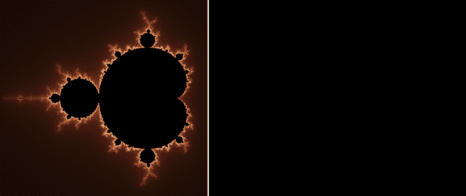

GIF 由作者使用[Fraqtive](https://github.com/mimecorg/fraqtive)生成，这是一个开源应用程序。[GPL-3 许可证](https://github.com/mimecorg/fraqtive)。

曼德布罗特集合是一组复数，当在复平面上绘制时，形成我们看到的自我重复形状。集合中的每个数字也可以是**朱利亚集合**的种子，你可以看到美丽的图案在我在曼德布罗特集合边界内移动鼠标时显现出来。

但在我们能够绘制曼德布罗特集合或朱利亚集合之前（不过，相信我，我们会的），我们还有很多内容要学习。如果你只是来看看那些炫酷的图片，我强烈推荐下载[开源 Fraqtive 软件](https://fraqtive.mimec.org/)（尽情发挥吧！），我用它生成了上面的 GIF 以及下面的那个：

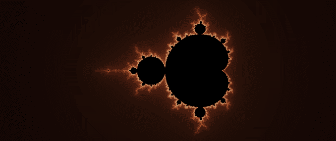

GIF 由作者使用[Fraqtive](https://github.com/mimecorg/fraqtive)生成，这是一个开源应用程序。[GPL-3 许可证](https://github.com/mimecorg/fraqtive)。

如果你只想用一行代码在 Python 中绘制曼德布罗特集合，下面就是代码（不，这个副标题不是诱饵）：

```py
from PIL import Image

Image.effect_mandelbrot((512, 512), (-3, -2.5, 2, 2.5), 100).show()
```

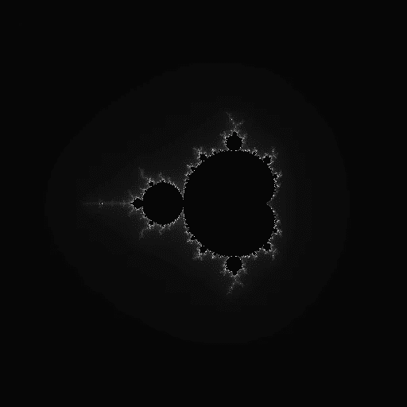

作者提供的图片

但是，如果你想深入了解美丽的分形，学习如何绘制它们，并且最重要的是，如何适当地给它们上色，那么请继续阅读！

在这篇文章中，我们将学习如何使用 Matplotlib 和 NumPy 绘制基本的（但仍然非常酷的）曼德尔布罗特集合。然后，我们将在未来的文章中使用 Pillow 将其提升到一个全新的水平。

让我们开始吧。

## Python 中的复数

Python 程序员并不每天处理复数。由于在本教程中我们将频繁使用复数，因此本节将作为一个入门介绍。

你可以通过将字面量*j*附加到整数或浮点数来创建复数的虚部。

```py
num1 = 2 + 1j
num2 = 12.3 + 23.1j

type(num1)
```

```py
complex
```

如果看到虚数用*j*而不是*i*表示让你感到困惑（你好，数学家们），你可以使用内置的`complex`函数：

```py
2 + 3j == complex(2, 3)
```

```py
True
```

一旦创建，你可以通过`real`和`imag`属性访问复数的实部和虚部：

```py
num1.real
```

```py
2.0
```

```py
num2.imag
```

```py
23.1
```

这篇文章中另一个重要的复数特性是它们的绝对值。复数的绝对值或模长衡量的是它在复平面上与原点（0, 0）之间的距离。它被定义为实部和虚部的平方和的平方根（感谢毕达哥拉斯）。

```py
abs(1 + 3.14j)
```

```py
3.295390720385065
```

这些就足够让我们创造一些很棒的东西了。让我们开始吧！

## 简单公式，宏伟集合

我们的旅程开始于确定某个复数***c***是否属于曼德尔布罗特集合，这实际上非常简单。我们只需将其代入下面的公式，并生成一个*z*值的序列：

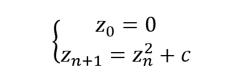

图片由作者提供

第一个*z*始终为 0，如上所定义。后续元素通过对前一个*z*进行平方运算并将*c*加到结果中来找到。

让我们在 Python 中实现这个过程。我们将定义一个`sequence`函数，该函数返回给定*c*的前`n`个元素：

```py
def sequence(c, n=7) -> list:
    z_list = list()

    z = 0
    for _ in range(n):
        z = z ** 2 + c
        z_list.append(z)

    return z_list
```

现在，我们将对一堆数字进行函数测试：

```py
import pandas as pd

df = pd.DataFrame()
df['element'] = [f"z_{i}" for i in range(7)]

# Random numbers
cs = [0, 1, -1, 2, 0.25, -.1]

for c in cs:
    df[f"c={c}"] = sequence(c)

df
```

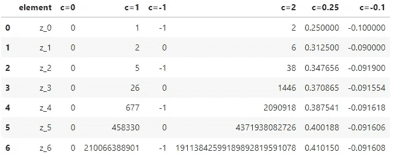

图片由作者提供

我们看到三种结果：当*c*为 1 或 2 时，序列是无界的（发散到无限大）。当*c*为-1 时，序列在 0 和-1 之间来回变化。至于 0.25 和-0.1，它们保持较小或有界。

那么，这五个中哪些是幸运的成为曼德尔布罗特集合的成员呢？

## 你稳定吗？

我们的筛选过程非常简单——如果*c*将序列发散到无限大，它就不在曼德尔布罗特集合中。在分形术语中，这个*c*被称为不稳定的。或者，我们换个角度看——如果给定的复数*c*的相应*Z*序列保持有界，那么它就是稳定的。

现在，我们必须弄清楚在将*c*分类为稳定或不稳定之前要查看多少个*z*成员。这个*迭代计数*并不容易找到，因为公式对*c*的最小变化都很敏感。

但幸运的是，人们已经研究了这个集合足够长的时间，知道所有的曼德 elbrot 都保持在半径为 2 的范围内。这意味着我们可以进行几十次迭代，剩下的相对较小或低于 2 的数字可能在曼德 elbrot 集合中。

所以，让我们使用这个逻辑创建一个新的函数`is_stable`，当数字是曼德 elbrot 时返回 True：

```py
def is_stable(c, n_iterations=20):
    z = 0

    for _ in range(n_iterations):
        z = z ** 2 + c

        if abs(z) > 2:
            return False
    return True
```

在这个布尔函数的主体中，我们将`z`设置为 0，并通过一个由`n_iterations`控制的循环运行算法。在每次迭代中，我们检查`z`的大小，以便在它早期超过 2 时终止循环，避免浪费时间运行其余的迭代。

最后的`return`语句仅在所有迭代后`z`低于 2 时执行。让我们检查几个数字：

```py
is_stable(1)
```

```py
False
```

```py
is_stable(0.2)
```

```py
True
```

```py
is_stable(0.26)
```

```py
True
```

```py
is_stable(0.26, n_iterations=30)
```

```py
False
```

注意增加`n_iterations`到 30 时如何改变 0.26 的稳定性。一般来说，接近分形边缘的值需要更多的迭代以进行更准确的分类，并创建更详细的视觉效果。

[## Join Medium with my referral link - Bex T.](https://ibexorigin.medium.com/membership?source=post_page-----c83817fcb64b--------------------------------)

### 获取对我所有⚡高级⚡内容和 Medium 上所有内容的独家访问权限。通过购买我的…

[ibexorigin.medium.com](https://ibexorigin.medium.com/membership?source=post_page-----c83817fcb64b--------------------------------)

## 如何在 Matplotlib 中绘制曼德 elbrot 集合

> 本节深受这篇精彩 RealPython 文章的启发：

[## Draw the Mandelbrot Set in Python - Real Python](https://realpython.com/mandelbrot-set-python/?source=post_page-----c83817fcb64b--------------------------------#plotting-the-mandelbrot-set-using-pythons-matplotlib)

### 在尝试绘制分形之前，了解对应的曼德 elbrot 集表示什么以及如何…

[realpython.com](https://realpython.com/mandelbrot-set-python/?source=post_page-----c83817fcb64b--------------------------------#plotting-the-mandelbrot-set-using-pythons-matplotlib)

我们文章的终极目标是用 Matplotlib 生成这个家伙（剧透警告，我们会创建更好的东西！）：

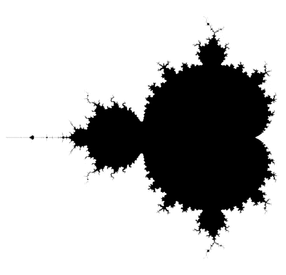

图片由作者提供。

这幅图像是通过将所有曼德 elbrot 部分涂成黑色，将不稳定的元素涂成白色创建的。在 Matplotlib 中，灰度有 256 种阴影或范围，从 0 到 255，其中 0 是完全白色，255 是纯黑色。但你可以将这个范围归一化为 0 和 1，使 0 为白色，1 为黑色。

这种归一化对我们很有帮助。我们可以创建一个二维复数数组，并对每个元素运行我们的`is_stable`函数。结果数组将对曼德 elbrot 赋值 1，对不稳定的部分赋值 0。当我们将这个数组绘制成图像时——瞧，我们得到了理想的黑白视觉效果。

让我们开始吧。首先，我们创建一个生成候选值矩阵的函数，我们可以在其上进行迭代：

```py
import numpy as np

def candidate_values(xmin, xmax, ymin, ymax, pixel_density):
    # Generate a 2D grid of real and imaginary values
    real = np.linspace(xmin, xmax, num=int((xmax-xmin) * pixel_density))
    imag = np.linspace(ymin, ymax, num=int((ymax-ymin) * pixel_density))

    # Cross each row of `xx` with each column of `yy` to create a grid of values
    xx, yy = np.meshgrid(real, imag)

    # Combine the real and imaginary parts into complex numbers
    matrix = xx + 1j * yy

    return matrix
```

我们将使用 `np.linspace` 函数在一个范围内创建均匀间隔的数字。`pixel_density` 参数动态设置每单位的像素数量。

例如，一个水平范围为 (-2, 0)、垂直范围为 (-1.2, 1.2) 且 `pixel_density` 为 1 的矩阵，其形状将是 (2, 2)。这意味着我们得到的曼德博图像将宽 2 像素、高 2 像素，这会让贝诺伊特·曼德博在他的坟墓里翻身。

```py
c = candidate_values(-2, 0, -1.2, 1.2, 1)

c.shape
```

```py
(2, 2)
```

所以，我们最好使用更高的密度，比如 25：

```py
c = candidate_values(-2, 0, -1.2, 1.2, 25)

c.shape
```

```py
(60, 50)
```

现在，为了对每个 `c` 元素运行我们的 `is_stable` 函数，我们用 `np.vectorize` 对其进行矢量化，并用 20 次迭代进行调用：

```py
c = candidate_values(-2, 0.7, -1.2, 1.2, pixel_density=25)

mandelbrot_mask = np.vectorize(is_stable)(c, n_iterations=20)
mandelbrot_mask.shape
```

```py
(60, 67)
```

我们将结果数组称为 `mandelbrot_mask`，因为它对每个曼德博集合返回 True (1)。为了绘制这个数组，我们使用 Matplotlib 的 `imshow` 函数，并使用 `binary` 颜色映射。这将使图像呈现黑白效果。

```py
import matplotlib.pyplot as plt

plt.imshow(mandelbrot_mask, cmap="binary")

# Turn off the axes and use tight layout
plt.axis("off")
plt.tight_layout()
```

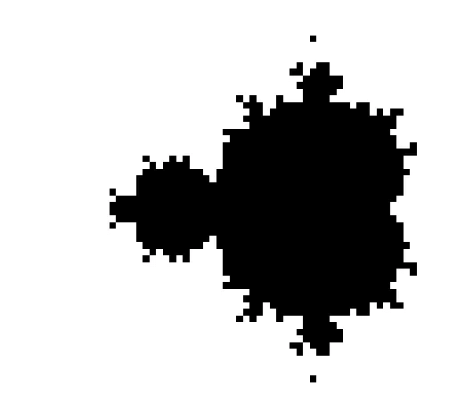

作者提供的图片

好吧，那是一张很丑的曼德博图像。我们要不要将像素密度提高到 1024，将迭代次数增加到 30？

```py
c = candidate_values(-2, 0.7, -1.2, 1.2, pixel_density=1024)

mandelbrot_mask = np.vectorize(is_stable)(c, n_iterations=30)

plt.imshow(mandelbrot_mask, cmap="binary")
plt.gca().set_aspect("equal")
plt.axis("off")
plt.tight_layout()
```

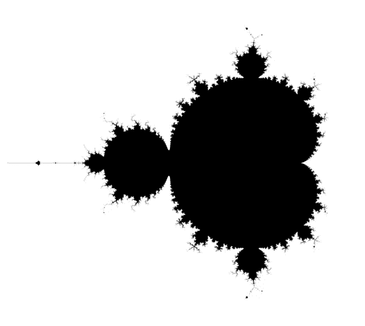

作者提供的图片

现在，这看起来更像样了！祝贺你绘制了你的第一个曼德博图像！

## 等等，那还不是艺术！

尽管我们当前的分形看起来很酷，但离我承诺的艺术还有很大差距。

所以，让我们通过不仅关注黑色集合数字，还关注边缘周围的数字来进行改造。因为看着这张图像，我们可以看到在边界周围出现了各种有趣的图案：

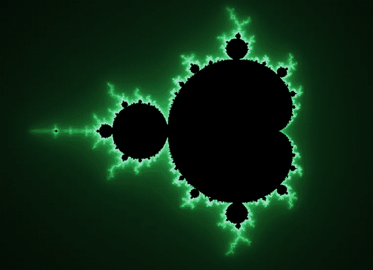

作者提供的图片

让我们通过将代码组织成一个类来开始改造，因为当前的代码实在是一团乱麻。

类的名称将是 `Mandelbrot`，我们将使用数据类，这样我们就不必像古人那样创建 `__init__` 构造函数：

```py
from dataclasses import dataclass

@dataclass
class Mandelbrot: # Inspired by the Real Python article shared above
    n_iterations: int

    def is_stable(self, c: complex) -> bool:
        z = 0

        for _ in range(self.n_iterations):
            z = z ** 2 + c
            if abs(z) > 2:
                return False

        return True
```

这个类只需要初始化 `max_iteration` 参数。我们还将 `is_stable` 函数添加为类方法。

```py
mandelbrot = Mandelbrot(n_iterations=30)

mandelbrot.is_stable(0.1)
```

```py
True
```

```py
mandelbrot.is_stable(1 + 4.4j)
```

```py
False
```

到目前为止，我们只对曼德博集合的部分进行了黑色着色，其余部分为白色。但是如果我们想给集合的边缘增添些许风采，我们必须想出一种逻辑来将不稳定的元素涂色为白色以外的颜色。

我们可以通过确定复数在多少次迭代中变得不稳定来实现这一点。有些会非常快地变得不稳定（也许它们有短暂的引信？），但其他的可能需要几百或几千次迭代（它们比较耐心）。不过，一般来说，接近分形边缘的数字比远离边缘的数字不稳定性更小（需要更多迭代）。

利用这些信息，我们可以根据每次终止的迭代次数为每个像素（复数）赋予不同的颜色深度。这被称为逃逸计数算法。让我们在我们的类中实现它：

```py
@dataclass
class Mandelbrot:
    max_iterations: int

    def escape_count(self, c: complex) -> int:
        z = 0
        for iteration in range(self.max_iterations):
            z = z ** 2 + c
            if abs(z) > 2:
                return iteration
        return self.max_iterations
```

首先，我们将 `n_iterations` 改为 `max_iterations`，因为这样更合适。然后，我们创建一个 `escape_count` 方法：

+   如果 *c* 不稳定，则返回它超出 2 的幅度的迭代次数

+   如果 *c* 是稳定的，则返回最大迭代次数

```py
mandelbrot = Mandelbrot(max_iterations=50)

mandelbrot.escape_count(-0.1) # stable
```

```py
50
```

```py
mandelbrot.escape_count(0.26) # unstable
```

```py
29
```

现在，我们创建另一种方法来根据迭代次数测量稳定性：

```py
@dataclass
class Mandelbrot:
    max_iterations: int

    def escape_count(self, c: complex) -> int:
        z = 0
        for i in range(self.max_iterations):
            z = z ** 2 + c
            if abs(z) > 2:
                return i
        return self.max_iterations

    def stability(self, c: complex) -> float:
        return self.escape_count(c) / self.max_iterations
```

`stability` 方法返回一个介于 0 和 1 之间的度量值，我们可以用它来确定颜色深度。只有 Mandelbrots 会返回 `max_iterations`，所以它们将被标记为 1。接近边缘的数字会需要更长的时间才会变得不稳定，因此它们的值会越来越接近 1。

根据这个逻辑，我们可以恢复我们的 `is_stable` 函数，但使其更简短：

```py
@dataclass
class Mandelbrot:
    max_iterations: int

    def escape_count(self, c: complex) -> int:
        z = 0
        for i in range(self.max_iterations):
            z = z ** 2 + c
            if abs(z) > 2:
                return i
        return self.max_iterations

    def stability(self, c: complex) -> float:
        return self.escape_count(c) / self.max_iterations

    def is_stable(self, c: complex) -> bool:
        # Return True only when stability is 1
        return self.stability(c) == 1
```

```py
mandelbrot = Mandelbrot(max_iterations=50)

mandelbrot.stability(-.1)
```

```py
1.0
```

```py
mandelbrot.is_stable(-.1)
```

```py
True
```

```py
mandelbrot.stability(2)
```

```py
0.02
```

```py
mandelbrot.is_stable(2)
```

```py
False
```

现在，我们创建一个最终的方法来使用 Matplotlib `plot` 集合：

```py
@dataclass
class Mandelbrot:
    max_iterations: int

    # ... The rest of the code from above

    @staticmethod
    def candidate_values(xmin, xmax, ymin, ymax, pixel_density):
        real = np.linspace(xmin, xmax, num=int((xmax-xmin) * pixel_density))
        imag = np.linspace(ymin, ymax, num=int((ymax-ymin) * pixel_density))

        xx, yy = np.meshgrid(real, imag)
        matrix = xx + 1j * yy

        return matrix

    def plot(self, xmin, xmax, ymin, ymax, pixel_density=64, cmap="gray_r"):
        c = Mandelbrot.candidate_values(xmin, xmax, ymin, ymax, pixel_density)

        # Apply `stability` over all elements of `c`
        c = np.vectorize(self.stability)(c)

        plt.imshow(c, cmap=cmap, extent=[0, 1, 0, 1])
        plt.gca().set_aspect("equal")
        plt.axis('off')
        plt.tight_layout()
```

在 `plot` 中，我们对 `c` 的所有元素应用 `stability` 方法，因此结果矩阵在每个单元格中保存颜色深度。当我们用反向灰度色图绘制这个矩阵（以便 Mandelbrots 保持黑色），我们会得到以下图像：

```py
mandelbrot = Mandelbrot(max_iterations=30)

mandelbrot.plot(
    xmin=-2, xmax=0.5, 
    ymin=-1.5, ymax=1.5, 
    pixel_density=1024,
)
```

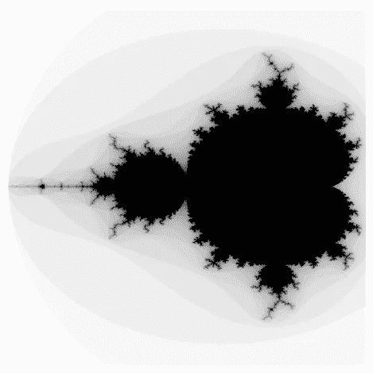

作者提供的图像

我们已经可以看到边缘周围出现了不同灰度级别的带状区域。让我们给它一个不那么无聊的灰度色图：

```py
mandelbrot = Mandelbrot(max_iterations=30)

mandelbrot.plot(
    xmin=-2, xmax=0.5, 
    ymin=-1.5, ymax=1.5, 
    pixel_density=1024,
    cmap="gist_heat"
)
```

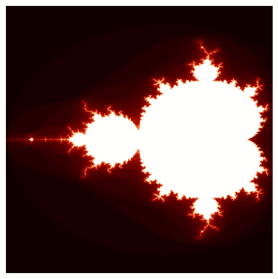

作者提供的图像

注意边界线是最亮的红色，并且在集合重复的地方仍然会出现白点。太棒了！

## 结论

我们的最终结果几乎可以称得上艺术。但仍有许多改进空间。首先是通过更精细地控制每个像素来提高图像分辨率。然后，我们需要去除图像周围那恼人的白色空白（如果你在暗模式下阅读）。

这些任务都是 Matplotlib 的不足之处，但在下一篇文章中，我们将通过 Pillow（Python 的图像处理库）将事情提升到一个全新的水平。

[敬请关注](https://ibexorigin.medium.com/)！

喜欢这篇文章吗？还有它那奇特的写作风格？想象一下，如果你能访问到数十篇类似的文章，全部由一个聪明、迷人、风趣的作者（就是我 :)）撰写，那会怎样。

仅需 4.99$ 会员，你不仅可以访问我的故事，还能获取来自 Medium 上最佳和最聪明的头脑的宝贵知识。如果你使用[我的推荐链接](https://ibexorigin.medium.com/membership)，你将获得我的超级感谢和一记虚拟的击掌，以支持我的工作。

[](https://ibexorigin.medium.com/membership?source=post_page-----c83817fcb64b--------------------------------) [## 使用我的推荐链接加入 Medium — Bex T.

### 独家访问我的所有 ⚡premium⚡ 内容，并在 Medium 上无限制浏览。通过为我购买一份来支持我的工作…

[ibexorigin.medium.com](https://ibexorigin.medium.com/membership?source=post_page-----c83817fcb64b--------------------------------) 
