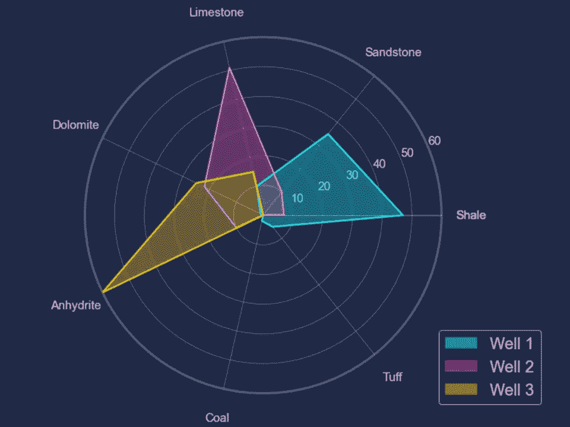

# 使用 Matplotlib 创建令人惊叹的雷达图

> 原文：[`towardsdatascience.com/create-stunning-radar-plots-with-matplotlib-6a8e05054ff9?source=collection_archive---------4-----------------------#2023-04-19`](https://towardsdatascience.com/create-stunning-radar-plots-with-matplotlib-6a8e05054ff9?source=collection_archive---------4-----------------------#2023-04-19)

## 使用 Python 最受欢迎的数据可视化库来可视化地质数据

[](https://andymcdonaldgeo.medium.com/?source=post_page-----6a8e05054ff9--------------------------------)[](https://towardsdatascience.com/?source=post_page-----6a8e05054ff9--------------------------------) [Andy McDonald](https://andymcdonaldgeo.medium.com/?source=post_page-----6a8e05054ff9--------------------------------)

·

[关注](https://medium.com/m/signin?actionUrl=https%3A%2F%2Fmedium.com%2F_%2Fsubscribe%2Fuser%2F9c280f85f15c&operation=register&redirect=https%3A%2F%2Ftowardsdatascience.com%2Fcreate-stunning-radar-plots-with-matplotlib-6a8e05054ff9&user=Andy+McDonald&userId=9c280f85f15c&source=post_page-9c280f85f15c----6a8e05054ff9---------------------post_header-----------) 发表在 [Towards Data Science](https://towardsdatascience.com/?source=post_page-----6a8e05054ff9--------------------------------) ·7 分钟阅读·2023 年 4 月 19 日[](https://medium.com/m/signin?actionUrl=https%3A%2F%2Fmedium.com%2F_%2Fvote%2Ftowards-data-science%2F6a8e05054ff9&operation=register&redirect=https%3A%2F%2Ftowardsdatascience.com%2Fcreate-stunning-radar-plots-with-matplotlib-6a8e05054ff9&user=Andy+McDonald&userId=9c280f85f15c&source=-----6a8e05054ff9---------------------clap_footer-----------)

--

[](https://medium.com/m/signin?actionUrl=https%3A%2F%2Fmedium.com%2F_%2Fbookmark%2Fp%2F6a8e05054ff9&operation=register&redirect=https%3A%2F%2Ftowardsdatascience.com%2Fcreate-stunning-radar-plots-with-matplotlib-6a8e05054ff9&source=-----6a8e05054ff9---------------------bookmark_footer-----------)

带有赛博朋克主题的 Matplotlib 雷达图。图片由作者提供。

雷达图（也称为蛛网图或雷达图表）是一种流行的数据可视化工具，它允许我们通过在二维图上同时显示多个变量来比较数据集。

每个变量由从图中心延伸到边缘的辐条表示，变量的大小由辐条上位置的远近来表示。然后在各个变量之间绘制线条，形成类似网状的形状。

在地球科学和岩石物理学中，我们可以使用雷达图来比较不同井之间的岩性变化，或显示岩石样本之间的矿物学变化。

在本教程中，我将演示如何使用一些合成岩性数据创建雷达图。这些数据代表了在一个井中遇到的平均岩性。

让我们开始吧！

# 导入库和数据

要开始，我们需要导入两个库：[numpy](https://numpy.org/) 和 [matplotlib](https://matplotlib.org/stable/index.html)。

```py
import matplotlib.pyplot as plt
import numpy as np
```
