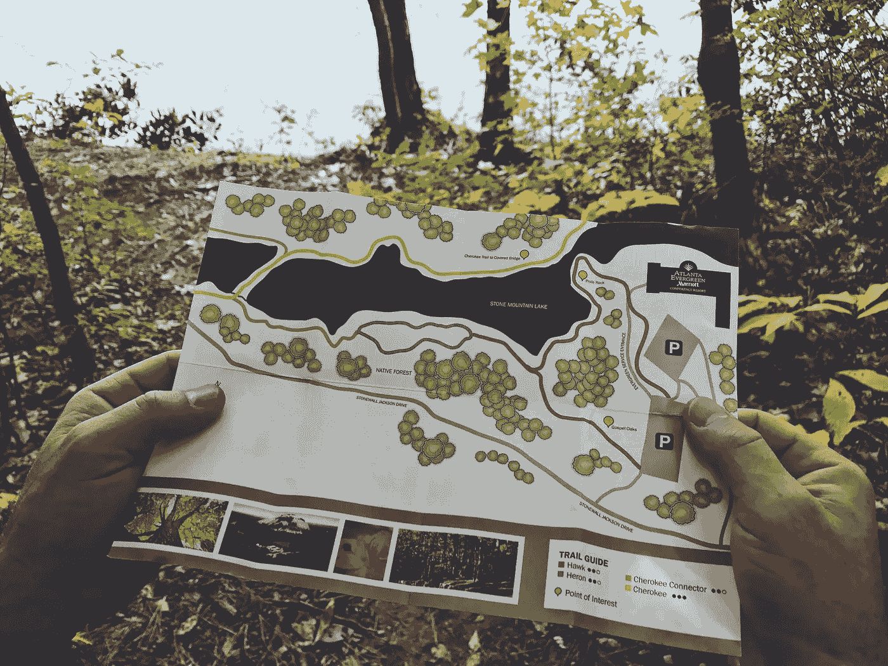
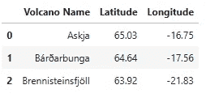
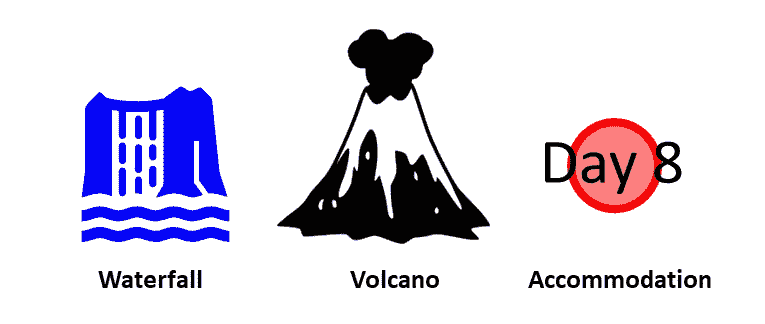
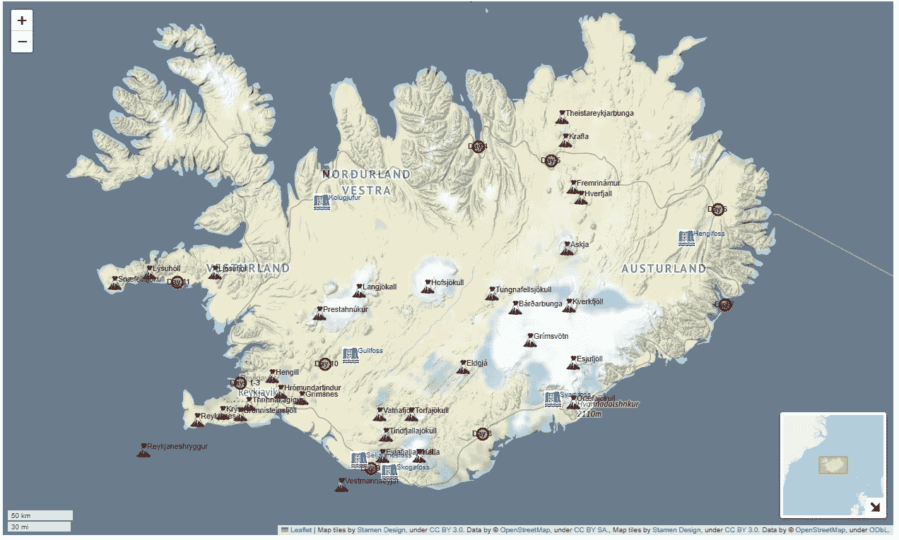
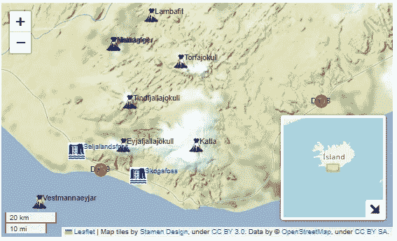

# 使用 Folium 创建量身定制的旅游地图

> 原文：[`towardsdatascience.com/create-tailor-made-tourist-maps-with-folium-954706cc04e8`](https://towardsdatascience.com/create-tailor-made-tourist-maps-with-folium-954706cc04e8)

## 为你的下一次假期增添色彩！

[](https://medium.com/@lee_vaughan?source=post_page-----954706cc04e8--------------------------------)[](https://towardsdatascience.com/?source=post_page-----954706cc04e8--------------------------------) [Lee Vaughan](https://medium.com/@lee_vaughan?source=post_page-----954706cc04e8--------------------------------)

·发表于 [Towards Data Science](https://towardsdatascience.com/?source=post_page-----954706cc04e8--------------------------------) ·阅读时长 7 分钟·2023 年 5 月 17 日

--



图片来源：[Kayla Duhon](https://unsplash.com/@kayla_marie?utm_source=unsplash&utm_medium=referral&utm_content=creditCopyText) 于 [Unsplash](https://unsplash.com/photos/zsqF_j9ZHXw?utm_source=unsplash&utm_medium=referral&utm_content=creditCopyText)

我是那些花哨旅游地图的粉丝。你知道我说的是哪种：那些五颜六色、卡通风格的地图，带有城堡、纪念碑和伦敦眼的 3D 渲染。能为你的假期制作一个定制版本岂不是太棒了？好好准备好护照吧，因为如果你知道 Python，那正是我们要做的事！

在这个*快速成功数据科学*项目中，我们将使用*Folium*库为我的冰岛假期制作一个定制的旅游地图。我们将使用自定义图标标记火山和瀑布，叠加地形和道路地图，并标记住宿位置。如果你从未去过冰岛，也不用担心，因为你可以将这个项目作为你*自己*旅行的模板。

# 涵盖的主要编程主题

这个项目不仅仅是乐趣和游戏。你还将学习一些有用的地理空间技术，例如：

1.  如何在 Folium 中叠加基础地图图块以在同一地图上显示多种功能类型。

1.  如何使用自定义标记在地图上标记功能。

1.  如何在 Folium 地图上添加静态文本并改变其大小和颜色（这并不像你想象的那样简单）。

1.  如何添加索引地图。

# Folium

开源 [Folium](https://python-visualization.github.io/folium/) 库允许你使用 [*Leaflet.JS*](https://leafletjs.com/) 这个强大的 JavaScript 库来可视化地图，Leaflet.JS 用于在移动和桌面平台上构建互动式网页映射应用。Folium 于 2013 年首次发布，非常流行，你会在互联网上找到大量资料来帮助你学习如何使用和定制它。

使用 Folium，你可以从 OpenStreetMap、Mapbox 和 Stamen 等地图服务中选择 *瓦片集*。这些瓦片集是将光栅或矢量数据分解成统一的方形网格，具有多达 22 个预设缩放级别的集合。它们让你轻松生成美丽的 leaflet 地图。

在 conda 环境中安装 Folium，请使用以下命令：

`conda install -c conda-forge folium`

使用 pip 安装 Folium，请使用：

`pip install folium`

为了方便起见，我们还将使用开源的 [*pandas* 库](https://pandas.pydata.org/docs/)。你可以使用以下命令安装：

`conda install pandas`

或

`pip install pandas`

# 代码

以下代码已输入到 Jupyter Notebook 中，并按单元格进行描述。

## 导入库

Folium 旨在用于 Web 应用中的动态、交互式地图。然而，对于这个项目，我们将用它制作一个 *静态* 地图，可以打印出来放在背包里。

我们将使用 Folium 的 `plugins` 模块制作一个索引地图，将映射区域置于更大的上下文中。`DivIcon` 模块将允许我们为瀑布和火山等对象使用自定义图标。

```py
import pandas as pd
import folium
from folium import plugins
from folium.features import DivIcon
```

## 加载火山数据库

冰岛也很容易被命名为“火山之地”，因为它有大约 130 座火山山脉，其中超过 30 座被归类为“活跃”。我编制了一份包含这些火山名称和坐标的 `CSV` 文件，并将其保存为 Gist。为了方便起见，我们将把这个文件导入为 pandas DataFrame。

```py
volcano_df = pd.read_csv('https://bit.ly/458vXfu')
volcano_df.head(3)
```



火山数据框（作者提供的图片）

## 住宿

在长时间的假期中很容易迷失时间，因此我们将记录每晚住宿的位置，标记为“第 1 天”、“第 2 天”等（你也可以使用实际日期或其他标记）。为了生成可绘制的数据库，我在线搜索了每个城镇的纬度和经度，并将其输入为 Python 字典。

```py
accommodations = {'Days 1-3': (64.128288, -21.827774),
                  'Day 4':    (65.688492, -18.126169),
                  'Day 5':    (65.6000, -17.0000),
                  'Day 6':    (65.28333, -14.40139),
                  'Day 7':    (64.656888, -14.290051),
                  'Day 8':    (63.7833302, -18.0666664),
                  'Day 9':    (63.5445, -19.8),
                  'Day 10':   (64.258149, -20.514890),
                  'Day 11':   (64.80806, -22.80500)}
```

## 瀑布

冰岛也可以被称为“瀑布之地”，因为它有超过 10,000 个瀑布。幸运的是，我只计划访问六个，所以我们将这些瀑布作为 Python 字典输入，就像我们为住宿做的一样。

```py
waterfalls = {'Kolugjufur':     (65.3335, -20.5645),
              'Hengifoss':      (65.1, -14.9),
              'Svartifoss':     (64.023, -16.975),
              'Skogafoss':      (63.5245, -19.5083),
              'Seljalandsfoss': (63.6095, -19.989),
              'Gullfoss':       (64.3223, -20.1193)}
```

## 自定义图标

*图标* 是地图上特征的视觉表示。一个熟悉的例子是用来标记 Google Maps 上位置的倒置泪滴。对于这个项目，我们将为火山和瀑布使用自定义图标。对于住宿，我们将使用 Folium 的标准 *圆形标记*。



本项目中使用的图标（作者提供的图片）

为了表示瀑布，我使用了随 Microsoft 365 订阅提供的免版税瀑布图标。对于火山，我使用了来自 [*ICONFINDER*](https://www.iconfinder.com/search?q=volcano) 的图标。我为此图标支付了费用，因此它可以 [商业使用](https://www.iconfinder.com/search?q=volcano&license=gte__1) 而无需注明来源。

我不能提供这些特定的图标，所以你需要自己准备。只需在线搜索“瀑布图标”和“火山图标”。当然，你需要确保这些图标有适当的许可，适用于你打算使用它们的目的。

Folium 支持多种文件类型，如 PNG 和 JPG，并允许缩放图标图像，因此你无需担心图标的大小。将图标保存在与笔记本或 Python 脚本相同的文件夹中。

## 绘制地图

最终的笔记本单元格绘制了地图。在高层次上，我们将首先选择地图的中心点位置，然后在预定的缩放级别上覆盖图块。接着，我们会循环遍历火山、瀑布和住宿数据库，并发布图标及相应的名称。最后，我们会添加一个索引地图。更详细的解释在代码后面。

```py
# Create basemap and overlay tiles:
center_location = [64.9, -18.6]
map = folium.Map(location=center_location, 
                 tiles='Stamen Terrain', 
                 control_scale=True,
                 zoom_start=7)
folium.raster_layers.TileLayer(tiles='Stamen Toner', opacity=0.3).add_to(map)

# Loop through volcano DataFrame and post volcano names and symbols:
for index, row in volcano_df.iterrows():
    volcano_icon = folium.features.CustomIcon('volcano_icon.png', 
                                              icon_size=(20, 20))

    folium.Marker(location=(row['Latitude'], row['Longitude']),
                  icon=volcano_icon).add_to(map)

    folium.map.Marker((row['Latitude'], row['Longitude']),
                      icon=DivIcon(
                          icon_size=(25, 25),
                          icon_anchor=(-5, 14),
                          html=f'<div style="font-size: 8pt">%s</div>' % str(
                               row['Volcano Name']))).add_to(map)

# Loop through waterfalls dictionary and post waterfall names and symbols:  
for key, value in waterfalls.items():
    waterfall_icon = folium.features.CustomIcon('waterfall_icon_dark_blue.jpg', 
                                                icon_size=(25, 25))

    folium.Marker(location=value,
                  fill_opacity=0.5,
                  icon=waterfall_icon).add_to(map)

    folium.map.Marker(location=value,
                      icon=DivIcon(
                          icon_size=(23, 23),
                          icon_anchor=(-10, 14),
                          html=f'<div style="color: blue">%s</div>' % str(key))
                     ).add_to(map)

# Loop through accommodations dictionary and post names and symbols:  
for key, value in accommodations.items():          
    folium.CircleMarker(location=value,
                        radius=8,    
                        color='red',
                        fill_color ='red',
                        fill_opacity=0.5).add_to(map)

    folium.map.Marker(location=value,
                      icon=DivIcon(
                          icon_size=(45, 30),
                          icon_anchor=(15, 9),
                          html=f'<div style="font-size: 8pt">%s</div>' % str(key)
                      )
                     ).add_to(map)

# Add index map:
mini_map = folium.plugins.MiniMap(toggle_display=True)
map.add_child(mini_map)

map 
```

第一步是为地图的中心点分配经纬度坐标到一个名为`center_location`的变量中。接下来，我们调用 Folium 的`Map`类，并传入位置、要使用的图块和初始缩放级别。`control_scale`参数激活地图的比例尺。

虽然`Stamen Terrain`图块包含道路，但它们很淡且难以辨认，因此我们用较暗的`Stamen Toner`图块覆盖地形图块。通过将 toner 图块的不透明度设置为较低的值，比如 0.3，地形图块仅部分被遮盖。

> 要查看 Folium 中可用的其他地图图块，请查看这个[博客](https://deparkes.co.uk/2016/06/10/folium-map-tiles/)。

接下来，我们循环遍历火山数据帧并发布其内容。`folium.features.CustomIcon()`方法允许我们使用自定义火山图标并控制其大小。`folium.Marker()`类实际上会将每个火山图标发布到地图上。

这是难点。Folium 旨在用于动态、交互式的网页地图，因此做一些看似基本的静态文本发布操作有点麻烦。我们必须使用`html`参数并传递`f'<div style="font-size: 8pt">%s</div>' % str(row['Volcano Name'])`。我们使用这种 HTML 格式不仅是为了发布名称，还为了控制其字体大小。注意文本必须转换为字符串后才能绘制。

绘制瀑布和住宿地点遵循相同的基本格式。不同的是，我们使用`html`参数将瀑布的文本颜色更改为蓝色。

我们通过添加一个索引地图（`mini_map`）来完成。这张地图会在你放大和缩小时动态调整位置。

这是最终的地图：



最终的旅游地图（作者提供的图像）

制作旅游地图时一个重要的考虑因素是根据你想要打印的*最终缩放级别*来调整图标和文本。理想情况下，这将是传递给`folium.Map()`时的`zoom_start`参数的缩放级别。虽然 Folium 允许你放大或缩小地图，但图标的相对大小会发生变化，你可能会对结果不满意。

# 打印地图

如前所述，Folium 地图旨在*在线*使用。虽然可以通过编程方式将其保存为图片，但直接进行屏幕截图更为简单。然后，你可以将结果粘贴到 Microsoft PowerPoint 或 Publisher 等程序中，以便在打印前进行额外的修饰。

对于图标和/或文本重叠的繁忙区域，你可以放大并打印“局部”地图。请注意，你可能需要使用新的笔记本单元来调整此新缩放级别的图标和文本大小。



一个放大的“局部”地图（图片来源：作者）

# 总结

游客地图是探索新区域的有趣方式。通过将 Folium 的精彩图块与自己的自定义图标和文本结合起来，你可以制作个性化地图，以便*规划*你的旅行和*记录*你的冒险。

# 谢谢！

感谢阅读，请关注我以获取更多未来的*快速成功数据科学*项目。
