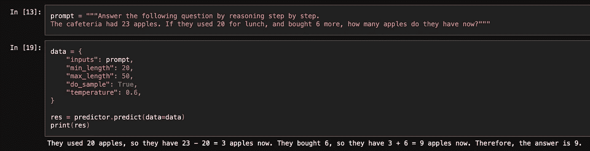
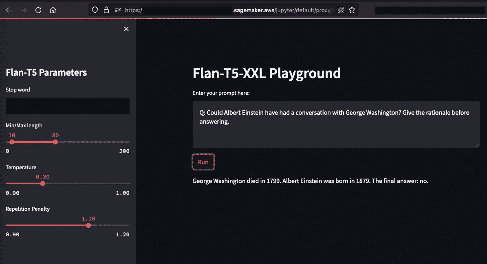

# 在 SageMaker Studio 中创建你自己的大语言模型实验室

> 原文：[`towardsdatascience.com/create-your-own-large-language-model-playground-in-sagemaker-studio-1be5846c5089?source=collection_archive---------8-----------------------#2023-03-20`](https://towardsdatascience.com/create-your-own-large-language-model-playground-in-sagemaker-studio-1be5846c5089?source=collection_archive---------8-----------------------#2023-03-20)

## 现在你可以在一个地方部署和实验大语言模型

 [Heiko Hotz](https://heiko-hotz.medium.com/?source=post_page-----1be5846c5089--------------------------------)

·

[关注](https://medium.com/m/signin?actionUrl=https%3A%2F%2Fmedium.com%2F_%2Fsubscribe%2Fuser%2F993c21f1b30f&operation=register&redirect=https%3A%2F%2Ftowardsdatascience.com%2Fcreate-your-own-large-language-model-playground-in-sagemaker-studio-1be5846c5089&user=Heiko+Hotz&userId=993c21f1b30f&source=post_page-993c21f1b30f----1be5846c5089---------------------post_header-----------) 发表在 [Towards Data Science](https://towardsdatascience.com/?source=post_page-----1be5846c5089--------------------------------) ·4 min read·2023 年 3 月 20 日

--

图片由作者提供 — 使用 Midjourney 创建

# 这是什么内容？

通过 REST 端点利用大语言模型（LLMs）具有众多优点，但通过 API 调用进行实验可能会很麻烦。以下我们将看到如何与已部署到 Amazon SageMaker 端点的模型进行交互。

图片由作者提供

为了简化这个过程，开发一个允许与已部署模型无缝互动的游乐场应用将是有利的。在本教程中，我们将通过使用 Amazon SageMaker（SM）Studio 作为我们的全功能 IDE，并将 Flan-T5-XXL 模型部署到 SageMaker 端点，随后创建一个基于[Streamlit](https://streamlit.io/)的游乐场应用，直接在 Studio 中访问。

本教程的所有代码都可以在这个[GitHub 仓库](https://github.com/marshmellow77/deploy-flan-t5-sagemaker)中找到。

# 为什么这很重要？

评估和对比不同的 LLM 对组织来说至关重要，以确定最适合其独特需求的模型，并快速进行实验。一个游乐场应用提供了最便捷、快速和简单的方法，让利益相关者（无论是技术人员还是非技术人员）可以实验已部署的模型。

此外，利用游乐场应用可以增强对比，并促进进一步的定制，例如加入反馈按钮和对模型输出进行排名。这些附加功能使用户能够提供反馈，提升模型的精确性和整体性能。实质上，游乐场应用提供了对模型优势和劣势的更深入理解，最终帮助做出明智的决定，以选择最适合应用的 LLM。

让我们开始吧！

# 部署 Flan-T5-XXL 模型

在我们可以设置游乐场之前，我们需要设置一个 REST API 来访问我们的模型。幸运的是，在 SageMaker 中这非常简单。类似于我们[部署 Flan-UL2 模型](https://medium.com/better-programming/deploy-flan-ul2-on-a-single-gpu-1778dac605f3)时所做的那样，我们可以编写一个推理脚本，从[Hugging Face Model Hub](https://huggingface.co/models)下载模型，并将其部署到 SageMaker 端点。这个端点随后为我们提供一个 REST API，我们可以在 AWS 账户内访问，而不必使用 API Gateway。

> 请注意，我们使用了 8 位加载模型的选项，这使我们能够将模型部署到单个 GPU（G5 实例）上。

一旦我们准备好推理脚本，就可以通过一个命令部署模型：

> 欲了解更多详细信息，请查看部署笔记本和我之前的[关于部署 Flan-UL2 的博客文章](https://medium.com/better-programming/deploy-flan-ul2-on-a-single-gpu-1778dac605f3)。

一旦端点启动并运行，我们就可以开始有趣的部分——设置一个游乐场应用以与模型互动。

# 游乐场应用

我们将使用 Streamlit 开发一个精简的游乐场应用。只需几行代码，它就能让我们创建一个文本框，并在用户友好的界面中展示各种生成参数。欢迎您修改应用，并展示一组不同的生成参数，以便更好地控制文本生成过程。

> 所有生成参数的列表可以在[这里](https://huggingface.co/docs/transformers/main/en/main_classes/text_generation#transformers.GenerationConfig)找到。

请注意，你需要在第 10 行指定终端名称，你可以从 SageMaker 控制台的部署笔记本中获取。

# 测试

现在是时候部署和测试我们的实验平台应用程序了。受[TensorBoard 在 SM Studio 中的使用说明](https://docs.aws.amazon.com/sagemaker/latest/dg/studio-tensorboard.html)的启发，我们可以使用相同的机制在 SM Studio 中启动我们的 Streamlit 应用。

为此，我们可以在终端执行命令`streamlit run flan-t5-playground.py --server.port 6006`。之后，我们将能够通过`https://<YOUR_STUDIO_ID>.studio.<YOUR_REGION>.sagemaker.aws/jupyter/default/proxy/6006/`访问这个实验平台。

作者提供的图片

# 结论

在本教程中，我们成功部署了一个前沿语言模型，并在单一环境 SageMaker Studio 中建立了一个实验平台。启动 LLM 实验的过程从未如此简单。希望你觉得这些信息有价值，如果你有任何问题或需要进一步的帮助，请随时联系我。

# Heiko Hotz

👋 关注我在[Medium](https://heiko-hotz.medium.com/)和[LinkedIn](https://www.linkedin.com/in/heikohotz/)上，阅读更多关于生成 AI、机器学习和自然语言处理的内容。

👥 如果你在伦敦，欢迎加入我们的[NLP London Meetups](https://www.meetup.com/nlp_london/)。

[`www.linkedin.com/in/heikohotz/`](https://www.linkedin.com/in/heikohotz/)
