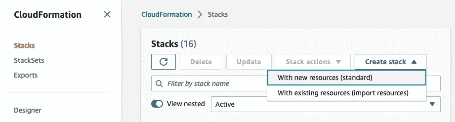
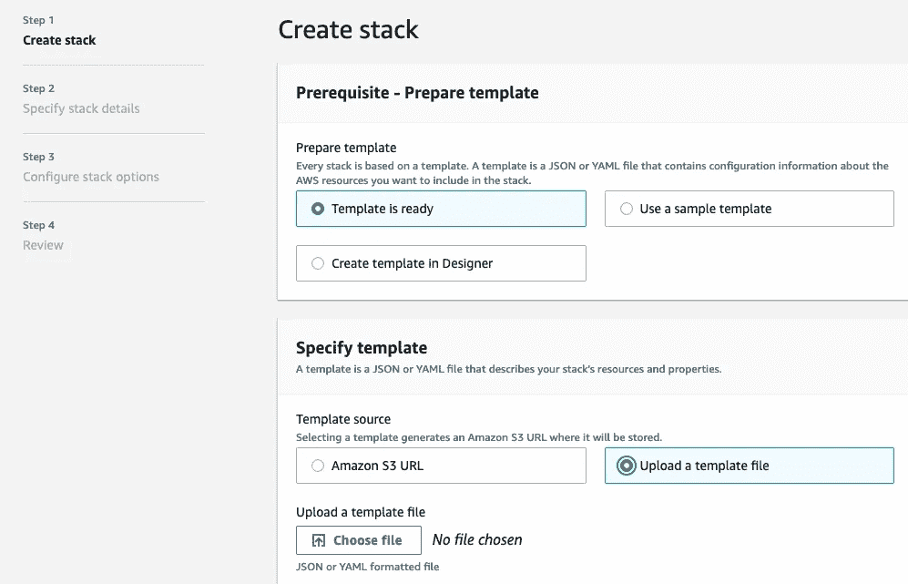
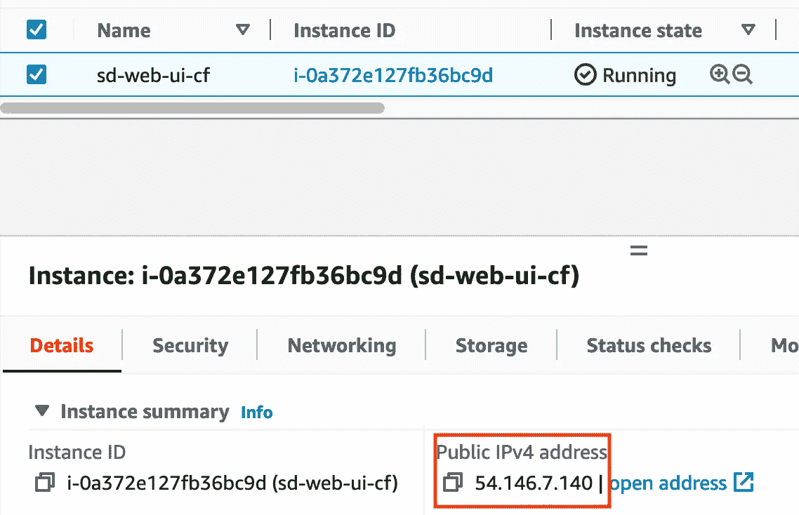
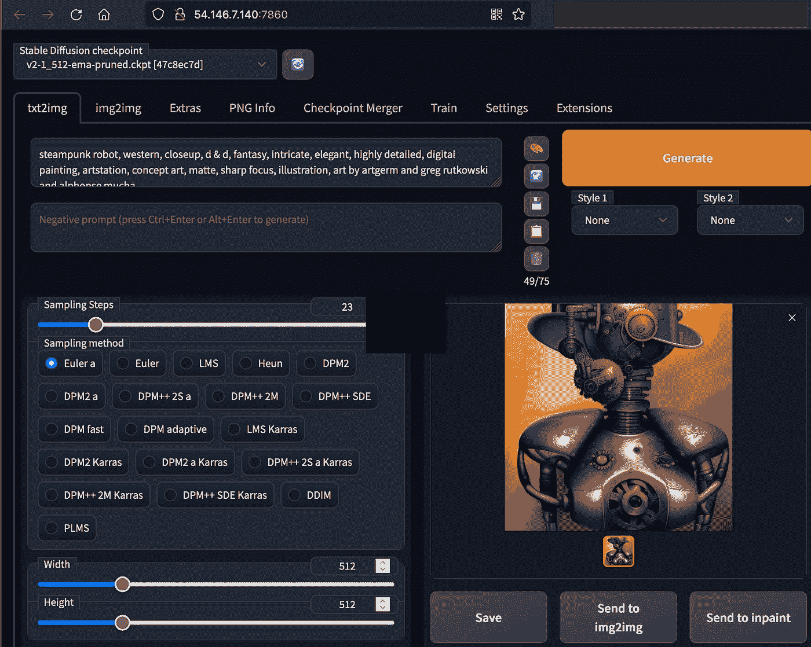

# 在 AWS 上快速创建你自己的稳定扩散 UI

> 原文：[`towardsdatascience.com/create-your-own-stable-diffusion-ui-on-aws-in-minutes-35480dfcde6a?source=collection_archive---------0-----------------------#2023-01-03`](https://towardsdatascience.com/create-your-own-stable-diffusion-ui-on-aws-in-minutes-35480dfcde6a?source=collection_archive---------0-----------------------#2023-01-03)

## 使用一个命令部署文本到图像的 web 应用

 [Heiko Hotz](https://heiko-hotz.medium.com/?source=post_page-----35480dfcde6a--------------------------------)

·

[关注](https://medium.com/m/signin?actionUrl=https%3A%2F%2Fmedium.com%2F_%2Fsubscribe%2Fuser%2F993c21f1b30f&operation=register&redirect=https%3A%2F%2Ftowardsdatascience.com%2Fcreate-your-own-stable-diffusion-ui-on-aws-in-minutes-35480dfcde6a&user=Heiko+Hotz&userId=993c21f1b30f&source=post_page-993c21f1b30f----35480dfcde6a---------------------post_header-----------) 发表在 [Towards Data Science](https://towardsdatascience.com/?source=post_page-----35480dfcde6a--------------------------------) ·8 分钟阅读·2023 年 1 月 3 日

--

图片由作者提供 — 使用稳定扩散创建

# 这是什么内容？

稳定扩散（SD）在 2022 年迅速成为最受欢迎的文本生成图像（即“AI 艺术生成”）模型之一。成功的一个关键因素是它被作为开源软件发布。这促使一个充满活力的社区迅速建立工具，使 SD 对任何对其感兴趣的人更加可及，无论其技术知识如何。

这些工具之一是简单而强大的 Web 界面 [stable-diffusion-webui by Automatic1111](https://github.com/AUTOMATIC1111/stable-diffusion-webui)。它允许我们在无需编程的情况下使用 SD 的所有功能，并且它还是开源的，这意味着任何人都可以下载这个 Web UI 以及 SD 模型，并在任何他们想要的地方进行部署。然而，挑战在于 SD 仍然需要 GPU 功率来运行，否则我们必须等待几分钟才能生成一张图像。而且我们许多人并不拥有足够强大的 GPU 来运行该模型。

多亏了云计算，我们无需花费巨资购买 GPU，而是可以“租用”一个。因此，在本教程中，我们将部署 Automatic1111 Web UI 到配备足够强大 GPU 以运行稳定扩散的 AWS EC2 实例上。我们将通过一个命令使用 [AWS CloudFormation](https://docs.aws.amazon.com/AWSCloudFormation/latest/UserGuide/Welcome.html) 模板来设置所需的所有基础设施。

与往常一样，你可以在我的 GitHub 账户中找到本教程的 [代码](https://github.com/marshmellow77/stable-diffusion-webui)。

# 为什么这很重要？

拥有稳定扩散模型甚至是 Automatic 的 Web UI 作为开源工具，是民主化先进 AI 工具访问的重要一步。但这还不够，因为运行这些模型所需的 GPU 对大多数消费者来说依然昂贵。运行这些 AI 模型所需的 GPU 价格很容易超过 $2,000。

本教程展示了如何以每小时仅 $0.53 的价格入门，这就是 AWS 上 *g4dn.xlarge* 实例的按需价格。它允许我们使用带有 16 GB VRAM 的 NVIDIA T4 GPU。这意味着我们可以运行应用程序几个小时以进行试用，并生成我们想要的图像，然后关闭 EC2 实例，不需要支付超过实际使用时间的费用。而且这一切只需点击一个按钮，无需编程或 Linux 经验，这得益于 AWS CloudFormation 模板。

*在开始之前需要说明一点：由于我在 AWS 工作，我显然对 AWS 有偏见。但我希望你从本教程中获得的核心信息是，通过云计算，先进的 AI 比以往任何时候都更具可及性和实惠性，无论你最终选择哪个服务提供商。*

# 先决条件

跟随本教程，我们需要一个 AWS 账户，这几乎是唯一的先决条件。在本地机器上安装 [AWS 命令行界面 (CLI)](https://docs.aws.amazon.com/cli/latest/userguide/getting-started-install.html) 会使事情变得更简单，但我也会演示如何在没有 CLI 的情况下仅使用 AWS 控制台来跟随教程。

# 快速入门指南

如引言中提到的，我们将使用 CloudFormation (CF) 模板通过一个命令来设置所有内容。启动模板后，应用程序需要 15–20 分钟才会准备好，所以这里有个提示：现在就启动模板，然后返回到这篇博客文章中，*深入了解*实际发生的背景情况 😉

## 在 AWS CLI 中启动应用程序

复制 [CF 模板](https://raw.githubusercontent.com/marshmellow77/stable-diffusion-webui/master/sd-web-ui-cf-template.yaml)（或者，克隆整个 [仓库](https://github.com/marshmellow77/stable-diffusion-webui)）并在你的本地机器上运行下面的命令。这将会在你的 AWS 账户中创建一个名为“*sd-webui-stack*”的 CF 堆栈。

## 在 AWS 控制台中启动应用程序

在 AWS 控制台中，导航到 CloudFormation 部分，选择“创建堆栈 -> 使用新资源”：

作者提供的图片

在接下来的对话框中，选择“模板已准备好”和“上传模板文件”：

作者提供的图片

从仓库中选择 CF 模板文件进行上传，命名堆栈为“*sd-webui-stack*”，在接下来的对话框中保持默认设置，然后在最后一个对话框中点击“提交”。这将会在你的 AWS 账户中创建一个包含所有所需资源的堆栈。

# 一探究竟

现在我们已经启动了 CF 模板，可以揭开帷幕，*深入了解*实际发生的背景情况。

## CloudFormation 模板

首先让我们来看一下 CF 模板：

这个模板设置了一些应用程序所需的资源。首先，我们创建一个“安全组”来指定 EC2 实例上哪些端口将会开放。我们选择端口 22，因为我们希望能够通过 SSH 连接到实例，同时选择端口 7860，因为我们的应用将在该端口监听。

接下来我们设置将托管应用程序的 EC2 实例。在这个模板中，我选择了 Ubuntu Server 22.04 LTS 发行版（AMI ID *ami-0574da719dca65348*），仅仅因为这是我最熟悉的。你可以更改为其他发行版，但请注意你需要相应地修改设置脚本（详见下文）。我们选择了一个 *g4dn.xlarge* 实例，如上所述。我们还配置了 300 GB 的磁盘空间，以确保有足够的空间来托管多个不同的模型。最后，我们在 EC2 实例上运行设置脚本，我们将在下一节中讨论。

接下来我们创建一个弹性 IP 地址，并将其分配给我们的 EC2 实例。这使我们能够拥有一个永久的 IP 地址，因此即使我们关闭 EC2 实例并在以后重新启动，它的应用程序也将始终托管在同一个 IP 地址上。

## 设置脚本

如前所述，我们在 EC2 实例上运行一个 [setup script](https://github.com/marshmellow77/stable-diffusion-webui/blob/master/setup.sh)，该脚本将执行一些命令以为 Web UI 设置一切。我们一步一步来看。

第一部分禁用 Ubuntu 安装包后的重启对话框，然后安装我们需要的一些包：

下一部分下载并安装 CUDA 驱动程序，以便我们可以访问机器的 GPU：

之后，我们需要安装 [Git Large File Storage](https://git-lfs.com/)，因为我们将下载一个大约 5 GB 的 Stable Diffusion 模型：

现在 Git LFS 已安装，我们可以从 Hugging Face Model Hub 下载模型。请注意，我们启用了“skip-smudge”选项，这允许我们仅下载所需的特定文件。在本教程中，我们下载了 SD v2.1（512px 版本），并将其移动到 Web UI 期望模型所在的目录中。

请注意，你可以更改脚本以下载不同版本的 Stable Diffusion，例如版本 1.5。你还可以在后续阶段通过将模型放入模型目录中，向 UI 添加任意多的模型。

除了模型之外，我们还需要一个由 WebUI 读取的配置文件。我们从 [Stable Diffusion Github repo](https://github.com/Stability-AI/StableDiffusion) 下载一个配置文件，并将其重命名为与模型名称匹配，然后也放入相同的目录中：

最后，我们将 WebUI 的所有权更改为用户 *ubuntu*，并以该用户身份启动服务器（因为用户 *root* 不允许启动应用程序）：

# 测试 Web UI

在 15–20 分钟后，部署应该完成。我们可以通过运行以下命令获取 EC2 实例的 IP 地址：

我们也可以通过访问 AWS 控制台中的 EC2 面板来检索它：

图片由作者提供

一旦我们获取了 IP 地址，就可以通过在浏览器中导航到 <IP address>:7860 打开应用程序（如果请求超时则说明安装尚未完成）。安装完成后，我们可以看到应用程序已经启动运行 🎉

# 关闭 EC2 实例并重新启动应用程序

即使每小时仅需 $0.53，我们显然也不希望在不使用时运行实例。我们可以在 AWS 控制台中停止实例，并在需要时重新启动它，而不会丢失任何已安装的应用程序。一旦我们重新启动了 EC2 实例，就可以通过 SSH 登录并使用以下命令重新启动应用程序：

# 删除所有内容

如果我们想要删除所有创建的资源（即安全组、EC2 实例、弹性 IP），我们可以使用以下命令删除 CF 堆栈（或在 AWS 控制台中删除它）：

# 限制

我想强调的是，这个教程只是一个起点，适合任何想尝试通过 Web UI 使用 Stable Diffusion 的人。这个方法有几个限制，如果想在生产环境中使用这个应用程序，可能需要解决这些限制。特别是，我没有涉及任何安全问题（请注意该应用程序运行在 http 上）、扩展问题（如果该应用程序需要同时服务多个用户）以及其他许多方面。

如果我们想在生产环境中使用这个应用程序，可以使用[AWS Well-Architected Framework](https://docs.aws.amazon.com/wellarchitected/latest/framework/welcome.html)作为起点。

# 结论

在本教程中，我们利用 CF 模板通过一个命令设置了一个用于 Stable Diffusion 的 Web UI。这使我们能够访问最先进的 AI 模型，而无需自己购买昂贵的硬件。

这个应用程序的待办事项列表中有很多项目，我将它们列在了[这里](https://github.com/marshmellow77/stable-diffusion-webui#todo-backlog)。对这个仓库的任何贡献都非常欢迎☺️

# Heiko Hotz

👋 关注我在[Medium](https://heiko-hotz.medium.com/)和[LinkedIn](https://www.linkedin.com/in/heikohotz/)上的文章，了解更多关于生成 AI、机器学习和自然语言处理的内容。

👥 如果你在伦敦，可以加入我们的[NLP London Meetups](https://www.meetup.com/nlp_london/)。

🤓 如果你对我如何可能帮助你在组织中采用 AI 和机器学习感兴趣，可以通过[aiml.consulting](https://www.aiml.consulting/)与我联系。
