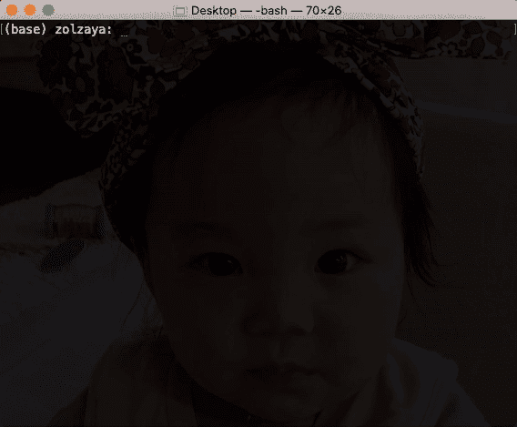
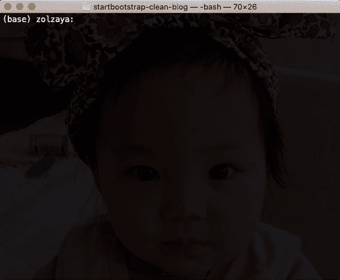
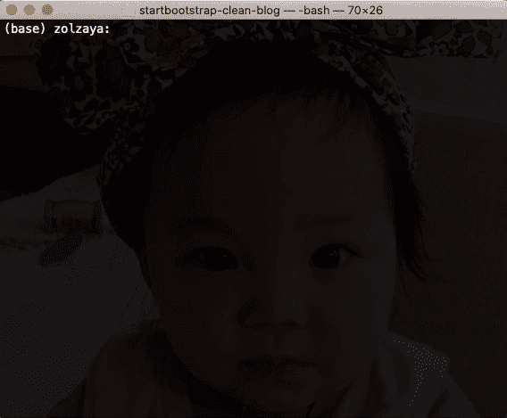
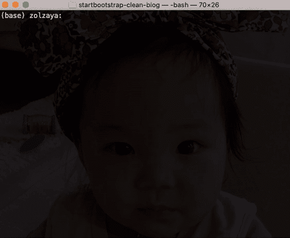
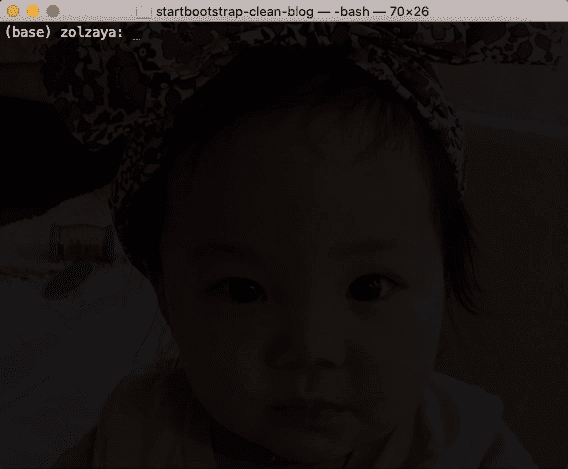
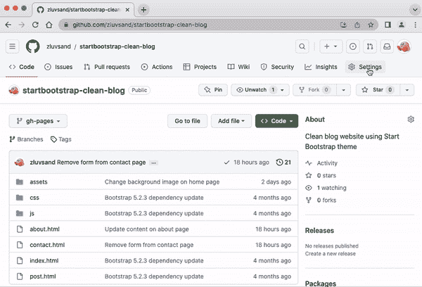
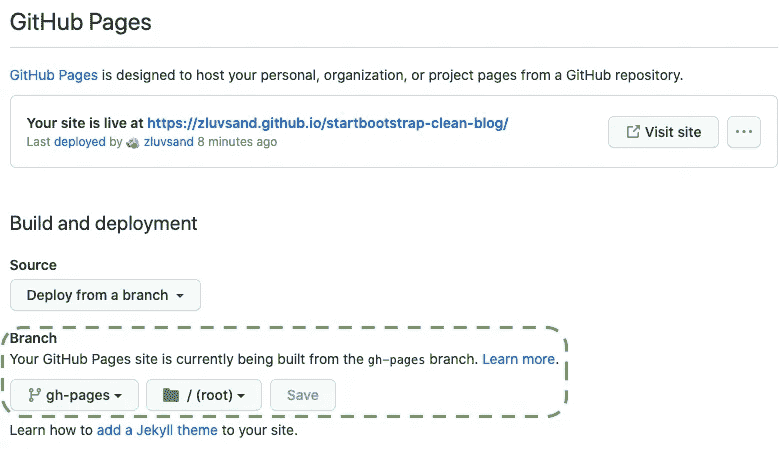
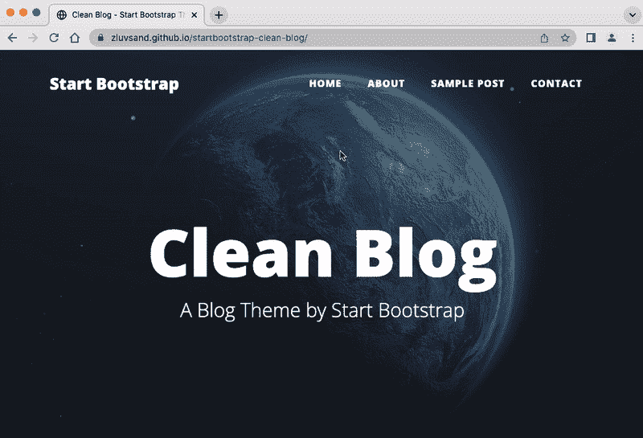

# 几分钟内免费创建你自己的惊艳网站

> 原文：[`towardsdatascience.com/create-your-own-stunning-website-in-minutes-for-free-63f0f7c75bf`](https://towardsdatascience.com/create-your-own-stunning-website-in-minutes-for-free-63f0f7c75bf)

## 无需先前的网页开发经验

[](https://zluvsand.medium.com/?source=post_page-----63f0f7c75bf--------------------------------)[](https://towardsdatascience.com/?source=post_page-----63f0f7c75bf--------------------------------) [Zolzaya Luvsandorj](https://zluvsand.medium.com/?source=post_page-----63f0f7c75bf--------------------------------)

·发表于 [Towards Data Science](https://towardsdatascience.com/?source=post_page-----63f0f7c75bf--------------------------------) ·阅读时间 8 分钟·2023 年 7 月 17 日

--

能够构建简单的网站带来了许多好处。也许你可以将简历发布到网站上以脱颖而出，或者创建自己的博客网站。可能性是无限的。有一种简单、快速且最重要的是免费的方式来托管静态网站，而无需了解之前的网页经验，只需利用预构建的主题。在这篇文章中，我将展示如何做到这一点。


图片来源：[Brad Neathery](https://unsplash.com/@bradneathery?utm_source=medium&utm_medium=referral) 通过 [Unsplash](https://unsplash.com/?utm_source=medium&utm_medium=referral)

# 📍 1\. 概述

构建简单、快速且免费的静态网站有两个关键要素：[*GitHub Pages*](https://pages.github.com/) 用于免费托管静态网站，和 [*Start Bootstrap*](https://startbootstrap.com/)*’s 免费惊艳主题*，可以在几分钟内创建美丽的网站。你只需要一些 git 和 GitHub 的经验以及一个 GitHub 帐户。如果你需要复习 git 的基础知识，[这个教程](https://medium.com/towards-data-science/introduction-to-git-for-data-science-ca5ffd1cebbe) 可能对你有用。

## 📌 *1.1\. GitHub Pages*

GitHub Pages 允许将公共 GitHub 仓库免费发布到网站上。根据 GitHub 仓库的命名方式，使用 GitHub Pages 托管的网站可以分为两种类型：

+   **用户网站：** 每个 GitHub 用户可以拥有一个用户网站。GitHub 仓库应命名为 `<username>.github.io`，并可以通过 `https://<username>.github.io/` 进行访问。

+   **项目网站：** 每个 GitHub 用户可以拥有多个项目网站。GitHub 仓库可以命名为除 `<username>.github.io` 之外的任何名称，并且可以通过 `https://<username>.github.io/<repository>/` 进行访问。

在这篇文章中，我们将一起构建一个项目网站作为实际示例。由于用户网站和项目网站之间唯一的区别是代码库名称和网页 URL，一旦你知道如何构建项目网站，构建用户网站就非常简单：你需要做的只是使用正确的代码库名称。

## 📌 1.2. Start Bootstrap

[Start Bootstrap](https://startbootstrap.com/) 提供免费的开源 [Bootstrap](https://www.google.com/search?q=bootstrap+meaning+in+web&oq=bootstrap+meaning+in+web&gs_lcrp=EgZjaHJvbWUyBggAEEUYOTIHCAEQABiABDINCAIQABgPGBYYHhiLAzILCAMQABgWGB4YiwMyDQgEEAAYhgMYiwMYigUyDQgFEAAYhgMYiwMYigUyDQgGEAAYhgMYiwMYigUyDQgHEAAYhgMYiwMYigUyDQgIEAAYhgMYiwMYigXSAQgzOTQxajFqN6gCALACAA&sourceid=chrome&ie=UTF-8) 代码，用于美丽的示例网站。即使没有网页开发经验，我们也可以通过利用 [Start Bootstrap 免费主题](https://startbootstrap.com/themes?showPro=false) 背后的源代码，在几分钟内创建一个炫目的网站。

使用预建主题也意味着我们的选择将被限制在这些主题内。虽然我们可以通过这些主题进行快速建站并进行简单的自定义，但值得一提的是，越多的自定义需求就需要更多的网页开发经验和时间。在我们的示例中，我们将选择这些预建主题中的一个并稍作自定义。像用你的内容替换示例内容这样的简单变化，就像在任何软件中替换文本一样简单。

现在，让我们动手实践，边做边学吧！

# 📍2. 步骤指南

这里是建立网站的三个步骤：

1️⃣ *选择一个免费的 Start Bootstrap 主题，*

2️⃣ *自定义它*，

3️⃣ *推送到 GitHub*。

听起来很简单？也许吧，因为确实如此。我们现在将详细了解每个步骤。

## 📌 2.1. 步骤 1：选择一个免费的 Start Bootstrap 主题并克隆代码

首先，我们需要从 [Start Bootstrap](https://startbootstrap.com/) 选择一个免费的主题。要查看它们：

◾️ 选择顶部面板上的*主题*，然后

◾️ 选择*浏览所有主题*或挑选一个所需的*主题类别（例如：作品集与简历、博客）*，然后

◾️ 取消勾选*价格*下的*Pro*选项，只查看*免费*模板。

如果你点击任何主题的*启动实时预览*，你将看到样本网站的外观。一旦你找到想要使用的主题，点击*查看源代码*以查看 GitHub 上的代码库。代码库中有几个分支。我们需要克隆`gh-pages`（用于 GitHub Pages）分支上的代码。

让我们一起完成这个任务。我们将从挑选一个 [*清爽博客*](https://startbootstrap.com/theme/clean-blog) 主题开始，它位于*博客*类别下。我们将在终端中输入以下代码来克隆 [代码库](https://github.com/startbootstrap/startbootstrap-clean-blog) 的 GitHub Pages 分支：

```py
# Clone gh-pages branch
git clone --branch gh-pages https://github.com/StartBootstrap/startbootstrap-clean-blog.git
# Go into the newly cloned directory
cd startbootstrap-clean-blog
```



图片由作者提供 | 使用的快捷键：Tab 自动完成

如果你愿意，你可以将克隆的仓库重命名为你喜欢的名字。然而，我们在示例中不会进行重命名。

## 📌 2.2\. 第 2 步：自定义代码

现在，我们将对代码进行以下三个小示例更改。

◾️ 更改*首页*上的图像

◾️ 替换*关于*页面中的文字

◾️ 从*联系*页面中删除部分内容

我们会确保每次更改都单独提交，以便提交历史记录清晰。

在自定义代码时，我们将熟悉仓库的文件夹结构。这个结构对于一般的网站非常常见。

📌 ***2.2.1\. 更改首页上的图像*** 网站使用的图像都保存在`assets/img`文件夹中。

```py
startbootstrap-clean-blog
└───assets
└───└───img
│   │   │   about-bg.jpg
│   │   │   contact-bg.jpg
│   │   │   home-bg.jpg
│   │   │   post-bg.jpg
│   │   │   post-sample-image.jpg
│   *
```

如果我们打开`home-bg.jpg`，我们会发现它是首页顶部使用的图像。我们也可以从它直观的名字猜测，它是**主**页面的**背景**图像。现在，我们将从 [Unsplash](https://unsplash.com/) 这个提供免费下载美丽高分辨率图像的网站中找一个替代图像。我们选择了 [这张图像](https://unsplash.com/photos/Jn2EaLLYZfY)，它是通过关键词‘*planet*’找到的。我们将这张新图像命名为`home-bg.jpg`并用它替换旧图像。完成后，以下是 [提交](https://github.com/zluvsand/startbootstrap-clean-blog/commit/ba7856ac4c8b8b6e3259b26dfc860fc5c38f6a20) 更改的 git 命令：

```py
# Check status
git status
# Stage new image
git add assets/img/home-bg.jpg
# Check status
git status
# Commit staged change
git commit -m "Change background image on home page"
# Check status
git status
```



作者提供的图像 | 使用的快捷键：Ctrl + L 清屏

***2.2.2\. 替换关于页面中的文字*** 现在，让我们练习用自己的内容替换一些内容。如果我们查看仓库结构，会看到以下 HTML 文件。

```py
startbootstrap-clean-blog
│   about.html
│   contact.html
│   index.html
│   post.html
└───*
```

如果你双击`about.html`，它会在默认浏览器中打开。我们可以看到‘about’网页。现在，右键单击文件，用文本编辑器打开它。这是页面内容的源代码。你可以很容易地在源代码中找到网页上显示的文字。尝试更改源代码中看到的一些文字并保存，然后刷新浏览器中显示的文件。你将看到更改。这是感知你所做更改对网页影响的好方法，在提交之前你可以随意尝试文件，因为你总是可以用 Git 命令如`git restore`和`git checkout`恢复到最后一次提交的状态。

现在，我们将把“这是我做的事情”替换为“终身成长心态”，并将正文中的三个段落（第 55 至 57 行）替换为“你好，我是 Zolzaya。我喜欢数据科学。”类似地，你可以在任何页面上用自己的内容替换现有内容。然后，我们将 [提交](https://github.com/zluvsand/startbootstrap-clean-blog/commit/f4e6fd869d1de78be0ef24e668525f0006f37e77) 更改：

```py
# Check status
git status
# See changes in about.html
git diff about.html
# Stage new content on about page
git add about.html
# Check status
git status
# Commit staged change
git commit -m "Update content on about page"
# Check status
git status
```



作者提供的图像 | 使用的快捷键：Q 退出 [less](https://stackoverflow.com/questions/9483757/how-to-exit-git-log-or-git-diff)

***2.2.3\. 从联系页面中删除部分***

如果您查看联系页面，您会看到有一个需要填写的表单。假设我们要删除这个表单。与之前一样，我们将同时在浏览器和文本编辑器中打开 HTML 文件。

HTML 文档由 HTML 标签组成。每个 HTML 标签通常都有一个开标签：`<tag>`和闭标签：`</tag>`，内容放在这些标签之间。因此，在删除这些标签时，确保删除整个标签部分。例如，如果您想删除以`<div>…`开头的部分，请确保将内容一直删除到相应的结束`</div>`标签。

您将看到表单位于第 56–107 行。我们将删除表单，然后将其上方的段落替换为“想要联系我？请随时通过 test@test.com 发邮件给我。”然后，我们将[提交](https://github.com/zluvsand/startbootstrap-clean-blog/commit/5067c5fdbaec14fa64e07af0dd0dcf56f46786f3)更改：

```py
# Check status
git status
# See changes in about.html
git diff contact.html
# Stage new content on contact page
git add contact.html
# Check status
git status
# Commit staged change
git commit -m "Remove form from contact page"
# Check status
git status
```



作者提供的图片

我们已经完成了示例自定义，因此我们准备将更改推送到 GitHub。

## 📌 2.3\. 第三步：推送到 GitHub，如有必要，请在 GitHub 中进行配置

让我们在 GitHub 上创建一个与您的本地仓库名称匹配的新公共仓库。在我们的示例中，它将是`[startbootstrap-clean-blog](https://github.com/zluvsand/startbootstrap-clean-blog)`。


作者提供的图片

仓库必须是公开的才能免费托管。

现在，我们将更新远程仓库的 URL，以便它指向新创建的仓库。然后我们将代码推送到远程仓库：

```py
# Check remote
git remote -v
# Change remote
git remote set-url origin https://github.com/zluvsand/startbootstrap-clean-blog.git
# Check remote
git remote -v
# Push code to new remote
git push
```



作者提供的图片 | 使用的快捷键：向上箭头访问之前的命令

现在，打开 GitHub 上的仓库。转到*设置*选项卡，然后从左侧面板中选择*Pages*。



作者提供的图片

您的网站将在推送代码后几分钟内从`gh-pages`分支中的代码自动构建。如果没有发生这种情况，或者您可能将分支命名为其他名称，则可以在 GitHub Pages 部分的*分支*子部分中指定。



作者提供的图片 | 突出显示的分支子部分

我们的示例仓库可以在[这里](https://github.com/zluvsand/startbootstrap-clean-blog)找到，网站托管在[这里](https://zluvsand.github.io/startbootstrap-clean-blog/)。



作者提供的图片 | 来源：[`zluvsand.github.io/startbootstrap-clean-blog/`](https://zluvsand.github.io/startbootstrap-clean-blog/)

完成了，这就是全部内容！我们刚刚使用 GitHub Pages 和 Startbootstrap 主题一起构建了一个网站！显然，关于网页开发还有很多可以学习的内容。了解一些 HTML 和 CSS 会非常有用。如果你想学习 HTML 和 CSS 的基础知识，[这个](https://www.udacity.com/course/intro-to-html-and-css--ud001)是 Udacity 提供的一个优秀的免费课程。如果你希望深入了解 GitHub Pages，可以查看[GitHub Pages 文档](https://docs.github.com/en/pages)。

感谢阅读我的文章。希望你获得了有关如何利用免费资源构建网站的有用知识。如果你感兴趣，以下是一些你可能也喜欢的帖子链接：

◼️ [数据科学中的 Git 入门](https://medium.com/towards-data-science/introduction-to-git-for-data-science-ca5ffd1cebbe)

◼️ 通过这些技巧丰富你的 GitHub 个人资料

再见啦 🏃💨
