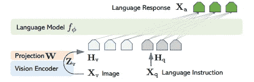
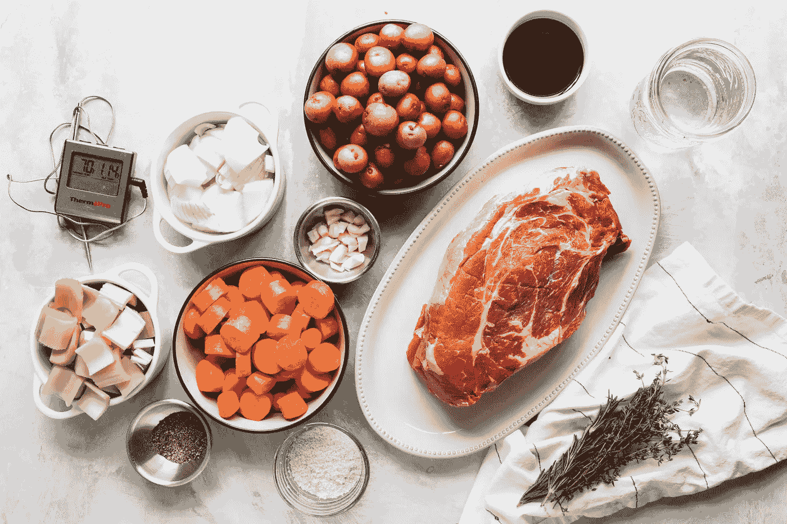

# 使用 LLaVA 创建你的视觉聊天助手

> 原文：[`towardsdatascience.com/create-your-vision-chat-assistant-with-llava-610b02c3283e?source=collection_archive---------3-----------------------#2023-11-11`](https://towardsdatascience.com/create-your-vision-chat-assistant-with-llava-610b02c3283e?source=collection_archive---------3-----------------------#2023-11-11)

## 开始使用开源的 LLaVA 模型来创建多模态对话模型。

[](https://medium.com/@gabrielesgroi94?source=post_page-----610b02c3283e--------------------------------)[](https://towardsdatascience.com/?source=post_page-----610b02c3283e--------------------------------) [Gabriele Sgroi, PhD](https://medium.com/@gabrielesgroi94?source=post_page-----610b02c3283e--------------------------------)

·

[关注](https://medium.com/m/signin?actionUrl=https%3A%2F%2Fmedium.com%2F_%2Fsubscribe%2Fuser%2F97ea0c34751b&operation=register&redirect=https%3A%2F%2Ftowardsdatascience.com%2Fcreate-your-vision-chat-assistant-with-llava-610b02c3283e&user=Gabriele+Sgroi%2C+PhD&userId=97ea0c34751b&source=post_page-97ea0c34751b----610b02c3283e---------------------post_header-----------) 发布在[Towards Data Science](https://towardsdatascience.com/?source=post_page-----610b02c3283e--------------------------------) ·17 分钟阅读·2023 年 11 月 11 日[](https://medium.com/m/signin?actionUrl=https%3A%2F%2Fmedium.com%2F_%2Fvote%2Ftowards-data-science%2F610b02c3283e&operation=register&redirect=https%3A%2F%2Ftowardsdatascience.com%2Fcreate-your-vision-chat-assistant-with-llava-610b02c3283e&user=Gabriele+Sgroi%2C+PhD&userId=97ea0c34751b&source=-----610b02c3283e---------------------clap_footer-----------)

--

[](https://medium.com/m/signin?actionUrl=https%3A%2F%2Fmedium.com%2F_%2Fbookmark%2Fp%2F610b02c3283e&operation=register&redirect=https%3A%2F%2Ftowardsdatascience.com%2Fcreate-your-vision-chat-assistant-with-llava-610b02c3283e&source=-----610b02c3283e---------------------bookmark_footer-----------)

照片由[Izabela Kraus](https://unsplash.com/@izabelakraus?utm_source=medium&utm_medium=referral)在[Unsplash](https://unsplash.com/?utm_source=medium&utm_medium=referral)上拍摄。

# 简介

大语言模型已经证明自己是一项革命性的技术。利用其能力的众多应用已经被开发出来，预计还会有更多的应用出现。大语言模型的一个最有趣的应用是将其作为智能助手，能够在各种任务中帮助用户。经过指令调优和从人类反馈中学习的聊天模型显示出很有前景的能力，能够遵循人类指令并完成指定任务。然而，它们在仅语言任务的适用性上存在局限。

多模态对话模型旨在释放大语言模型的潜力，以解决需要将自然语言与其他模态结合的问题。特别是，自从将视觉能力引入 GPT-4V 以来，视觉语言模型受到了越来越多的关注。赋予 GPT-4 的自然语言能力以图像理解，已导致一个强大的聊天助手，可以帮助用户处理需要视觉和语言理解的任务。尽管 GPT-4V 的视觉能力令人印象深刻，但闭源模型限制了对这一令人惊叹的技术进行研究和实验的潜力。幸运的是，一些开源模型出现了，将视觉语言模型的力量以易于访问和透明的方式带给了社区。这些模型还延续了对计算和内存效率的关注趋势，这一趋势在开源大语言模型中已经显现。这是一个重要的特性，因为它促进了这些模型的广泛应用。

在本教程中，我将介绍如何使用在[Visual Instruction Tuning](https://arxiv.org/abs/2304.08485)论文中介绍的 LLaVA（大语言与视觉助手）模型创建一个视觉聊天助手。我将首先简要介绍 LLaVA 模型及其改进，然后讨论使用[官方代码库](https://github.com/haotian-liu/LLaVA)中提供的代码实现一个简单的视觉聊天助手。我还将展示一些我设计的示例，以展示该模型的能力和局限性。

## LLaVA

LLaVA 模型首次在论文[视觉指令调整](https://arxiv.org/abs/2304.08485)中提出，随后在[改进的基线与视觉指令调整](https://arxiv.org/abs/2310.03744)中进一步改进（也称为 LLaVA-1.5）。其背后的理念是从图像中提取视觉嵌入，并像处理语言标记生成答案一样处理它们，通过将它们馈送给大型语言模型。直观地说，我们可以认为图像将用语言模型生成答案所需的“单词”。为了选择正确的“单词”，模型使用预训练的 CLIP 视觉编码器提取视觉嵌入，然后将其投影到语言模型的单词嵌入空间中。后者的操作是通过一个视觉语言连接器完成的，最初在第一篇论文[视觉指令调整](https://arxiv.org/abs/2304.08485)中选择为简单的线性层，后来在[改进的基线与视觉指令](https://arxiv.org/abs/2310.03744)中替换为更具表现力的多层感知器（MLP）。模型的架构如下所示。



LLaVA 模型的架构。在 LLaVA 中，投影 W 是一个简单的线性层，而在 LLaVA-1.5 中是一个 MLP。图片来源于论文[视觉指令调整](https://arxiv.org/abs/2304.08485)。

该方法的优势之一在于通过使用预训练的视觉编码器和预训练语言模型，只需学习轻量级模块——视觉语言连接器，从头开始。具体而言，LLaVA 的训练包括两个阶段：

+   特征对齐的预训练：冻结预训练的视觉编码器和语言模型的权重，仅更新视觉语言连接器的权重。所有训练样本由文本-图像对打包成单回合对话。此阶段旨在训练视觉语言连接器将视觉编码器的嵌入与语言模型的文本嵌入对齐。

+   使用视觉指令进行微调：在此阶段，仅冻结视觉编码器的权重，同时对视觉语言连接器和语言模型进行微调。模型在基于图像的指令跟随任务上进行微调。有趣的是，一些数据是通过使用仅包含语言的 GPT4 从图像的标题和实体边界框的坐标创建指令跟随样本。

# 视觉聊天机器人实现

使用[官方存储库](https://github.com/haotian-liu/LLaVA)中提供的代码创建视觉聊天机器人非常简单。该存储库还提供了标准化的聊天模板，可用于解析正确格式的输入。遵循训练中使用的正确格式对生成的答案质量至关重要。确切的模板取决于使用的语言模型。使用预训练的 Vicuna 语言模型的 LLaVA-1.5 的模板如下：

```py
A chat between a curious user and an artificial intelligence assistant. The 
assistant gives helpful, detailed, and polite answers to the user's questions. 

USER: <im_start><image><im_end> User's prompt

ASSISTANT: Assistant answer

USER: Another prompt
```

前几行是模型使用的一般系统提示。特殊标记<im_start>、<image>和<im_end>用于指示将放置表示图像的嵌入的位置。

聊天机器人可以在一个简单的 Python 类中定义。

```py
class LLaVAChatBot:
    def __init__(self,
                 model_path: str = 'liuhaotian/llava-v1.5-7b',
                 device_map: str = 'auto',
                 load_in_8_bit: bool = True,
                 **quant_kwargs) -> None:
        self.model = None
        self.tokenizer = None
        self.image_processor = None
        self.conv = None
        self.conv_img = None
        self.img_tensor = None
        self.roles = None
        self.stop_key = None
        self.load_models(model_path,
                         device_map=device_map,
                         load_in_8_bit=load_in_8_bit,
                         **quant_kwargs)

    def load_models(self, model_path: str,
                    device_map: str,
                    load_in_8_bit: bool,
                    **quant_kwargs) -> None:
        """Load the model, processor and tokenizer."""
        quant_cfg = BitsAndBytesConfig(**quant_kwargs)
        self.model = LlavaLlamaForCausalLM.from_pretrained(model_path,
                                                           low_cpu_mem_usage=True,
                                                           device_map=device_map,
                                                           load_in_8bit=load_in_8_bit,
                                                           quantization_config=quant_cfg)
        self.tokenizer = AutoTokenizer.from_pretrained(model_path,
                                                       use_fast=False)
        vision_tower = self.model.get_vision_tower()
        vision_tower.load_model()
        vision_tower.to(device='cuda')
        self.image_processor = vision_tower.image_processor
        disable_torch_init()

    def setup_image(self, img_path: str) -> None:
        """Load and process the image."""
        if img_path.startswith('http') or img_path.startswith('https'):
            response = requests.get(img_path)
            self.conv_img = Image.open(BytesIO(response.content)).convert('RGB')
        else:
            self.conv_img = Image.open(img_path).convert('RGB')
        self.img_tensor = self.image_processor.preprocess(self.conv_img,
                                                          return_tensors='pt'
                                                          )['pixel_values'].half().cuda()

    def generate_answer(self, **kwargs) -> str:
        """Generate an answer from the current conversation."""
        raw_prompt = self.conv.get_prompt()
        input_ids = tokenizer_image_token(raw_prompt,
                                          self.tokenizer,
                                          IMAGE_TOKEN_INDEX,
                                          return_tensors='pt').unsqueeze(0).cuda()
        stopping = KeywordsStoppingCriteria([self.stop_key],
                                            self.tokenizer,
                                            input_ids)
        with torch.inference_mode():
            output_ids = self.model.generate(input_ids,
                                             images=self.img_tensor,
                                             stopping_criteria=[stopping],
                                             **kwargs)
        outputs = self.tokenizer.decode(
            output_ids[0, input_ids.shape[1]:]
        ).strip()
        self.conv.messages[-1][-1] = outputs

        return outputs.rsplit('</s>', 1)[0]

    def get_conv_text(self) -> str:
        """Return full conversation text."""
        return self.conv.get_prompt()

    def start_new_chat(self,
                       img_path: str,
                       prompt: str,
                       do_sample=True,
                       temperature=0.2,
                       max_new_tokens=1024,
                       use_cache=True,
                       **kwargs) -> str:
        """Start a new chat with a new image."""
        conv_mode = "v1"
        self.setup_image(img_path)
        self.conv = conv_templates[conv_mode].copy()
        self.roles = self.conv.roles
        first_input = (DEFAULT_IM_START_TOKEN + DEFAULT_IMAGE_TOKEN +
                       DEFAULT_IM_END_TOKEN + '\n' + prompt)  # f"{self.roles[0]}: {prompt}")
        self.conv.append_message(self.roles[0], first_input)
        self.conv.append_message(self.roles[1], None)
        if self.conv.sep_style == SeparatorStyle.TWO:
            self.stop_key = self.conv.sep2
        else:
            self.stop_key = self.conv.sep
        answer = self.generate_answer(do_sample=do_sample,
                                      temperature=temperature,
                                      max_new_tokens=max_new_tokens,
                                      use_cache=use_cache,
                                      **kwargs)
        return answer

    def continue_chat(self,
                      prompt: str,
                      do_sample=True,
                      temperature=0.2,
                      max_new_tokens=1024,
                      use_cache=True,
                      **kwargs) -> str:
        """Continue the existing chat."""
        if self.conv is None:
            raise RuntimeError("No existing conversation found. Start a new"
                               "conversation using the `start_new_chat` method.")
        self.conv.append_message(self.roles[0], prompt)
        self.conv.append_message(self.roles[1], None)
        answer = self.generate_answer(do_sample=do_sample,
                                      temperature=temperature,
                                      max_new_tokens=max_new_tokens,
                                      use_cache=use_cache,
                                      **kwargs)
        return answer
```

如果您熟悉[transformers](https://github.com/huggingface/transformers)库，您将会认识到许多常见功能，并且执行的操作应该很容易理解。让我们快速浏览上面定义的 LLaVAChatBot 类的方法。

+   load_models: 该方法加载语言模型、分词器和图像处理器，使用 BitsAndBytes 库进行量化，以减少 GPU 内存需求。该代码阴影了 Hugging Face transformers 模型使用的 from_pretrained 方法。BitsAndBytes 允许将模型量化为 8 位或 4 位。

+   setup_image: 它从本地路径或 URL 加载图像，并使用图像处理器将其转换为张量。

+   generate_answer: 该方法返回模型关于所提供图像当前对话的答案。LLaVa 模型的 generate 方法类似于 Hugging Face transformers 模型的 generate 方法。

+   get_conv_text: 该方法返回到目前为止对话的原始文本。

+   start_new_chat: 这是聊天机器人的两个主要方法之一，用于与模型开始新的聊天。它创建一个新的对话，给定图像和初始提示传递给模型。它通过使用存储库中定义的模板设置对话，遵循前面部分讨论的格式。

+   continue_chat: 另一个主要方法，它继续关于图像的现有对话。

我在[此 Colab 笔记本](https://colab.research.google.com/drive/1tq9K3utBJ4VeMmuUarMEFCmaekMUG_Zd?usp=sharing)中提供了完整的代码，这样你就可以自己尝试。

# 示例

在本节中，我收集了在测试模型能力时获得的一些有趣示例。本文中的所有示例都是使用 8 位量化的模型 llava-v1.5–7b 创建的。

首先，让我们看看该模型描述和理解图像的能力。下面我要求模型描述一张描绘白老虎的图片。


照片由[Joshua J. Cotten](https://unsplash.com/@jcotten?utm_source=medium&utm_medium=referral)提供，来自[Unsplash](https://unsplash.com/?utm_source=medium&utm_medium=referral)。

```py
A chat between a curious user and an artificial intelligence assistant. The 
assistant gives helpful, detailed, and polite answers to the user's questions. 

USER: <im_start><image><im_end>
Describe the image in details. 

ASSISTANT: The image features a white tiger laying down on a rocky surface, 
possibly a stone wall or a rock. The tiger appears to be relaxed and 
comfortable in its environment. The tiger's position is such that it covers a 
significant portion of the image, from the left side to almost the entire right
side. The rocky surface provides a natural and rugged backdrop for the scene.</s></s>

USER: What is unique about this tiger? 

ASSISTANT: This tiger is unique because it is a white tiger, which is an 
extremely rare and visually striking variation of the species. White tigers are
born with a genetic mutation that causes their fur to be predominantly white, 
with the rest of their body being a mix of orange and black stripes. This 
distinctive appearance sets them apart from the more common orange and black 
striped tigers.</s></s>
```

模型似乎能够详细描述图像，并且能够推理图像的主题，正确评估白老虎是一种罕见的情况。

接下来，我测试了模型是否能够为用户提供执行各种任务的可操作指导。这是区分“字幕生成”模型和真正的视觉对话助手的关键点。例如，模型能否根据图像中存在的成分提供食谱？结果如下报告。



照片由[ThermoPro](https://unsplash.com/@thermopro?utm_source=medium&utm_medium=referral)提供，来自[Unsplash](https://unsplash.com/?utm_source=medium&utm_medium=referral)。

```py
A chat between a curious user and an artificial intelligence assistant. The 
assistant gives helpful, detailed, and polite answers to the user's questions. 
USER: <im_start><image><im_end>
What can I cook with these ingredients? 

ASSISTANT: With the ingredients displayed on the table, you can prepare a 
delicious roast dinner. The meat, which is a large piece of beef, can be 
seasoned and cooked in the oven, while the vegetables, including carrots, 
potatoes, and onions, can be roasted alongside the meat. You can also prepare a
side dish with the potatoes, carrots, and onions, which can be served alongside
the roast dinner. The presence of a bowl of sauce suggests that you can use it 
as a dipping sauce or to enhance the flavors of the roast and vegetables. 
Overall, this combination of ingredients offers a hearty and flavorful meal 
that can be enjoyed with family and friends.</s></s>

USER: Could the recipe you suggested be included in a vegetarian diet? 

ASSISTANT: The recipe I suggested, which involves roasting a large piece of 
beef and vegetables, is not suitable for a vegetarian diet. The beef is the 
main protein source in the dish, and it is not suitable for vegetarians who 
avoid consuming meat. However, you can still create a vegetarian-friendly meal 
using the vegetables and sauce availableon the table. For example, you can 
prepare a vegetable roast with the carrots, potatoes, and onions, and serve it 
alongside a side of mashed potatoes or a vegetable-based sauce. This way, you 
can still enjoy the flavors and textures of the dish without including meat.</s></s>

USER: Can you suggest a vegetarian recipe with minimal modifications of the 
depicted ingredients? 

ASSISTANT: Certainly! Here's a vegetarian recipe that can be made using the 
ingredients available on the table:

Roasted Vegetable Medley with Sauce

Ingredients:

* Carrots
* Potatoes
* Onions
* Olive oil
* Salt
* Pepper
* Herbs (such as thyme, rosemary, or parsley)
* Sauce (optional)

Instructions:

1\. Preheat your oven to 400°F (200°C).
2\. Wash and peel the carrots, potatoes, and onions. Cut them into bite-sized 
pieces.
3\. In a large bowl, toss the vegetables with olive oil, salt, and pepper.
4\. Spread the vegetables evenly on a baking sheet lined with parchment paper.
5\. Roast the vegetables in the preheated oven for 20-25 minutes, or until they 
are tender and slightly browned.
6\. If desired, prepare a sauce by combining ingredients such as tomatoes, 
garlic, and herbs. You can use this sauce as a dipping sauce or to enhance the
flavors of the roasted vegetables.
7\. Serve the roasted vegetable medley alongside a side of mashed potatoes or a 
vegetable-based sauce.

This vegetarian recipe allows you to enjoy the flavors and textures of the 
roasted vegetables without including meat. The sauce can be easily customized 
to suit your taste preferences, and the dish can be served alongside a variety 
of side dishes, such as mashed potatoes or a vegetable-based sauce.</s></s>
```

模型似乎对图像中存在的成分有很好的理解，并且能够将单个词语连接到更抽象的概念（即肉类餐品不是素食）。

现在让我们看看模型如何用于获得建议。这是在头脑风暴时获取新想法的有用功能，并且可以为用户提供真正的价值。在下面的对话中，我请求模型提供关于改变咖啡馆外观的建议。


照片由[Michał Mancewicz](https://unsplash.com/@kreyatif?utm_source=medium&utm_medium=referral)提供，来自[Unsplash](https://unsplash.com/?utm_source=medium&utm_medium=referral)。

```py
A chat between a curious user and an artificial intelligence assistant. The 
assistant gives helpful, detailed, and polite answers to the user's questions. 

USER: <im_start><image><im_end>
How can I renovate this café to make it look more vintage? 

ASSISTANT: To make the café look more vintage, you can consider the following 
changes:

1\. Update the lighting: Replace the current lighting with vintage-style lamps 
or lanterns, which will create a warm and cozy atmosphere.

2\. Add vintage decorations: Incorporate antique items, such as vintage clocks, 
artwork, or decorative plates, to create a nostalgic ambiance.

3\. Use vintage furniture: Replace the current stools with vintage-style chairs 
or barstools, which can add character and charm to the space.

4\. Incorporate greenery: Add more greenery, such as potted plants or vines, to 
create a lush and inviting atmosphere.

5\. Update the bar: Replace the current bar with a vintage-style bar, complete 
with a vintage-inspired backsplash and countertop.

6\. Use vintage-style glassware: Replace the current glassware with vintage-style
glasses, such as wine glasses, beer mugs, or cocktail shakers.
7\. Add vintage-style signage: Replace the current signage with vintage-style 
menu boards or chalkboards, which can add a touch of nostalgia to the space.

8\. Use vintage-style wallpaper or paint: Apply a vintage-style wallpaper or 
paint to the walls, which can create a unique and charming atmosphere.

By implementing these changes, the café will appear more vintage and inviting, 
creating a memorable experience for its patrons.</s></s>
```

建议看起来切合要点，尽管相当通用，识别出可以更改的当前元素，以赋予更复古的风格。

让我们继续实际的内容，可以帮助用户在日常活动中获得帮助。模型是否能够帮助撰写广告或列表？


照片由[Eugene Chystiakov](https://unsplash.com/@eugenechystiakov?utm_source=medium&utm_medium=referral)提供，来自[Unsplash](https://unsplash.com/?utm_source=medium&utm_medium=referral)。

```py
A chat between a curious user and an artificial intelligence assistant. The 
assistant gives helpful, detailed, and polite answers to the user's questions. 

USER: <im_start><image><im_end>
Write an advertisment for this chair 

ASSISTANT: Introducing the modern and stylish black and wood chair, perfect for
any contemporary setting. This chair features a sleek black seat and a wooden 
base, creating a striking contrast against any background. Its minimalist 
design makes it a versatile addition to any room, whether it's used as a dining
chair, a side table, or a statement piece in a living space. The chair's sturdy
construction ensures it can withstand daily use, while its clean lines and 
sleek appearance add a touch of sophistication to any room. Upgrade your living
space with this stylish and functional chair today.</s></s>

USER: Write now an advertisement for the same chair but targeting cafes 

ASSISTANT: Attention café owners and design enthusiasts! Introducing the black
and wood chair, the perfect addition to your café's seating area. This stylish
and functional chair offers a modern touch to your establishment, with its 
sleek black seat and wooden base creating a striking contrast against any 
background. Its minimalist design makes it a versatile choice for any café 
setting, whether it's used as a dining chair, a side table, or a statement 
piece in a lounge area. The chair's sturdy construction ensures it can 
withstand daily use, while its clean lines and sleek appearance add a touch of 
sophistication to any room. Upgrade your café's ambiance with this stylish and 
functional chair today.</s></s>
```

模型能够准确指出椅子的特征，并且能够创建吸引人的广告，当要求时正确地定制答案以适应不同的目标。

作为最后的测试，让我们看看是否可以像大型语言模型那样使用已被证明对 LLaVA 有益的提示技术。以下是尝试零点启发的链式思维提示的示例。


照片由[Arnold Middelkoop](https://unsplash.com/@arnoldmid?utm_source=medium&utm_medium=referral)提供，来自[Unsplash](https://unsplash.com/?utm_source=medium&utm_medium=referral)。

```py
A chat between a curious user and an artificial intelligence assistant. The 
assistant gives helpful, detailed, and polite answers to the user's questions. 

USER: <im_start><image><im_end>
Would the fish depicted in the image float if thrown in water? Think step by 
step. 

ASSISTANT: The fish depicted in the image is a large white fish sculpture or 
statue, which is lying on the ground on a brick walkway near a body of water. 
If thrown into the water, the fish would not float because it is a solid, 
inanimate object. It would sink to the bottom of the water, as it is not 
buoyant due to its composition and size. The fish's position on the ground and 
its lack of buoyancy make it impossible for it to float in water.</s></s>

USER: What material could be used to make a fish sculpture that floats on 
water? 

ASSISTANT: To make a fish sculpture that floats on water, one could use a 
lightweight, buoyant material such as expanded polystyrene foam or polyethylene
foam. These materials are commonly used for making buoyant objects like life 
jackets, flotation devices, and fishing floats. By shaping the foam into the 
desired fish form, it would be able to float on the water's surface, 
simulating the behavior of a real fish.</s></s>
```

该模型能够解释为什么鱼不会浮起，正确地识别出它不是真正的鱼。它还遵循了在给出最终答案之前逐步思考的指示。作为比较，这是一个没有“逐步思考”提示的对话示例。

```py
A chat between a curious user and an artificial intelligence assistant. The 
assistant gives helpful, detailed, and polite answers to the user's questions.

USER: <im_start><image><im_end>
Would the fish depicted in the image float if thrown in water? 

ASSISTANT: No, the fish depicted in the image would not float if thrown in 
water. It is a large, white, stone fish sculpture, which is not a real fish 
and does not have the buoyancy properties of a natural fish.</s></s>
```

虽然最终答案仍然是正确的，但在这种情况下给出的解释要少得多，并且答案是在句子开头给出的。由于 LLaVA 使用的生成语言模型是因果的，这意味着提供的答案不依赖于后续的解释。进行更广泛的实验将很有趣，以测试 Chain of Thought（CoT）是否通常能够改善视觉语言模型在复杂推理任务中的表现，类似于观察到的大型语言模型在[Chain-of-Thought Prompting Elicits Reasoning in Large Language Models](https://arxiv.org/abs/2201.11903)和[Large Language Models are Zero-Shot Reasoners](https://arxiv.org/abs/2205.11916)中所述的情况。

# 限制

尽管非常强大，LLaVA 也有其局限性。例如，该模型已经训练成每次只使用一张图片，因此无法处理需要与多张图片交互的更复杂对话。然而，值得注意的是，这种限制并非模型架构固有的，可以通过在训练期间包含多图片对话数据来修正。

在测试中，我注意到该模型（至少是 1.5 7b 模型的 8 位量化版本）在计算图像中的元素数量以及处理数值任务方面存在困难。以下是一个例子。


照片由[John Matychuk](https://unsplash.com/@john_matychuk?utm_source=medium&utm_medium=referral)拍摄，来自[Unsplash](https://unsplash.com/?utm_source=medium&utm_medium=referral)

```py
A chat between a curious user and an artificial intelligence assistant. The 
assistant gives helpful, detailed, and polite answers to the user's questions. 

USER: <im_start><image><im_end>
How many car are inside the parking lot? 

ASSISTANT: There are several cars parked inside the parking lot.</s></s>

USER: List the numbers of the parking spots occupied by cars 

ASSISTANT: The parking spots occupied by cars are 66, 67, 68, 69, 70, and 71.</s></s>
```

像所有大型语言模型一样，该模型也容易产生幻觉，并且可以通过适当的提示轻易地被欺骗而犯错。例如，如果提供了沙漠的图片，并问这张图片中的鱼是哪种物种，它会产生沙漠鱼的幻觉。


照片由[Wolfgang Hasselmann](https://unsplash.com/@wolfgang_hasselmann?utm_source=medium&utm_medium=referral)拍摄，来自[Unsplash](https://unsplash.com/?utm_source=medium&utm_medium=referral)

```py
A chat between a curious user and an artificial intelligence assistant. The 
assistant gives helpful, detailed, and polite answers to the user's questions. 

USER: <im_start><image><im_end>
Tell me the species of the fish in this image 

ASSISTANT: The fish in this image is a desert fish, which is a species adapted 
to living in desert environments.</s></s>
```

# 结论

LLaVA 在视觉语言理解方面显示出令人印象深刻的能力。这标志着多模式开源视觉语言模型的明显进步。LLaVA 最大的优势之一是它易于训练和微调。例如，LLaVA 1.5 13b 的完整训练仅使用了 1.2M 数据，在单个 8-A100 节点上大约耗时 1 天。这使其适合在特定领域进行微调，以获得专家助理，例如在[LLaVA-Med: Training a Large Language-and-Vision Assistant for Biomedicine in One Day](https://arxiv.org/abs/2306.00890)中所做的那样。

为聊天助手添加视觉能力扩展了此类模型的应用领域，使其革命性潜力能够应用于更复杂和更细致的任务。将图像特征视为语言标记也带来了使用所有先进提示技术的可能性，这些技术通常用于纯文本语言模型，并进一步扩展了这些技术。例如，可以通过检索与对话相关的文本和图像来扩展检索增强生成的能力。实际上，利用 CLIP 的共享图像文本嵌入空间，可以通过输入文本或图片来检索外部文档和外部图像！

扩展模型能力的另一个有趣方向可以在[LLaVA-Interactive: An All-in-One Demo for Image Chat, Segmentation, Generation and Editing](https://arxiv.org/abs/2311.00571)中找到。主要思路是结合视觉语言聊天模型、文本生成图像模型以及其他视觉模型（如图像分割模型）的各种能力，以获得一个能够处理多模态输入并生成多模态输出的助手。

总之，LLaVA 为开源多模态生成模型标志着一个重要的步骤，这些模型展现了令人印象深刻的能力，并引起了广泛关注。随着开源模型的更广泛采用，我相信我们很快将见证这些强大模型的新应用的迅速增长。

感谢阅读！如果你想亲自尝试代码，可以查看[这个 Colab 笔记本](https://colab.research.google.com/drive/1tq9K3utBJ4VeMmuUarMEFCmaekMUG_Zd?usp=sharing)。
