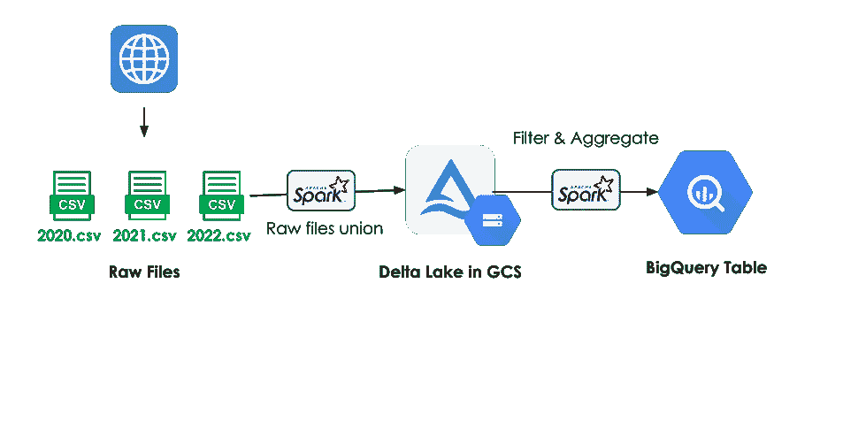
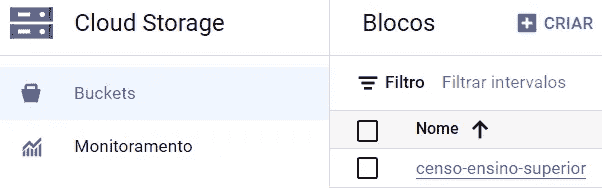
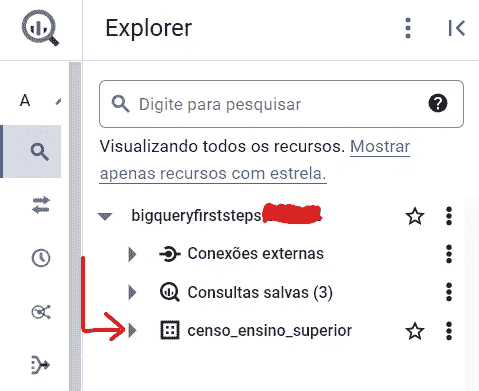
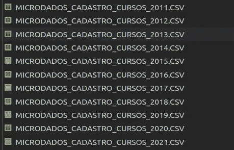
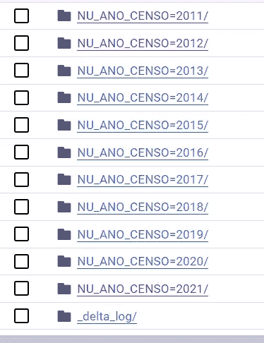
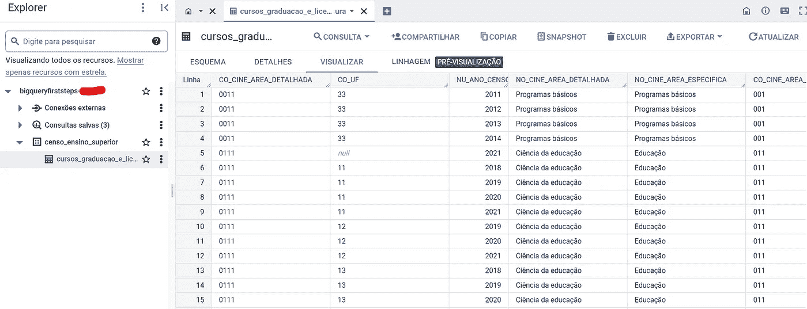
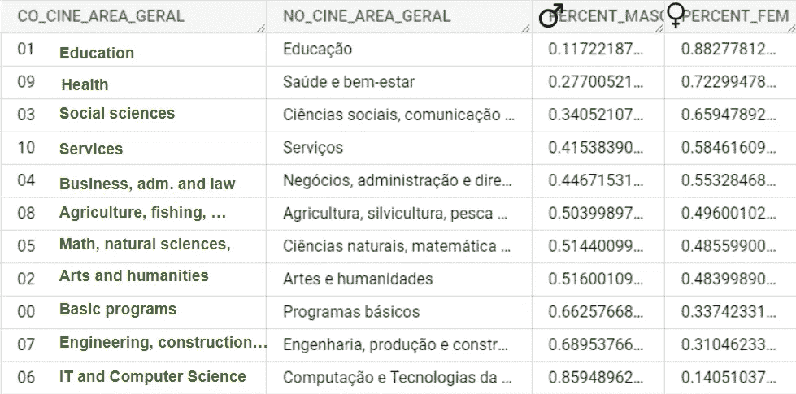

# 使用 Spark、Google Cloud Storage 和 Big Query 创建数据管道

> 原文：[`towardsdatascience.com/creating-a-data-pipeline-with-spark-google-cloud-storage-and-big-query-a72ede294f4c?source=collection_archive---------7-----------------------#2023-03-06`](https://towardsdatascience.com/creating-a-data-pipeline-with-spark-google-cloud-storage-and-big-query-a72ede294f4c?source=collection_archive---------7-----------------------#2023-03-06)

## 本地和云端协同工作以交付数据产品

[](https://joaopedro214.medium.com/?source=post_page-----a72ede294f4c--------------------------------)[](https://towardsdatascience.com/?source=post_page-----a72ede294f4c--------------------------------) [João Pedro](https://joaopedro214.medium.com/?source=post_page-----a72ede294f4c--------------------------------)

·

[关注](https://medium.com/m/signin?actionUrl=https%3A%2F%2Fmedium.com%2F_%2Fsubscribe%2Fuser%2Fb111eee95c&operation=register&redirect=https%3A%2F%2Ftowardsdatascience.com%2Fcreating-a-data-pipeline-with-spark-google-cloud-storage-and-big-query-a72ede294f4c&user=Jo%C3%A3o+Pedro&userId=b111eee95c&source=post_page-b111eee95c----a72ede294f4c---------------------post_header-----------) 发布于 [Towards Data Science](https://towardsdatascience.com/?source=post_page-----a72ede294f4c--------------------------------) · 10 分钟阅读 · 2023 年 3 月 6 日 [](https://medium.com/m/signin?actionUrl=https%3A%2F%2Fmedium.com%2F_%2Fvote%2Ftowards-data-science%2Fa72ede294f4c&operation=register&redirect=https%3A%2F%2Ftowardsdatascience.com%2Fcreating-a-data-pipeline-with-spark-google-cloud-storage-and-big-query-a72ede294f4c&user=Jo%C3%A3o+Pedro&userId=b111eee95c&source=-----a72ede294f4c---------------------clap_footer-----------)

--

[](https://medium.com/m/signin?actionUrl=https%3A%2F%2Fmedium.com%2F_%2Fbookmark%2Fp%2Fa72ede294f4c&operation=register&redirect=https%3A%2F%2Ftowardsdatascience.com%2Fcreating-a-data-pipeline-with-spark-google-cloud-storage-and-big-query-a72ede294f4c&source=-----a72ede294f4c---------------------bookmark_footer-----------)

图片由 [Toro Tseleng](https://unsplash.com/@crayon__artworks?utm_source=medium&utm_medium=referral) 提供，来源于 [Unsplash](https://unsplash.com/?utm_source=medium&utm_medium=referral)

开发数据管道在某种程度上类似于玩乐高，你需要构思实现目标（数据需求），选择合适的零件（软件、工具、平台），然后将它们组装在一起。就像在乐高中一样，构建过程的复杂性取决于最终目标的复杂性。

从使用 Python 构建的简单 ETL 管道在两个数据库之间移动数据，到使用 Kafka 在各种云结构之间流式传输实时消息以服务多个最终应用程序，非常复杂的结构都是可能的。

但现实是，当前的数据场景更像那些昂贵的专业乐高套件，拥有各种解决特定需求的零件，并且新的零件在每个角落不断出现。你可能已经看过 [Matt Turck 的 2021 年机器学习、人工智能和数据 (MAD) 领域](https://mattturck.com/data2021/)。而糟糕的部分——说明书没有包含在内。

过去十年中，许多开源数据相关工具如 Spark、Hadoop 和 Kafka 已经被开发出来，更不用说 Python 库中所有可用的工具了。这些就是我喜欢在文章中覆盖的工具，它们是免费的，维护良好的 Docker 镜像，并且我可以使用 Docker 开发自包含的应用程序，任何人都可以在任何地方运行。

但是，随着数据领域的成熟，所有的箭头似乎都指向同一个方向——云计算。这一点毫不令人惊讶。专注于数据应用的公司如 Databricks、DBT 和 Snowflake 正在迅速流行，而传统玩家（AWS、Azure 和 GCP）也在大力投资他们的数据产品。

这就是今天文章的目标——我们将使用 Apache Spark、Google Cloud Storage 和 Google Big Query（使用免费层）来开发一个数据管道。

> 未经赞助。

# 工具

**Spark** 是一个面向处理极大量数据的通用分布式内存数据处理框架。我在许多其他文章中介绍过 Spark。

**Google Cloud Storage (GCS)** 是 Google 的对象存储。概念很简单：创建一个桶并将文件存储在其中。稍后使用它们的“路径”读取。文件夹是虚假的，对象是不可变的。

**Google Big Query (GBQ)** 是 Google 的云数据仓库解决方案。一个以 OLAP 为重点的数据库，具有无服务器 SQL 查询执行能力，能够处理大量数据。

# 数据

我们将构建一个数据管道来处理和存储来自巴西“高等教育”（字面翻译）普查的数据。该普查每年收集有关巴西高等教育机构（主要是大学）从不同角度的许多统计数据：机构的、社会和人口统计的、地理的等等。

我们将处理 *课程报告*，其中包含有关每个巴西高等教育课程（本科、研究生、博士等）的统计数据。这些数据公开可用 [CC BY-ND 3.0]，以 CSV 文件形式提供（每年一个）。

# 实现

管道的想法很简单，将 CSV 文件下载到本地机器，转换为存储在 GCS 桶中的 Delta-Lake 表，对这个 delta 表进行所需的转换，并将结果保存到一个 Big Query 表中，以便其他下游任务可以轻松使用。



提议的管道。作者提供的图像。

存储桶将作为原始文件存储，聚合所有报告到一个地方。BigQuery 表将存储我们准备好的数据，已经过滤、聚合，并且只包含有用的列。

如前所述，普查收集了来自所有高等教育机构的大量统计数据，包括但不限于大学。为了模拟“真实情况”，假设我们需要创建一个表格来回答关于每年进入大学的新生的各种社会/人口统计问题。

## 0\. 设置环境

所有代码都可以在这个 [GitHub 仓库](https://github.com/jaumpedro214/posts)中找到。

你需要在本地计算机上安装 docker 以创建 Spark 集群，并且需要 python 来下载文件。

docker-compose 文件：

```py
version: '3'

services:
  spark:
    build: .
    environment:
      - SPARK_MODE=master
    ports:
      - '8080:8080'
      - '4040:4040'
    volumes:
      - ./data:/data
      - ./src:/src
  spark-worker:
    build: .
    environment:
      - SPARK_MODE=worker
      - SPARK_MASTER_URL=spark://spark:7077
      - SPARK_WORKER_MEMORY=4G
      - SPARK_EXECUTOR_MEMORY=4G
      - SPARK_WORKER_CORES=4
    volumes:
      - ./data:/data
      - ./src:/src 
```

spark Dockerfile：

```py
FROM docker.io/bitnami/spark:3.3.1

COPY *.jar $SPARK_HOME/jars

RUN mkdir -p $SPARK_HOME/secrets
COPY ./src/credentials/gcp-credentials.json $SPARK_HOME/secrets/gcp-credentials.json
ENV GOOGLE_APPLICATION_CREDENTIALS=$SPARK_HOME/secrets/gcp-credentials.json

RUN pip install delta-spark
```

docker 镜像已经配置为从头自动创建一个新环境，因此我们可以更多地关注实现而不是配置。

当然，你需要创建一个 Google Cloud Platform 账户。尽管我们只会使用免费的配额，但仍然需要你的信用卡信息。GCP 表示除非你明确结束免费试用期，否则不会收费，但请小心。

创建账户后，按照以下步骤操作：

**1.** 访问 GCP 控制台并**创建一个新项目**。我将我的项目命名为“BigQueryFirstSteps”


**2\.** 在 API & Services 标签中授权 Google Cloud Storage 和 BigQuery 的 API。

**3.** 在 Google Cloud Storage 中创建一个名为**censo-ensino-superior**的新存储桶



**4\.** 在 Google Big Query 中创建一个名为**censo-ensino-superior**的新数据集



**5\.** 在 IAM & Administrator 标签页中的*服务账户*项目下创建一个新的服务账户，并分配适当的角色以读取、写入和创建 GCP 存储桶和 GBQ 表（我使用了*BigQuery 管理员*和*存储管理员*角色）

**6\.** 在此页面上，生成一个新的访问密钥（JSON）用于新创建的账户。密钥将下载到你的本地计算机。

返回本地环境，执行*prepare_env.sh* 脚本。

```py
mkdir -p ./data/
mkdir -p ./src/credentials
chmod -R 777 ./src
chmod -R 777 ./data

wget https://storage.googleapis.com/hadoop-lib/gcs/gcs-connector-latest-hadoop2.jar
```

它创建了几个具有特定授权的文件夹（以便 spark 容器可以从中读取和写入）并下载了 GCS 连接器以供 spark 使用。

现在，将你的 JSON 凭证文件重命名为**gcp-credentials.json**并放置在 ./src/credentials 文件夹中（与 bucket_name.txt 文件一起）。

最后，启动容器：

```py
docker compose up --build
```

## 1\. 下载数据

只需运行脚本：

```py
python download_files.py
```

CSV 文件将下载到 ./data 文件夹中。



## 2\. 将 CSV 转换为 GCS 中的 Delta Lake

首先需要做的是实例化一个 Spark 会话，并配置 Delta-Lake 依赖项。

```py
from pyspark.sql import SparkSession
from pyspark.sql import functions as F

from delta import configure_spark_with_delta_pip

MASTER_URI = "spark://spark:7077"

if __name__ == "__main__":
    # spark-submit --packages io.delta:delta-core_2.12:2.1.0 --master spark://spark:7077 insert_csv_into_delta_table_gcs.py

    builder = SparkSession.builder\
        .master(MASTER_URI)\
        .appName("Insert CSV Censo into Delta Table")\
        .config("spark.sql.extensions", "io.delta.sql.DeltaSparkSessionExtension") \
        .config("spark.sql.catalog.spark_catalog", "org.apache.spark.sql.delta.catalog.DeltaCatalog")\

    spark = configure_spark_with_delta_pip(builder).getOrCreate()
```

读取下载的 CSV 文件非常简单，只需指定选项并给出路径。

```py
# Read the CSV file
df_cursos = (
    spark.read
    .format("csv")
    .option("header", "true")
    .option("delimiter", ";")
    .option("encoding", "ISO-8859-1")
    .option("inferSchema", "true")
    .load("/data/MICRODADOS_CADASTRO_CURSOS_*.CSV") # read all csv files
)
```

为了在 GCP 桶中写入更少的数据，我还仅选择了对最终表有用的列：普查年份；课程标识；知识领域；地点和类型；按性别、年龄和肤色统计的新生人数。

```py
# Select Columns
df_cursos = df_cursos.select(
    [   
        # Year
        "NU_ANO_CENSO",
        # Course AND Institution
        "CO_IES",
        "NO_CURSO",
        "CO_CURSO",
        # Total of new students
        "QT_ING",
        # Age
        "QT_ING_0_17",
        # ...
        # Skin Color
        "QT_ING_BRANCA",
        "QT_ING_PRETA",
        # ...
        # Gender COLUMNS
        # Place COLUMNS
        # Area of Knowledge (CINE) COLUMNS
        # FIELDS OMITTED TO MAKE THIS CODE BLOCK SMALLER
    ]
)

# cast columns to the correct type
for col in df_cursos.columns:
    if col in ["NU_ANO_CENSO"] or col.startswith("QT_"):
        df_cursos = df_cursos.withColumn(col, df_cursos[col].cast(IntegerType()))
    elif col.startswith("IN_"):
        df_cursos = df_cursos.withColumn(col, df_cursos[col].cast(BooleanType()))
    else:
        df_cursos = df_cursos.withColumn(col, df_cursos[col].cast(StringType()))
```

将数据写入 GCP 桶就像写入文件系统一样，但我们需要用自己的语法指定桶路径：“gs://<bucket_name>/<filepath_to_be_create>”。

```py
df_cursos.write\
        .format("delta")\
        .partitionBy(["NU_ANO_CENSO"])\
        .mode("overwrite")\
        .save("gs://censo-ensino-superior/cens_cursos")
```

上述代码在 **censo-ensino-superior** 桶内创建了一个名为 **censo_cursos** 的新 Delta 表。

我们不需要在代码中处理身份验证，因为凭据在 Docker 构建阶段已经正确配置。

要执行此脚本，请访问 Spark 容器的终端（主节点或工作节点）并执行：

```py
# cd into the folder where the script is stored
spark-submit --packages io.delta:delta-core_2.12:2.1.0 --master spark://spark:7077 insert_csv_into_delta_table_gcs.py
```

一分钟左右，脚本将完成，数据将可用在你的 GCS 桶中。



## 3\. 从 GCS 处理 Delta 表到 GBQ

首先需要做的是实例化一个 Spark 会话，与之前所做的相同。

从桶中读取数据也遵循与写入相同的逻辑。

```py
df_censo = (
      spark.read
          .format("delta")
          .load("gs://censo-ensino-superior/cens_cursos")
)
```

数据准备好后，我们可以像往常一样进行一些转换。

```py
 df_censo = (
        df_censo
        # Bachelor and Licenciatura TP_GRAU_ACADEMICO = 4
        .filter( 
            (F.col('TP_GRAU_ACADEMICO') == "1")  
            | (F.col('TP_GRAU_ACADEMICO') == "4")
        )
        # Group by CO_CINE_AREA_DETALHADA, CO_UF (STATE) and NU_ANO_CENSO (YEAR)
        .groupBy(
            'CO_CINE_AREA_DETALHADA', 'CO_UF', 'NU_ANO_CENSO'
        )
        .agg(
            F.max('NO_CINE_AREA_DETALHADA').alias('NO_CINE_AREA_DETALHADA'),

            F.max('NO_CINE_AREA_ESPECIFICA').alias('NO_CINE_AREA_ESPECIFICA'),
            F.max('CO_CINE_AREA_ESPECIFICA').alias('CO_CINE_AREA_ESPECIFICA'),
            F.max('NO_CINE_AREA_GERAL').alias('NO_CINE_AREA_GERAL'),
            F.max('CO_CINE_AREA_GERAL').alias('CO_CINE_AREA_GERAL'),

            F.max('SG_UF').alias('SG_UF'),
            F.max('NO_REGIAO').alias('NO_REGIAO'),
            F.max('CO_REGIAO').alias('CO_REGIAO'),

            F.count('CO_CURSO').alias('QT_CO_CURSO'),
            F.sum('QT_CURSO').alias('QT_CURSO'),
            F.sum('QT_VG_TOTAL').alias('QT_VG_TOTAL'),
            F.sum('QT_ING').alias('QT_ING'),

            F.sum('QT_ING_0_17').alias('QT_ING_0_17'),
            F.sum('QT_ING_18_24').alias('QT_ING_18_24'),
            F.sum('QT_ING_25_29').alias('QT_ING_25_29'),
            F.sum('QT_ING_30_34').alias('QT_ING_30_34'),
            F.sum('QT_ING_35_39').alias('QT_ING_35_39'),
            F.sum('QT_ING_40_49').alias('QT_ING_40_49'),
            F.sum('QT_ING_50_59').alias('QT_ING_50_59'),
            F.sum('QT_ING_60_MAIS').alias('QT_ING_60_MAIS'),

            F.sum('QT_ING_BRANCA').alias('QT_ING_BRANCA'),
            F.sum('QT_ING_PRETA').alias('QT_ING_PRETA'),
            F.sum('QT_ING_PARDA').alias('QT_ING_PARDA'),
            F.sum('QT_ING_AMARELA').alias('QT_ING_AMARELA'),
            F.sum('QT_ING_INDIGENA').alias('QT_ING_INDIGENA'),
            F.sum('QT_ING_CORND').alias('QT_ING_CORND'),

            F.sum('QT_ING_FEM').alias('QT_ING_FEM'),
            F.sum('QT_ING_MASC').alias('QT_ING_MASC'),
        )
    )
```

上述查询首先筛选出仅包含学士和学位课程（使用它们的代码），并按年份、详细领域和州对结果进行分组，汇总每个类别的新生人数（“QT_ING_XYZ”）。

要将数据写入 BigQuery 表，我们需要使用格式 “bigquery” 以及一些选项。显然，我们需要传递要写入的表和数据库。由于这个表尚不存在，因此需要将选项“createDisposition”设置为“CREATE_IF_NEEDED”。

标准的 [GBQ-Spark 连接器](https://cloud.google.com/dataproc/docs/tutorials/bigquery-connector-spark-example)使用 GCS 桶作为一个中间缓冲区，用于从 GBQ 传输数据。因此，我们需要传递一个“temporaryGcsBucket”选项，并指定桶名称。为了简单起见，我使用了之前创建的相同桶。

```py
df_censo.write\
    .format("bigquery")\
    .mode("overwrite")\
    .option("temporaryGcsBucket", "censo-ensino-superior")\
    .option("database", "censo_ensino_superior")\
    .option("table", "censo_ensino_superior.cursos_graduacao_e_licenciatura")\
    .option("createDisposition", "CREATE_IF_NEEDED")\
    .save()
```

同时，请注意这次写入是以 mode=“overwrite” 模式进行的，如果表已经存在，它将覆盖任何以前的数据。如果你只想添加新行，请使用“append”模式。

就这些了。

要运行这个任务，只需输入：

```py
# cd into the folder where the script is stored
spark-submit --packages io.delta:delta-core_2.12:2.1.0,com.google.cloud.spark:spark-3.1-bigquery:0.28.0-preview aggregate_delta_gcs_to_gbq_table.py
```

表将会被创建并填充，让我们来看看：



为了举例说明，让我们运行一个查询。

下面的查询计算了每个知识领域男性和女性的百分比。

```py
SELECT
  CO_CINE_AREA_GERAL,
  NO_CINE_AREA_GERAL,
  SUM(QT_ING_MASC)/SUM(QT_ING_FEM + QT_ING_MASC) AS PERCENT_MASC,
  SUM(QT_ING_FEM)/SUM(QT_ING_FEM + QT_ING_MASC) AS PERCENT_FEM  
FROM 
  `censo_ensino_superior.cursos_graduacao_e_licenciatura`
GROUP BY
  NO_CINE_AREA_GERAL,
  CO_CINE_AREA_GERAL
ORDER BY
  PERCENT_MASC
```

结果：



带有注释翻译的查询结果。图片由作者提供。

# 结论

在这篇文章中，我们学习了如何使用 Apache Spark（本地部署）作为数据处理工具，并将 Google Cloud Storage（用于原始文件存储）和 Google Big Query（用于为分析查询提供处理后的数据）作为存储解决方案来开发数据管道。

使用 Spark 与云中的数据进行交互并没有那么特别。更困难的部分是配置环境：找到合适的连接器，将其放置在正确的位置，并使用正确的格式。坦白说，我在学习如何正确配置 Docker 镜像和凭据时遇到了很多困难。但一旦掌握了这个过程，查询和操作数据就会像平常一样。

这也是我最喜欢 Apache Spark 的其中一个原因——它将处理逻辑与连接逻辑分开。例如，如果我们将 blob 存储解决方案从 GCS 更改为 Amazon 的 S3，我们需要做的就是用新的 AWS 凭据重新配置环境并更改读写命令。所有的查询/转换逻辑保持不变。

但除了“没有那么特别”之外，学习如何与云存储组件交互是一个极其重要的技能，我希望这篇文章能帮助你更好地理解这个过程。

和往常一样，我不是帖子中涉及的任何主题的专家，我强烈建议进一步阅读，见下方参考文献。

感谢阅读！;)

# 参考文献

> *所有代码都可以在* [*这个 GitHub 仓库*](https://github.com/jaumpedro214/posts)*中找到*。
> 
> 使用的数据 —* [*Microdados do Censo da Educação Superior*](https://www.gov.br/inep/pt-br/acesso-a-informacao/dados-abertos/microdados/censo-da-educacao-superior)*，[CC BY-ND 3.0]，INEP-巴西政府*

[1] Chambers, B., & Zaharia, M. (2018). Spark: The definitive guide: Big data processing made simple. “ O’Reilly Media, Inc.”.

[2] 什么是 BigQuery？（无日期）。*Google Cloud*。 [链接](https://cloud.google.com/bigquery/docs/introduction)。

[3] *Delta Lake 官方页面*。（无日期）。Delta Lake。 [`delta.io/`](https://delta.io/)

[4] Databricks. (2020 年 9 月 15 日)。*利用 Delta Lake 改善 Apache SparkTM* [[视频](https://www.youtube.com/watch?v=LJtShrQqYZY)]。YouTube。

[5]*使用 BigQuery 连接器与 Spark*。（无日期）。Google Cloud。 [链接](https://cloud.google.com/dataproc/docs/tutorials/bigquery-connector-spark-example)。

[6] Sohail, K. (2021 年 12 月 15 日)。*使用本地 PySpark 和 Jupyter Notebooks 从 Google Cloud Storage Bucket 读取文件*。Medium。 [链接](https://kashif-sohail.medium.com/read-files-from-google-cloud-storage-bucket-using-local-pyspark-and-jupyter-notebooks-f8bd43f4b42e)。
