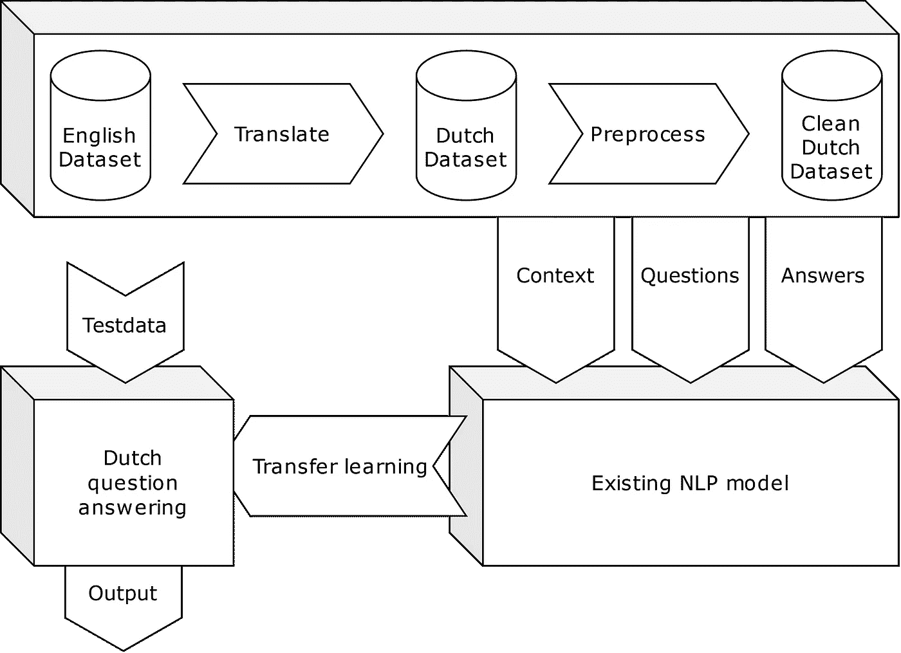
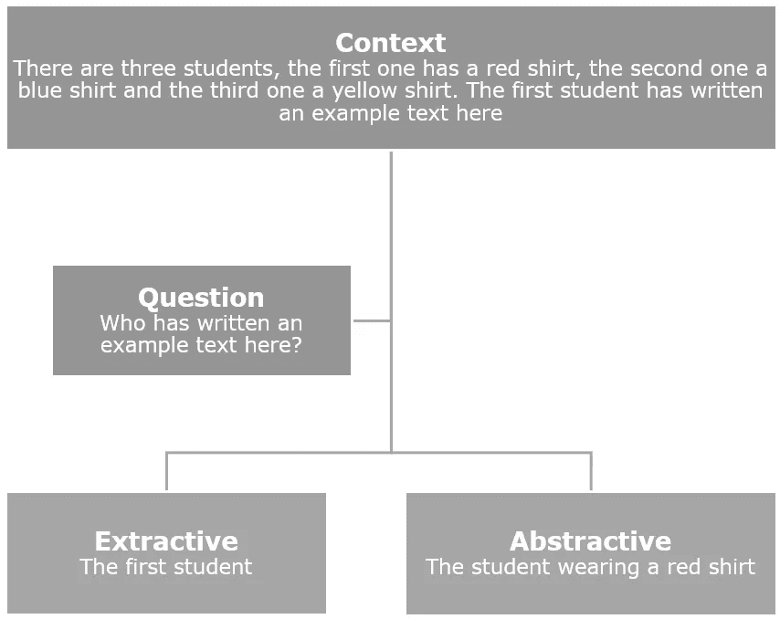
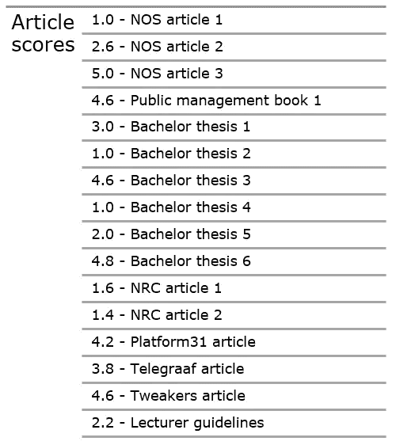

# 创建荷兰语问答机器学习模型

> 原文：[`towardsdatascience.com/creating-a-dutch-question-answering-machine-learning-model-3b666a115be3?source=collection_archive---------3-----------------------#2023-01-29`](https://towardsdatascience.com/creating-a-dutch-question-answering-machine-learning-model-3b666a115be3?source=collection_archive---------3-----------------------#2023-01-29)

## 自然语言处理教程

## 使用自然语言处理翻译创建新的数据集

[](https://medium.com/@ErwinVanCrasbeek?source=post_page-----3b666a115be3--------------------------------)[](https://towardsdatascience.com/?source=post_page-----3b666a115be3--------------------------------) [Erwin van Crasbeek](https://medium.com/@ErwinVanCrasbeek?source=post_page-----3b666a115be3--------------------------------)

·

[关注](https://medium.com/m/signin?actionUrl=https%3A%2F%2Fmedium.com%2F_%2Fsubscribe%2Fuser%2Feeab190a1f50&operation=register&redirect=https%3A%2F%2Ftowardsdatascience.com%2Fcreating-a-dutch-question-answering-machine-learning-model-3b666a115be3&user=Erwin+van+Crasbeek&userId=eeab190a1f50&source=post_page-eeab190a1f50----3b666a115be3---------------------post_header-----------) 发布于 [Towards Data Science](https://towardsdatascience.com/?source=post_page-----3b666a115be3--------------------------------) ·20 min 阅读·2023 年 1 月 29 日[](https://medium.com/m/signin?actionUrl=https%3A%2F%2Fmedium.com%2F_%2Fvote%2Ftowards-data-science%2F3b666a115be3&operation=register&redirect=https%3A%2F%2Ftowardsdatascience.com%2Fcreating-a-dutch-question-answering-machine-learning-model-3b666a115be3&user=Erwin+van+Crasbeek&userId=eeab190a1f50&source=-----3b666a115be3---------------------clap_footer-----------)

--

[](https://medium.com/m/signin?actionUrl=https%3A%2F%2Fmedium.com%2F_%2Fbookmark%2Fp%2F3b666a115be3&operation=register&redirect=https%3A%2F%2Ftowardsdatascience.com%2Fcreating-a-dutch-question-answering-machine-learning-model-3b666a115be3&source=-----3b666a115be3---------------------bookmark_footer-----------)

荷兰语问答模型创建流程

自然语言处理模型目前是一个热门话题。谷歌发布的《Attention Is All You Need》[1] 推动了许多像 BERT、GPT-3 和 ChatGPT 这样的 Transformer 模型的发展，这些模型受到了全球的广泛关注。虽然许多语言模型是在英语或多语言上进行训练的，但针对特定语言的模型和数据集可能难以找到或质量堪忧。

NLP 有广泛的应用，包括但不限于翻译、信息提取、摘要和问答，而后者是我个人一直在从事的工作。作为应用人工智能的学生，我一直在研究问答 NLP 模型，并且发现很难找到有用的荷兰语数据集用于训练。为了解决这个问题，我开发了一个翻译解决方案，可以应用于各种 NLP 问题和几乎所有语言，这可能对其他学生有兴趣。我认为这对人工智能开发和研究社区也具有很大的价值。特别是对于像问答这样的特定任务，几乎没有荷兰语数据集。通过翻译一个大型且知名的数据集，我能够以相对较低的努力创建一个荷兰语问答模型。

如果你有兴趣了解更多关于我的过程、我面临的挑战以及此解决方案的潜在应用，请继续阅读。本文旨在为具有基本 NLP 背景的学生提供。然而，我还为那些尚未熟悉该领域或仅需复习的人士提供了复习材料和各种概念的介绍。

为了正确解释我使用翻译数据集的解决方案，我将本文分为两个主要部分：数据集的翻译和问答模型的训练。我撰写本文的方式旨在展示我在解决方案方面的进展，同时也作为一个逐步指南。文章包括以下章节：

1.  关于 NLP 的复习和 NLP 的简要历史

1.  问题、数据集和问答

1.  翻译数据集

1.  构建一个问答模型

1.  已取得的成就与未取得的成就？

1.  未来计划

1.  来源

# 关于 NLP 的复习和 NLP 的简要历史

为了更好地理解这个解决方案的各个元素，我想从对 NLP 及其近期历史的复习开始。我们所知道的语言可以分为两组，形式语言和自然语言。形式语言指的是专门为特定任务如数学和编程设计的语言。自然语言或普通语言是指由人类自然发展和演变的语言，没有任何形式的预先规划。这可以表现为我们所知道的各种人类言语形式，甚至是手语[2]。

NLP 在其最广泛的形式上是将计算方法应用于自然语言。通过将基于规则的语言建模与人工智能模型相结合，我们已经能够使计算机以一种能够处理文本和语音形式的方式“理解”我们的自然语言[3]。这种理解的方式——如果它真的可以称为理解的话——仍然存在争议。然而，像 ChatGPT 这样的最新发展表明，我们人类确实常常觉得这些模型的输出让人感到它有自我意识，并且具有较高的理解水平[4]。

当然，这种理解并非凭空而来。NLP 有着广泛的历史，可以追溯到二战后的 1940 年代[5]。在这个时期，人们意识到了翻译的重要性，并希望创造一种能够自动完成翻译的机器。然而，这证明是相当具有挑战性的。大约在 1960 年左右，NLP 研究分为基于规则的和随机的两大类。基于规则的或符号化的主要涉及形式语言和语法生成。这个领域的许多语言学研究者和计算机科学家认为这是人工智能研究的开始。随机研究则更多关注统计学和文本间的模式识别等问题。

自那时起，NLP（自然语言处理）领域取得了许多进展，研究领域也不断扩展。然而，NLP 模型生成的实际文本一直相当有限，且缺乏许多现实世界的应用。直到 2000 年代初期，NLP 的发展才迎来了每隔几年便有显著突破的阶段，这才导致了我们现在的情况。

# 问题、数据集和问答

现在我已经简要回顾了 NLP 的背景，是时候介绍我一直在研究的实际问题了。简而言之，我的目标是训练一个荷兰语问答的机器学习模型。然而，由于缺乏合适的数据集，这变得相当困难，因此我通过翻译创建了自己的数据集。在本文中，我将逐步讲解数据集的创建和机器学习模型的训练，以便你可以跟随并复制整个解决方案，或选择对你来说重要的部分。

本文可以分为两个主要部分。第一个是荷兰语数据集的创建，第二个是问答机器学习模型的训练。在这一章中，我将提供一些背景信息，介绍我的解决方案并解释我的选择。

## 数据集

如果我们想找到一个有用的荷兰语数据集，那么了解训练一个问答模型所需的具体内容是很重要的。生成答案的主要有两种方法：第一种是抽取式，第二种是生成式。

· **抽取式**问答模型被训练以从上下文（源文本）中提取答案[7]。较早的方法通过训练一个模型来输出答案在上下文中的起始和结束索引来实现这一点。然而，Transformer 的引入使这种方法已经过时。

· **生成式**问答模型被训练以根据上下文和问题生成新文本[8]。

图 1 展示了抽取式和生成式模型可能产生的输出示例。

尽管有不同的方法，但如今抽取式和生成式问答模型通常都基于像 BERT 这样的 Transformer[8]，[9]。



图 1\. 抽取式与生成式方式生成的答案示例。

基于关于抽取式和生成式模型的信息，我们现在知道我们需要一个包含上下文、问题、答案以及（可选的）答案在上下文中的起始和结束索引的数据集。我已经探索了以下选项，以寻找合适的数据集。

+   我使用了 Cambazoglu *et al* 的 2020 年论文[10]，以获得有关问答数据集的清晰图像。他们的研究结果提供了一张包含最显著问答数据集的表格。不幸的是，这些大型数据集中没有荷兰语的数据集。

+   另一个选择是 Huggingface，它托管了大量的数据集[11]。乍一看，有一些荷兰语的问答数据集。然而，进一步检查显示，这些数据集往往不完整，包含网站域名而不是上下文，或者是各种语言的混合。这些数据集完全无法使用，或者不够完整，无法用于我们的目标。

从这些观察结果来看，几乎没有公共数据集可以用来训练荷兰语问答模型。手动创建我们自己的数据集将花费太多时间，那么我们还有什么其他选项？首先，我们可以简单地使用一个英语模型，将荷兰语输入翻译成英语，然后将输出再翻译回荷兰语。然而，通过 Google 翻译进行的快速测试表明，这种方法的结果远非理想，几乎感觉有些消极攻击。也许在双重翻译步骤中丢失了太多信息和上下文？这就引出了第二个选项，即翻译整个数据集并在其上进行训练。在我的研究中，我遇到了一些提到这一点的实例。例如，Zoumana Keita 在 Towardsdatascience 上的一篇文章[16]使用翻译进行数据增强。第三章将深入探讨我如何执行数据集的翻译。

最后，我们需要选择用于翻译的方法的数据集。既然我们决定翻译整个数据集，那么原始数据集使用什么语言就不重要了。[斯坦福问答数据集](https://rajpurkar.github.io/SQuAD-explorer/)（SQuAD）[12] 似乎相当受欢迎，并被 Paperswithcode 用于问答基准测试[13]。它还包含大量（100,000+）的问答，并且经仔细检查后似乎没有任何意外数据。这就是我们将要使用的数据集。

## 机器学习模型

现在我们已经确定了如何获取数据集；我们需要决定哪种机器学习模型适合回答问题的目标。在前一章中，我们已经确定可以选择抽取式模型和生成式模型。在我的研究中，我使用了生成式模型，因为它基于较新的技术，并且给出了更有趣的结果。然而，以防有人希望采用抽取式模型，我也会对此进行介绍。这也与数据集的选择一致，因为它包含了答案的起始索引。

从头开始训练一个 Transformer 模型，至少可以说是低效的。P. Azunre 的《自然语言处理中的迁移学习》一书[14]深入探讨了为什么进行迁移学习，并展示了如何进行迁移学习的多个示例。大量大型 NLP 模型托管在 Huggingface[15]上，并可用于迁移学习。我选择了 t5-v1_1-base 模型，因为它经过多语言的多任务训练。第四章将介绍该模型的迁移学习。

# 翻译数据集

在本章中，我将展示如何通过提供代码片段并对其进行解释来翻译数据集。这些代码块连续生成的代码就是我编写的整个数据集翻译脚本。欢迎跟随或取用对你有用的特定部分。

## *导入*

解决方案使用了几个模块。首先，我们需要以尽可能快的速度翻译文本。在我的研究中，我尝试使用来自 Huggingface 的各种翻译 AI 模型，但迄今为止，最快的翻译器是 Googletrans 模块，它使用了 Google Translate API。该解决方案还使用了 httpx 的 Timeout 来定义翻译的超时时间，使用 json 解析 SQuAD 数据集，使用 Pandas 处理数据框，以及使用 Time 来测量所有操作所需的时间。

```py
from googletrans import Translator, constants
from httpx import Timeout

import json
import pandas as pd
import time
```

## **初始化**

首先，我们应该定义几个在脚本中会用到的常量。为了方便访问，我在这里添加了源语言和翻译语言。

Googletrans 模块为我们提供了一个可以自定义超时时间的翻译器。我使用了相对较长的超时时间，因为在测试期间翻译经常超时。我将在本指南后面的部分提供更多有关这个问题的信息。

```py
src_lang = "en"
dest_lang = "nl"

translator = Translator(timeout = Timeout(60))
```

## 阅读 SQuAD 数据集

以下代码从训练和验证 json 文件中提取上下文、问题和答案。这是通过将文件以 json 格式读取，并以一种提取三种列表的方式遍历数据来完成的。对于每个问题和答案，上下文被复制并添加到上下文列表中。这样我们可以通过使用索引轻松访问带有相关上下文和答案的问题。

```py
def read_squad(path):
    with open(path, 'rb') as f:
        squad_dict = json.load(f)
    contexts, questions, answers = [], [], []
    for group in squad_dict['data']:
        for passage in group['paragraphs']:
            context = passage['context']

            for qa in passage['qas']:
                question = qa['question']
                if 'plausible_answers' in qa.keys():
                    access = 'plausible_answers'
                else:
                    access = 'answers'
                for answer in qa[access]:
                    contexts.append(context)
                    questions.append(question)
                    answers.append(answer['text'])
    return contexts, questions, answers

train_c, train_q, train_a = read_squad('squad-train-v2.0.json')
val_c, val_q, val_a= read_squad('squad-dev-v2.0.json')
```

## 时间

以下代码为我们提供了每个翻译所需时间的大致估计。

```py
def time_translation(entries, name):
    start_time = time.time()
    translation = translator.translate(entries[0], dest=dest_lang, src= src_lang)
    duration = time.time() - start_time
    total_duration = len(entries)*duration
    print(f"translating {name} takes {total_duration/60/60} hours")

time_translation(train_c, "train contexts")
time_translation(train_q, "train questions")
time_translation(train_a, "train answers")
time_translation(val_c, "validation contexts")
time_translation(val_q, "validation questions")
time_translation(val_a, "validation answers")
```

## 翻译

记得我提到过翻译超时的问题吗？在我的研究过程中，我不断遇到翻译超时的问题，导致结果数据集被损坏。事实证明，Googletrans 模块并不是 100% 可靠的，因为它使用了 Google Translate API。我找到的解决办法是创建一个小的包装函数，该函数会不断尝试翻译，直到成功为止。经过这样处理后，我不再遇到超时问题。

```py
def get_translation(text):
    success = False
    translation = ""
    while not success:
        translation = translator.translate(text, dest=dest_lang, src=src_lang).text
        success = True
    return translation
```

由于我们从数据集中提取上下文的方式，每个问题和答案对都有重复的上下文。直接翻译所有上下文会显得冗余且非常缓慢，因此以下翻译函数首先会将前一个上下文与当前上下文进行比较。如果它们匹配，则使用之前的翻译。

```py
def translate_context(contexts, name):
    start_time = time.time()
    context_current = ""
    translated_contexts = []
    index = 0

    for context in contexts:
        index+=1
        if context != context_current:
            context_current = context
            print(f"[{index}/{len(contexts)}]")
            get_translation(context)
            context_translated = get_translation(context)
            translated_contexts.append(context_translated)
        else:
            translated_contexts.append(context_translated)

    duration = time.time() - start_time
    print(f"Translating {name} took {round(duration, 2)}s") 
    return translated_contexts
```

翻译问题和答案非常简单，因为我们只需循环遍历列表来翻译所有内容。

```py
def translate_qa(input, name):
    start_time = time.time()
    input_translated = []
    index = 0
    for text in input:
        text_nl = get_translation(text)
        input_translated.append(text_nl)
        index+=1
        print(f"[{index}/{len(input)}]")
    duration = time.time() - start_time
    print(f"Translating {name} took {round(duration, 2)}s") 
    return input_translated
```

现在我们可以使用我们定义的函数来翻译数据集的所有部分。

```py
train_c_translated = translate_context(train_c, "train contexts")
train_q_translated = translate_qa(train_q, "train questions")
train_a_translated = translate_qa(train_a, "train answers")

val_c_translated = translate_context(val_c, "val contexts")
val_q_translated = translate_qa(val_q, "val questions")
val_a_translated = translate_qa(val_a, "val answers")
```

## 导出

只剩下将翻译导出以供以后使用。我们可以通过将列表转换为数据框，然后使用 to_csv 函数来完成这一点。需要注意的是，Googletrans 模块输出的翻译包含 utf-8 编码中不包含的字符。这就是我们在这里使用 utf-16 编码的原因。将其转换为 utf-8 可能在某些时候更有用，因为这可能对 AI 模型更有帮助。然而，由于我们这里只是在处理数据集，所以我们可以决定将这一步骤留到后续数据预处理阶段。

```py
def save_data(data, name, header):
    data_df = pd.DataFrame(data)
    data_df.to_csv(name + "_pdcsv.csv", encoding='utf-16', index_label = "Index", header = [header])

save_data(train_c_translated, "train_contexts", "contexts")
save_data(train_q_translated, "train_questions", "questions")
save_data(train_a_translated, "train_answers", "answers")
save_data(val_c_translated, "val_contexts", "contexts")
save_data(val_q_translated, "val_questions", "questions")
save_data(val_a_translated, "val_answers", "answers")
```

# 构建问答模型

发现如何训练一个问答模型的过程有点挑战。然而，通过借鉴 P. Suraj [17] 的 Notebook，我能够创建一个基于 Transformer 的模型，该模型可以用于问答训练。按照 Notebook 的指导，我使用了 Torch 来创建模型。

## 导入

从导入开始，使用了以下模块。我们还定义了一些变量，这些变量定义了模型的最大输入和输出长度。

```py
import pandas as pd
import unicodedata

import torch
from torch.utils.data import DataLoader

from transformers import T5Tokenizer
from transformers import T5ForConditionalGeneration
from transformers import AdamW
from tqdm import tqdm

from sklearn.model_selection import train_test_split 
from datetime import datetime

max_text_length = 512
max_output_length = 256
```

## 加载数据

现在我们可以加载之前创建的数据集。由于我们使用 Pandas 导出了 csv，因此现在可以轻松加载并将其转换为数组。我还定义了一个函数，该函数将在后续将任何训练或输入数据转换为 utf-8，这是我们将用于训练模型的格式。

```py
def load_data(path):
    df = pd.read_csv(path, encoding='utf-16')
    df = df.drop('Index', axis=1)
    data = df.values.tolist()
    data = [a[0] for a in data]
    return data

def to_utf8(text):
    try:
        text = unicode(text, 'utf-8')
    except NameError:
        pass
    text = unicodedata.normalize('NFD', text).encode('ascii', 'ignore').decode("utf-8")
    return str(text)
```

现在我们可以实际加载数据。在模型训练中，我只使用了训练数据，并将其拆分为测试数据，测试数据大小为 0.2。

```py
contexts_csv = 'train_contexts_pdcsv.csv'
questions_csv = 'train_questions_pdcsv.csv'
answers_csv = 'train_answers_pdcsv.csv'

contexts = load_data(contexts_csv)
questions = load_data(questions_csv)
answers = load_data(answers_csv)

c_train, c_val, q_train, q_val, a_train, a_val = train_test_split(contexts,
                                                questions, answers,
                                                test_size=0.2,
                                                random_state=42)
```

## 准备数据

如我之前提到的，我们可以训练一个抽取式模型和一个抽象生成模型。在我的研究中，我开发了这两种模型。在这篇文章中，我只介绍抽象生成版本，但对于感兴趣的读者，我还会解释如何为抽取式模型预处理数据。这是为了创建上下文中答案的起始和结束索引。

**抽象生成**

数据集不需要过多预处理就可以训练抽象生成模型。我们只需将所有训练数据转换为 utf-8。可以取消注释最后三行，以减少训练集的大小，这将改善训练时间并有助于调试。

```py
def clean_data(contexts, questions, answers):
    cleaned_contexts, cleaned_questions, cleaned_answers = [], [], []
    for i in range(len(answers)):
        cleaned_contexts.append(to_utf8(contexts[i]))
        cleaned_questions.append(to_utf8(questions[i]))
        cleaned_answers.append(to_utf8(answers[i]))
    return cleaned_contexts, cleaned_questions, cleaned_answers

cc_train, cq_train, ca_train = clean_data(c_train, q_train, a_train); 
cc_val, cq_val, ca_val = clean_data(c_val, q_val, a_val); 

print("Original data size: " + str(len(q_train)))
print("Filtered data size: " + str(len(cq_train)))

#cc_train = cc_train[0:1000]
#cq_train = cq_train[0:1000]
#ca_train = ca_train[0:1000]
```

**抽取式**

在许多情况下，抽取式模型需要上下文中答案的起始和结束索引。然而，由于我们使用 Transformer 翻译了数据集，可能会出现一些问题。例如，答案可能与上下文中的措辞不同，或者答案的位置或长度可能已经改变。为了解决这个问题，我们可以尝试在上下文中找到答案，如果找到答案，则将其添加到清理后的答案中。因此，我们也获得了关于起始索引的信息，结束索引简单地是起始索引加上答案的长度。

```py
def clean_data(contexts, questions, answers):
    cleaned_contexts, cleaned_questions, cleaned_answers = [], [], []
    for i in range(len(answers)):
        index = contexts[i].find(answers[i])
        if(index != -1):
        #print(str(index) + " + " + str(index+len(answers[i])))
            cleaned_contexts.append(contexts[i])
            cleaned_questions.append(questions[i])
            cleaned_answers.append({
                'text':answers[i],
                'answer_start': index,
                'answer_end': index+len(answers[i])
                })
    return cleaned_contexts, cleaned_questions, cleaned_answers

cc_train, cq_train, ca_train = clean_data(c_train, q_train, a_train); 
cc_val, cq_val, ca_val = clean_data(c_val, q_val, a_val);
```

## 分词器

下一步是分词，因为我们使用的是 t5-v1_1-base，我们可以直接从 Huggingface 导入分词器。然后，我们将使用问题对上下文进行分词，以便分词器将它们与结束字符串标记一起添加。我们还指定了之前定义的 max_text_length。最后，分词后的答案被添加到编码中作为目标。

```py
tokenizer = T5Tokenizer.from_pretrained('google/t5-v1_1-base')
train_encodings = tokenizer(cc_train, cq_train, max_length=max_text_length, truncation=True, padding=True)
val_encodings = tokenizer(cc_val, cq_val, max_length=max_text_length, truncation=True, padding=True)

def add_token_positions(encodings, answers):
    tokenized = tokenizer(answers, truncation=True, padding=True)
    encodings.update({'target_ids': tokenized['input_ids'], 'target_attention_mask': tokenized['attention_mask']})

add_token_positions(train_encodings, ca_train)
add_token_positions(val_encodings, ca_val)
```

## 数据加载器

我们将使用数据加载器来训练 PyTorch 模型。这里还可以指定批量大小。我训练时的服务器内存有限，所以我不得不使用批量大小为 2。如果可能的话，使用更大的批量大小会更好。

```py
class SquadDataset(torch.utils.data.Dataset):
    def __init__(self, encodings):
        self.encodings = encodings
        print(encodings.keys())

    def __getitem__(self, idx):
        return {key: torch.tensor(val[idx]) for key, val in self.encodings.items()}

    def __len__(self):
        return len(self.encodings.input_ids)

train_dataset = SquadDataset(train_encodings)
val_dataset = SquadDataset(val_encodings)

train_loader = DataLoader(train_dataset, batch_size=2, shuffle=True)
```

# 训练模型

我们使用的模型是基于 T5-v1_1-base 的 T5ForConditionalGeneration。如果用于训练的 PC 或服务器上安装了 CUDA，我们可以尝试利用它来显著提高训练速度。我们还告诉模型我们将对其进行训练。

我们使用的优化器是 AdamW，学习率为 1e-4。这个选择基于 T5 文档[18]，文档中提到在我们的情况下这是一个合适的值：

> *通常，1e-4 和 3e-4 对于大多数问题（分类、摘要、翻译、问答、问题生成）效果很好。*

最后，我们定义一个函数，在模型训练完成后将其保存以供以后使用。

```py
model = T5ForConditionalGeneration.from_pretrained('google/t5-v1_1-base')
cuda = torch.cuda.is_available()
device = torch.device('cuda') if cuda else torch.device('cpu')
model.to(device)
model.train()

optimizer = AdamW(model.parameters(), lr=1e-4)

def save_model():
    now = datetime.now()
    date_time = now.strftime(" %m %d %Y %H %M %S")
    torch.save(model.state_dict(), "answer_gen_models/nlpModel"+date_time+".pt")
```

模型的实际训练将在三个时期内完成，我使用的 Notebook [17] 和 T5 文档都表明这是一个不错的训练周期数。在我配备 RTX 3090 的 PC 上，这大约需要每个周期 24 小时。我使用的服务器利用了 Nvidia Tesla T4，每个周期大约需要 6 小时。

Tqdm 模块用于对训练状态进行可视化反馈。它提供了关于已过时间和估计训练时间的数据。两个注释箭头之间的步骤对于我们的问答目标很重要，这里我们定义了给模型的输入。该代码块中的其他步骤对于 PyTorch 模型的训练相当直接。

```py
for epoch in range(3):
    loop = tqdm(train_loader, leave=True)
    for batch in loop:
        optim.zero_grad()

        # >
        input_ids = batch['input_ids'].to(device)
        attention_mask = batch['attention_mask'].to(device)
        target_ids = batch['target_ids'].to(device)
        target_attention_mask = batch['target_attention_mask'].to(device)

        outputs = model(input_ids, attention_mask=attention_mask,
                        labels=target_ids,
                        decoder_attention_mask=target_attention_mask)
        # >
        loss = outputs[0]
        loss.backward()
        optimizer.step()

        loop.set_description(f'Epoch {epoch}')
        loop.set_postfix(loss=loss.item())
save_model()
```

## 结果

如果你跟随完成了，恭喜你！你已经创建了自己的荷兰数据集并训练了一个荷兰问答模型！如果你和我一样，可能迫不及待想尝试一下模型的结果。你可以使用以下代码来评估模型。有趣的是，你可能会发现模型不仅能够回答荷兰语问题！它也有能力回答不同（主要是日耳曼语）的语言的问题。这很可能是因为原始 T5-v1_1-base 模型已经在四种不同语言上进行了训练。

```py
model = T5ForConditionalGeneration.from_pretrained('google/t5-v1_1-base')
model.load_state_dict(torch.load("answer_gen_models/some_model.pt"))

cuda = torch.cuda.is_available()
device = torch.device('cuda') if cuda else torch.device('cpu')
model.to(device)
model.eval()

def test(context, question):
    input = tokenizer([to_utf8(context)],
                      [to_utf8(question)],
                      max_length=max_text_length,
                      truncation=True,
                      padding=True)
    with torch.no_grad():
        input_ids = torch.tensor(input['input_ids']).to(device)
        attention_mask = torch.tensor(input['attention_mask']).to(device)
        out = model.generate(input_ids,
                             attention_mask=attention_mask,
                             max_length=max_output_length,
                             early_stopping=True)
        print([tokenizer.decode(ids,
        skip_special_tokens=True) for ids in out][0])

test("Dit is een voorbeeld", "Wat is dit?")
```

以下是一些示例背景和问题以及模型生成的答案：

**背景** 我们和应用人工智能硕士班的同学们去过科隆。

**问题** 班级去过哪里？

**答案** 科隆

**背景** 大棕色狐狸跳过了懒狗。

**问题** 狐狸跳过了什么？

**答案** 懒狗

**背景** 大棕色狐狸跳过了懒狗。

**问题** 狐狸做了什么？

**答案** 跳过懒狗

**背景** 两乘二是十。

**问题** 两乘二是多少？

**答案** 十

# 已经实现了什么，未实现什么？

总结一下，我们选择了一个用于问答的英文数据集，通过 Google Translate API 将其翻译成荷兰语，并训练了一个基于 T5-v1_1-base 的 PyTorch 编码器-解码器模型。我们究竟实现了什么，这在实际情况中是否能使用？

首先，重要的是要认识到我们没有对模型进行适当评估，因为这不是本文的范围。然而，为了能够正确解释我们的结果，并能够谈论其可用性，我建议查看如 Rouge [19] 等度量标准或进行人类评估。我采取的方法是人类评估。表 2 显示了五个人对各种上下文来源和问题生成答案的平均评分，评分范围从 1 到 5。平均分为 2.96\。这个数字本身并没有告诉我们很多信息，但我们可以从表中得出结论，我们创建的模型在某些情况下可以生成接近完美的答案。然而，它也经常生成评估小组认为完全无意义的答案。



表 2\. 各种文章、论文和学位论文的人类评估评分（1–5）。

还需要注意的是，通过翻译数据集，我们很可能引入了偏差。谷歌翻译背后的 AI 已经在一个数据集上进行训练，由于其基于自然语言，因此自然包含了偏差。通过翻译我们的数据，这种偏差将传递到任何使用该数据集训练的模型中。在像这样的数据集可以在实际情况下使用之前，应彻底评估，以指出其中的偏差以及这些偏差如何影响结果。

然而，这种解决方案对于那些在实验 AI、开发新型机器学习模型或仅仅学习 NLP 的人来说可能非常有趣。这是一种非常便捷的方式，可以为几乎任何 NLP 问题获取大规模的数据集。许多学生无法获得大数据集，因为这些数据集通常只对大型公司开放或费用过高。通过这样的方式，任何大型英语数据集都可以转换为特定语言的数据集。

# 未来计划

我个人对这个方法的应用前景非常感兴趣。我目前正在研究一个使用完全相同方法和数据集的问题生成模型。我希望调查这两种模型结合使用的效果，以便更多地了解潜在的偏差或错误。这与第五章讨论的评估需求是一致的。我已经通过请五个人对创建的模型的结果进行评分来创建了一个人类评估。然而，我打算进一步了解不同的度量标准，这些标准可以更好地告诉我模型的工作原理、生成某些结果的原因以及其中包含的偏差。

我还了解到，斯坦福问题与回答数据集的 2.0 版本包含一些无法回答的问题。虽然这与本文提供的解决方案没有直接关系，但我对将本文的解决方案应用于完整的 SQuAD 2.0 数据集后的结果差异感到好奇。

# 来源

[1] A. Vaswani *et al.*，“注意力机制是你所需要的一切，” 2017 年。

[2] D. Khurana, A. Koli, K. Khatter, 和 S. Singh，“自然语言处理：最新进展、当前趋势和挑战，” *Multimedia Tools and Applications*，2022 年 7 月，doi: 10.1007/s11042–022–13428–4。

[3] “什么是自然语言处理？| IBM，” [*www.ibm.com*](http://www.ibm.com.)。[`www.ibm.com/topics/natural-language-processing`](https://www.ibm.com/topics/natural-language-processing)（访问日期：2023 年 1 月 11 日）。

[4] E. Holloway，“是的，ChatGPT 是有意识的 — 因为实际上是人类在其中，” *Mind Matters*，2022 年 12 月 26 日。[`mindmatters.ai/2022/12/yes-chatgpt-is-sentient-because-its-really-humans-in-the-loop/`](https://mindmatters.ai/2022/12/yes-chatgpt-is-sentient-because-its-really-humans-in-the-loop/)（访问日期：2023 年 1 月 18 日）。

[5] “NLP — 概述，” *cs.stanford.edu*。[`cs.stanford.edu/people/eroberts/courses/soco/projects/2004-05/nlp/overview_history.html`](https://cs.stanford.edu/people/eroberts/courses/soco/projects/2004-05/nlp/overview_history.html)（访问日期：2023 年 1 月 18 日）。

[6] S. Ruder，“自然语言处理最近历史的回顾，” *Sebastian Ruder*，2018 年 10 月 1 日。[`ruder.io/a-review-of-the-recent-history-of-nlp/`](https://ruder.io/a-review-of-the-recent-history-of-nlp/)（访问日期：2023 年 1 月 18 日）。

[7] S. Varanasi, S. Amin, 和 G. Neumann，“AutoEQA：用于提取式问答的自动编码问题，” *计算语言学协会年会论文集：EMNLP 2021*，2021 年。

[8] “什么是问答？ — Hugging Face，” *huggingface.co*。[`huggingface.co/tasks/question-answering`](https://huggingface.co/tasks/question-answering)（访问日期：2023 年 1 月 18 日）。

[9] R. E. López Condori 和 T. A. Salgueiro Pardo，“观点总结方法：比较和扩展提取式和抽象式方法，” *专家系统应用*，第 78 卷，第 124–134 页，2017 年 7 月，doi: 10.1016/j.eswa.2017.02.006。

[10] B. B. Cambazoglu, M. Sanderson, F. Scholer, 和 B. Croft，“关于问答研究的公共数据集综述，” *ACM SIGIR Forum*，第 54 卷，第 2 期，第 1–23 页，2020 年 12 月，doi: 10.1145/3483382.3483389。

[11] “Hugging Face — 建设未来的人工智能社区，” *huggingface.co*。[`huggingface.co/datasets?language=language:nl&task_categories=task_categories:question-answering&sort=downloads`](https://huggingface.co/datasets?language=language%3Anl&task_categories=task_categories%3Aquestion-answering&sort=downloads)（访问日期：2023 年 1 月 18 日）。

[12] “斯坦福问答数据集，” *rajpurkar.github.io*。[`rajpurkar.github.io/SQuAD-explorer/`](https://rajpurkar.github.io/SQuAD-explorer/)（访问日期：2023 年 1 月 18 日）。

[13] “Papers with Code — 问答，” *paperswithcode.com*。[`paperswithcode.com/task/question-answering`](https://paperswithcode.com/task/question-answering)（访问日期：2023 年 1 月 18 日）。

[14] P. Azunre，*自然语言处理中的迁移学习*。Simon and Schuster，2021 年。

[15] “Hugging Face — 一次提交解决 NLP 问题的使命。” *huggingface.co*。 [`huggingface.co/models`](https://huggingface.co/models)（访问日期：2023 年 1 月 18 日）。

[16] Z. Keita，“使用 MarianMT 进行 NLP 中的数据增强，” *Medium*，2022 年 11 月 5 日。 `towardsdatascience.com/data-augmentation-in-nlp-using-back-translation-with-marianmt-a8939dfea50a`（访问日期：2023 年 1 月 18 日）。

[17] P. Suraj，“Google Colaboratory，” *colab.research.google.com*。 [`colab.research.google.com/github/patil-suraj/exploring-T5/blob/master/T5_on_TPU.ipynb`](https://colab.research.google.com/github/patil-suraj/exploring-T5/blob/master/T5_on_TPU.ipynb)（访问日期：2023 年 1 月 25 日）。

[18] “T5，” *huggingface.co*。 [`huggingface.co/docs/transformers/model_doc/t5#transformers.T5Model`](https://huggingface.co/docs/transformers/model_doc/t5#transformers.T5Model)（访问日期：2023 年 1 月 25 日）。

[19] “ROUGE — evaluate-metric 提供的 Hugging Face 空间，” *huggingface.co*。 [`huggingface.co/spaces/evaluate-metric/rouge`](https://huggingface.co/spaces/evaluate-metric/rouge)（访问日期：2023 年 1 月 25 日）。

除非另有说明，所有图片均为作者所摄。
