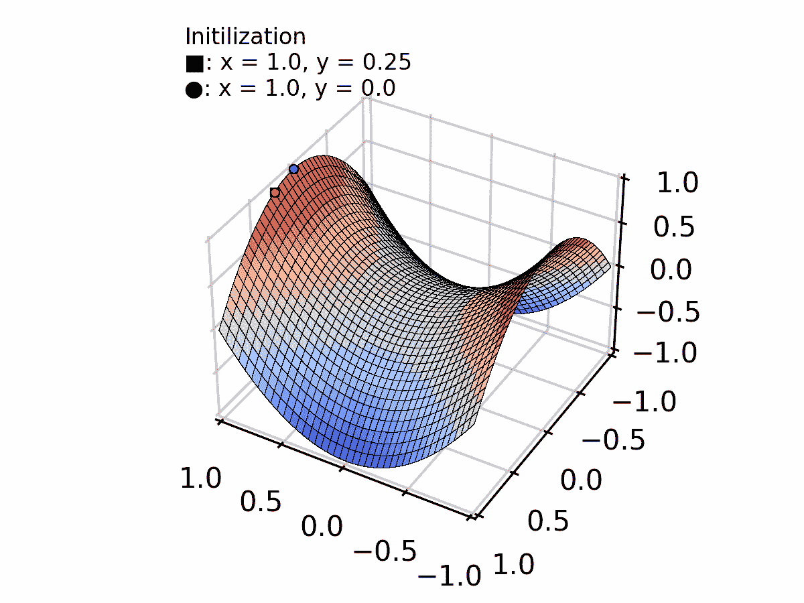
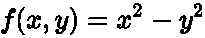
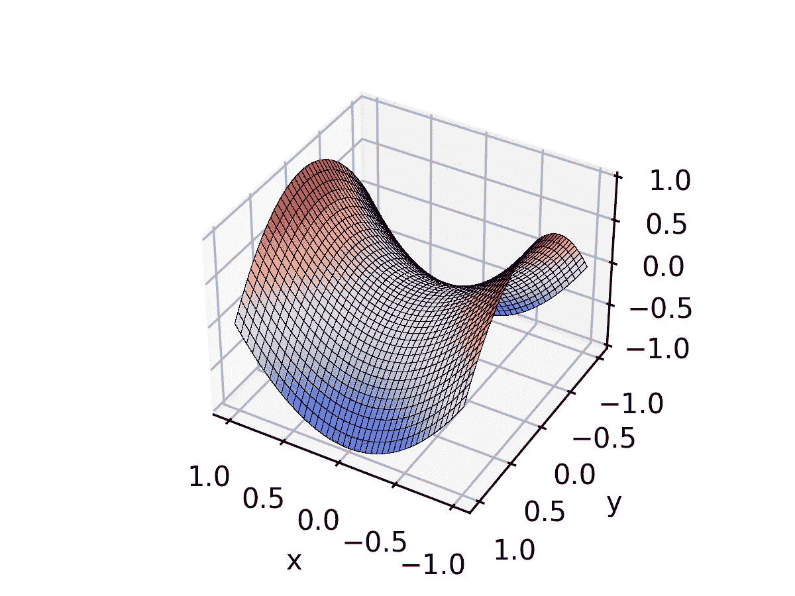
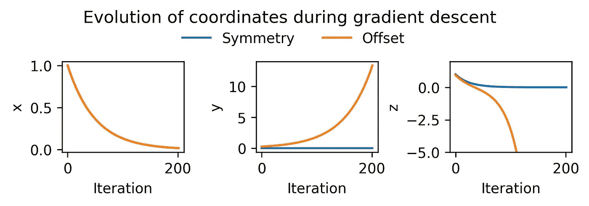
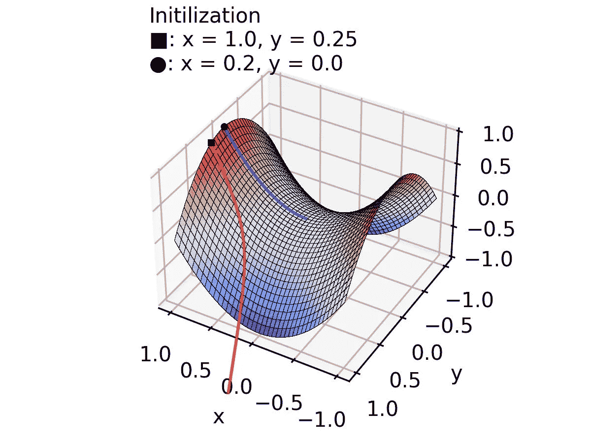
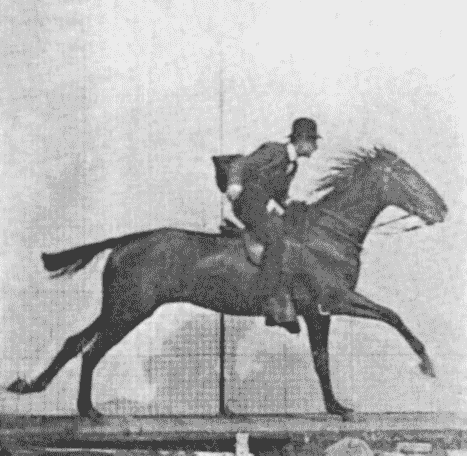
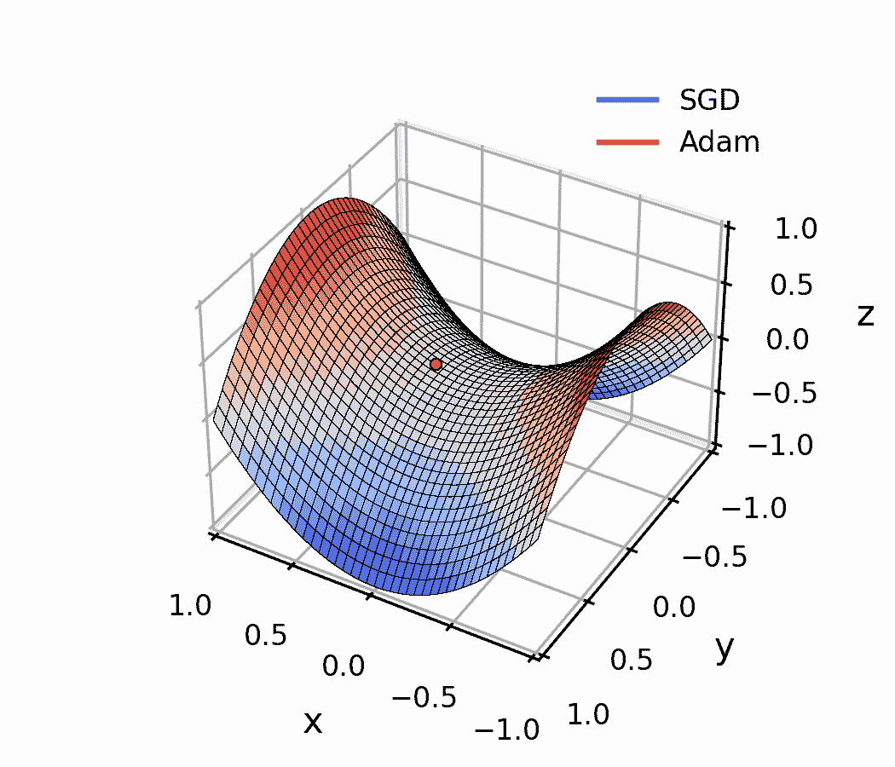

# 在 Python 中创建梯度下降动画

> 原文：[`towardsdatascience.com/creating-a-gradient-descent-animation-in-python-3c4dcd20ca51`](https://towardsdatascience.com/creating-a-gradient-descent-animation-in-python-3c4dcd20ca51)

## 如何绘制点在复杂曲面上的轨迹

[](https://medium.com/@luisdamed?source=post_page-----3c4dcd20ca51--------------------------------)[](https://towardsdatascience.com/?source=post_page-----3c4dcd20ca51--------------------------------) [Luis Medina](https://medium.com/@luisdamed?source=post_page-----3c4dcd20ca51--------------------------------)

·发表于 [Towards Data Science](https://towardsdatascience.com/?source=post_page-----3c4dcd20ca51--------------------------------) ·阅读时间 10 分钟·2023 年 11 月 11 日

--


图片由[Todd Diemer](https://unsplash.com/@todd_diemer?utm_source=medium&utm_medium=referral)提供，来源于[Unsplash](https://unsplash.com/?utm_source=medium&utm_medium=referral)

让我告诉你我是如何创建梯度下降动画的，只是为了在博客文章中说明一个观点。这是值得的，因为通过这样做我学到了更多的 Python，并掌握了一项新技能：制作动画图。



在 Python 中创建的梯度下降动画。图片由作者提供。

我将带你一步一步走过我所遵循的过程。

## 背景介绍

几天前，我发表了一篇[关于梯度下降的博客文章](https://medium.com/@luisdamed/gradient-descent-f09f19eb35fb)，介绍了作为训练人工神经网络的优化算法的梯度下降。

我想包含一个动画图形，以展示选择不同的初始化点对于梯度下降优化可能产生不同的结果。

就在那时，我偶然发现了这些[**惊人的动画**](https://imgur.com/a/Hqolp)，这些动画由[Alec Radford](https://twitter.com/alecrad)多年前创建，并在[Reddit 评论](https://www.reddit.com/r/MachineLearning/comments/2gopfa/comment/cklhott/?utm_source=share&utm_medium=web2x&context=3)中分享，展示了一些先进的梯度下降算法之间的差异，如[Adagrad](http://www.jmlr.org/papers/volume12/duchi11a/duchi11a.pdf)、[Adadelta](http://arxiv.org/abs/1212.5701)和[RMSprop](https://class.coursera.org/neuralnets-2012-001/lecture/67)。

由于我一直在努力[用 Python 取代 Matlab](https://medium.com/@luisdamed/replacing-matlab-with-python-part-1-322271314e4d)，我决定试试自己编写类似的动画，首先使用“基本版”梯度下降算法。

一步一步来吧。

## 绘制用于优化的表面

首先我们导入所需的库，并定义我们想要表示的数学函数。

我想使用一个鞍点表面，所以我定义了以下方程：



鞍形表面方程。图像由作者提供。

我们还创建了一个点网格来绘制我们的表面。`[np.mgrid](https://numpy.org/doc/stable/reference/generated/numpy.mgrid.html)`非常适合这个目的。传递的复数`81j`作为步长，表示在起始值和结束值之间创建多少个点（81 个点）。

```py
import numpy as np
from mpl_toolkits.mplot3d import Axes3D
import matplotlib.pyplot as plt

# Create a function to compute the surface
def f(theta):
  x = theta[0]
  y = theta[1]
  return x**2 - y**2

# Make a grid of points for plotting
x, y = np.mgrid[-1:1:81j, -1:1:81j]
```

接下来要做的是创建图形和坐标轴，绘制表面并格式化。

```py
# Create a figure with axes in 3d projection
fig1 = plt.figure(figsize = (4,8), dpi = 300)
ax1 = fig1.add_subplot(111, projection='3d')

plot_args = {'rstride': 2, 'cstride': 2, 'cmap':"coolwarm",
             'linewidth': 0.01, 'antialiased': False,
             'vmin': -1, 'vmax': 1, 'edgecolors':'k'}

ax1.plot_surface(x, y, f([x,y]), **plot_args)

ax1.view_init(azim= 120, elev= 37)
ax1.set_xlabel('x')
ax1.set_ylabel('y')

plt.plot()
```



鞍形表面。图像由作者提供。

## 计算梯度下降轨迹

我们需要实现梯度下降算法并将其应用到我们的表面。这样，我们将计算 x 和 y 坐标在优化过程中迭代的演变。

正如我在[关于梯度下降的帖子](https://medium.com/@luisdamed/gradient-descent-f09f19eb35fb)中提到的，最简单的实现是根据梯度迭代更新 x 和 y 值，直到达到局部最小值。

一旦你在任何任意点初始化 x 和 y 来开始优化，算法基于以下步骤：

1.  计算当前点（x, y）处的表面梯度（偏导数）。

1.  按梯度更新坐标。

1.  在新坐标处评估表面函数。

这是在预定义的迭代次数内完成的，或者直到一次迭代与前一次迭代之间的差异小于某个阈值。

为了实现这一点，我创建了一个函数，参数为初始化值、步长参数和所需的迭代次数。

它返回一个包含每次迭代的 x、y、z 坐标的数组。

```py
# Define a function to compute the gradient
def grad_f(theta):
    returnValue = np.array([0.,0.])
    x = theta[0]
    y = theta[1]
    returnValue[0] += 2*x
    returnValue[1] += - 2*y
    return returnValue

# Gradient descent routine
def gradient_descent(x_init, y_init, step_size, n_iters):
  eta = step_size

  theta = np.tile([x_init, y_init], (n_iters,1) )
  g_t = np.zeros((n_iters,2))
  z = np.tile([f(theta[0])], n_iters )

  for k in range (1, n_iters):

      g_t[k] = grad_f(theta[k-1])
      theta[k] = theta[k-1] - eta * g_t[k]
      z[k] = f(theta[k])

  # Setting up Data Set for Animation
  dataSet = np.stack((theta[:,0], theta[:,1], z), 1)

  return dataSet
```

我用两个不同的初始化点进行了测试，一个在 y = 0 的对称线上的，另一个在偏移的 y 值上。

我对两者使用了相同的步长和迭代次数，以便进行比较。这也使得后续动画制作更为简单，因为两个结果将具有相同的帧数。

```py
n_iters = 200
step_size = 0.0

x_sym, y_sym = 1, 0
x_off, y_off = 1, 0.25

data_sym = gradient_descent(x_sym, y_sym, step_size , n_iters)
data_off = gradient_descent(x_off, y_off, step_size , n_iters)
```

为了验证结果，我分别绘制了每个坐标的轨迹

```py
fig2, ax2 = plt.subplots(1,3, figsize = (6,2), dpi = 300)

ax2[0].plot(data_sym[:,0])
ax2[0].plot(data_off[:,0])
ax2[0].set_xlabel('Iteration')
ax2[0].set_ylabel('x')

ax2[1].plot(data_sym[:,1])
ax2[1].plot(data_off[:,1])
ax2[1].set_xlabel('Iteration')
ax2[1].set_ylabel('y')
ax2[1].set_ylim(0, 10)

ax2[2].plot(data_sym[:,2], label = 'Symmetry')
ax2[2].plot(data_off[:,2], label = 'Offset')
ax2[2].set_xlabel('Iteration')
ax2[2].set_ylabel('z')
ax2[2].set_ylim(-5, 2)

handles, labels = ax2[2].get_legend_handles_labels()
fig2.legend(handles, labels, loc=(0.3, 0.75), fancybox = False, 
            frameon = False, ncols = 2)
fig2.suptitle('Evolution of coordinates during gradient descent', y = 0.99)

fig2.tight_layout()
```



优化过程中 x、y 和 z 坐标的演变。图像由作者提供。

对称情况中，y 和 z 收敛到 0，而在偏移位置初始化的优化则迅速沿 z 轴移动。一切如预期。

现在我们可以在表面上可视化轨迹了。

## 在优化表面上绘制梯度下降的轨迹

起初，我认为这部分只是将结果绘制在我们为表面使用的相同坐标轴 `ax1` 上。不幸的是，这样做不起作用。[在 Matplotlib 中，我们需要做更多的工作](https://stackoverflow.com/questions/49586376/draw-line-over-surface-plot/49601924#49601924)。

我在图形中添加了新的坐标轴，并将它们设置为与 `ax1` 具有相同的视角和位置。然后我绘制了轨迹线。

最重要的部分是使用 `set_zorder` 手动将线条放置在表面之上。其次，我们需要使用 `set_axis_off` 使新的坐标轴不可见。

```py
newax = fig1.add_axes(ax1.get_position(), projection='3d',
                     xlim = ax1.get_xlim(),
                     ylim = ax1.get_ylim(),
                     zlim = ax1.get_zlim(),
                     facecolor = 'none',)
newax.view_init(azim= 120, elev= 37)
newax.set_zorder(1)
ax1.set_zorder(0)

newax.plot3D(data_sym[:,0], data_sym[:, 1], data_sym[:, 2], 
             c='blue', alpha = 0.7)
newax.plot3D(data_off[:, 0], data_off[:, 1], data_off[:, 2],
             c='red', alpha = 0.7)

newax.plot3D(data_sym[0, 0], data_sym[0, 1], data_sym[0, 2],
               ms = 2.5, c='black', marker='o')
newax.plot3D(data_off[0, 0], data_off[0, 1], data_off[0, 2],
               ms = 2.5, c='black', marker='s')
newax.set_axis_off()
sq = u'■'
cir = u'●'
ax1.text2D(0.05, 0.95, f'Initilization\n'\
                      f'{sq}: x = {x_off}, y = {y_off}\n'\
                      f'{cir}: x ={x_sym}, y = {y_sym}', transform=ax1.transAxes)
fig1
```



梯度下降轨迹的静态表示。图片由作者提供。

太好了！我们的图表有意义了，所以我们可以开始创建动画版本。

## 创建动画图形

还记得过去电影是如何通过静态图像序列制作的吗？



Eadweard Muybridge，[Waugsberg](https://commons.wikimedia.org/wiki/User:Waugsberg) — 来源不明，[见于维基百科](https://commons.wikimedia.org/wiki/Eadweard_Muybridge#/media/File:Muybridge_horse_gallop_animated_2.gif)。 [公共领域](https://commons.wikimedia.org/wiki/File:Muybridge_horse_gallop_animated_2.gif?uselang=en#Licensing)

好吧，它们的处理方式依然相同。

这就是为什么我在每次迭代时将更新后的 x、y 和 z 坐标存储在数组中的原因。

我们需要找到一种方法来依次绘制优化过程中的多个“图像”或帧。

我对如何实现这一点毫无头绪，所以开始寻找做类似事情的代码。

我在 Medium 上找到了一篇由 [Zack Fizell](https://medium.com/u/595b588fe9e6?source=post_page-----3c4dcd20ca51--------------------------------) 撰写的精彩文章，他展示了 如何在 Python 中创建动画图。

幸运的是，Matplotlib 中有一个专门的类 `animation` 来实现这一点。

Zack 解释了代码的所有细节，你可以在他的文章中查看。对我而言，最重要的部分是使用

```py
from matplotlib import animation

# Define Aimation function
def animate_func(num):
  ... # Plot trajectories, index arrays with incremental num

# Plotting the Animation
fig = plt.figure()
ax = plt.axes(projection='3d')
line_ani = animation.FuncAnimation(fig, animate_func, interval=100,   
                                   frames=numDataPoints)
plt.show()
```

依次绘制轨迹的所有步骤。

很简单，对吧？

`animation.FuncAnimation` 的作用是更新我们传入的图形，使用我们定义的任何函数，在 Zack 的案例中是 `animate_func`。该函数将 `frames` 参数作为输入，并被调用 `frames` 次。

图像序列被存储为 `[TimedAnimation](https://matplotlib.org/stable/api/_as_gen/matplotlib.animation.TimedAnimation.html#matplotlib.animation.TimedAnimation)` 对象，图像之间有一个时间 `interval`（以毫秒为单位）。

所有这些在 [官方 matplotlib 文档](https://matplotlib.org/stable/api/_as_gen/matplotlib.animation.FuncAnimation.html) 中有很好的解释。

在我们的案例中，我们需要在函数中包含所有的解决方法，以避免每次更新轨迹线时新轴与表面重叠。

这是我定义更新函数的方式：

```py
def descent_animation(num):
    # Clear the axes where we are plotting the tracjectories
    newax.clear()

    # Manually adjust the order of the axes
    newax.set_zorder(1)
    ax.set_zorder(0)

    # Hide the axes in the front plane
    newax.set_axis_off()

    # Plot new frame of trajectory line for the symmetry case
    newax.plot3D(data_sym[:num+1, 0], data_sym[:num+1, 1],
                 data_sym[:num+1, 2], c='blue', alpha = 0.7)
    # Updating Point Location
    newax.scatter(data_sym[num, 0], data_sym[num, 1], data_sym[num, 2],
               s = 10, c='blue', marker='o', edgecolor = 'k', linewidth = 0.5)
    # Adding Constant Origin
    newax.plot3D(data_sym[0, 0], data_sym[0, 1], data_sym[0, 2],
               ms = 2.5, c='black', marker='o')

    # Plot new frame of trajectory line for the offset case
    newax.plot3D(data_off[:num+1, 0], data_off[:num+1, 1],
                 data_off[:num+1, 2], c='red', alpha = 0.7)
    # Updating Point Location
    newax.scatter(data_off[num, 0], data_off[num, 1], data_off[num, 2],
               s = 10, c='red', marker='o', edgecolor = 'k', linewidth = 0.5)
    # Adding Constant Origin
    newax.plot3D(data_off[0, 0], data_off[0, 1], data_off[0, 2],
               ms = 2.5, c='black', marker='s')

    # Setting Axes Limits and view angles
    newax.set_xlim3d([-1, 1])
    newax.set_ylim3d([-1, 1])
    newax.set_zlim3d([-1, 1])
    newax.view_init(azim= 120, elev= 37)
```

最后，为了创建动画，我创建了一个新的图像，并重复添加第二对坐标轴的过程。这次我只绘制了表面，因为轨迹将由 `descent_animation` 函数处理。

```py
fig = plt.figure(figsize = (4, 3), dpi = 300)
ax = fig.add_subplot(111, projection='3d')

plot_args = {'rstride': 2, 'cstride': 2, 'cmap':"coolwarm",
            'linewidth': 0.01, 'antialiased': False,
            'vmin': -1, 'vmax': 1, 'edgecolors':'k'}
x, y = np.mgrid[-1:1:81j, -1:1:81j]

# Plot surface
ax.plot_surface(x, y, f([x,y]), **plot_args)
ax.view_init(azim= 120, elev= 37)
ax.set_xlim3d([-1, 1])
ax.set_ylim3d([-1, 1])
ax.set_zlim3d([-1, 1])

ax.w_xaxis.set_pane_color((1.0, 1.0, 1.0, 0.0))
ax.w_yaxis.set_pane_color((1.0, 1.0, 1.0, 0.0))
ax.w_zaxis.set_pane_color((1.0, 1.0, 1.0, 0.0))

# Add second pair of axes
newax = fig.add_axes(ax.get_position(), projection='3d',
                    xlim = ax.get_xlim(),
                    ylim = ax.get_ylim(),
                    zlim = ax.get_zlim(),
                    facecolor = 'none',)
newax.view_init(azim= 120, elev= 37)

# Manually adjust the order of the axes
newax.set_zorder(1)
ax.set_zorder(0)

# Hide axes in the front plane
newax.set_axis_off()

# Add some text to distinguish the two initialization points
sq = u'■'
cir = u'●'
ax.text2D(0.05, 0.95, f'Initilization\n'\
                      f'{sq}: x = {x_off}, y = {y_off}\n'\
                      f'{cir}: x ={x_sym}, y = {y_sym}', 
          transform=ax.transAxes,
          fontsize = 8)

# Plotting the Animation
line_ani = animation.FuncAnimation(fig, descent_animation, interval=100,
                                   frames= n_iters + 1)
plt.show() 
```


最终结果：使用 Python 创建的梯度下降动画。图像由作者提供。

## 保存和显示动画

我们可以通过几行代码保存动画。

```py
filename = "gradient_func.gif"
writergif = animation.PillowWriter(fps=500)
line_ani.save(filename, writer=writergif)
```

`PillowWriter` 方法适用于存储 Gif 文件。

*Gif* 文件的问题在于，如果你有许多帧并且希望保持良好的图像质量，你可能会得到一个不必要地大的文件。

为了优化文件大小，我们可以调整传递给 `FUncAnimation` 的 `interval` 参数，并指定创建和保存图像时希望使用的 FPS 和 DPI。否则，我们可以使用 [EZGif 的优化](https://ezgif.com/optimize) 来减少文件大小。

另一种选择是将其存储为 *MP4* 文件，或者更好的是，使用 `[FFMpegWriter](https://matplotlib.org/stable/api/_as_gen/matplotlib.animation.FFMpegWriter.html#matplotlib.animation.FFMpegWriter)` 存储为 *WebM* 文件。

正如我之前讨论过的，[如果我们想在网页上显示图像，使用 WebM 替代 Gif 文件可以显著提高速度](https://medium.com/@luisdamed/using-webm-instead-of-gifs-to-improve-your-blogs-speed-e37f71a45d57)，或者仅仅是减少文件大小。不幸的是，Medium 仍然不支持 WebM。

最后，如果你正在使用 Jupyter Notebooks 或在 [Google Colab](https://colab.research.google.com/) 上工作，你可以使用以下方法显示动画图像：

```py
from IPython.display import Image
Image(open(filename,'rb').read())
```

# 附加说明

这种类型的动画图像非常适合比较不同类型优化算法的轨迹。

下面，你可以看到随机梯度下降 (SGD)—我在这篇文章中展示的—与一种更高级的方法 [*Adam*](https://arxiv.org/abs/1412.6980)（源于自适应矩估计） 的性能比较，Adam 目前是训练人工神经网络的行业标准之一，因为它的鲁棒性和速度。

两者都在点 x = 0.2, y = 1e-8 初始化，以提供具有挑战性的情况。与精确对称线 (y = 0) 的偏差非常小，且小的 x 坐标在“下降”时提供了很少的动量积累空间。你可以看到，相较于 SGD，Adam 在经过很少的迭代后就能够打破对称性。

如果你有兴趣了解这两种算法之间的差异，请查看我关于 [梯度下降优化的高级方法](https://medium.com/towards-data-science/dl-notes-advanced-gradient-descent-4407d84c2515) 的文章。



SGD 与 Adam 的比较。图片由作者提供。

所以这就是全部内容了。

感谢阅读！希望你能从我分享的内容中找到有用的信息，并或许将其应用于自己的项目。

如果你对梯度下降和神经网络感兴趣，我推荐你阅读我关于这些主题的其他文章。

[](https://medium.com/@luisdamed/gradient-descent-f09f19eb35fb?source=post_page-----3c4dcd20ca51--------------------------------) [## 深度学习笔记：梯度下降

### 神经网络如何“学习”

[medium.com](https://medium.com/@luisdamed/gradient-descent-f09f19eb35fb?source=post_page-----3c4dcd20ca51--------------------------------) [](https://medium.com/@luisdamed/feedforward-artificial-neural-networks-52bcf96d6ac3?source=post_page-----3c4dcd20ca51--------------------------------) [## 深度学习笔记：前馈人工神经网络

### 基本概念，解释如上

[medium.com](https://medium.com/@luisdamed/feedforward-artificial-neural-networks-52bcf96d6ac3?source=post_page-----3c4dcd20ca51--------------------------------)

我正在撰写一系列关于深度学习和机器学习的文章，但我也会发布*元*内容，分享我在写这些文章时学到的其他知识——这篇文章就是一个例子。因此，不仅是深度学习的理论和应用，还有像这样的 Python 编程技巧。

一定要关注我并订阅我的邮件，以便在我发布新文章时得到通知！
