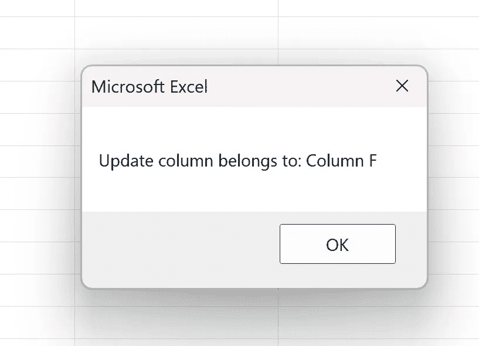
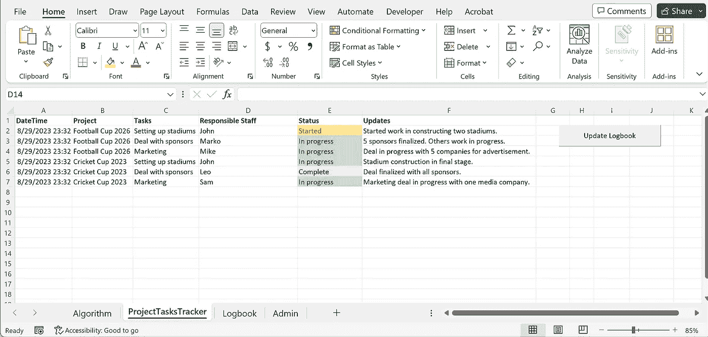
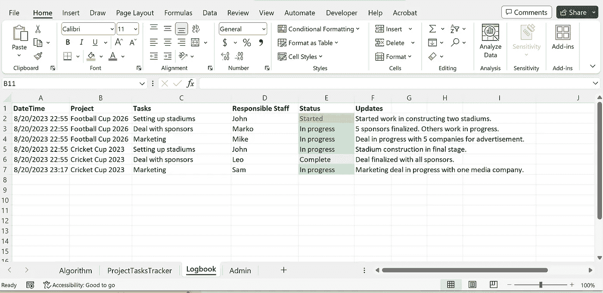
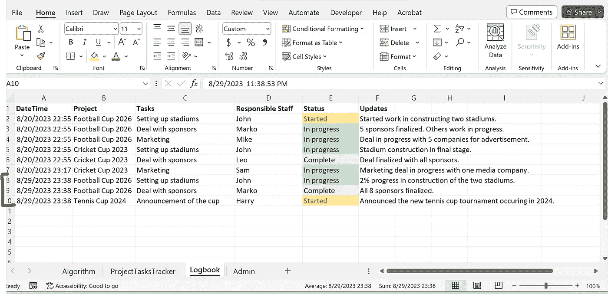

# 在 Excel 中使用 VBA 创建项目更新跟踪器

> 原文：[`towardsdatascience.com/creating-a-project-updates-tracker-in-excel-using-vba-c085e6fe05a8?source=collection_archive---------7-----------------------#2023-09-02`](https://towardsdatascience.com/creating-a-project-updates-tracker-in-excel-using-vba-c085e6fe05a8?source=collection_archive---------7-----------------------#2023-09-02)

## 三个简单步骤来跟踪 Excel 中的项目更新并记录它们

[](https://medium.com/@himalaya.birshrestha?source=post_page-----c085e6fe05a8--------------------------------)[](https://towardsdatascience.com/?source=post_page-----c085e6fe05a8--------------------------------) [Himalaya Bir Shrestha](https://medium.com/@himalaya.birshrestha?source=post_page-----c085e6fe05a8--------------------------------)

·

[关注](https://medium.com/m/signin?actionUrl=https%3A%2F%2Fmedium.com%2F_%2Fsubscribe%2Fuser%2Fba33e6d0d27b&operation=register&redirect=https%3A%2F%2Ftowardsdatascience.com%2Fcreating-a-project-updates-tracker-in-excel-using-vba-c085e6fe05a8&user=Himalaya+Bir+Shrestha&userId=ba33e6d0d27b&source=post_page-ba33e6d0d27b----c085e6fe05a8---------------------post_header-----------) 发表在 [Towards Data Science](https://towardsdatascience.com/?source=post_page-----c085e6fe05a8--------------------------------) ·7 min read·2023 年 9 月 2 日[](https://medium.com/m/signin?actionUrl=https%3A%2F%2Fmedium.com%2F_%2Fvote%2Ftowards-data-science%2Fc085e6fe05a8&operation=register&redirect=https%3A%2F%2Ftowardsdatascience.com%2Fcreating-a-project-updates-tracker-in-excel-using-vba-c085e6fe05a8&user=Himalaya+Bir+Shrestha&userId=ba33e6d0d27b&source=-----c085e6fe05a8---------------------clap_footer-----------)

--

[](https://medium.com/m/signin?actionUrl=https%3A%2F%2Fmedium.com%2F_%2Fbookmark%2Fp%2Fc085e6fe05a8&operation=register&redirect=https%3A%2F%2Ftowardsdatascience.com%2Fcreating-a-project-updates-tracker-in-excel-using-vba-c085e6fe05a8&source=-----c085e6fe05a8---------------------bookmark_footer-----------)

在我们的工作中，我们经常参与多个项目。每个项目涉及若干任务或子任务。跟踪这些任务和项目的状态是一种良好的项目管理实践。这些项目任务或更新可以用于我们自己的知识，也可以在项目会议中共享信息。市场上有许多免费的或商业的项目管理工具，具有类似的目的。然而，我想使用 Visual Basic Applications (VBA) 创建一个简单的 Excel 工具以供自己使用。

VBA 的功能非常广泛。它可以用于自动化数据处理、数据分析和数据可视化。这使得在 Excel 中处理和管理大数据集非常方便。关于 VBA 的一个事实是，VBA 代码库不会像 Python 中的不同包一样定期更新。这在不同的上下文中可以被视为优点和缺点。然而，其中一个优点是，一旦你学习了 VBA，你可以在未来继续使用相同的知识。你不需要不断更新 VBA 的新版本或新功能，因为没有（除非微软决定引入新功能）。

在我之前的帖子中，我使用 VBA 进行了时间序列重采样。

[](/running-python-via-excel-vba-a-case-of-time-series-resampling-fe108610e4e4?source=post_page-----c085e6fe05a8--------------------------------) ## 通过 Excel VBA 运行 Python — 时间序列重采样的案例

### 对使用 VBA、Python 和通过 Python 进行的太阳辐射时间序列重采样的全面评估...

towardsdatascience.com

在这篇帖子中，我将分享我如何使用 Excel 中的 Visual Basic Applications（VBA）为自己创建一个简单的项目更新跟踪工具的三步方法。让我们开始吧。


图片由[Brands&People](https://unsplash.com/@brandsandpeople)提供，来源于[Unsplash](http://www.unsplash.com)。

## **目标**

我旨在创建一个用于跟踪项目更新并记录它们的应用程序。我想有一个工作表，用于输入每个任务的新更新。我还想跟踪记录此信息的时间。通过点击一个按钮，我希望将每个新更新及其记录时间移动到一个单独的工作表中进行日志记录。

为此，我创建了一个包含两个不同工作表的 Excel 文件。第一个工作表名为**ProjectTasksTracker**，第二个工作表名为**Logbook**。这两个工作表都包含相同的标题行，包含六列：DateTime、Project、Tasks、Responsible Staff、Status 和 Updates。

我在 DateTime 列中使用`=NOW()`函数以获取实时信息。在 Status 列中，我允许下拉菜单中有三个选项：Started、In Progress 和 Complete。我还创建了一个名为***Update Logbook***的按钮，以便自动将所有信息记录到 Logbook 工作表中而不产生重复。ProjectTasksTracker 工作表如下所示：


ProjectTasksTracker 工作表的结构。作者插图。

## **编码步骤**

我从在 VBA 模块内创建一个子例程开始。

1.  第一步涉及为文件定义工作簿对象`wb`，以及为**ProjectTasksTracker**工作表和**Logbook**工作表分别定义两个工作表对象`ws1`和`ws2`。代码如下：

```py
'Define workbook and two worksheets.
Dim wb As Workbook
Dim ws1 As Worksheet 'Project tracker worksheet
Dim ws2 As Worksheet 'Logbook worksheet

Set wb = ThisWorkbook
Set ws1 = ThisWorkbook.Sheets("ProjectTasksTracker")
Set ws2 = ThisWorkbook.Sheets("Logbook")
```

第二步涉及编写代码以计算两个工作表中的行数和列数。这也可以手动完成。然而，由于在输入项目更新时行数可能会变化，因此此过程会更新。列数保持固定（6），以保持两个工作表的结构一致。不过，也为了演示目的进行了编码。

在下面的代码片段中，`lr1`基于列 A 计算工作表`ws1`中的行数。`lc1`基于第 1 行计算同一工作表中的列数。

```py
'Count the number of rows and columns in ProjectTasksTracker sheet
Dim lr1, lc1 As Integer
lr1 = ws1.Cells(Rows.Count, “A”).End(xlUp).Row 
lc1 = ws1.Cells(1, Columns.Count).End(xlToLeft).Column 
```

**注意：** 在使用宏时，可以使用对特定单元格的引用。这在处理可能发生变化的数据集时很有用。例如，我创建了一个命名范围**Updates**，以引用**ProjectTasksTracker**工作表中的单元格 F1。如果在其前面添加了一列，Updates 将引用单元格 G1。

**Updates**命名范围在代码中以`update_cell`引用，如下所示。它所属的列号用`update_column`引用，而用字母表示的列号由`update_col`给出。

```py
Dim update_cell As Range
Set update_cell = ws1.Range(“Updates”)

Dim update_column As Integer
update_column = update_cell.Column

Dim update_col As String
update_col = Chr(update_column + 64)
MsgBox "Update column belongs to: Column " & update_col
```



MsgBox 用于显示根据上述代码的更新位置参考。作者插图。

在下一步的代码中，为方便起见，我们将直接引用列号为 6 的更新列。

第三步是此过程中最重要的一步。在此步骤中，我遍历了**ProjectTasksTracker**工作表中的每一行（除标题行和日期时间列外），并执行以下操作，分为三个子步骤：

在**ProjectTasksTracker**工作表的每一行中，我检查了每个任务的更新列是否为空。如果**ProjectTasksTracker**中的某一行有更新，则我计算了**Logbook**工作表中的行数，并将其赋值为一个名为`lr2`的整数。此外，我声明了一个布尔数据类型，名为`valuesMatch`，默认赋值为 False。

b. 接下来，我创建了一个嵌套循环，用于遍历**Logbook**表中的每一行，并检查**ProjectTasksTracker**表中的每一列的内容（定义为范围`rg1`）是否与**Logbook**表中任何一行的每一列的内容（定义为范围`rg2`）匹配。如果`rg1`与`rg2`的任何值之间没有匹配，则意味着**ProjectTasksTracker**表中特定行的更新之前尚未记录到**Logbook**表中。`valuesMatch`将保持为 False。如果**ProjectTasksTracker**表中的某一行内容与**Logbook**表中的任何一行匹配，则意味着该行已被记录。在这种情况下，`valuesMatch`的值将更改为 True。

c. 如果`valuesMatch`在两个 for 循环结束时为 True，则不会进行进一步处理。如果`valuesMatch`在两个 for 循环结束时为 False，则**ProjectTasksTracker**表中的行（包括 Datetime 列）将被复制并粘贴到**Logbook**表中。

步骤 3a、b 和 c 已在下面的代码片段中编写：

## 演示

下面的图表显示了截至 2023 年 8 月 20 日 23:32 的**ProjectTasksTracker**表中的更新。



2023 年 8 月 29 日**ProjectTasksTracker**表中更新的初始视图。由作者插图。

这些更新已经在 2023 年 8 月 20 日当天记录到了**Logbook**表中，如下所示。



截至 2023 年 8 月 20 日的**Logbook**表中的更新。由作者插图。

接下来，在 2023 年 8 月 29 日 23:38，我对**ProjectTasksTracker**表进行了更改，用红色标出（对前两行进行了更改并添加了最后一行）。然后我点击了*Update Logbook*按钮，该按钮分配了上述**Coding Steps**部分描述的宏。


2023 年 8 月 29 日**ProjectTasksTracker**表中所做的更改。由作者插图。

这些新更改随后被记录到**Logbook**表中。底部用红色标记的行是 2023 年 8 月 29 日的更改。之前记录的其他更新保持不变。



新的更新记录在**Logbook**表中。之前的更新保持不变。

## 结论

在这篇文章中，我描述了一些编码步骤，以在 Excel 中创建一个简单的跟踪器来输入项目任务更新并记录它们。如果在**ProjectTasksTracker**表中进行了一些更改或添加并运行宏，这将把这些更新复制并粘贴到**Logbook**表中。然而，如果**ProjectTasksTracker**表没有更改，点击按钮后两个表中的更新将保持不变。

也可以在**日志簿**工作表的末尾创建额外的功能，如按特定顺序对行进行排序。同时，也可以创建一个新文件来记录项目更新，而不是在同一 Excel 文件的单独工作表中记录。在这种情况下，代码中的工作簿和工作表目标需要重新定义。为了保持简洁，这些步骤未包含在本文中。本文中使用的代码和启用宏的 Excel 文件可在此 GitHub [repository](https://github.com/hbshrestha/Data_Analytics)中找到。感谢阅读！
