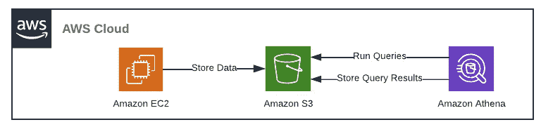
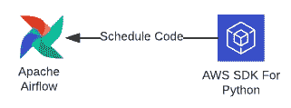

# 使用 AWS 和 Apache Airflow 创建 YouTube 数据管道

> 原文：[`towardsdatascience.com/creating-a-youtube-data-pipeline-with-aws-and-apache-airflow-e5d3b11de9c2`](https://towardsdatascience.com/creating-a-youtube-data-pipeline-with-aws-and-apache-airflow-e5d3b11de9c2)

## 一种利用云服务和作业调度程序有效管理 YouTube 数据的解决方案

[](https://medium.com/@aashishnair?source=post_page-----e5d3b11de9c2--------------------------------)[](https://towardsdatascience.com/?source=post_page-----e5d3b11de9c2--------------------------------) [Aashish Nair](https://medium.com/@aashishnair?source=post_page-----e5d3b11de9c2--------------------------------)

·发布于 [Towards Data Science](https://towardsdatascience.com/?source=post_page-----e5d3b11de9c2--------------------------------) ·阅读时间 12 分钟·2023 年 4 月 20 日

--


图片由 Artem Podrez 提供：[`www.pexels.com/photo/thoughtful-woman-with-earbuds-using-laptop-4492161/`](https://www.pexels.com/photo/thoughtful-woman-with-earbuds-using-laptop-4492161/)

∘ 引言

∘ 问题陈述

∘ 理解数据管道

∘ 理解数据

∘ 第 1 阶段 — 设置 AWS 环境

∘ 第 2 阶段— 使用 Boto3 简化 AWS 操作

∘ 第 3 阶段— 设置 Airflow 管道

∘ 第 4 阶段— 运行管道

∘ 结果分析

∘ 该数据管道的优点

∘ 该数据管道的缺点

∘ 结论

## 引言

YouTube 已经成为信息、思想和观点交流的主要媒介，每天平均上传 300 万个视频。这个视频流媒体平台始终准备好以其多样化的内容为观众提供新的话题，从严肃的新闻故事到轻松的音乐视频。

尽管如此，由于视频内容的持续涌入，很难判断哪些类型的内容最能吸引变化莫测的 YouTube 观众的注意。

通常，哪些类型的视频会获得最多的点赞和评论？来自不同国家的 YouTube 用户是否偏爱不同类型的内容？对特定内容类别的兴趣是否会随着时间而波动？

回答这些问题需要一种系统的方法来收集、处理和存储 YouTube 数据，以便后续分析。

## 问题陈述

项目的目标是创建一个数据管道，收集 5 个 YouTube 用户最多的国家（巴西、印度、印尼、墨西哥和美国）的 YouTube 数据。该管道应每日收集数据，以保持信息的最新。

通过管道收集的数据将用于回答以下问题：

+   各个国家最受欢迎的视频类别是什么？

+   最受欢迎的视频类别会随时间变化吗？如果会，如何变化？

开发和运行管道将需要大量步骤。因此，项目将分为 4 个阶段：

**1\. 设置 AWS 环境**

**2\. 利用 boto3 促进 AWS 操作**

**3\. 设置 Airflow 管道**

**4\. 运行 Airflow 管道**

## 理解数据管道

在项目开始之前，值得讨论管道的设置，其可以通过以下图示表示：


数据管道（由作者创建）

有很多内容，所以让我们来逐一解析。

亚马逊网络服务（AWS）将提供项目所需的所有计算和存储服务，而 Apache Airflow 将调度相关过程以便每天运行。

所有在 AWS 环境中进行的过程将由利用 boto3 的 Python 脚本来实现，boto3 是 AWS 的 Python 软件开发工具包（SDK）。这些脚本将通过 Apache Airflow 的有向无环图（DAG）进行调度，并部署到 EC2 实例中。

存储在 EC2 实例中的 DAG 将使用 YouTube API 拉取数据，并将其存储在 S3 桶中作为 csv 文件。程序随后将使用 Amazon Athena 查询该桶中的数据。查询结果将存储在同一 S3 桶中。

## 理解数据

接下来，了解 API 提供的 YouTube 数据将对其在管道中需要经过的过程提供一些见解。

API 调用的响应包含了在给定时间内某个国家中最多 50 个最受欢迎的视频的信息。原始数据以 JSON 格式呈现：

```py
{
  "kind": "youtube#videoListResponse",
  "etag": etag,
  "nextPageToken": string,
  "prevPageToken": string,
  "pageInfo": {
    "totalResults": integer,
    "resultsPerPage": integer
  },
  "items": [
    video Resource
  ]
}
```

欲了解更多信息，请随时访问 YouTube [文档](https://developers.google.com/youtube/v3/docs/videos/list)。

为了方便后续使用 SQL 查询，这些原始数据将在存储到 AWS 之前转换为 csv 格式。处理后的数据还将省略与此用例无关的特征。

JSON 数据到表格数据的转换总结如下：


JSON 数据转换（由作者创建）

此外，API 调用只能显示单一国家的信息。换句话说，获取 N 个国家的热门视频数据将需要 N 次 API 调用。由于目标是提取 5 个国家的 YouTube 数据，每次迭代将需要进行 5 次 API 调用。

在 AWS S3 中以 csv 文件格式存储数据后，将对数据进行查询，以确定每个国家和日期的最受欢迎的视频类别。

查询输出将包含以下字段：日期、国家、视频类别和视频数量。


查询输出格式（作者创建）

## 阶段 1 — 设置 AWS 环境



AWS 环境（作者创建）

首先创建/部署存储和查询 YouTube 数据所需的 AWS 资源。

**1\. 一个 IAM 用户**

将为这个项目创建一个 IAM 用户。这个用户将获得使用 Amazon EC2、Amazon S3 和 Amazon Athena 的权限。

用户帐户还将提供访问密钥，这些密钥将用于通过 Python 脚本使用这些资源。

**2\. EC2 实例**

我们将设置一个带有 Ubuntu AMI 的 t2-small 实例。这是 Airflow 流水线将被部署的地方。

实例有一个名为“youtube_kp.pem”的密钥对文件，该文件将用于通过安全外壳（SSH）访问 EC2 实例，并通过安全复制协议（SCP）将文件复制到实例中。

此外，将为实例添加一个入站规则，以便用户可以查看 Airflow Web 服务器（用户界面）。

连接到实例后，将进行以下安装：

```py
sudo apt-get update
sudo apt install python3-pip
sudo apt install python3.10-venv
```

接下来，将设置一个名为 `youtube` 的虚拟环境，其中将运行该项目。

```py
python -m venv youtube
```

之后，将在实例中添加一个名为 `airflow` 的目录。这里将存储包括 DAG 在内的所有所需文件。

```py
mkdir airflow
```

**2\. S3 存储桶**

S3 存储桶将存储通过 YouTube API 提取的数据以及执行查询的输出。存储桶将命名为 `youtube-data-storage`。


S3 存储桶（作者创建）

在配置方面需要做的事情很少。存储桶将仅包含两个文件夹，分别名为 `data` 和 `query-output`，这些文件夹将分别包含提取的数据和查询输出。


S3 存储桶文件夹（作者创建）

**3\. AWS Athena**

接下来，将配置 AWS Athena 以查询存储在 `data` 文件夹中的数据，并将输出存储在 `query-output` 文件夹中。默认情况下，它会留下一个没有表的空数据库。


空数据库（作者创建）

首先，在查询编辑器中创建一个名为 `youtube` 的新数据库。

```py
CREATE DATABASE youtube;
```

接下来，创建一个名为 `youtube_videos` 的冰山表。该表的字段应与将加载到 S3 存储桶中的 csv 文件的字段匹配。还应指定将被查询的 csv 文件的位置。

```py
CREATE EXTERNAL TABLE youtube_videos (
  date_of_extraction STRING,
  country STRING,
  video_id STRING,
  video_name STRING,
  channel_id STRING,
  channel_name STRING,
  category STRING,
  view_count INT,
  like_count INT,
  favorite_count INT,
  comment_count INT
)
ROW FORMAT SERDE 'org.apache.hadoop.hive.serde2.OpenCSVSerde'
WITH SERDEPROPERTIES (
  'separatorChar' = ',',
  'quoteChar' = '\"',
  'escapeChar' = '\\'
)
LOCATION 's3://youtube-data-storage/data/'
TBLPROPERTIES ('skip.header.line.count'='1')
```

最后，查询结果位置将设置为设置中的 `youtube-data-storage` 存储桶中的 `query-output` 子目录。


查询结果位置（由作者创建）

## 第 2 阶段——利用 Boto3 促进 AWS 操作


AWS SDK（由作者创建）

设置好 AWS 环境后，我们现在可以专注于开发将促进数据传输和处理的脚本。

首先，我们从 YouTube API 拉取数据，将其转换为表格格式，并使用名为`pull_youtube_data.py`的函数将其存储在 S3 存储桶中，格式为 csv 文件。

> 注意：记住这些 Python 函数的名称可能会很有帮助，因为这将使在配置 Airflow DAG 时更容易跟进。

此函数的唯一参数是 `region_code`，这是表示感兴趣国家的两位数字代码。

例如，`pull_youtube_data('US')` 将返回美国最受欢迎的视频数据。为了获取 5 个国家最受欢迎的视频信息，这个函数需要运行 5 次。

接下来，我们编写一个使用 boto3 分析 S3 存储桶中数据的函数，使用 Amazon Athena。这涉及在 `data` 文件夹中编写 SQL 查询，并将结果存储在 `query-output` 文件夹中。

这些步骤在名为 `run_query` 的函数中执行。

## 第 3 阶段——设置 Airflow 流水线



使用 Apache Airflow 调度 Python 代码（由作者创建）

在创建了 Python 函数之后，我们可以构建 Airflow 流水线，并安排函数每天运行。这一阶段有很多步骤，请做好准备。

1\. 首先，我们编写名为 `youtube_dag.py` 的 Python 脚本，该脚本实例化 DAG，定义任务，并建立任务之间的依赖关系。

简而言之，DAG 被配置为在运行 `run_query` 函数之前执行 `pull_data` 函数 5 次（每个国家一次）。DAG 运行是每天进行的。

现在，我们可以在创建的 EC2 实例中部署 Airflow DAG。

**2\. 使用 SSH 访问 EC2 实例**

```py
ssh -i "youtube_kp.pem" ubuntu@ec2-18-117-190-136.us-east-2.compute.amazonaws.com
```

**3\. 进入创建的虚拟环境**

```py
source youtube/bin/activate
```

**4\. 安装所需的依赖项（包括 Apache Airflow）**

```py
pip install -r requirements.txt
python3 -m pip install cryptography==38.0.4
```

**5\. 指定 airflow 主目录的位置**

在 Ubuntu 上，可以使用以下命令完成：

```py
sudo vim /etc/environment
```

为了将 Airflow 主目录设置为创建的 airflow 文件夹，请将以下行添加到文本编辑器中：

```py
AIRFLOW_HOME = ‘/home/ubuntu/airflow’
```

**6\. 初始化 Airflow 数据库**

```py
airflow init db
```

**7\. 将 YouTube DAG（及其他依赖项）存储在所需位置**

airflow.cfg 文件将指示 DAG 所需的目录以便被检测到。


DAG 文件的位置（由作者创建）

`youtube_dag.py` 和其他所有 Python 文件都使用安全拷贝（SCP）从本地机器复制到此目录。执行复制的命令格式如下。

```py
scp -i </path/key-pair-name.pem> </path/file_to_copy> <username>@<instance_public_dns>:<destination_path>
```

执行 SCP 命令后，`dags` 目录应包含所有必要的文件。


Dags 目录中的文件（由作者创建）

最后，Airflow 应该可以访问创建的 DAG。为确认这一点，我们可以使用以下命令：

```py
airflow dags list
```


代码输出（由作者创建）

## 第四阶段——运行管道

最终，我们已经设置了 AWS 资源、Python 脚本和 Airflow DAG！数据管道现在可以运行了！

我们可以使用 Airflow web 服务器查看工作流。

```py
airflow webserver -p 8080
```

尽管 DAG 被设置为自动运行，但我们可以通过在命令行界面中运行以下命令手动触发第一次迭代：

```py
airflow dags trigger <dag_id>
```

另外，也可以通过点击 web 服务器中的“播放”按钮来触发运行。


手动运行 DAG（由作者创建）

为了更好地理解工作流的组成部分，我们可以查看 DAG 的图形：


DAG 图形（由作者创建）

如图所示，包含巴西、印度尼西亚、印度、墨西哥和美国最受欢迎视频的 YouTube 数据首先通过 YouTube API 提取并存储在 S3 桶中。在所有国家的数据被摄取后，AWS Athena 运行预定义的查询，以确定每个国家在每个给定日期的最受欢迎类别。

此外，所有任务周围的绿色边缘表示任务已成功运行。

> 注意：无需每次都手动触发 DAG；它会按照预定义的计划运行，在此情况下是每天运行一次。

## 检查结果

让我们看看在管道运行两次后（即每个国家两个日期），存储的 CSV 文件和查询输出是什么样的。


S3 桶中的数据目录（由作者创建）

我们可以在 `youtube-data-storage` 桶的数据文件夹中看到 10 个 csv 文件（每个国家和日期一个）。


S3 桶中的 query-output 目录（由作者创建）

`query-output` 目录中有一个包含查询输出的 csv 文件。文件内容如下：


SQL 查询输出（由作者创建）

尽管 YouTube 平台上有许多视频类别，但似乎巴西、印度尼西亚、印度、墨西哥和美国的最受欢迎视频仅归入 4 类：**“音乐”**、**“娱乐”**、**“人物与博客”** 和 **“体育”**。

虽然这是一个有趣的发现，但由于信息仅包括 2 天的内容，因此几乎无法从中得出任何结论。然而，在反复运行 Airflow DAG 后，这些信息将充分捕捉到每个国家的视频观众偏好随时间变化的情况。

## 本数据管道的优势

在这种管道中收集 YouTube 数据有几个好处。

**1\. 利用云技术：** AWS 为我们提供了安全存储数据的手段，并能够以低廉的费用应对任何突发需求。

**2\. 自动化：** 使用部署的 Airflow 管道，YouTube 数据将被提取、转换、存储和查询，而无需人工干预。

**3.** **日志记录：** Airflow 的 Web 服务器使我们能够访问日志，并检查所有 DAG 运行及所有任务的当前状态。

**4.** **可修改：** 可以在 AWS 环境中添加或移除元素，而不会影响当前管道的操作。如果需要，用户可以轻松添加新的数据源、编写新的查询或启动其他 AWS 资源。

## 该数据管道的缺点

尽管如此，构建的管道确实存在一些局限性。

**1\. 通知缺乏：** 目前，数据管道没有集成通知服务来警告用户如果 Airflow DAG 中的任务没有按预期运行。这可能会延迟响应时间。

**2\. 缺乏数据仓库：** 该管道目前通过直接查询 S3 存储桶生成报告，该存储桶充当数据湖。这在当前情况下是可行的，但如果要添加其他数据源，管道将缺乏高效执行复杂连接或聚合所需的工具，以便进行后续分析。

## 结论


照片由 [Prateek Katyal](https://unsplash.com/it/@prateekkatyal?utm_source=medium&utm_medium=referral) 提供，来自 [Unsplash](https://unsplash.com/?utm_source=medium&utm_medium=referral)

*最终*，追踪不同地区随时间变化的最受欢迎的 YouTube 内容是一项巨大的工作，这需要持续收集适合分析的数据。虽然获取这些数据的操作可以在本地基础设施上手动执行，但随着数据量的增加和工作流的复杂化，这种方法变得更加低效和不可行。

因此，对于这种用例，利用云平台和作业调度器是值得的，以确保数据的摄取和处理可以自动化。

使用 AWS，我们可以创建一个可扩展且具有成本效益的解决方案，来收集、转换、存储和处理 YouTube 数据。利用 Apache Airflow，我们能够监控复杂的工作流，并在必要时进行调试。

要查看本项目使用的源代码，请访问 GitHub 仓库：

[](https://github.com/anair123/Building-a-Youtube-Data-Pipeline-With-AWS-and-Airflow?source=post_page-----e5d3b11de9c2--------------------------------) [## GitHub - anair123/Building-a-Youtube-Data-Pipeline-With-AWS-and-Airflow]

### 目前，您无法执行该操作。您在另一个标签页或窗口中登录了。您在另一个标签页或窗口中注销了……

github.com](https://github.com/anair123/Building-a-Youtube-Data-Pipeline-With-AWS-and-Airflow?source=post_page-----e5d3b11de9c2--------------------------------)

感谢阅读！
