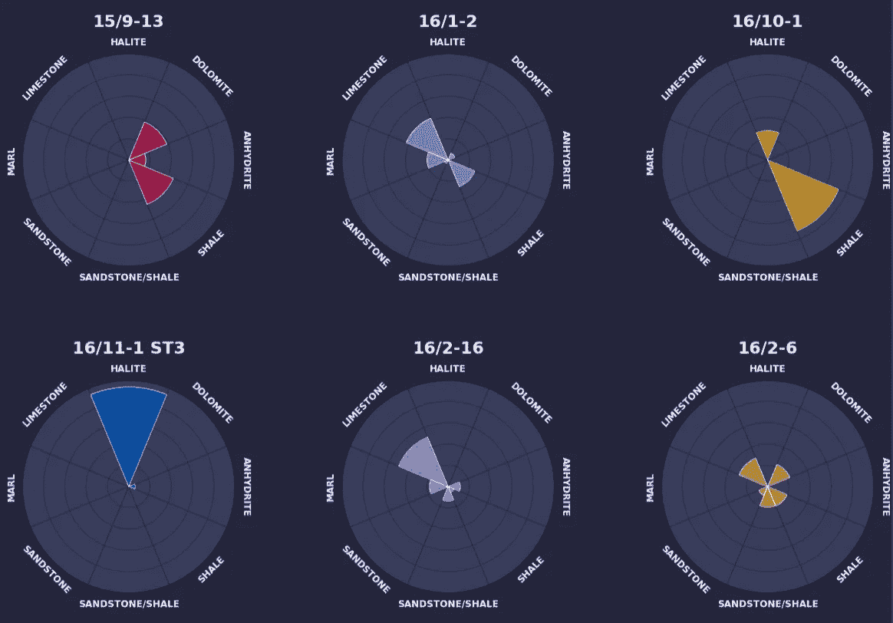
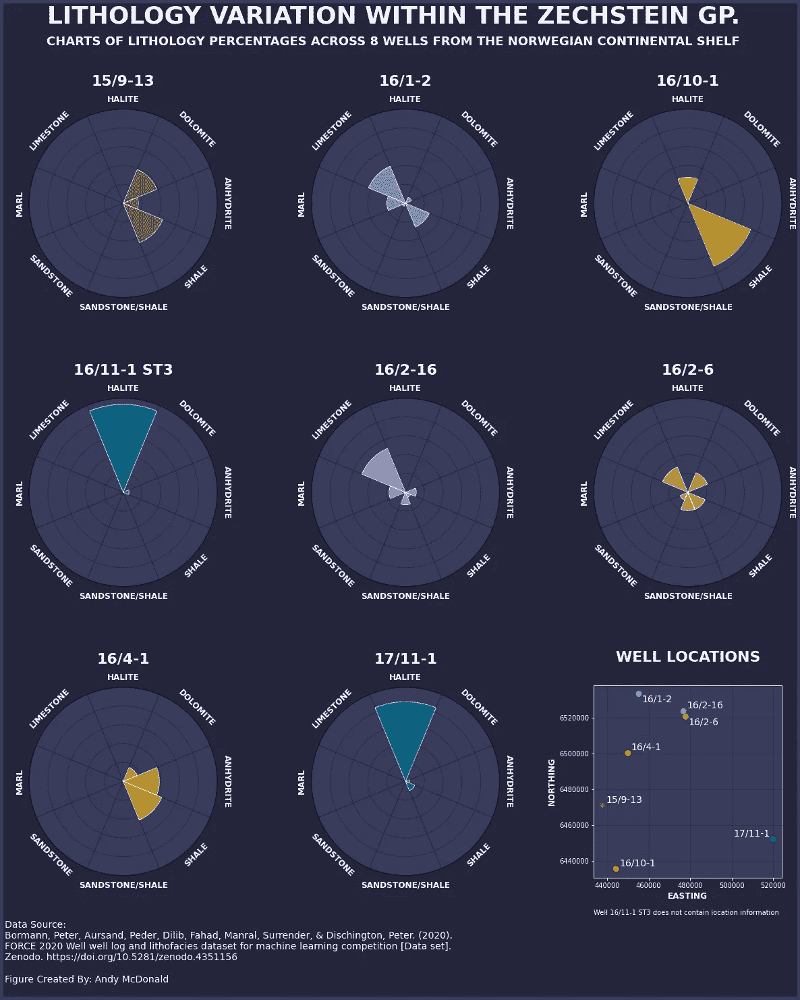
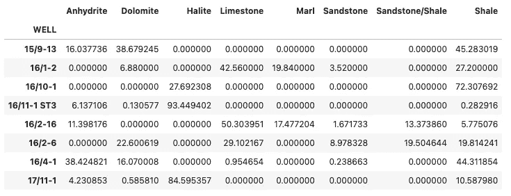
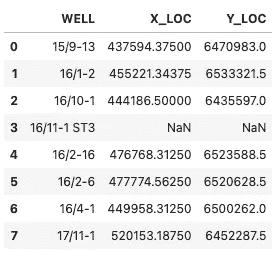
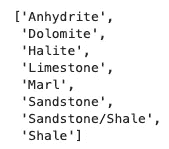
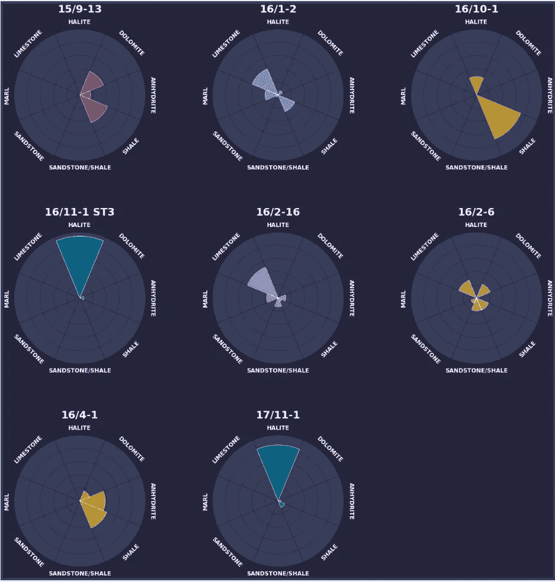
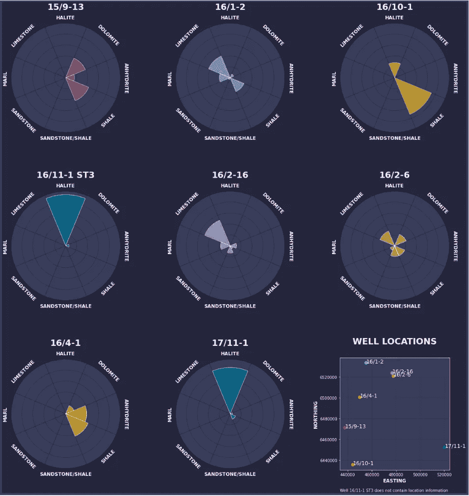
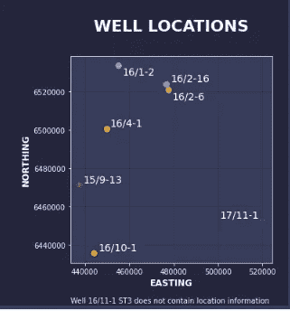

# 使用 Matplotlib 创建信息图

> 原文：[`towardsdatascience.com/creating-an-infographic-with-matplotlib-3c5ece11bedc`](https://towardsdatascience.com/creating-an-infographic-with-matplotlib-3c5ece11bedc)

## 挪威大陆架上的 Zechstein 组地质岩性变化

[](https://andymcdonaldgeo.medium.com/?source=post_page-----3c5ece11bedc--------------------------------)[](https://towardsdatascience.com/?source=post_page-----3c5ece11bedc--------------------------------) [Andy McDonald](https://andymcdonaldgeo.medium.com/?source=post_page-----3c5ece11bedc--------------------------------)

·发布于[Towards Data Science](https://towardsdatascience.com/?source=post_page-----3c5ece11bedc--------------------------------) ·14 分钟阅读·2023 年 7 月 3 日

--



挪威大陆架上的岩性变化的径向条形图。图像由作者提供。

创建令人兴奋和引人注目的数据可视化对于数据工作和数据科学家来说至关重要。它使我们能够以简明的形式向读者提供信息，帮助读者理解数据，而不必查看原始数据值。此外，我们还可以使用图表和图形讲述一个引人入胜的故事，解答关于数据的一个或多个问题。

在 Python 世界中，有众多库可以让数据科学家创建可视化，其中许多人在开始数据科学之旅时最先接触的是[matplotlib](https://matplotlib.org/)。然而，在使用[matplotlib](https://matplotlib.org/)一段时间后，许多人转向其他更现代的库，因为他们认为基础的 matplotlib 图表单调且基础。

通过一点时间、精力、代码以及对[matplotlib](https://matplotlib.org/)功能的理解，我们可以将基础且单调的图表转变为更具吸引力和视觉冲击力的内容。

在我过去的几篇文章中，我专注于如何通过各种样式方法来转换单个图表。如果你想进一步探讨如何改进 matplotlib 数据可视化，可以查看我下面的一些早期文章：

+   [升级你的数据可视化：4 个 Python 库提升你的 Matplotlib 图表](https://medium.com/p/74361bc3b92e)

+   [将你的 Matplotlib 图形变得赛博朋克](https://medium.com/p/96f4d473185d)

+   [使用 Matplotlib 提升你的极坐标条形图](https://medium.com/p/c08e332ec01c)

+   [使用 Matplotlib 创建惊艳的雷达图](https://medium.com/p/6a8e05054ff9)

这些文章主要集中在单个图表及其样式化。在本文中，我们将关注如何使用 matplotlib 构建信息图。

信息图用于将复杂的数据集转化为引人入胜的视觉叙事，这些叙事既信息丰富又吸引读者。它们通过图表、表格和简洁的文本来视觉化数据。将这些元素结合起来，可以提供一个易于理解的主题或问题概述。

在分享了我上一篇关于 [极坐标条形图](https://medium.com/p/c08e332ec01c) 的文章后，我被 Russell Forbes 的一条推文提及，显示出可以在 matplotlib 中制作信息图。

所以，基于这个，我对自己说，为什么不尝试用 matplotlib 构建一个信息图呢。

我确实做了。

以下的信息图是上述结果，它是我们在本文中将要重新创建的内容。



使用 matplotlib 创建的示例信息图。图片由作者提供。

请记住，我们将在本文中构建的信息图可能适合于网页使用或包含在演示文稿中。然而，如果我们打算将这些内容纳入报告或在更正式的场合展示，我们可能需要考虑替代的色彩方案和更专业的风格。

# 信息图的目标

在进行任何数据可视化之前，我们需要了解创建信息图的目的。如果没有这个目的，将很难缩小我们想使用的图表范围和我们想讲述的故事。

在这个例子中，我们将使用一组来自挪威大陆架的井日志岩性测量数据。我们将特别关注以下问题：

***Zechstein 组在这个数据集中岩性的变化是什么？***

这为我们提供了起点。

我们知道我们在寻找岩性数据和 Zechstein 组的数据。

# 导入库和加载数据

首先，我们需要导入一些关键的库。

这些库包括 [pandas](https://pandas.pydata.org/) 用于加载和存储数据，[numpy](https://numpy.org/) 用于进行数学计算以绘制极坐标投影的标签和数据，[matplotlib](https://matplotlib.org/) 用于创建图表，以及 [adjustText](https://adjusttext.readthedocs.io/en/latest/) 以确保散点图上的标签不会重叠。

```py
import pandas as pd
import matplotlib.pyplot as plt
import numpy as np
from adjustText import adjust_text
```

库导入后，我们需要加载我们的数据集。有关该数据集的来源详细信息包含在本文的底部。

我们将加载的第一个数据集是我在 [上一篇文章](https://medium.com/p/94192f5631c0) 中创建的 Zechstein 组岩性组成。

我们可以使用 pandas 的 `read_csv()` 函数来加载这些数据。

```py
df = pd.read_csv('Data/LithologySummary.csv', index_col='WELL')
```

当我们查看我们的数据框时，我们可以看到关于 Zechstein 组在每口井中的岩性信息。



Pandas 数据框，包含穿越 Zechstein Group 的八口井的岩性组成。图片由作者提供。

为了帮助读者更好地理解数据，我们最好提供有关钻探井与 Zechstein Group 交汇处的信息。

我们可以通过使用 `pd.read_csv()` 以相同的方式加载这些数据。然而，这次我们不需要设置索引。

```py
zechstein_well_intersections = pd.read_csv('Data/Zechstein_WellIntersection.csv')
```

当我们查看这个数据框时，会呈现出以下表格，包含井名、井穿越 Zechstein Group 的 X 和 Y 网格位置。



Pandas 数据框，包含钻探穿越 Zechstein Group 的井的 X 和 Y 网格位置。

# 使用 Matplotlib 准备和创建信息图

在开始创建任何图形之前，我们需要创建几个包含关于数据的关键信息的变量。这将使绘制图表的过程更容易。

首先，我们将获得所有可能的岩性列表。这是通过将汇总数据框中的列名转换为列表来完成的。

```py
lith_names = list(df.columns)
```

当我们查看这个列表时，我们会得到以下岩性。



接下来，我们需要决定如何设置信息图中的单独图表。

对于这个数据集，我们有 8 口井，这将用于生成 8 个径向条形图。

我们还希望在同一图形上显示井的位置。所以这给我们 9 个子图。

我们可以通过设置 3 列和 3 行来对图形进行细分。这允许我们创建第一个变量 `num_cols`，表示列数。

然后，我们可以将行数（`num_rows`）变量进行泛化，以便可以在其他数据集上重复使用。在这个示例中，它将获取我们拥有的井数（数据框中的行数），并将其除以我们想要的列数。使用 `np.ceil` 将允许我们将这个数字向上取整，以便在图形上显示所有图表。

```py
# Set the number of columns for your subplot grid
num_cols = 3

# Get the number of wells (rows in the DataFrame)
num_wells = len(df)

# Calculate the number of rows needed for the subplot grid
num_rows = np.ceil(num_wells / num_cols).astype(int)
```

我们需要声明的下一组变量如下：

+   `indexes` : 创建一个从 0 到列表中总项数的数字列表。在我们的例子中，这将生成一个从 0 到 7 的列表，涵盖数据集中的 8 种岩性。

+   `width` : 创建一个基于计算图表中每个条形的宽度的列表，通过将圆的周长除以 `rock_names` 中的岩石类型数量来完成

+   `angles` : 创建一个包含每种岩石类型角度的列表

+   `colours` : 我们希望用来表示每口井的十六进制颜色列表

+   `label_loc` : 创建一个在 0 和 2 * pi 之间均匀间隔的值列表，用于显示岩石类型标签

```py
indexes = list(range(0, len(lith_names)))
width = 2*np.pi / len(lith_names)
angles = [element * width for element in indexes]

colours = ["#ae1241", "#5ba8f7", "#c6a000", "#0050ae", 
"#9b54f3", "#ff7d67", "#dbc227", "#008c5c"]

label_loc = np.linspace(start=0, stop=2 * np.pi, num=len(lith_names))
```

# 使用 Matplotlib 创建信息图

## 添加径向条形图作为子图

在开始创建信息图之前，我们首先需要创建一个图形对象。这是通过调用 `plt.figure()` 来完成的。

为了设置我们的图形，我们需要传入一些参数：

+   `figsize` : 控制信息图的大小。由于行数可能不同，我们可以将行参数设置为行数的倍数。这将防止图表和图形变形。

+   `linewidth` : 控制图形的边框厚度

+   `edgecolor` : 设置边框颜色

+   `facecolor` : 设置图形背景颜色

```py
# Create a figure
fig = plt.figure(figsize=(20, num_rows * 7), linewidth=10,
                 edgecolor='#393d5c', 
                 facecolor='#25253c')
```

接下来，我们需要定义网格布局。有几种方法可以做到这一点，但在这个例子中，我们将使用[GridSpec](https://matplotlib.org/stable/api/_as_gen/matplotlib.gridspec.GridSpec.html)。这将允许我们指定子图的位置以及它们之间的间距。

```py
# Create a grid layout
grid = plt.GridSpec(num_rows, num_cols, wspace=0.5, hspace=0.5)
```

我们现在准备开始添加我们的径向条形图。

为了实现这一点，我们需要遍历岩相组成汇总数据框中的每一行，并使用`add_subplot()`向网格中添加一个轴。由于我们绘制的是径向条形图，我们希望将`projection`参数设置为`polar`。

接下来，我们可以通过调用`ax.bar`将数据添加到图表中。在这个调用中，我们传入：

+   `angles` : 提供条形图在极坐标投影中的位置，也用于定位岩相标签

+   `height` : 使用当前行的百分比值来设置每个条形图的高度

+   `width` : 用于设置条形图的宽度

+   `edgecolor` : 设置径向条形图的边缘颜色

+   `zorder` : 用于设置条形图在图形上的绘制顺序。在这种情况下，它设置为 2，以便位于图形的顶部层

+   `alpha` : 用于设置条形图的透明度

+   `color` : 根据先前定义的颜色列表设置条形图的颜色

然后，我们重复添加条形图的过程，以便为径向条形图添加背景填充。我们可以将高度设置为 100，以便填充整个区域，而不是从表格中设置一个值。

接下来的步骤包括设置标签、副图标题和网格颜色。

对于岩相标签，我们需要创建一个 for 循环，使我们能够将标签放置在极坐标图边缘的正确角度。

在这个循环中，我们需要检查当前角度。如果条形图的角度小于 pi，则从旋转角度中减去 90 度。否则，如果条形图位于圆的下半部分，则将 90 度加到旋转角度中。这将使图表左侧和右侧的标签容易阅读。

```py
# Loop over each row in the DataFrame
for i, (index, row) in enumerate(df.iterrows()):
    ax = fig.add_subplot(grid[i // num_cols, i % num_cols], projection='polar')

    bars = ax.bar(x=angles, height=row.values, width=width, 
                  edgecolor='white', zorder=2, alpha=0.8, color=colours[i])

    bars_bg = ax.bar(x=angles, height=100, width=width, color='#393d5c',
                     edgecolor='#25253c', zorder=1)

    ax.set_title(index, pad=35, fontsize=22, fontweight='bold', color='white')
    ax.set_ylim(0, 100)
    ax.set_yticklabels([])
    ax.set_xticks([])
    ax.grid(color='#25253c')
    for angle, height, lith_name in zip(angles, row.values, lith_names):
        rotation_angle = np.degrees(angle)
        if angle < np.pi:
            rotation_angle -= 90
        elif angle == np.pi:
            rotation_angle -= 90
        else:
            rotation_angle += 90
        ax.text(angle, 110, lith_name.upper(), 
                ha='center', va='center', 
                rotation=rotation_angle, rotation_mode='anchor', fontsize=12, 
                fontweight='bold', color='white')
```

当我们运行此时的代码时，我们会得到包含所有 8 个井的图像。



Matplotlib 图形中显示了来自挪威大陆架的 8 个井的岩相百分比的径向条形图。图片由作者提供。

## 添加散点图作为子图

如上所示，我们在图形的右下角有一个空白区域。这是我们将放置散点图的位置，用于显示井的位置。

为此，我们可以在 for 循环外添加一个新的子图。因为我们希望这是图形上的最后一个图，所以我们需要从 `num_rows` 和 `num_cols` 中减去 1。

然后，我们通过调用 `ax.scatter()` 并传入 `zechstein_well_intersections` 数据框中的 X 和 Y 位置来将散点图添加到坐标轴上。

剩下的代码包括添加 x 轴和 y 轴的标签，设置刻度格式，并将散点图的边缘（坐标轴）设置为白色。

由于我们有一个井没有位置信息，我们可以在散点图上添加一个小脚注，以告知读者这一点。

最后，我们需要将井名添加为标签，以便读者能够理解每个标记是什么。我们可以在 for 循环中实现，并将标签添加到列表中。

```py
# Add the scatter plot in the last subplot (subplot 9)
ax = fig.add_subplot(grid[num_rows - 1, num_cols - 1], facecolor='#393d5c')
ax.scatter(zechstein_well_intersections['X_LOC'], 
zechstein_well_intersections['Y_LOC'], c=colours, s=60)

ax.grid(alpha=0.5, color='#25253c')
ax.set_axisbelow(True)
ax.set_ylabel('NORTHING', fontsize=12, 
                fontweight='bold', color='white')
ax.set_xlabel('EASTING', fontsize=12, 
                fontweight='bold', color='white')

ax.tick_params(axis='both', colors='white')
ax.ticklabel_format(style='plain')
ax.set_title('WELL LOCATIONS', pad=35, fontsize=22, fontweight='bold', color='white')

ax.spines['bottom'].set_color('white')
ax.spines['top'].set_color('white') 
ax.spines['right'].set_color('white')
ax.spines['left'].set_color('white')

ax.text(0.0, -0.2, 'Well 16/11-1 ST3 does not contain location information', ha='left', va='bottom', fontsize=10,
        color='white', transform=ax.transAxes)

labels = []
for i, row in zechstein_well_intersections.iterrows():
    labels.append(ax.text(row['X_LOC'], row['Y_LOC'], row['WELL'], color='white', fontsize=14))
```

当我们运行绘图代码时，我们将得到以下图形。现在可以看到所有八个井都以径向条形图表示，它们的位置由散点图表示。



Matplotlib 径向条形图和散点图都在一个图形中。图片由作者提供。

我们确实有一个需要解决的问题，那就是标签的位置。目前，它们与数据点、坐标轴和其他标签重叠。

我们可以通过使用之前导入的 adjustText 库来解决这个问题。该库将计算出最佳的标签位置，以避免这些问题。

为了使用此功能，我们只需调用 `adjust_text` 并传入我们在之前的 for 循环中创建的标签列表。为了减少重叠，我们可以使用 `expand_points` 和 `expand_objects` 参数。在这个例子中，1.2 的值效果很好。

```py
adjust_text(labels, expand_points=(1.2, 1.2), expand_objects=(1.2, 1.2))
```



使用 adjustText 库之后显示井位置和相关标签的散点图。图片由作者提供。

## 添加脚注和图形标题

为了完成我们的信息图，我们需要给读者提供一些额外的信息。

我们将向图形添加脚注，以显示数据来源和创建者。

为了帮助读者理解信息图的内容，我们可以使用 `plt.suptitle` 添加标题，并使用 `fig.text` 添加副标题。这将立即告诉读者他们在查看图表时可以期待什么。

```py
footnote = """
Data Source: 
Bormann, Peter, Aursand, Peder, Dilib, Fahad, Manral, Surrender, & Dischington, Peter. (2020). FORCE 2020 Well well log and lithofacies dataset for
machine learning competition [Data set]. Zenodo. https://doi.org/10.5281/zenodo.4351156

Figure Created By: Andy McDonald
"""

plt.suptitle('LITHOLOGY VARIATION WITHIN THE ZECHSTEIN GP.', size=36, fontweight='bold', color='white')
plot_sub_title = """CHARTS OF LITHOLOGY PERCENTAGES ACROSS 8 WELLS FROM THE NORWEGIAN CONTINENTAL SHELF"""

fig.text(0.5, 0.95, plot_sub_title, ha='center', va='top', fontsize=18, color='white', fontweight='bold')
fig.text(0.1, 0.01, footnote, ha='left', va='bottom', fontsize=14, color='white')

plt.show()
```

完成绘图代码后，我们将得到如下的 matplotlib 图形。


Matplotlib 信息图显示了挪威大陆架上 Zechstein Group 的岩性变化。图片由作者提供。

我们展示了所有的径向条形图以及每个井的位置。这使读者能够理解井之间的空间变化，从而有助于解释数据中的变异。

例如，15/9–13 井位于该地区的西侧，由白云岩、无水石膏和页岩混合组成。而 17/11–1 井位于该地区的东侧，主要由盐岩组成。这可能与该区域不同的沉积环境有关。

# 信息图的完整代码

信息图的完整代码如下展示，每个主要部分都附有注释。

```py
# Set the number of columns for your subplot grid
num_cols = 3

# Get the number of wells (rows in the DataFrame)
num_wells = len(df)

# Calculate the number of rows needed for the subplot grid
num_rows = np.ceil(num_wells / num_cols).astype(int)

indexes = list(range(0, len(lith_names)))
width = 2*np.pi / len(lith_names)
angles = [element * width for element in indexes]

colours = ["#ae1241", "#5ba8f7", "#c6a000", "#0050ae", "#9b54f3", "#ff7d67", "#dbc227", "#008c5c"]

label_loc = np.linspace(start=0, stop=2 * np.pi, num=len(lith_names))

# Create a figure
fig = plt.figure(figsize=(20, num_rows * 7), linewidth=10,
                 edgecolor='#393d5c', 
                 facecolor='#25253c')

# Create a grid layout
grid = plt.GridSpec(num_rows, num_cols, wspace=0.5, hspace=0.5)

# Loop over each row in the DataFrame to create the radial bar charts per well
for i, (index, row) in enumerate(df.iterrows()):
    ax = fig.add_subplot(grid[i // num_cols, i % num_cols], projection='polar')
    bars = ax.bar(x=angles, height=row.values, width=width, 
                  edgecolor='white', zorder=2, alpha=0.8, color=colours[i])

    bars_bg = ax.bar(x=angles, height=100, width=width, color='#393d5c',
                     edgecolor='#25253c', zorder=1)

    # Set up labels, ticks and grid
    ax.set_title(index, pad=35, fontsize=22, fontweight='bold', color='white')
    ax.set_ylim(0, 100)
    ax.set_yticklabels([])
    ax.set_xticks([])
    ax.grid(color='#25253c')

    #Set up the lithology / category labels to appear at the correct angle
    for angle, height, lith_name in zip(angles, row.values, lith_names):
        rotation_angle = np.degrees(angle)
        if angle < np.pi:
            rotation_angle -= 90
        elif angle == np.pi:
            rotation_angle -= 90
        else:
            rotation_angle += 90
        ax.text(angle, 110, lith_name.upper(), 
                ha='center', va='center', 
                rotation=rotation_angle, rotation_mode='anchor', fontsize=12, 
                fontweight='bold', color='white')

# Add the scatter plot in the last subplot (subplot 9)
ax = fig.add_subplot(grid[num_rows - 1, num_cols - 1], facecolor='#393d5c')
ax.scatter(zechstein_well_intersections['X_LOC'], zechstein_well_intersections['Y_LOC'], c=colours, s=60)
ax.grid(alpha=0.5, color='#25253c')
ax.set_axisbelow(True)

# Set up the labels and ticks for the scatter plot
ax.set_ylabel('NORTHING', fontsize=12, 
                fontweight='bold', color='white')
ax.set_xlabel('EASTING', fontsize=12, 
                fontweight='bold', color='white')

ax.tick_params(axis='both', colors='white')
ax.ticklabel_format(style='plain')
ax.set_title('WELL LOCATIONS', pad=35, fontsize=22, fontweight='bold', color='white')

# Set the outside borders of the scatter plot to white
ax.spines['bottom'].set_color('white')
ax.spines['top'].set_color('white') 
ax.spines['right'].set_color('white')
ax.spines['left'].set_color('white')

# Add a footnote to the scatter plot explaining missing well
ax.text(0.0, -0.2, 'Well 16/11-1 ST3 does not contain location information', ha='left', va='bottom', fontsize=10,
        color='white', transform=ax.transAxes)

# Set up and display well name labels
labels = []
for i, row in zechstein_well_intersections.iterrows():
    labels.append(ax.text(row['X_LOC'], row['Y_LOC'], row['WELL'], color='white', fontsize=14))

# Use adjust text to ensure text labels do not overlap with each other or the data points
adjust_text(labels, expand_points=(1.2, 1.2), expand_objects=(1.2, 1.2))

# Create a footnote explaining data source

footnote = """
Data Source: 
Bormann, Peter, Aursand, Peder, Dilib, Fahad, Manral, Surrender, & Dischington, Peter. (2020). FORCE 2020 Well well log and lithofacies dataset for
machine learning competition [Data set]. Zenodo. https://doi.org/10.5281/zenodo.4351156

Figure Created By: Andy McDonald
"""

# Display overall infographic title and footnote
plt.suptitle('LITHOLOGY VARIATION WITHIN THE ZECHSTEIN GP.', size=36, fontweight='bold', color='white')
plot_sub_title = """CHARTS OF LITHOLOGY PERCENTAGES ACROSS 8 WELLS FROM THE NORWEGIAN CONTINENTAL SHELF"""

fig.text(0.5, 0.95, plot_sub_title, ha='center', va='top', fontsize=18, color='white', fontweight='bold')
fig.text(0.1, 0.01, footnote, ha='left', va='bottom', fontsize=14, color='white')

plt.show()
```

# 摘要

信息图是总结数据并以引人入胜的方式呈现给读者的绝佳方法，而不必担心原始数字。这也是讲述数据故事的好方法。

起初，你可能觉得 matplotlib 不适合制作信息图，但经过一些练习、时间和努力，这完全是可能的。

# 本教程中使用的数据集

训练数据集作为 Xeek 和 FORCE 2020 举办的机器学习竞赛的一部分使用 *(Bormann et al., 2020)*。该数据集在 Creative Commons Attribution 4.0 International 许可下提供。

完整的数据集可以通过以下链接访问：[`doi.org/10.5281/zenodo.4351155`](https://doi.org/10.5281/zenodo.4351155)。

*感谢阅读。在离开之前，你一定要订阅我的内容，并将我的文章送到你的收件箱里。* [***你可以在这里订阅！***](https://andymcdonaldgeo.medium.com/subscribe)

*其次，你可以通过注册会员获得完整的 Medium 体验，并支持数千名其他作家和我。它每月仅需 $5，你可以完全访问所有精彩的 Medium 文章，还有机会通过你的写作赚取收入。*

*如果你通过* [***我的链接***](https://andymcdonaldgeo.medium.com/membership)***注册，*** *你将直接通过你的费用的一部分支持我，并且不会花费你更多。如果你这样做，非常感谢你的支持。*
