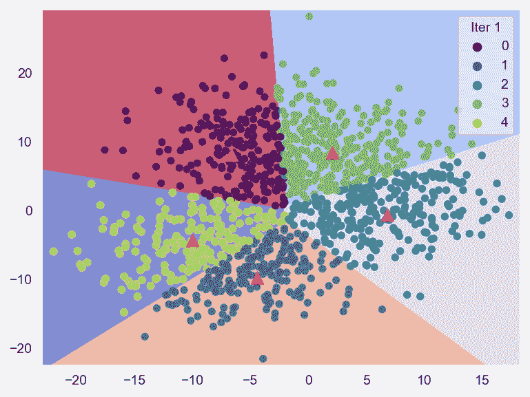

# 使用 Python 和 Sklearn 创建 4 种基于质心的聚类算法的动画

> 原文：[`towardsdatascience.com/creating-animation-to-show-4-centroid-based-clustering-algorithms-using-python-and-sklearn-d397ade89cb3`](https://towardsdatascience.com/creating-animation-to-show-4-centroid-based-clustering-algorithms-using-python-and-sklearn-d397ade89cb3)

## 使用数据可视化和动画来理解 4 种基于质心的聚类算法的过程。

[](https://medium.com/@borih.k?source=post_page-----d397ade89cb3--------------------------------)[](https://towardsdatascience.com/?source=post_page-----d397ade89cb3--------------------------------) [Boriharn K](https://medium.com/@borih.k?source=post_page-----d397ade89cb3--------------------------------)

·发布在 [Towards Data Science](https://towardsdatascience.com/?source=post_page-----d397ade89cb3--------------------------------) ·阅读时间 9 分钟·2023 年 8 月 16 日

--


照片由 [Mel Poole](https://unsplash.com/@melpoole?utm_source=medium&utm_medium=referral) 提供，发布在 [Unsplash](https://unsplash.com/?utm_source=medium&utm_medium=referral)

# 聚类分析

聚类分析是一种有效的机器学习技术，通过数据的相似性和差异性将数据分组。获得的数据组可以用于各种目的，如分割、结构化和决策制定。

要执行聚类分析，有许多基于不同算法的方法可供选择。本文将主要关注基于质心的聚类，这是一种常见且有用的技术。

# 基于质心的聚类

基本上，基于质心的技术通过反复计算来获得最佳的质心（聚类中心），然后将数据点分配给最近的质心。

由于需要进行多次迭代，数据可视化可以用来表达过程中的变化。因此，本文的目的是使用 Python 和 Sklearn 创建动画，以展示基于质心的过程。


本文中的聚类动画示例。图片由作者提供。

Sklearn ([Scikit-learn](https://scikit-learn.org/stable/index.html)) 是一个强大的库，帮助我们高效地执行聚类分析。以下是我们将使用的基于质心的聚类技术。

1.  **K-means 聚类**

1.  **MiniBatch K-means 聚类**

1.  **Bisecting K-means 聚类**

1.  **Mean-Shift 聚类**

开始吧

# **获取数据**

从导入库开始。

```py
import numpy as np
import pandas as pd
import matplotlib.pyplot as plt
import seaborn as sns
```

作为示例，本文将使用生成的数据集，该数据集可以使用 sklearn 的 `make_blobs()` 轻松创建。如果你有自己的数据集，可以跳过此步骤。

```py
from sklearn.datasets import make_blobs
X, y = make_blobs(cluster_std=5, n_samples=1200,
                  n_features=2, random_state=42)
df_X = pd.DataFrame(X)
df_X.dropna(inplace=True)

sns.set_style('darkgrid')
sns.scatterplot(data = df_X, x = 0, y = 1, linewidth=0.5)
plt.show()
```


# 1\. K-Means 聚类

这是一种基于质心的聚类常见方法。过程可以简要解释为：首先定义簇的数量。接下来，一些数据点被随机选择作为初始质心。其他数据点通过最小 [Euclidean](https://en.wikipedia.org/wiki/Euclidean_distance) 距离分配到最近的质心。

然后，通过计算每个簇的数据点的平均值来重新初始化质心。因此，质心将被更新。之后，重复分配和重新初始化的过程。算法将继续迭代，直到达到最佳质心。

现在，让我们开始使用 Python 代码。首先定义一个迭代次数的列表。作为示例，本文将只运行前十次迭代。如果你想更改数量，请随意修改下面的代码。

```py
iter_num = [i+1 for i in range(10)]
iter_num

#[1, 2, 3, 4, 5, 6, 7, 8, 9, 10]
```

定义函数和变量。

```py
def apply_model(model_in, df):
    clus = model_in.fit_predict(df)
    cent = model_in.cluster_centers_
    #decision boundary
    z = model_in.predict(np.c_[xx.ravel(), yy.ravel()])
    z = z.reshape(xx.shape)
    return clus, cent, z

h = 0.02 
x_min, x_max = X[:, 0].min() - 1, X[:, 0].max() + 1
y_min, y_max = X[:, 1].min() - 1, X[:, 1].max() + 1
xx, yy = np.meshgrid(np.arange(x_min, x_max, h), np.arange(y_min, y_max,h))
```

这里是聚类过程。我们可以使用 Sklearn 的 [Kmeans](https://scikit-learn.org/stable/modules/generated/sklearn.cluster.KMeans.html#sklearn.cluster.KMeans)、定义的函数和 Python 的 for 循环来返回三个值：每次迭代中的质心、聚类标签和边界。这些值将保存在列表中以便后续绘图。

```py
from sklearn.cluster import KMeans
df_ = df_X.copy()
centroids = None
keep_cent, keep_clus, keep_Z = [], [], []

for n in iter_num:
    model= KMeans(n_clusters=5, random_state=42, max_iter=n, n_init=1,
                  init=(centroids if centroids is not None else 'k-means++'))
    cluster, centroids, Z = apply_model(model, df_)
    keep_clus.append(cluster)
    keep_cent.append(centroids)
    keep_Z.append(Z)
```

从聚类标签列表中创建一个 DataFrame。

```py
col_name = ['Iter '+str(i) for i in iter_num]

df_iter = pd.DataFrame([list(i) for i in zip(*keep_clus)],columns=col_name)
df_plot = df_.join(df_iter)
df_plot.head()
```


定义一个函数，使用 for 循环来创建散点图。这个函数也将用于可视化本文中的其他聚类技术。请注意，结果将导出为 PNG 文件，以便稍后合并成 GIF 动画。

```py
def plot_clus(names, Z_val, ctds):
    sns.set_style('darkgrid', {'axes.grid' : False})
    for i,z,c in zip(names, Z_val, ctds):
        plt.figure(1)
        plt.clf()
        plt.imshow(z, interpolation='nearest',
               extent=(xx.min(), xx.max(), yy.min(), yy.max()),
               cmap='coolwarm_r',
               aspect='auto',
               origin='lower', alpha=0.6)
        sns.scatterplot(data = df_plot, x = 0, y = 1, hue = i,
                        palette='viridis', linewidth=0.1, alpha=0.8)
        plt.scatter(c[:, 0], c[:, 1], s=92, marker = '^', c='red', lw=0.5)
        plt.xlabel('')
        plt.ylabel('')
        plt.legend(title=i, loc='upper right')
        plt.savefig(i+'.png', bbox_inches = 'tight', dpi=240)
    return plt.show()
```

绘制 K-means 聚类结果。

```py
plot_clus(col_name, keep_Z, keep_cent)
```


展示 K-means 聚类过程的散点图示例。图像来源：作者。

定义一个函数，将图像合并为动画。结果将保存到你的计算机上。

```py
from PIL import Image
import imageio
def animation(names, save_name, time_speed):
    img = []
    for i in names:           # read PNG files
        myImage = Image.open(i+'.png')
        img.append(myImage)
    #export the GIF file, output location can be changed
    imageio.mimsave(save_name, img, duration=time_speed)
```

应用该函数。

```py
animation(col_name, 'animation_KMeans.gif', 0.4)
```

看！ 



动画展示 K-means 聚类过程。图像来源：作者。

动画显示了在第一次迭代中数据点被分配到不同的簇中。然后，由于重新计算，一些数据被分配到相邻的簇中。红色三角形显示了每一步的质心。该过程将持续进行，直到质心达到最佳点。

# 2\. MiniBatch K-means 聚类

与 K-means 聚类处理所有数据点不同，MiniBatch K-means 在每次迭代时随机取小批量数据。这会提高聚类速度，同时返回略有不同的结果。

Sklearn 的 [MiniBatchKmeans](https://scikit-learn.org/stable/modules/generated/sklearn.cluster.MiniBatchKMeans.html#sklearn.cluster.MiniBatchKMeans) 函数可以用于执行 MiniBatch K-means 聚类。我们将使用与之前 K-means 过程相同的步骤。

```py
from sklearn.cluster import MiniBatchKMeans
ctrd = None
keep_cent, keep_clus, keep_Z = [], [], []

for n in iter_num:
    model = MiniBatchKMeans(n_clusters=5, random_state=42,
                            max_iter=n, n_init=1,
                            init=(ctrd if ctrd is not None else 'k-means++'))
    cluster, centroids, Z = apply_model(model, df_)
    keep_clus.append(cluster)
    keep_cent.append(centroids)
    keep_Z.append(Z)

df_iter = pd.DataFrame([list(i) for i in zip(*keep_clus)], columns=col_name)
df_plot = df_.join(df_iter)
plot_clus(col_name, keep_Z, keep_cent)
```


显示 MiniBatch K-means 聚类过程的散点图示例。图像来源：作者。

多亏了前一步定义的函数，我们只需一行代码就可以创建动画。

```py
animation(col_name, 'animation_miniBKMeans.gif', 0.2)
```


显示 MiniBatch K-means 聚类过程的动画。图像来源：作者。

与 K-means 的结果相比，MiniBatch K-means 在第一次迭代中的聚类区域大致接近 K-means 的第五或第六次迭代。因此，可以看出 MiniBatch K-means 返回的聚类速度更快。

# 3\. 二分 K-means 聚类

二分 K-means 算法在第一步应用 K-means 将所有数据点划分为两个簇。之后，算法将选择平方和最大的簇，再次将其划分为两个簇。这个过程会不断重复，直到簇的总数等于 K。

这个算法也可以被视为 [划分层次聚类](https://www.geeksforgeeks.org/ml-hierarchical-clustering-agglomerative-and-divisive-clustering/) 和 K-means 之间的一种混合方法。它是一种处理大量 K 的有效方法。

现在我们将处理代码部分。首先创建一个数字列表，用于 for 循环函数。为了与本文中的其他算法进行比较，我将创建一个从一到五的数字列表。

```py
n_num = [i+1 for i in range(5)]
col_name = ['Iter '+str(i) for i in n_num]
n_num

#[1, 2, 3, 4, 5]
```

接下来，我们将使用 [Sklearn](https://scikit-learn.org/stable/modules/generated/sklearn.cluster.BisectingKMeans.html#sklearn.cluster.BisectingKMeans) 的 `BisectingKMeans` 函数来进行二分 K-means 聚类。

```py
from sklearn.cluster import BisectingKMeans
keep_cent, keep_clus, keep_Z = [], [], []

for n in n_num:
    model = BisectingKMeans(n_clusters=n, random_state=42,
                            max_iter=1, n_init=1)
    cluster, centroids, Z = apply_model(model, df_)
    keep_clus.append(cluster)
    keep_cent.append(centroids)
    keep_Z.append(Z)

df_iter = pd.DataFrame([list(i) for i in zip(*keep_clus)],columns=col_name)
df_plot = df_X.join(df_iter)
plot_clus(col_name, keep_Z, keep_cent)
```


显示二分 K-means 聚类过程的散点图示例。图像来源：作者。

将图表合并成动画。

```py
animation(col_name, 'animation_BisectingKMeans.gif', 0.9)
```


显示二分 K-means 聚类过程的动画。图像来源：作者。

从动画中可以看到，在第一步中，所有数据点被划分为两个簇，在第二步中，平方和较大的簇再次被划分为两个簇。因此，在第三次迭代中我们有了三个簇。二分 K-means 过程将继续，直到簇的数量达到 K 值，即本文中的五个。

# 4\. 均值漂移聚类

均值漂移聚类计算某一半径（带宽）内的局部均值点，并将数据点分配到最高密度的地方。算法会不断计算直到收敛。这种方法也被称为爬山算法，因为它的行为特征。

**注意：** Mean-shift 聚类技术也被认为是一种基于密度的算法 [[link1](https://en.wikipedia.org/wiki/Cluster_analysis#Density-based_clustering), [link2](https://www.geeksforgeeks.org/ml-mean-shift-clustering/)]。

接下来，让我们使用 [Sklearn](https://scikit-learn.org/stable/modules/generated/sklearn.cluster.MeanShift.html) 的 `MeanShift` 函数进行 Mean-shift 聚类。与之前的 K-means 方法相比，主要区别在于不需要定义 K 的数量。顺便提一下，我们需要计算带宽作为 Mean-shift 聚类的参数。

```py
from sklearn.cluster import MeanShift, estimate_bandwidth
keep_cent, keep_clus, keep_Z = [], [], []
bandwidth = estimate_bandwidth(X, quantile=0.2, n_samples=250)

seeds = None 
for n in n_num:
    model = MeanShift(bandwidth = bandwidth,
                      seeds = (seeds if seeds is not None else None),
                      max_iter=1)
    cluster, seeds, Z = apply_model(model, df_)
    keep_clus.append(cluster)
    keep_cent.append(seeds)
    keep_Z.append(Z)

df_iter = pd.DataFrame([list(i) for i in zip(*keep_clus)],columns=col_name)
df_plot = df_.join(df_iter)
plot_clus(col_name, keep_Z, keep_cent)
```


一个展示 Meanshift K-means 聚类过程的散点图示例。图像作者提供。

应用该函数以创建动画。

```py
animation(col_name, 'animation_MeanShift.gif', 1.1)
```

哒哒！！


展示 Meanshift 聚类过程的动画。图像作者提供。

在第一次迭代中，我们可以看到许多质心，因为算法试图在使用的带宽内找到数据点的最高密度。在随后的迭代中，第二次迭代中只有三个质心，而接下来的迭代中只剩下两个质心。这是因为算法不断寻找更高的数据点密度来分配质心。

# 关键要点

总结来说，基于质心的聚类方法旨在找到质心作为数据聚类的参考。为实现这一目标，算法必须重复计算质心以获得最优的质心。这导致了在过程中质心和簇的变化。

本文的目的是应用数据可视化来表达过程，这有助于展示每种算法的工作原理并监控过程中的变化。如果你有任何建议或问题，请随时评论。

感谢阅读。

这里是一些我写的数据可视化文章，你可能会觉得有趣：

+   可视化 3 种 Sklearn 交叉验证：K-Fold、Shuffle & Split 和 Time Series Split ([link](https://medium.com/towards-data-science/visualizing-sklearn-cross-validation-k-fold-shuffle-split-and-time-series-split-a13221eb5a56))

+   9 个使用 Python 的可视化效果比条形图更吸引注意力 (link)

+   8 个使用 Python 处理多时间序列数据的可视化 (link)

+   可视化多重共线性对多重回归模型的影响 ([link](https://medium.com/towards-data-science/visualizing-the-effect-of-multicollinearity-on-multiple-regression-model-8f323ef542a9))

## 参考资料

+   Techniques, A. (n.d.). *使用聚类分析进行决策的好处和挑战是什么？*。《决策中的聚类分析：好处与挑战》。 [`www.linkedin.com/advice/3/what-benefits-challenges-using-cluster-analysis`](https://www.linkedin.com/advice/3/what-benefits-challenges-using-cluster-analysis)

+   Wikimedia Foundation. (2023 年 7 月 24 日). *聚类分析*。《维基百科》。 [`en.wikipedia.org/wiki/Cluster_analysis`](https://en.wikipedia.org/wiki/Cluster_analysis)

+   *示例*。《Scikit》。 (n.d.). [`scikit-learn.org/stable/auto_examples`](https://scikit-learn.org/stable/auto_examples/)

+   Sharma, N. (2023 年 4 月 19 日). *K 均值聚类解析*。《neptune.ai》。 [`neptune.ai/blog/k-means-clustering`](https://neptune.ai/blog/k-means-clustering)

+   GeeksforGeeks. (2023 年 1 月 23 日). *机器学习：小批量 K 均值聚类算法*。《GeeksforGeeks》。 [`www.geeksforgeeks.org/ml-mini-batch-k-means-clustering-algorithm`](https://www.geeksforgeeks.org/ml-mini-batch-k-means-clustering-algorithm)

+   Firdaus, A. (2020 年 5 月 9 日). *二分 K 均值聚类*。《Medium》。 [`medium.com/@afrizalfir/bisecting-kmeans-clustering-5bc17603b8a2`](https://medium.com/@afrizalfir/bisecting-kmeans-clustering-5bc17603b8a2)

+   Yufeng. (2022 年 2 月 22 日). *理解均值漂移聚类及其在 Python 中的实现*。《Medium》。 `towardsdatascience.com/understanding-mean-shift-clustering-and-implementation-with-python-6d5809a2ac40`

+   Wikimedia Foundation. (2023 年 7 月 24 日). *均值漂移*。《维基百科》。 [`en.wikipedia.org/wiki/Mean_shift`](https://en.wikipedia.org/wiki/Mean_shift)
