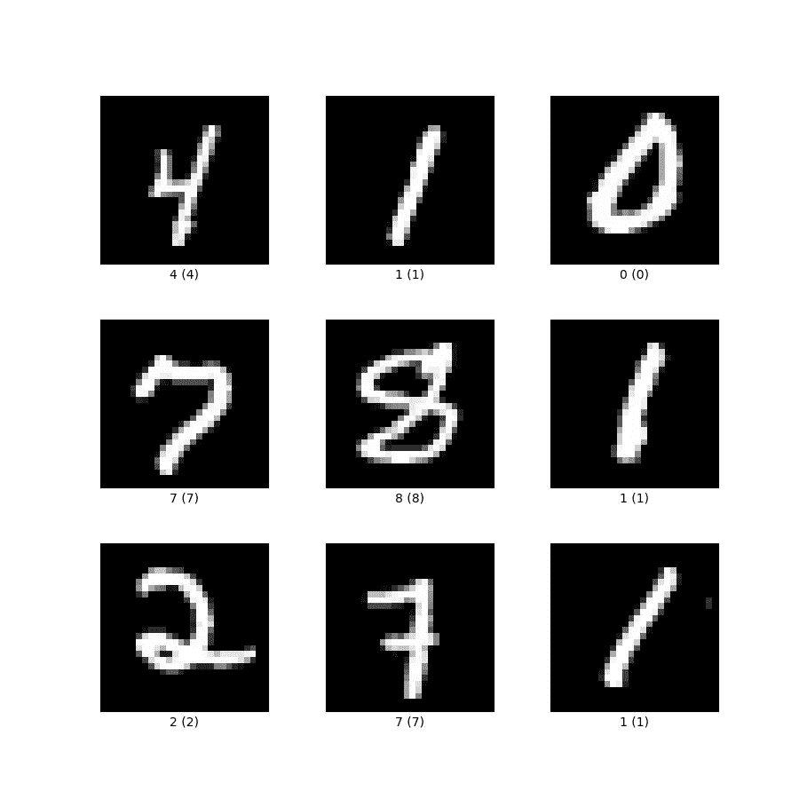

# 在 TensorFlow 中创建自定义损失函数：理解理论与实际应用

> 原文：[`towardsdatascience.com/creating-custom-loss-functions-in-tensorflow-understanding-the-theory-and-practicalities-383a19e387d6?source=collection_archive---------7-----------------------#2023-01-12`](https://towardsdatascience.com/creating-custom-loss-functions-in-tensorflow-understanding-the-theory-and-practicalities-383a19e387d6?source=collection_archive---------7-----------------------#2023-01-12)

## 利用自定义损失函数最大化 TensorFlow 中的模型性能

[](https://marcosanguineti.medium.com/?source=post_page-----383a19e387d6--------------------------------)[](https://towardsdatascience.com/?source=post_page-----383a19e387d6--------------------------------) [Marco Sanguineti](https://marcosanguineti.medium.com/?source=post_page-----383a19e387d6--------------------------------)

·

[关注](https://medium.com/m/signin?actionUrl=https%3A%2F%2Fmedium.com%2F_%2Fsubscribe%2Fuser%2F33141be0f14d&operation=register&redirect=https%3A%2F%2Ftowardsdatascience.com%2Fcreating-custom-loss-functions-in-tensorflow-understanding-the-theory-and-practicalities-383a19e387d6&user=Marco+Sanguineti&userId=33141be0f14d&source=post_page-33141be0f14d----383a19e387d6---------------------post_header-----------) 发布于 [Towards Data Science](https://towardsdatascience.com/?source=post_page-----383a19e387d6--------------------------------) ·7 分钟阅读·2023 年 1 月 12 日[](https://medium.com/m/signin?actionUrl=https%3A%2F%2Fmedium.com%2F_%2Fvote%2Ftowards-data-science%2F383a19e387d6&operation=register&redirect=https%3A%2F%2Ftowardsdatascience.com%2Fcreating-custom-loss-functions-in-tensorflow-understanding-the-theory-and-practicalities-383a19e387d6&user=Marco+Sanguineti&userId=33141be0f14d&source=-----383a19e387d6---------------------clap_footer-----------)

--

[](https://medium.com/m/signin?actionUrl=https%3A%2F%2Fmedium.com%2F_%2Fbookmark%2Fp%2F383a19e387d6&operation=register&redirect=https%3A%2F%2Ftowardsdatascience.com%2Fcreating-custom-loss-functions-in-tensorflow-understanding-the-theory-and-practicalities-383a19e387d6&source=-----383a19e387d6---------------------bookmark_footer-----------)

由[Fotis Fotopoulos](https://unsplash.com/@ffstop?utm_source=medium&utm_medium=referral)在[Unsplash](https://unsplash.com/?utm_source=medium&utm_medium=referral)拍摄的照片

## 介绍

在机器学习中，损失函数是训练过程中的一个关键组成部分。它衡量模型预测与真实输出之间的差异，并用于更新模型的参数，以最小化这一差异。虽然许多常用的损失函数都内置于 TensorFlow 中，但在某些情况下，你可能需要定义一个自定义损失函数，以更好地适应模型的具体要求。

[## 模块：tf.keras.losses | TensorFlow v2.11.0

### 内置损失函数。

www.tensorflow.org](https://www.tensorflow.org/api_docs/python/tf/keras/losses?source=post_page-----383a19e387d6--------------------------------)

这对于处理不平衡的数据集、融入领域知识以及其他特定用例可能非常有用。本文将探讨自定义损失函数的理论、使用自定义损失函数的好处以及在 TensorFlow 中创建它们的实际操作。

## 理解损失函数的作用

在机器学习中，训练模型的目标是最小化模型预测与真实输出之间的差异。这种差异通过损失函数来衡量，损失函数也称为成本函数。损失函数是一个标量函数，用于比较模型的预测输出与真实输出。最常用的损失函数有均方误差、平均绝对误差和交叉熵。

[## 损失函数 - 维基百科

### 在数学优化和决策理论中，损失函数或成本函数（有时也称为误差函数）是用于衡量预测与真实结果之间差异的工具。

en.wikipedia.org](https://en.wikipedia.org/wiki/Loss_function?source=post_page-----383a19e387d6--------------------------------)

## 损失函数如何驱动优化？

优化算法使用损失函数的值来调整模型的参数，以使预测输出与真实输出之间的差异最小化。在训练阶段，模型会接收一组输入及相应的真实输出，模型的参数被调整以最小化损失。这个过程是迭代的，直到损失函数达到最小值或达到最大迭代次数时停止。

[](https://en.wikipedia.org/wiki/Gradient_descent?source=post_page-----383a19e387d6--------------------------------) [## 梯度下降 - 维基百科

### 在数学中，梯度下降（也常称为最陡下降）是一种一阶迭代优化算法…

en.wikipedia.org](https://en.wikipedia.org/wiki/Gradient_descent?source=post_page-----383a19e387d6--------------------------------)

## 自定义损失函数的必要性

虽然 TensorFlow 提供的内置损失函数足以应对许多情况，但可能会出现需要自定义损失函数的情况。最常见的原因之一是处理不平衡数据集。在这种情况下，数据可能包含大量某一类别的示例和少量另一类别的示例。这可能导致一个高度准确但对少数类别表现不佳的模型。在这种情况下，可以使用优化召回率或精确度的自定义损失函数来平衡准确性和对少数类别的性能之间的权衡。

Gradient Descent (C1W2L04) — [来源](https://www.youtube.com/@Deeplearningai)

使用自定义损失函数的另一个原因是将领域知识融入模型。例如，在某些情况下，模型的预测需要满足特定的约束，如非负或具有特定范围。可以定义自定义损失函数来强制执行这些约束。此外，还有一些特定的研究领域，如目标检测和语义分割，有其特定的损失函数，如带掩码的交叉熵、Dice 损失、焦点损失等。

## 在 TensorFlow 中创建自定义损失函数

TensorFlow 提供了多个工具用于创建自定义损失函数，包括`tf.keras.losses`模块。要在 TensorFlow 中创建自定义损失函数，你可以继承`tf.keras.losses.Loss`类并定义`call`方法。`call`方法应接收预测输出和真实输出，并返回计算的损失。也可以将额外的参数传递给自定义损失函数的构造函数，以便在损失计算中使用。

还可以使用 TensorFlow 库中的函数来创建自定义损失函数，例如使用数学运算或使用`tf.nn`模块。定义自定义损失函数时，一个重要的点是如何使其可微分，因为优化器将使用损失对模型参数的梯度来更新模型。

创建自定义损失函数时一个常见的陷阱是忘记正确处理输入被批处理的情况，这意味着输入是矩阵而不是单一值，因此数学操作也应适用于矩阵维度。

还需注意，自定义损失函数的类应实现`__init__`、`__call__`和`get_config`方法，这是在 Keras 中创建子类的标准方式。

## 让我们从一个示例开始

下面是一个在 TensorFlow 中创建自定义损失函数以处理不平衡数据集的示例。该示例是一个二分类问题，目标是将数据点分类为类 A 或类 B，其中类 A 是少数类。

我们将创建的自定义损失函数将是加权交叉熵损失，它为少数类分配更高的权重，以平衡少数类的准确性和性能之间的权衡。

```py
import tensorflow as tf

class WeightedCrossEntropy(tf.keras.losses.Loss):
    def __init__(self, weight, epsilon=1e-7, name="weighted_cross_entropy", **kwargs):
        super().__init__(name=name, **kwargs)
        self.weight = weight
        self.epsilon = epsilon

    def call(self, y_true, y_pred):
        y_pred = tf.clip_by_value(y_pred, self.epsilon, 1 - self.epsilon)
        loss = -(self.weight * y_true * tf.math.log(y_pred) + (1 - y_true) * tf.math.log(1 - y_pred))
        return tf.math.reduce_mean(loss)

    def get_config(self):
        config = {
            'weight': self.weight,
            'epsilon': self.epsilon
        }
        base_config = super().get_config()
        return {**base_config, **config}
```

在这里，我们将 `tf.keras.losses.Loss` 类进行子类化，并定义一个 `call` 方法，该方法接受 y_true 和 y_pred，分别表示真实标签和预测标签。该方法通过使用初始化时传递的权重变量来计算加权交叉熵损失，并返回损失的均值。

要使用这个自定义损失函数，你可以在定义模型时将其实例传递给模型的 `compile` 方法。

```py
model = tf.keras.Sequential()
# add layers to your model
...
model.compile(optimizer='adam', loss=WeightedCrossEntropy(weight=0.8), metrics=['accuracy'])
```

在这里，我们在编译模型时传递了一个权重为 0.8 的 WeightedCrossEntropy 对象，它将作为训练期间的损失函数使用。

需要注意的是，权重参数应根据训练数据集中少数类和多数类的相对频率来设置。

请记住，这只是一个示例，你可能需要根据你的具体用例调整它，它还应该与过采样、欠采样或合成数据生成等技术结合使用，以便正确处理不平衡数据。



MNIST 手写数字数据库的一些样本— [来源](https://www.tensorflow.org/datasets/catalog/mnist)

这是一个如何在使用 MNIST 数据集的数字分类问题中使用我们之前创建的自定义损失函数的示例。首先，我们将使用 TensorFlow 内置的 `tf.keras.datasets` 模块加载 MNIST 数据集，并将其分为训练集和测试集。接下来，我们将定义一个简单的模型来分类 MNIST 数据集中的数字。现在，我们将根据训练数据集中少数类和多数类的相对频率确定自定义损失函数的权重。在这种情况下，少数类是 ‘0’，多数类是 ‘1’ 到 ‘9’。

```py
import tensorflow as tf

class WeightedCrossEntropy(tf.keras.losses.Loss):
    def __init__(self, weight, epsilon=1e-7, name="weighted_cross_entropy", **kwargs):
        super().__init__(name=name, **kwargs)
        self.weight = weight
        self.epsilon = epsilon

    def call(self, y_true, y_pred):
        y_pred = tf.clip_by_value(y_pred, self.epsilon, 1 - self.epsilon)
        loss = -(self.weight * y_true * tf.math.log(y_pred) + (1 - y_true) * tf.math.log(1 - y_pred))
        return tf.math.reduce_mean(loss)

    def get_config(self):
        config = {
            'weight': self.weight,
            'epsilon': self.epsilon
        }
        base_config = super().get_config()
        return {**base_config, **config}

(x_train, y_train), (x_test, y_test) = tf.keras.datasets.mnist.load_data()

# Normalize data
x_train = x_train.astype('float32') / 255
x_test = x_test.astype('float32') / 255

# one-hot encode the target variables
y_train = tf.keras.utils.to_categorical(y_train, 10)
y_test = tf.keras.utils.to_categorical(y_test, 10)

model = tf.keras.Sequential([
    tf.keras.layers.Flatten(input_shape=(28, 28)),
    tf.keras.layers.Dense(256, activation='relu'),
    tf.keras.layers.Dropout(0.2),
    tf.keras.layers.Dense(10, activation='softmax')
])

# Determine the weight for the custom loss function
y_train_integers = tf.argmax(y_train,axis=-1)
weight = 1 - y_train_integers.numpy().tolist().count(0) / len(y_train_integers)

loss_fn = WeightedCrossEntropy(weight=weight)
model.compile(optimizer='adam', loss=loss_fn, metrics=['accuracy'])

# Train the model
model.fit(x_train, y_train, epochs=5, batch_size=64)
```

然后，我们定义自定义损失函数并将权重参数传递给它。最后，我们编译我们的模型，指定自定义损失函数、优化器和评估指标，然后使用训练数据训练我们的模型。需要记住的是，这只是如何在 TensorFlow 中使用自定义损失函数的一个示例，根据你要解决的问题，可能还有许多其他方法可以使用它。此外，重要的是评估模型在测试集上的表现，并解释结果，并与处理不平衡数据集的其他技术进行比较。

## 结论

自定义损失函数可以成为提升机器学习模型性能的强大工具，特别是在处理不平衡数据集或融入领域知识时。虽然创建自定义损失函数可能看起来令人畏惧，但 TensorFlow 提供了多种工具和库来简化这一过程。通过理解自定义损失函数的理论和实践，你将能够充分应对遇到的各种挑战。

## 加入 Medium 会员

如果你喜欢这篇文章并希望继续了解更多相关内容，我邀请你通过这个[链接](https://marcosanguineti.medium.com/membership)加入 Medium 会员。

[## 使用我的推荐链接加入 Medium - Marco Sanguineti](https://marcosanguineti.medium.com/membership?source=post_page-----383a19e387d6--------------------------------)

### 阅读 Marco Sanguineti（以及 Medium 上其他成千上万位作者）的每一个故事。对文化的投资是最好的……

[marcosanguineti.medium.com](https://marcosanguineti.medium.com/membership?source=post_page-----383a19e387d6--------------------------------)

成为会员后，你将能访问更多高质量内容，独享会员专属故事，还能支持像我这样的独立作家和创作者。此外，作为会员，你还可以高亮你喜欢的段落，保存故事以供日后阅读，并获得个性化的阅读推荐。立即注册，让我们继续一起探索这一主题和其他主题。

感谢您的支持！下次见，

Marco
