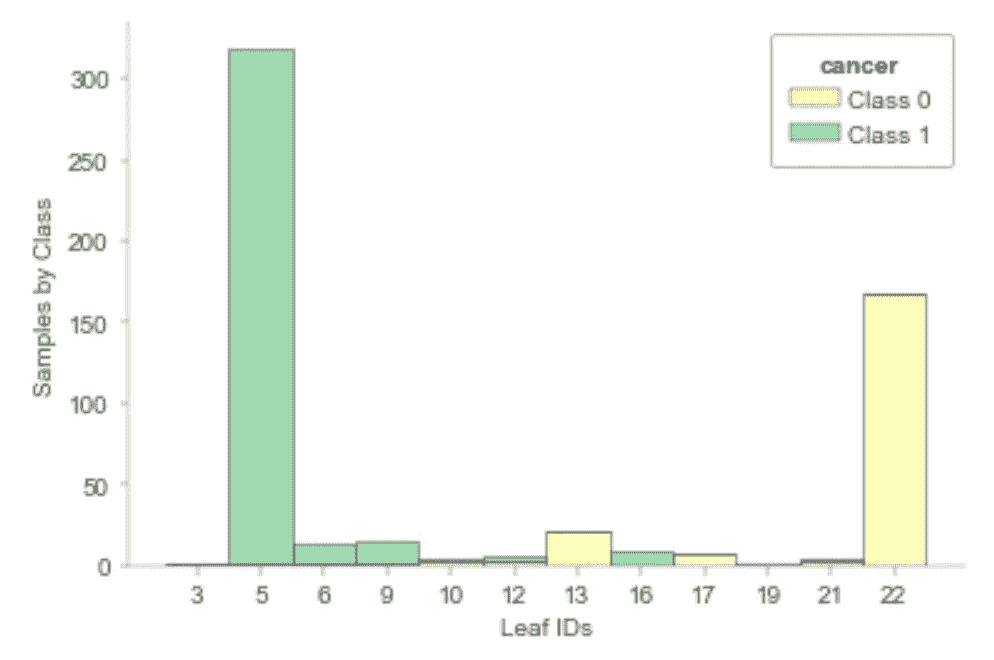

# 使用 dtreeviz 创建令人惊叹的决策树可视化

> 原文：[`towardsdatascience.com/creating-incredible-decision-tree-visualizations-with-dtreeviz-820c6547b6a9`](https://towardsdatascience.com/creating-incredible-decision-tree-visualizations-with-dtreeviz-820c6547b6a9)

## 如何使用这个有用的库可视化决策树模型

[](https://amolmavuduru.medium.com/?source=post_page-----820c6547b6a9--------------------------------)[](https://towardsdatascience.com/?source=post_page-----820c6547b6a9--------------------------------) [Amol Mavuduru](https://amolmavuduru.medium.com/?source=post_page-----820c6547b6a9--------------------------------)

·发布于 [Towards Data Science](https://towardsdatascience.com/?source=post_page-----820c6547b6a9--------------------------------) ·阅读时长 6 分钟·2023 年 6 月 21 日

--


图片由作者提供，使用 dtreeviz 创建。

在模型可解释性方面，决策树是一些最直观和可解释的模型。每个决策树模型都可以解释为一组人类可解释的规则。能够可视化决策树模型对于模型的可解释性非常重要，并且可以帮助利益相关者和业务经理对这些模型建立信任。

幸运的是，我们可以使用 dtreeviz 库轻松地可视化和解释决策树。**在本文中，我将演示如何使用 dtreeviz 可视化用于回归和分类的基于树的模型。**

# 安装 dtreeviz

你可以使用以下命令通过 pip 轻松安装 dtreeviz：

```py
pip install dtreeviz
```

有关依赖项和可能需要安装的额外库的详细列表，请参阅 [这个 GitHub 仓库](https://github.com/parrt/dtreeviz)。

# 可视化回归树

在本节中，我们将对 [糖尿病数据集](https://archive.ics.uci.edu/dataset/34/diabetes) 训练一个决策树回归器。请注意，你可以在这个 GitHub 仓库中找到本教程的所有代码。请记住，我使用 Jupyter 作为运行 Python 代码的环境。你可以在 [这个 GitHub 仓库](https://github.com/AmolMavuduru/DtreevizTutorial) 中找到我为本教程编写的所有代码。

## 导入库

在下面的代码块中，我简单地导入了包括 scikit-learn 决策树模块和 dtreeviz 在内的几个常用库。

```py
import numpy as np
import pandas as pd
from sklearn.tree import DecisionTreeClassifier, DecisionTreeRegressor
import dtreeviz
```

## 读取数据

糖尿病数据集可在 scikit-learn 中获取，因此我们可以使用以下代码导入数据集，并将特征和目标值存储在名为 X 和 y 的 numpy 数组中。

```py
from sklearn.datasets import load_diabetes

diabetes_data = load_diabetes()
X = pd.DataFrame(data = diabetes_data['data'], columns=diabetes_data['feature_names'])
y = diabetes_data['target']
```

## 训练决策树模型

为了使树更容易可视化，我们可以限制决策树的最大深度，并按如下方式对数据进行训练。

```py
dtree_reg = DecisionTreeRegressor(max_depth=3)
dtree_reg.fit(X, y)
```

## 可视化树

dtreeviz 的一个关键特点是能够可视化决策树模型。使用下面的代码，我们可以创建一个有趣的决策树可视化，并在每个节点处视觉上描绘决策边界。

```py
viz_model = dtreeviz.model(dtree_reg,
                           X_train=X, y_train=y,
                           feature_names=list(X.columns),
                           target_name='diabetes')
viz_model.view()
```


糖尿病回归树可视化。图像由作者使用 dtreeviz 创建。

注意上面的可视化还给出了每个节点的决策边界和特征空间，以及每个叶节点的回归输出和样本大小。

## 可视化叶节点分布

dtreeviz 提供的另一个有用功能是可视化叶节点分布。决策树的叶节点包含根据每组条件预测的实际值。使用**rtree_leaf_distributions**函数，我们可以为回归树创建这种可视化。

```py
import matplotlib.pyplot as plt
from mpl_toolkits.mplot3d import Axes3D
%matplotlib inline

viz_model.rtree_leaf_distributions()
```


根据上面的可视化，我们可以看到决策树可以预测 268.9、208.6、176.9、137.7、154.7、274.0、83.4 或 108.8 作为糖尿病这一目标变量的值。水平分散的点表示糖尿病目标变量值的分布，小黑线表示用于预测该叶节点的平均值。理想情况下，叶节点的分布应具有低方差，以便我们对用于预测的平均值有更高的信心。

## 可视化叶节点大小

我们还可以可视化叶节点的大小，即每个叶节点的样本数量，如下面的函数所示。

```py
viz_model.leaf_sizes()
```


根据上面的图，我们可以看到每个叶节点的样本数量。这种可视化是评估我们对回归树预测的信心的良好工具。

# 可视化分类树

我们还可以使用 dtreeviz 可视化分类树，且这些可视化与回归树创建的效果略有不同。在本节中，我们将使用[乳腺癌威斯康星数据集](https://www.kaggle.com/datasets/uciml/breast-cancer-wisconsin-data)来训练和可视化决策模型。

## 读取数据

乳腺癌威斯康星数据集在 scikit-learn 中可用，因此我们可以使用下面的代码加载它。

```py
from sklearn.datasets import load_breast_cancer

cancer_data = load_breast_cancer()
X = pd.DataFrame(data = cancer_data['data'], columns=cancer_data['feature_names'])
y = cancer_data['target']
```

## 训练决策树模型

如往常一样，使用 scikit-learn 训练决策树模型是简单明了的。我们还可以对最大树深度施加约束，以便更容易可视化决策树。

```py
dtree_clf = DecisionTreeClassifier(max_depth=4)
dtree_clf.fit(X, y)
```

## 可视化决策树

我们可以使用回归树部分的完全相同的函数来可视化分类树。不过，可视化效果会略有不同。

```py
viz_model = dtreeviz.model(dtree_clf,
                           X_train=X, y_train=y,
                           feature_names=list(X.columns),
                           target_name='cancer')
viz_model.view()
```


癌症分类决策树。

注意，以上的分类树可视化与上一节的回归树可视化不同。我们看到的不是每个节点处选定特征和目标的散点图，而是显示每个节点处类别分布的彩色直方图。

## 可视化叶子分布

我们还可以使用相同的函数可视化回归树的叶子分布的类别分布。

```py
 viz_model.ctree_leaf_distributions()
```



分类树的叶子分布图。图像由作者使用 dtreeviz 创建。

每个叶子都有一个堆叠条形图，展示了该叶子中样本的类别标签分布。大多数叶子中的样本明显属于一个类别，这很好，有助于我们对模型的预测建立信心。

## 可视化特征空间

我们还可以使用以下函数可视化分类器的特征空间。

```py
viz_model.ctree_feature_space()
```


上面的特征空间图展示了分类树的训练准确率，以及两个特征的散点图和可以用来区分两个类别的线性决策边界。

# 摘要

当涉及到可视化基于树的模型时，dtreeviz 是一个强大的库，提供了几个有用的可视化函数。我只介绍了这个库中提供的部分函数，还有许多其他功能，你可以在 [dtreeviz GitHub 仓库](https://github.com/parrt/dtreeviz) 中阅读。像往常一样，你可以在 [我的 GitHub](https://github.com/AmolMavuduru/DtreevizTutorial) 上找到这篇文章的所有代码。

# 加入我的邮件列表

加入我的 [邮件列表](https://mailchi.mp/e8dd82679724/amols-data-science-blog) 来获取关于数据科学内容的更新。当你 [注册](https://mailchi.mp/e8dd82679724/amols-data-science-blog) 时，你还会获得我的免费**逐步解决机器学习问题指南**！你也可以在 [Twitter](https://twitter.com/amolmavuduru1) 上关注我，获取内容更新。

在此过程中，考虑 [加入 Medium 社区](https://amolmavuduru.medium.com/membership)，阅读成千上万其他作者的文章。

# 来源

1.  Terence Parr, [dtreeviz: 决策树可视化](https://github.com/parrt/dtreeviz), (2023), GitHub。
