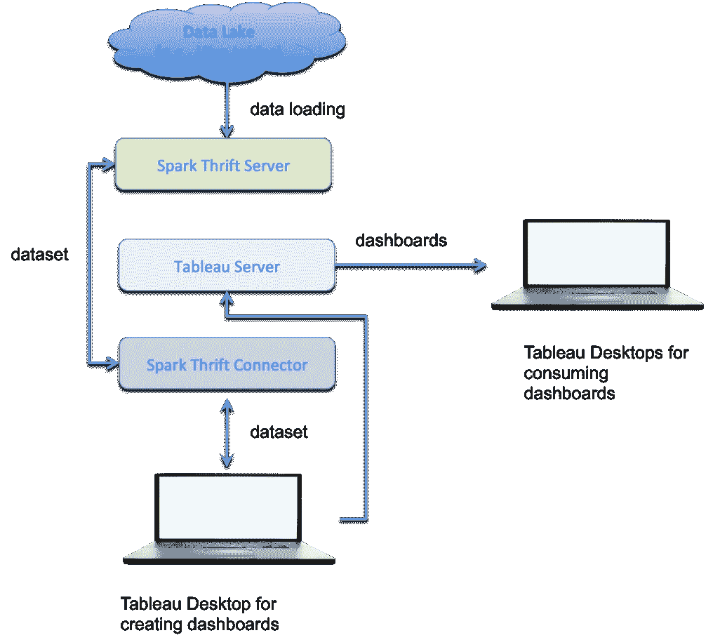
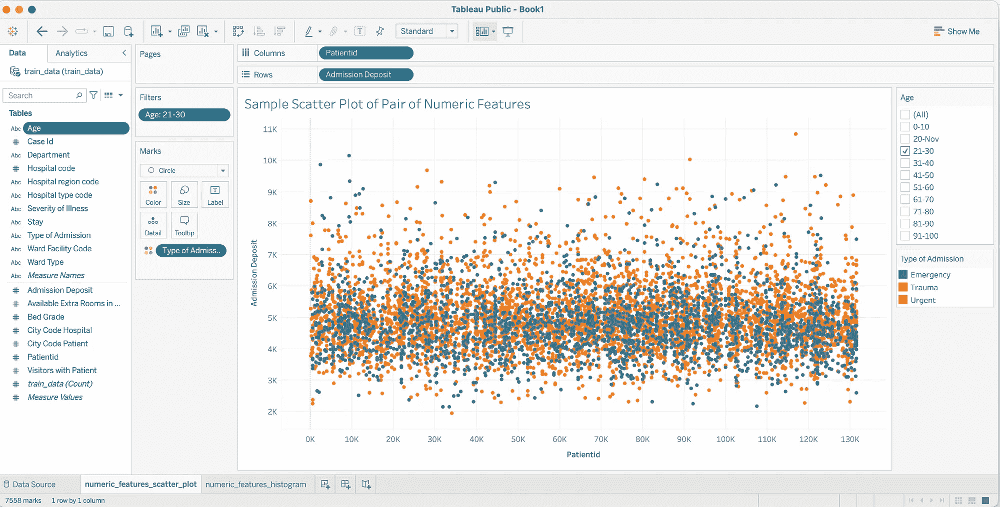
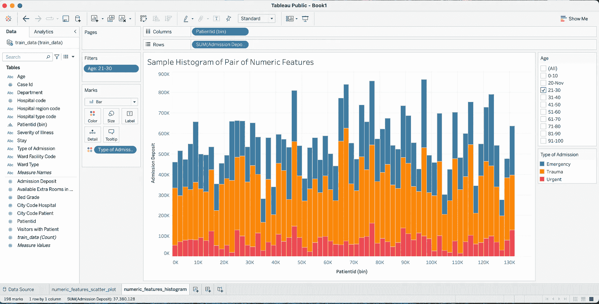
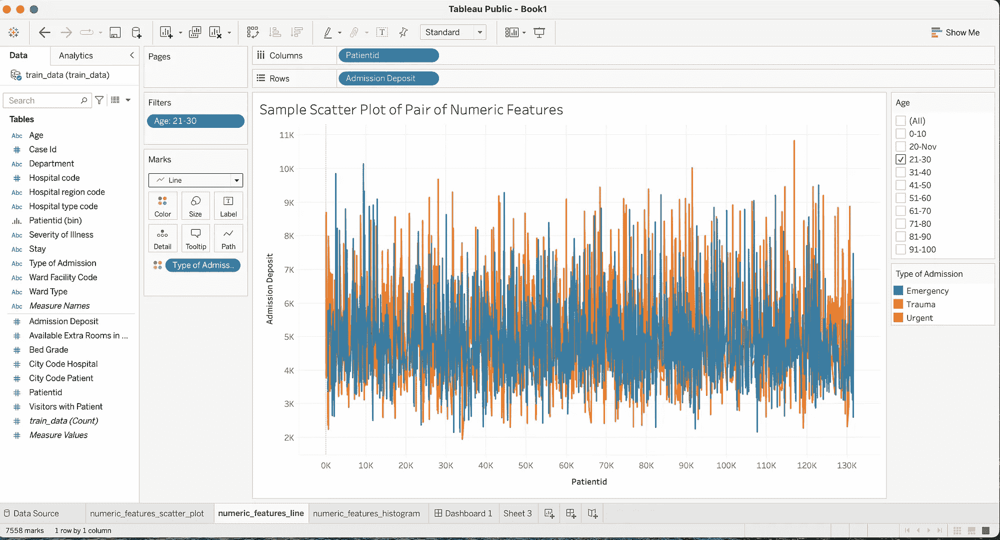
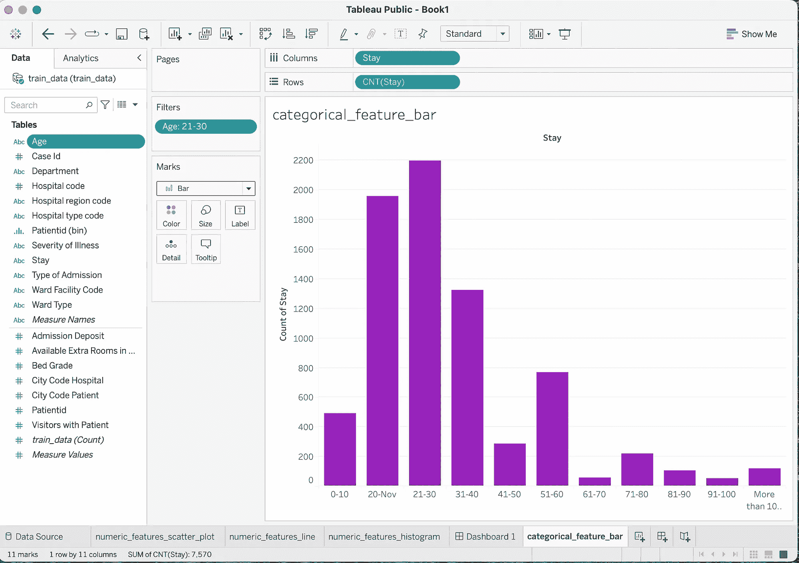
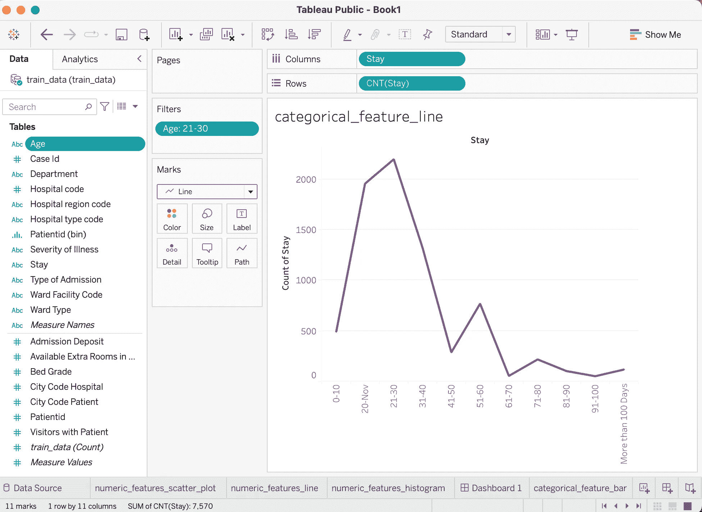
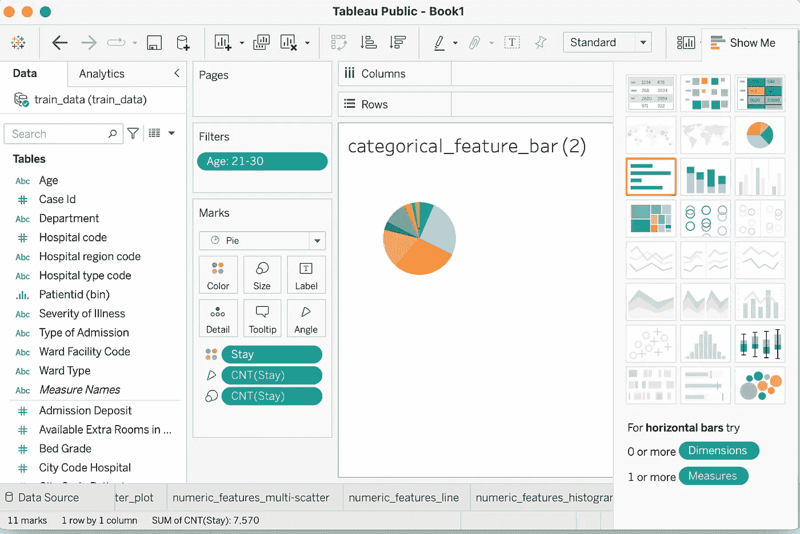
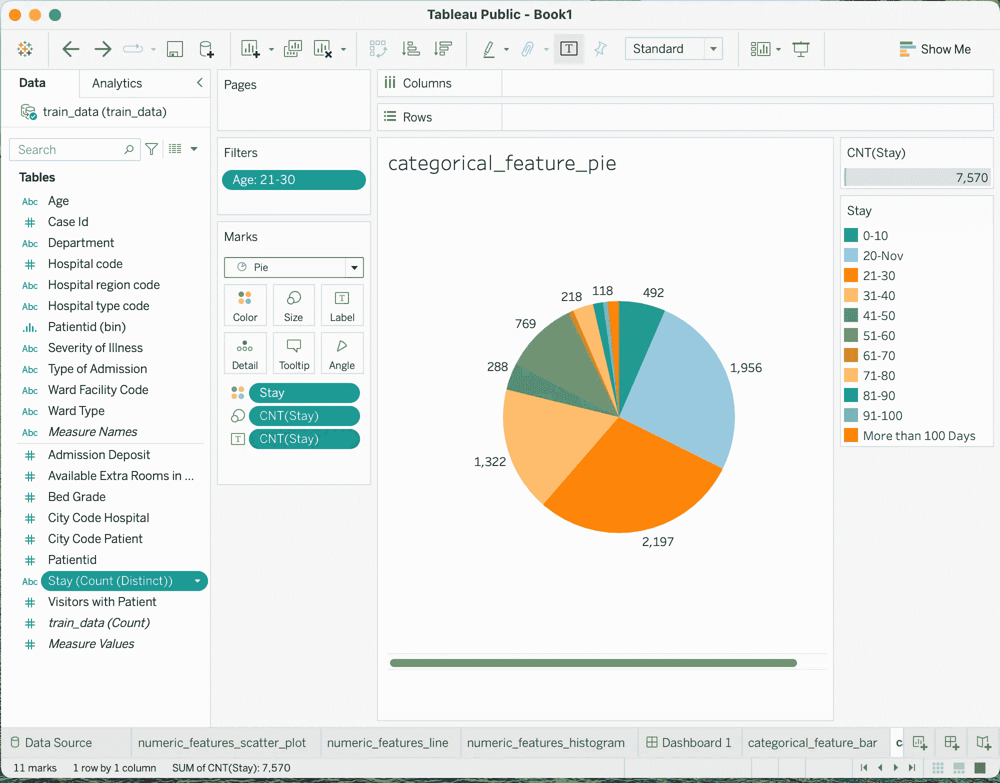
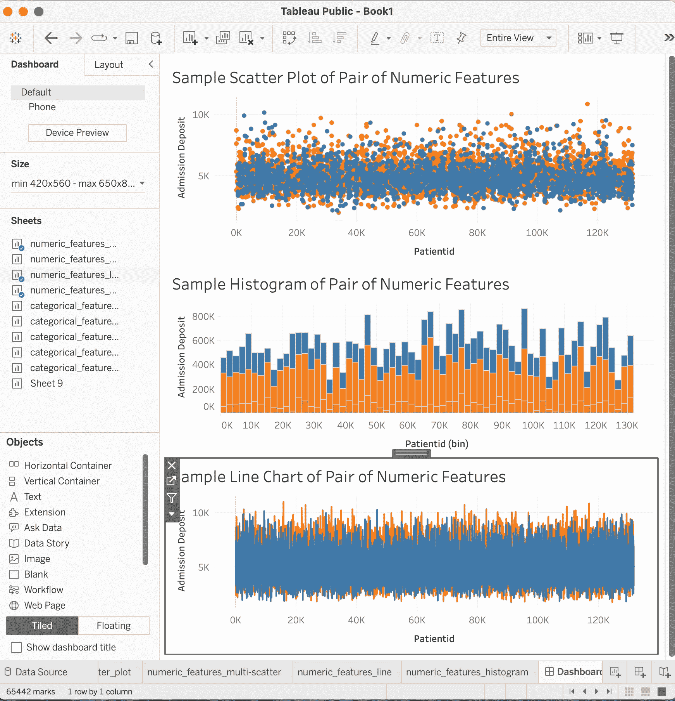
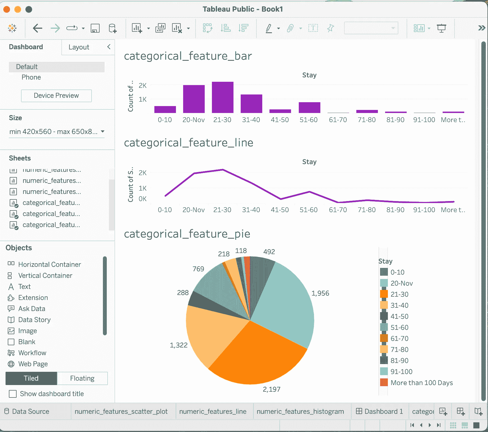

# 使用 Spark 和 Tableau Desktop 创建富有洞察力的仪表板

> 原文：[`towardsdatascience.com/creating-insightful-dashboards-with-spark-and-tableau-desktop-1fd91837b8b5?source=collection_archive---------10-----------------------#2023-06-29`](https://towardsdatascience.com/creating-insightful-dashboards-with-spark-and-tableau-desktop-1fd91837b8b5?source=collection_archive---------10-----------------------#2023-06-29)

## 使用 Tableau Desktop 工具进行大规模数据可视化自动化

 [Yu Huang, M.D., M.S. in CS](https://medium.com/@jadezhang244?source=post_page-----1fd91837b8b5--------------------------------)

·

[关注](https://medium.com/m/signin?actionUrl=https%3A%2F%2Fmedium.com%2F_%2Fsubscribe%2Fuser%2F759013c23ad5&operation=register&redirect=https%3A%2F%2Ftowardsdatascience.com%2Fcreating-insightful-dashboards-with-spark-and-tableau-desktop-1fd91837b8b5&user=Yu+Huang%2C+M.D.%2C+M.S.+in+CS&userId=759013c23ad5&source=post_page-759013c23ad5----1fd91837b8b5---------------------post_header-----------) 发表在 [Towards Data Science](https://towardsdatascience.com/?source=post_page-----1fd91837b8b5--------------------------------) ·9 min read·2023 年 6 月 29 日

--

作者照片

# 1\. 介绍

作为数据的可视化表示，数据可视化是数据分析中广泛采用的方法，用于从大规模数据集中获得有用的业务洞察（例如，趋势、模式、异常值、关联等）。最近，我介绍了一种使用 Spark、Plotly 和 Dash 开发用于 Web 应用的互动且富有洞察力的数据可视化仪表板的软件开发方法[1]。

类似于 [1]，本文使用与 [2] 中相同的开源数据集，展示如何使用 Spark 和 Tableau Desktop [3] 从大规模数据集创建有洞察力的仪表板，而无需编程。

**图 1：** 工作流的高层次概述。

图 1 显示了工作流的高层次概述。它包括以下主要步骤：

+   将 Tableau Desktop 用于仪表板创作连接到 Spark

+   从 Cloud Data Lake 查询数据集

+   从加载的数据集创建数据可视化图表

+   从创建的单独图表中创建仪表板

+   将仪表板发布到 Tableau 服务器以便共享

# 2\. 连接 Tableau Desktop 到 Spark

如 [4] 所述，以下步骤可以用来使用 Spark SQL 作为分布式查询引擎，通过其 JDBC/ODBC [5] 并将 Tableau Desktop 连接到分布式 Spark SQL 引擎 [4]：

+   安装 Hadoop

+   设置 Hive

+   设置 MySQL

+   设置 Spark

+   设置 Tableau Desktop

# 3\. 从 Cloud Data Lake 查询数据集

一旦 Tableau Desktop 成功连接到分布式 Spark SQL 引擎，我们应该能够浏览默认模式并查看 Hive Hadoop 集群表 [4]。

从使用 Tableau Desktop 创建仪表板的角度来看，从 Hive Hadoop 集群加载的表和从本地 Microsoft Excel 文件加载的表没有区别。为了方便起见，本文将使用 Tableau Desktop Public 的免费版本，并将本地 Excel 文件（该文件由 [2] 中的数据集 *csv* 文件转换而来）用于演示目的。

# 4\. 创建数据可视化图表

我们需要先创建单独的可视化图表，然后才能创建可视化仪表板。

我们可以使用 Tableau Desktop 创建多种类型的图表。如 [1] 所述，某些图表适合于可视化连续的数值特征，而其他图表适合于可视化离散的分类特征。

类似于 [1]，本文使用 Tableau Desktop 创建以下常见图表以用于演示目的。

+   **数值特征的图表：** 散点图、直方图和折线图

+   **分类特征的图表：** 条形图、折线图和饼图

## 4.1 数值特征的图表

Tableau Desktop 使用符号 *#* 来指示数值特征。本小节展示如何使用 Tableau Desktop 创建以下三种常见的数值特征图表：

+   散点图

+   直方图

+   折线图

**4.1.1 散点图**

对于一对数值特征，散点图使用每对特征值作为坐标在 2D 平面上绘制一个点。例如，如 [1] 所示，图 2 显示了 21 到 30 岁人群的两个数值特征 *Patient ID* 和 *Admission Deposit* 的散点图。特征 *Type of Admission* 用于颜色编码。

以下步骤可以用来创建散点图：

+   将特征 *Patientid* 拖动到 *Columns* 区域

+   拖动特征*入院押金*并将其放到*行*货架上。

+   拖动特征*入院类型*并将其放到标记卡的*颜色*属性上。

+   点击标记卡上的下拉菜单并选择*圆形*。

+   右键点击特征*年龄*，选择*显示过滤器*，并仅选择*21–30*。

**图 2：** 数值特征对的散点图示例。

该散点图揭示了大多数 21–30 岁之间的急诊和创伤患者押金范围在$3,000 到$6,000 之间的商业洞察。

**4.1.2 直方图**

Tableau Desktop 将直方图视为条形图。因此，列的数值特征需要通过分箱转换为分类特征，而行的数值特征需要聚合，如求和。

可以按照以下步骤创建图 3 中的直方图：

+   右键点击数值特征*病人 ID*并选择“创建区间”以创建新特征*病人 ID（区间）*。

+   拖动新的特征*病人 ID（区间）*并将其放到*列*货架上。

+   拖动数值特征*入院押金*并将其放到*行*货架上，然后点击放置的特征并选择聚合*总和*。

+   拖动分类特征*入院类型*并将其放到标记卡的*颜色*属性上。

+   点击标记卡上的下拉菜单并选择*条形图*。

+   右键点击特征*年龄*，选择*显示过滤器*，并仅选择*21–30*。

**图 3：** 数值特征对的直方图示例。

该直方图向我们展示了紧急患者在 21–30 岁之间的总入院押金最少，而急诊患者的总入院押金最多的商业洞察。

**4.1.3 折线图**

类似于创建散点图，可以按照以下步骤创建图 4 中的折线图：

+   拖动特征*病人 ID*并将其放到*列*货架上。

+   拖动特征*入院押金*并将其放到*行*货架上。

+   拖动特征*入院类型*并将其放到标记卡的*颜色*属性上。

+   点击标记卡上的下拉菜单并选择*折线*。

+   右键点击特征*年龄*，选择*显示过滤器*，并仅选择*21–30*。

**图 4：** 数值特征对的折线图示例。

类似于散点图，该折线图显示了相同的商业洞察，即大多数 21–30 岁之间的急诊和创伤患者押金范围在$3,000 到$6,000 之间。

## 4.2 分类特征的图表

Tableau Desktop 使用符号*Abc*来表示分类特征。本小节展示如何使用 Tableau Desktop 创建以下三种分类特征值计数的常见图表：

+   条形图

+   折线图

+   饼图

**4.2.1 条形图**

作为示例，可以按照以下步骤创建图 5 中分类特征*Stay*的柱状图：

+   拖动特征*Stay*并将其放到*Columns*架上。

+   拖动相同的特征*Stay*并将其放到*Rows*架上，然后点击已放置的特征并选择聚合*Count*。

+   点击 Marks Card 上的下拉菜单，选择*Bar*。

+   右键点击特征*Age*，选择*show filter*，仅选择*21–30*。

+   点击 Marks Card 上的*Color*属性并选择*purple*颜色。

**图 5：** 分类特征值计数的示例柱状图。

该柱状图展示了业务洞察，即对于 21–30 岁之间的患者，更多患者住院时间为 21–30 天，相比其他住院时间间隔。

**4.2.2 折线图**

类似于柱状图，可以按照以下步骤创建图 6 中分类特征*Stay*的折线图：

+   拖动特征*Stay*并将其放到*Columns*架上。

+   拖动相同的特征*Stay*并将其放到*Rows*架上，然后点击已放置的特征并选择聚合*Count*。

+   点击 Marks Card 上的下拉菜单，选择*Line*。

+   右键点击特征*Age*，选择*show filter*，仅选择*21–30*。

+   点击 Marks Card 上的*Color*属性并选择*purple*颜色。

**图 6：** 分类特征值计数的示例折线图。

类似于柱状图，这个折线图揭示了相同的业务洞察，即对于 21–30 岁之间的患者，更多患者住院时间为 21–30 天，相比其他住院时间间隔。

**4.2.3 饼图**

创建饼图的过程不如创建折线图和柱状图那样直接。

我们可以按照以下步骤创建图 8 中分类特征*Stay*的饼图：

+   拖动特征*Stay*并将其放到*Columns*架上。

+   拖动相同的特征*Stay*并将其放到*Rows*架上，然后点击已放置的特征并选择聚合*Count*。

+   右键点击特征*Age*，选择*show filter*，仅选择*21–30*。

+   点击图表上方右角的*Show Me*，选择*pies*图标。一个小的*pies*图将如图 7 所示出现。

+   通过选择 Marks Card 上的*Size*属性来增加饼图的大小，然后选择并拖动饼图的边界框。

+   拖动聚合功能*CNT(Stay)*并放到*Label*属性的 Marks Card 上。

**图 7：** 将柱状图转换为饼图。

图 8 展示了完成上述步骤后的最终饼图。

**图 8：** 分类特征值计数的示例饼图。

与条形图和折线图类似，这个饼图确认了相同的业务洞察：对于 21-30 岁之间的患者，住院 21-30 天的患者更多（共 2,197 名），相比于其他住院时间段。

# 5\. 创建仪表板

一旦单独的图表创建完成，我们可以选择并将这些图表组合成一个仪表板。

## 5.1 用于可视化数值特征对的仪表板

可以按照以下步骤创建一个用于可视化数值特征*Patientid*和*Admission Deposit*的仪表板。

**步骤 1：** 选择*仪表板*菜单，然后选择*新建仪表板*

**步骤 2：** 将以下创建的图表逐一拖动并放置到新的仪表板页面上：

+   数值特征对的示例散点图

+   数值特征对的示例直方图

+   数值特征对的示例折线图

图 9 展示了新创建的仪表板。

**图 9：** 用于可视化一对数值特征的示例仪表板。

## 5.2 用于可视化分类值计数的仪表板

可以按照以下步骤创建一个用于可视化分类特征*Stay*的值计数的仪表板。

**步骤 1：** 选择*仪表板*菜单，然后选择*新建仪表板*

**步骤 2：** 将以下创建的图表逐一拖动并放置到新的仪表板页面上：

+   categorical_feature_bar

+   categorical_feature_line

+   categorical_feature_pie

图 10 展示了新创建的仪表板。

**图 10：** 用于可视化分类特征值计数的示例仪表板。

# 6\. 发布仪表板

一旦创建了仪表板，它可以发布到 Tableau Server 以进行共享。

服务器有三种类型：

+   Tableau Public

+   Tableau Server

+   Tableau Cloud

由于使用的是免费的 Tableau Desktop Public 创建这些仪表板，因此这些仪表板只能发布到 Tableau Public。

可以按照[6]中的发布步骤，将仪表板及相关数据集发布到 Tableau Public 服务器上以供公众查看。

# 7\. 结论

Tableau 是一个多层次的视觉数据分析平台，具有复杂的架构。本文介绍了一种将 Spark 与 Tableau 集成的方法，用于首先从大规模数据湖（例如，Hadoop Hive）中查询数据，然后演示如何使用 Tableau Desktop 从加载的数据集中创建有洞察力的仪表板，而无需编程。

作为一个仪表板创建和共享工具，Tableau Desktop 支持多种创建可视化图表的方法。了解从哪里开始以及如何创建有洞察力的可视化图表和仪表板可能会让人感到困惑。本文通过专注于两个简单的可视化场景：一个是可视化一对数值特征，另一个是可视化分类特征的值计数，来帮助快速学习 Tableau Desktop。

# 参考文献

[1] 黄宇，使用 Spark 和 Plotly Dash 开发互动和洞察性仪表板

[2] 黄宇，预测 Covid-19 患者住院时间

[3] [教程：开始使用 Tableau Desktop](https://help.tableau.com/current/guides/get-started-tutorial/en-us/get-started-tutorial-home.htm)

[4] [设置 Tableau 与 Apache Spark 的指南](https://community.tableau.com/s/news/a0A4T000002O4RxUAK/a-guide-to-setting-up-tableau-with-apache-spark)

[5] [分布式 SQL 引擎](https://spark.apache.org/docs/latest/sql-distributed-sql-engine.html)

[6] [分享你的发现](https://help.tableau.com/current/guides/get-started-tutorial/en-us/get-started-tutorial-share.htm#Use_Tableau_Public)

**注意：** 本文中的所有照片/图片/图表均由作者提供。
