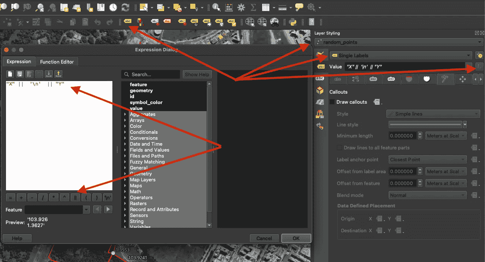

# 使用 QGIS 创建地图

> 原文：[`towardsdatascience.com/creating-maps-with-qgis-1af81b9d0e73`](https://towardsdatascience.com/creating-maps-with-qgis-1af81b9d0e73)

## 最佳开源 GIS 软件的全面指南

 [Jake Teo](https://medium.com/@teosiyang?source=post_page-----1af81b9d0e73--------------------------------)

·发表于 [Towards Data Science](https://towardsdatascience.com/?source=post_page-----1af81b9d0e73--------------------------------) ·阅读时间 11 分钟·2023 年 12 月 24 日

--

照片由 [Louis Hansel](https://unsplash.com/@louishansel?utm_source=medium&utm_medium=referral) 提供，来源于 [Unsplash](https://unsplash.com/?utm_source=medium&utm_medium=referral)

十多年前，当我开始作为 GIS（地理信息系统）分析师的数据职业生涯时，两款万能的 GIS 软件非常突出。十年后，这两款软件依然是同样的两款。**ArcGIS** (由 **ERSI** 提供) 迄今为止仍是最主流的选择，它非常易于使用，功能丰富，并配备了出色的 Python 库。然而，它需要付费，并且仅在 Windows 上运行。

[**QGIS**](https://qgis.org/en/site/)（量子 GIS）则是最佳的开源替代品。它支持大多数操作系统，并拥有非常活跃的开源社区。无论选择哪款软件，你都不会出错，但随着我深入编程职业，使用 Windows 变得更加困难，因此我通常避免使用企业软件以避免采购行政工作。因此，我现在更倾向于使用 QGIS。

QGIS logo。[(CC BY-SA)](https://www.qgis.org/en/site/getinvolved/styleguide.html)

*以下教程显示的是 QGIS 3.34 Prizren 版本，可能与之前和未来的版本略有不同。*

# 目录

键盘快捷键 添加底图

创建新图层

添加要素

编辑要素

符号系统

使用工具箱

字段计算器

添加标签

地图主题

地图布局

# 你将学到的内容

在这次演练结束时，你将学会如何制作类似这样的地图，我将用于森林调查。

从这篇文章中你将学到的内容。（作者创建）

# 键盘快捷键

有几个常用的操作可以通过实现键盘快捷键来简化你的工作。我会自定义它们，使其更容易使用。这可能看起来不重要，但相信我，当你在地图项目中移动和切换时，它会优化一切。

转到键盘快捷键。（作者截图）

这五个操作及其自定义快捷键为：

+   平移地图：C

+   放大：V

+   缩小：X

+   切换编辑：E

+   选择要素：R

当然，你可以随意使用你的快捷键。

搜索操作 > 更改 > 输入你想要的快捷键。（作者截图）

# 添加基础地图

基础地图是你整个地图项目的背景。我们通常使用权威地图作为背景，以便在其上添加图层时能够感知土地细节。在 QGIS 中，可以通过首先在插件中安装插件来添加基础地图，路径为 Plugins > Manage and Install Plugins > QuickMapServices。这些地图是通过外部 API 获取的，因此需要互联网连接。

安装 QuickMapServices 插件。（作者截图）

然后我们可以搜索并将基础图层添加到项目中。在这个例子中，我添加了 Google 卫星影像，它会出现在左侧的图层面板中。

添加基础图层。（作者截图）

我们可以稍后通过上一个截图中的快捷方式访问插件以选择其他基础图层，或者如下所示。

从 Web 菜单访问 QuickMapServices。（作者截图）

# 创建一个新图层

GIS 中使用了两种类型的图形。之前的 Google 卫星影像由一个颜色像素的网格组成，这被称为**栅格**。这种栅格有一个分辨率，当你放大足够时，最终会看到单独的像素。

**矢量**则没有分辨率，放大时始终保持清晰锐利。这些矢量由各种几何类型组成，即折线、多边形和点。GIS 中最常见的矢量存储格式是 ESRI **shapefile**。要创建此文件，转到 Layer > Create Layer > New Shapefile Layer。

创建一个新的 shapefile（作者截图）

如下所示，需要弹出窗口来定义 shapefile。shapefile 将包括一个属性表，我们可以在其中存储每个要创建的要素的信息。我们可以在此定义任何新字段。创建后，你应该会看到新图层添加到左侧的图层菜单栏中。

创建 shapefile 的属性。（作者截图）

需要注意的是，shapefile 由多个文件组成。特别值得注意的是 `.shp` 文件，它包含几何坐标，`.dbf` 文件，它包含属性表，以及 `.prj` 文件，它包含坐标参考系统。

一个 shapefile 由多个文件组成。（作者截图）

# 添加要素

创建一个要素（在此案例中是多边形）非常简单。我们只需在菜单中选择图层，启用 *切换编辑*（铅笔图标），然后点击 *添加多边形* 图标。接着，我们将鼠标指向底图，并在区域上绘制多边形，点击以完成。最后，当我们完成时，可以右键点击，弹出窗口将提示我们输入要素的属性到属性表中（如果需要）。

添加新要素。（作者截图）

# 编辑要素

有许多编辑方法，在这种情况下，我将展示如何将现有的多边形拆分为多个部分。首先，如之前所述选择图层并 *切换编辑*。然后前往 编辑 > 编辑几何 > *拆分要素*。

拆分要素（作者截图）

你的鼠标箭头将变成靶心圆圈，然后你可以从多边形外部点击，通过绘制多边形线段将其切割成更小的部分，线段结束于多边形外部，并右键点击。

将多边形拆分为多个部分。（作者截图）

使用这个方法，我们将调查区域拆分为六个不同的部分，其中我知道植被类型存在一些差异。

# 符号系统

要调整图层的填充和边框颜色，我们可以右键点击图层 > *属性* > 选择 *符号系统* 标签。如果图层中的特征在其属性表中分配了类别或数值范围，我们也可以将颜色显示从 *单一符号* 更改为 *分类* 或 *分级*。

在这种情况下，我们只想去掉填充颜色，并将边框设置为红色，因此我们可以点击 *填充*，然后点击 *简单线条* 以依次更改它们。

调整图层的颜色和边框。（作者截图）

# 使用工具箱

处理工具箱包含你工作所需的所有空间处理功能。它们可以通过 处理 > 工具箱 访问，使用简单的搜索框来获取所需的功能。在这种情况下，我们希望通过在每个调查区域内添加随机点来创建一些分层随机样本。

在处理工具箱中获取随机点工具。（作者截图）

工具弹出窗口将显示，我们可以输入每个区域三个点的适当输入，距离至少相隔 10 米。

输入随机点生成的输入。（作者截屏）

这样，点就会作为地图上的新图层生成。

随机点已生成。（作者截屏）

# 字段计算器

我们之前稍微谈到了属性表，这是一个在 shapefile 或图层中的表格，其中每个要素可以有相应的数据存储在其中。通过图层中要素的空间属性，我们可以使用**字段计算器**在表格中进行计算。在这个实例中，我们希望在随机点的属性表中创建两个新字段 X 和 Y，以显示它们的坐标。

首先，我们右键点击图层并打开属性表。然后，我们切换到编辑模式 > 打开字段计算器。

打开属性表 > 字段计算器。（作者截屏）

在字段计算器中，我们想创建一个名为 X 的新字段，使用十进制格式。在表达式中，我们输入 X 坐标的计算。在这个实例中，我使用了以米为单位的本地坐标系统，但我希望标签显示全球坐标系统的纬度和经度，因此我进行了转换。

在字段计算器中，我们可以为特定字段添加计算。（作者截屏）

这一次重复相同的步骤以获取 Y 坐标，我们应该得到类似这样的结果。再次切换编辑图标以保存这两个新字段。

X 和 Y 坐标已创建。（作者截屏）

# 添加标签

现在我们已经为每个点创建了 X 和 Y 坐标，我们怎么在地图上显示它们？这可以通过从工具栏开启标签选项（或右键点击图层 > 属性 > 标签）来完成。然后我们选择图层 > 单一标签 > 并点击表达式对话框以设计标签的显示方式。

在表达式对话框中，我们添加了 X 和 Y 标签，并用新的一行 `"X" || '\n' || "Y"` 连接它们，以便文本标签将按此方式显示。

使用标签表达式启用标签（作者截屏）

然后我们通过增加字体大小和颜色，并为标签添加黑色缓冲区，使它们在黑暗的底图背景中更加突出。

调整字体大小和颜色（作者截屏）

最后，我们添加了一条白色的标注线，将每个点要素与标签连接起来。

添加标注线（作者截屏）

这样，标签在地图上看起来像这样。效果还不错，但不是最整洁的，因为其中一些标签聚集在一起，还阻碍了调查多边形的显示。

它的样子。（截图由作者提供）

我们可以通过选择*移动标签*图标，将标签从多边形中移开来解决这个问题，点击其中一个标签并将其移到另一个位置。

手动将标签拖出多边形。（截图由作者提供）

现在我认为最终状态更为干净。在添加其他地图符号时，可能需要进行一些细微调整以构建布局。

最终标签。（截图由作者提供）

# 地图主题

**地图主题** 在同一个项目中非常重要，因为你可以显示不同的图层而不必麻烦地切换它们。当我们在同一地图布局中创建多个地图时，主题也很重要，正如你将在下一部分中看到的那样，我们需要主要地图以及插图。

我们已经提前准备好了主要地图，所以我们将添加一个名为基础的主题。

添加一个主题。（截图由作者提供）

为了准备插图，我添加了手头的一个新加坡国家图层，并关闭了其他图层。

添加国家图层。（截图由作者提供）

接下来，我们想要将调查边界添加到国家地图中。为此，我们首先复制调查边界图层。

复制图层。（截图由作者提供）

然后，通过右键点击重复的图层 > 属性 > 符号系统，编辑颜色，将红色填充颜色添加到图层中。仅用这两个图层，调查的位置在国家中变得一目了然。

添加带有新填充颜色的复制图层。（截图由作者提供）

最后，我们将其作为另一个主题，称为插图。通过下拉菜单，我们应该能够在这两个主题之间切换。

添加了两个主题。（截图由作者提供）

# 地图布局

最后一步是添加所有必要的项目，使其成为一张完整的地图。这通过创建一个布局来完成。

创建一个新的布局。（截图由作者提供）

在布局页面中，我们首先定义**页面属性**，将其设置为纵向模式。

纵向布局。（截图由作者提供）

首先添加的当然是我们刚刚创建的地图。为此，我们需要选择**添加地图**图标，然后在空白画布上拖动一个矩形。

将我们的地图添加到布局中（截图由作者提供）

然后，我们可以通过选择移动图标进行一些精细调整。接着，我们可以平移地图上的内容。我们可以使用鼠标进行缩放，但对于精细调整，我们可以输入特定的比例尺。特别重要的是选择之前创建的地图主题。

在布局中调整地图并选择主题。（作者截图）

接下来，我们添加另一个称为**插图**的地图，它表示初始地图的相同区域，但以更广的比例显示它的位置。再次，我们需要将插图锁定为之前创建的地图主题。

添加插图。（作者截图）

现在，我们可以准备在空白矩形背景中添加其余的地图元素。角落经过圆角处理，使其看起来更美观。在右上角面板中，我们可以调整每个地图元素的层级，以便插图位于矩形背景的顶部。

添加一个空白元素。（作者截图）

完成这些步骤后，我们首先为其添加一个**图例**。我们可以自定义图例的标题，并删除一些不需要的条目。

添加一个图例。（作者截图）

**北箭头**也是地图的重要组成部分。有几种箭头类型可以选择。

添加一个北箭头。（作者截图）

最后，我们将为其添加一个比例尺。我们可以更改比例尺符号类型，并在项目属性中自定义比例尺。

添加一个比例尺。（作者截图）

最终，我们可以修饰地图元素，并将完成的地图导出为栅格图像，或保留为 SVG 或 PDF 矢量图形。

导出为图片。（作者截图）

# 总结

空间分析和制图是数据分析和可视化的一个小众领域。在我从事这个领域的那些年里，我为公共步道展示创建了地图，并将它们发表在杂志、报纸、书籍和期刊上。这是一项有趣且富有挑战性的工作，我相信你可以利用我提供的基础知识进行同样的尝试并在此基础上拓展。
