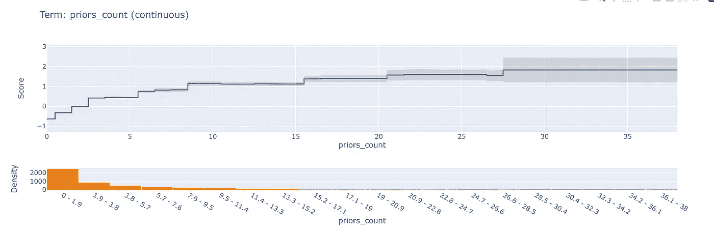
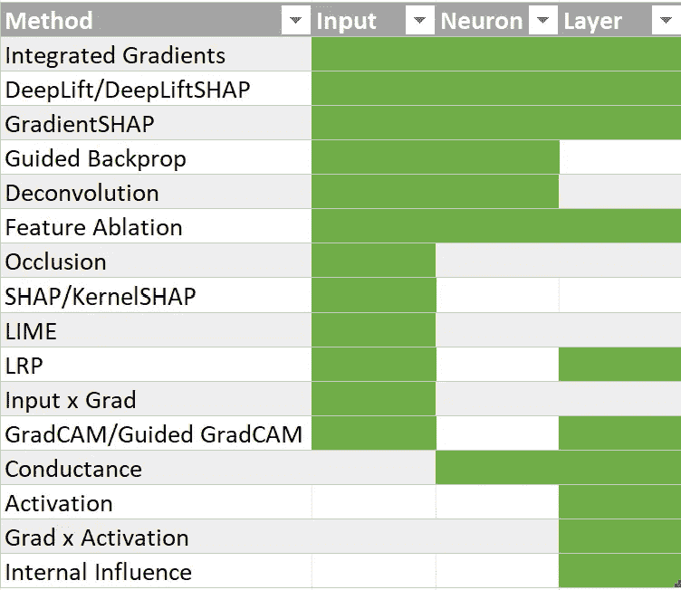
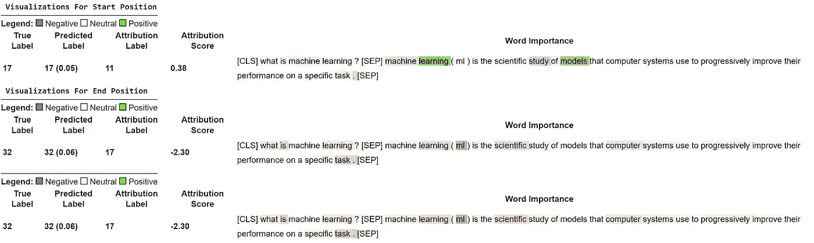
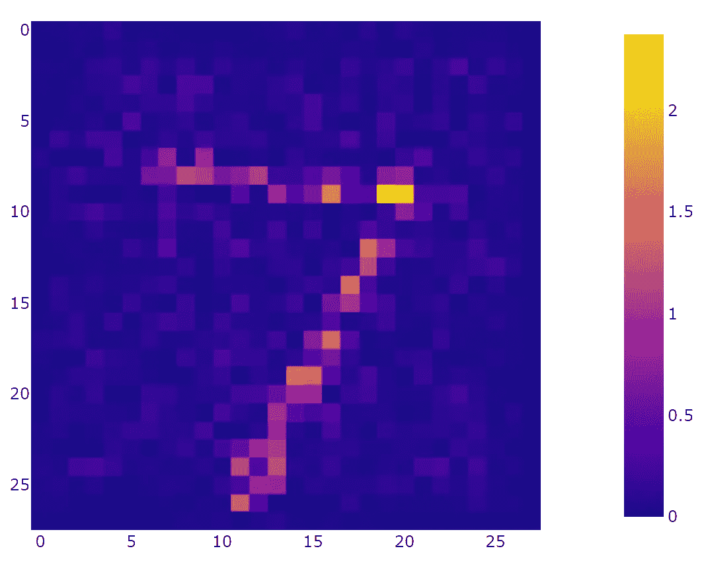
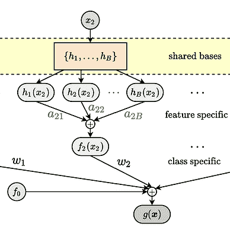

# 伦理和可解释性 AI 的关键工具

> 原文：[`towardsdatascience.com/critical-tools-for-ethical-and-explainable-ai-ed0e336d82a`](https://towardsdatascience.com/critical-tools-for-ethical-and-explainable-ai-ed0e336d82a)

照片由 [Wesley Tingey](https://unsplash.com/@wesleyphotography?utm_source=medium&utm_medium=referral) 提供，来源于 [Unsplash](https://unsplash.com/?utm_source=medium&utm_medium=referral)

## 一个帮助你创建值得信赖且强大的模型的必备库和工具包指南

 [Nakul Upadhya](https://medium.com/@upadhyan?source=post_page-----ed0e336d82a--------------------------------)

·发表于 [Towards Data Science](https://towardsdatascience.com/?source=post_page-----ed0e336d82a--------------------------------) ·8 分钟阅读·2023 年 7 月 19 日

--

机器学习模型通过提供显著的预测能力，彻底改变了多个领域。然而，随着这些模型变得越来越普遍，确保公平性和可解释性的需求已成为一个关键问题。构建公平和透明的模型是建立信任、避免偏见和减轻意外后果的伦理要求。幸运的是，Python 提供了大量强大的工具和库，使数据科学家和机器学习从业者能够直接应对这些挑战。事实上，众多工具和资源可能会让数据科学家和利益相关者感到不知所措，不知道该使用哪些工具。

本文将深入探讨公平性和可解释性，介绍了一系列精心挑选的 Python 包，涵盖了广泛的可解释性工具。这些工具使研究人员、开发人员和利益相关者能够深入了解模型行为，理解特征的影响，并确保他们的机器学习工作中的公平性。

*免责声明：我将只关注三个不同的包，因为这三个包包含了大多数可解释性和公平性工具。然而，值得一提的工具列表可以在文章的最后找到。*

# InterpretML

> *GitHub*: [`github.com/interpretml/interpret`](https://github.com/interpretml/interpret)
> 
> *文档*: [`interpret.ml/docs/getting-started.html`](https://interpret.ml/docs/getting-started.html)

可解释模型在机器学习中扮演着关键角色，通过揭示决策机制来促进信任。这种透明性对于监管合规、伦理考虑和用户接受度至关重要。InterpretML [1] 是微软研究团队开发的一个开源包，集成了许多关键的机器学习可解释性技术于一个库中。

***Post-Hoc Explanations***

首先，InterpretML 包含了许多后期解释算法，以揭示黑箱模型的内部。这些算法包括：

+   Shapley Additive Explanations (SHAP)：一种基于博弈论的特征重要性解释方法。

+   局部可解释模型无关解释（LIME）：一种局部解释方法，它通过拟合一个可解释的替代模型来预测黑箱模型的结果。

+   部分依赖图（PDP）：一种基于扰动的可解释性方法，帮助展示特征之间的交互。

+   莫里斯敏感度分析：一种通过系统性地扰动输入变量并观察输出结果的变化来量化输入变量对模型输出影响的方法（类似于 PDP）。

几乎所有上述方法都可以在其他库中找到，但 InterpretML 通过将所有这些方法组合到一个包中，使我们更容易使用。

***Glassbox Models***

除了提供后期解释外，InterpretML 还包含一些玻璃盒（或固有可解释）模型，如线性模型、决策树和决策规则（或忽略决策树）。

**InterpretML 还是唯一一个包含解释性增强机器（EBM）**的包，EBM 是一种基于树的梯度提升广义加性模型。内部，EBM 根据单个变量或变量交互的值生成贡献函数。这些函数随后被组合以进行最终预测，并可以通过可视化贡献值来生成全局解释。

COMPAS 数据集上的 priors_count 解释。随着 priors 的增加，模型预测的再犯率更高（作者图示）

EBM 的准确性通常与 LightGBM 和 XGBoost 等其他提升模型相当，使其成为任何数据科学家工具箱中的重要工具。请参阅 Dr. Kubler 的文章 关于 EBM 的详细解释。

# Captum

> *GitHub*: [`github.com/pytorch/captum`](https://github.com/pytorch/captum)
> 
> *文档*: [`captum.ai/docs/introduction`](https://captum.ai/docs/introduction)

虽然 InterpretML 主要集中于“浅层”模型，Captum [2] 是 PyTorch 的深度学习可解释性首选包。该库包含许多后期可解释性算法，帮助提供特征重要性和神经元/层的归因（完整表格见下）。

Captum 归因算法按解释焦点组织（图片由作者提供）

这些算法帮助处理表格数据的可解释性，但它们的使用案例不限于此。是否曾想过 BERT 可能在其预测中关注什么？好吧，[Captum 提供的教程之一](https://captum.ai/tutorials/)展示了如何使用[层集成梯度来解释 BERT 生成的问答对](https://captum.ai/tutorials/Bert_SQUAD_Interpret)：

问答系统可解释性（图片由作者提供）

Captum 还可以用于解释图像预测，使用如 Input x Gradient 或层相关传播等算法：

MNIST 预测解释使用层相关传播（图片由作者提供）

总的来说，这个库非常易于使用且极其多才多艺，使其成为任何深度学习开发者必知的工具。

# AIF360

> *GitHub*: [`github.com/Trusted-AI/AIF360`](https://github.com/Trusted-AI/AIF360)
> 
> *文档*: [`aif360.readthedocs.io/en/stable/`](https://aif360.readthedocs.io/en/stable/)

虽然可解释性可以在识别模型中的潜在偏差方面发挥很大作用，但一些专门的工具和指标可以衡量并更重要的是，*缓解*数据集和预测工具中的不公平现象。其中之一是 AI 公平性 360 工具包（AIF360）[3]，这是 IBM 为 Python 和 R 开发的开源库。该工具包涵盖了几乎所有可能需要的公平性和缓解方法。

此外，AIF360（如 Captum 一样）提供了大量[易于入门的教程](https://github.com/Trusted-AI/AIF360/tree/master/examples)来指导如何使用这个库。

***数据集***

AIF360 提供的第一个极其有用的功能是提供大量在学习公平性和可解释性时非常有用的沙箱数据集。这些数据集包括成人普查收入、银行营销、COMPAS（犯罪复发数据集）、MEPS（2019-21 年医疗支出调查）数据、法学院 GPA 和德国信用数据集。所有这些都是检查公平性和系统性偏见的绝佳起点。

***公平性指标***

AIF360 还提供了一整套工具，用于计算在特权和非特权群体上的表示和模型性能指标。这使得用户能够轻松计算公平性评分，如平等化机会（各组之间的假阳性和假阴性率相等）和人口统计均衡（忽略敏感特征时的预测相同）。例如，使用`compute_num_TF_PN`可以比较一个被低估群体和特权群体之间的混淆矩阵。

***缓解方法***

AIF360 的顶级特色是库中包含的大量缓解算法。这些算法可以轻松集成到标准机器学习管道中，几乎不需要做任何改动，并且所有算法都与 sklearn 接口兼容。

第一组缓解方法是预处理算法。这些算法转换输入数据，以帮助平衡数据的公平性和表示。AIF360 包含四种此类算法：

+   不平等影响去除：这项技术编辑各类特征值，以提高整体公平性，并减少系统性偏见对数据集的影响。

+   学习公平表示（LFR）：该算法找到数据的潜在表示，编码重要信息，同时隐藏关于受保护属性的信息。

+   优化预处理：这项技术学习一种概率变换，编辑特征和标签以确保群体公平性和数据的真实性。

+   重新加权：该算法简单地重新加权样本，以确保分类任务前的公平性。

AIF360 还提供了许多“处理中”方法，这些方法围绕训练和超参数搜索过程进行。这些方法包括网格搜索减少（寻找优化性能和公平性的超参数）、对抗性去偏（学习第二个模型，旨在使用第一个模型的结果检测受保护属性）等。

最后，AIF360 提供了多个后处理算法，这些算法接受模型的预测结果并解决其优化问题，以使预测结果更公平。这些算法包括校准均衡赔率（修改预测以确保正负率相等）和拒绝选项分类器（改变预测以给予弱势群体更有利的结果）。

# 荣誉提及

上述三大库非常出色，将覆盖初学数据科学家 80%的可解释性和公平性需求。然而，还有一些其他包和工具值得荣誉提及：

## 可解释性

+   [SHAP](https://github.com/slundberg/shap) [4] / [LIME](https://github.com/marcotcr/lime) [5]：分别是 SHAP 和 LIME 算法的专用实现，以及相关可视化。

+   [ELI5](https://github.com/eli5-org/eli5) [6]：该包类似于 InterpretML，提供了许多白盒模型和黑盒解释器。不幸的是，这个项目已不再更新。

+   [Yellowbrick](https://github.com/DistrictDataLabs/yellowbrick/tree/main) [7]：这个包扩展了 sklearn API，提供了许多用于模型内部可视化的工具。

+   [Alibi](https://github.com/SeldonIO/alibi) [8]：该包类似于 InterpretML 和 ELI5，提供了许多解释器和白盒模型。

## 公平性

+   [Fairlearn](https://github.com/fairlearn/fairlearn) [9]: Fairlearn 是一个类似于 AIF360 的库，提供促进公平的工具。这个包包含了许多 AIF360 中的算法。

+   [Aequitas](https://github.com/dssg/aequitas) [10]: Aequitas 是一个偏见审计工具包，它既是一个库也是一个 [web 应用程序](http://aequitas.dssg.io/)。使用这个工具，你可以生成关于数据中可能存在的系统性偏见的报告。

+   [FairML](https://github.com/adebayoj/fairml) [11]: FairML 是一个量化模型输入相对重要性和预测依赖性的库。这个工具可以帮助审计预测模型。

# 结论

最终，拥抱可解释性和公平性的集体努力将引领我们迈向一个未来，在这个未来中，AI 系统不仅准确强大，而且透明、公正和可信，*从而最终惠及开发者和最终用户*。通过利用这些 Python 包的能力并承诺于伦理 AI，我们可以为一个更加包容和负责任的 AI 驱动世界铺平道路。

# 资源与参考文献

+   如果你对可解释的机器学习和预测感兴趣，可以关注我：[`medium.com/@upadhyan`](https://medium.com/@upadhyan)

+   欲了解更多有关伦理和可解释 AI 的文章，请查看以下阅读列表：

[Nakul Upadhya](https://medium.com/@upadhyan?source=post_page-----ed0e336d82a--------------------------------)

## 可解释和伦理的 AI

[查看列表](https://medium.com/@upadhyan/list/interpretable-and-ethical-ai-f6ee1f0b476d?source=post_page-----ed0e336d82a--------------------------------)5 个故事

## 参考文献

[1] Nori, H., Jenkins, S., Koch, P., & Caruana, R. (2019). InterpretML: 一个统一的机器学习可解释性框架*。arXiv 预印本 arXiv:1909.09223*。

[2] Narine Kokhlikyan, Vivek Miglani, Miguel Martin, Edward Wang, Bilal Alsallakh, Jonathan Reynolds, Alexander Melnikov, Natalia Kliushkina, Carlos Araya, Siqi Yan, & Orion Reblitz-Richardson. (2020). Captum: 一个统一且通用的 PyTorch 模型可解释性库。

[3] Rachel K. E. Bellamy, Kuntal Dey, Michael Hind 和 Samuel C. Hoffman, Stephanie Houde, Kalapriya Kannan 和 Pranay Lohia, Jacquelyn Martino, Sameep Mehta 和 Aleksandra Mojsilovic, Seema Nagar, Karthikeyan Natesan Ramamurthy 和 John Richards, Diptikalyan Saha, Prasanna Sattigeri 和 Moninder Singh, Kush R. Varshney, & Yunfeng Zhang. (2018). AI Fairness 360: 一个可扩展的工具包，用于检测、理解和缓解不希望出现的算法偏见。

[4] Lundberg, S., & Lee, S.I. (2017). 解释模型预测的统一方法*。神经信息处理系统进展 30*, 4765–4774。

[5] Marco Tulio Ribeiro, Sameer Singh, & Carlos Guestrin (2016). “我为什么应该相信你？”：解释任何分类器的预测。在 *第 22 届 ACM SIGKDD 国际知识发现与数据挖掘大会论文集，旧金山，加州，美国，2016 年 8 月 13–17 日*（第 1135–1144 页）。

[6] TeamHG-Memex (2019) ELI5\。*Github*

[7] Bengfort, B., & Bilbro, R. (2019). Yellowbrick: 可视化 Scikit-Learn 模型选择过程*。开放源软件期刊，4(35)。*

[8] Janis Klaise, Arnaud Van Looveren, Giovanni Vacanti, & Alexandru Coca (2021). Alibi Explain: 解释机器学习模型的算法*。机器学习研究期刊，22(181)，1–7。*

[9] Bird, S., Dudik, M., Edgar, R., Horn, B., Lutz, R., Milan, V., Sameki, M., Wallach, H., & Walker, K. (2020). *Fairlearn: 评估和改进 AI 公平性的工具包* [白皮书]。微软。

[10] Saleiro, P., Kuester, B., Stevens, A., Anisfeld, A., Hinkson, L., London, J., & Ghani, R. (2018). Aequitas: 偏见和公平性审计工具包*。arXiv 预印本 arXiv:1811。*

[11] Adebayo, J. A. (2016). *FairML: 诊断预测建模偏差的工具箱*（博士论文，麻省理工学院）。
