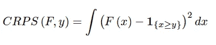
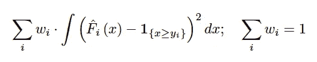
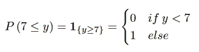
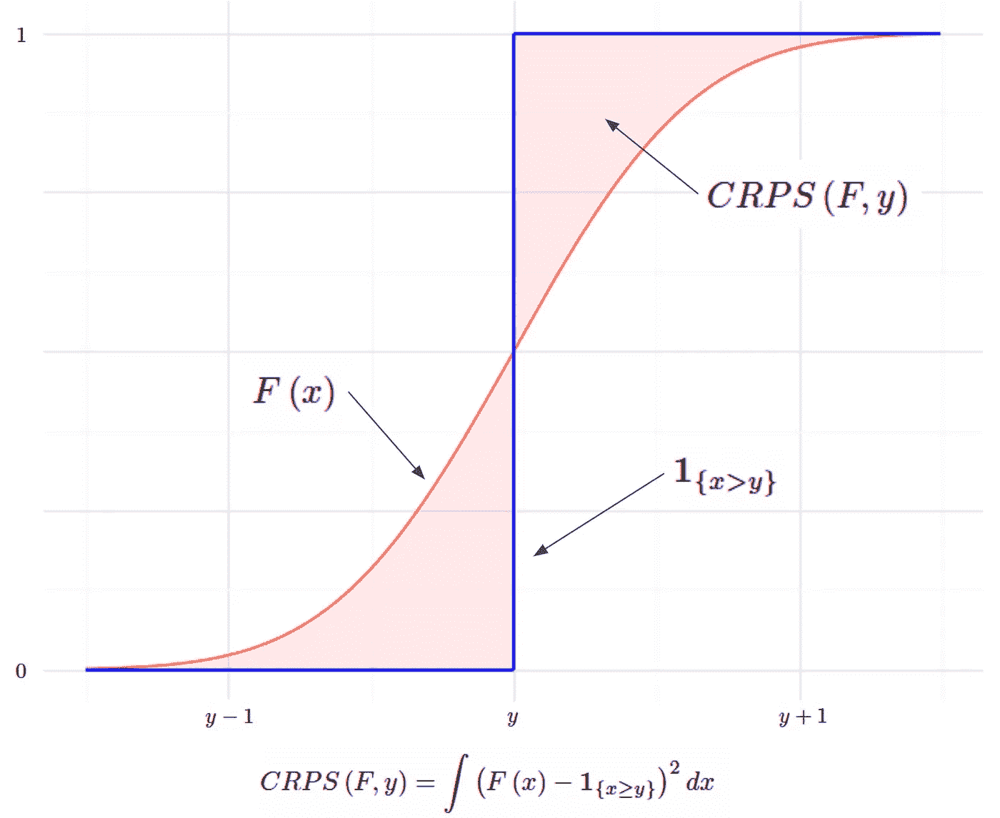
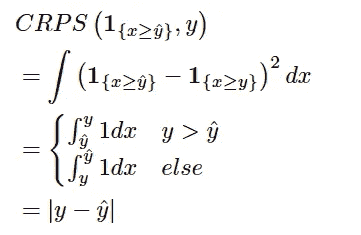
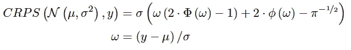
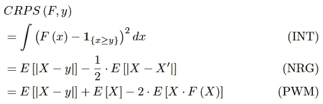

# CRPS — 贝叶斯机器学习模型的评分函数

> 原文：[`towardsdatascience.com/crps-a-scoring-function-for-bayesian-machine-learning-models-dd55a7a337a8?source=collection_archive---------1-----------------------#2023-01-28`](https://towardsdatascience.com/crps-a-scoring-function-for-bayesian-machine-learning-models-dd55a7a337a8?source=collection_archive---------1-----------------------#2023-01-28)

## 连续排名概率分数是一种统计指标，用于比较分布预测与真实值的差异

 [Itamar Faran](https://medium.com/@itamar.faran?source=post_page-----dd55a7a337a8--------------------------------)

·

[关注](https://medium.com/m/signin?actionUrl=https%3A%2F%2Fmedium.com%2F_%2Fsubscribe%2Fuser%2F153789513a7b&operation=register&redirect=https%3A%2F%2Ftowardsdatascience.com%2Fcrps-a-scoring-function-for-bayesian-machine-learning-models-dd55a7a337a8&user=Itamar+Faran&userId=153789513a7b&source=post_page-153789513a7b----dd55a7a337a8---------------------post_header-----------) 发表在 [Towards Data Science](https://towardsdatascience.com/?source=post_page-----dd55a7a337a8--------------------------------) ·5 分钟阅读·2023 年 1 月 28 日

--

机器学习工作流中的一个重要部分是模型评估。这个过程本身可以被认为是常识：将数据分为训练集和测试集，在训练集上训练模型，并使用评分函数在测试集上评估其性能。

评分函数（或[度量](https://scikit-learn.org/stable/modules/model_evaluation.html)）是将真实值及其预测映射到一个单一且可比较的值[1]。例如，对于连续预测，可以使用如 RMSE、MAE、MAPE 或 R 平方等评分函数。但如果预测不是逐点估计，而是一个分布呢？

在贝叶斯机器学习中，预测通常不是逐点估计，而是值的分布。例如，预测可能是分布的估计参数，或者在非参数情况下——来自 MCMC 方法的样本数组。

在这些情况下，传统的评分函数不适合统计设计；可以将预测分布聚合成它们的均值或中位数，但这会导致对预测分布的离散性和形状的信息损失。

## 连续排名概率评分

CRPS——连续排名概率评分——是一个评分函数，用于将单一真实值与累积分布函数（CDF）进行比较：

CRPS 的定义[1]。图片由作者提供。

首次引入于 70 年代[4]，主要用于天气预报，如今在文献和工业界重新获得关注[1][6]。当目标变量是连续的且模型预测目标的分布时，它可以作为评估模型性能的度量；例如，贝叶斯回归或贝叶斯时间序列模型[5]。

理论定义中包含 CDF 使得 CRPS 对参数化和非参数化预测都很有用：对于许多分布，CRPS 有一个解析表达式[3]，而对于非参数预测，可以使用带经验累积分布函数（eCDF）的 CRPS。

在计算完测试集中每个观测值的 CRPS 后，我们需要将结果聚合成一个单一值。类似于 RMSE 和 MAE，我们将使用（可能加权的）平均值来聚合它们。

在测试集上对 CRPS 的聚合，以及经验 CDFs。图片由作者提供。

## 直观理解

比较单一值与分布的主要挑战是如何将单一值转换到分布的领域。CRPS 通过将真实值转换为带有指示函数的[退化分布](https://en.wikipedia.org/wiki/Degenerate_distribution)来解决这个问题。例如，如果我们的真实值是 7，我们可以这样转换：

带有指示函数的[退化分布](https://en.wikipedia.org/wiki/Degenerate_distribution)示例。图片由作者提供。

指示函数是一个有效的 CDF，符合所有 [CDF 的要求](https://en.wikipedia.org/wiki/Cumulative_distribution_function#Properties)。现在我们需要将预测分布与真实值的退化分布进行比较。显然，我们希望预测分布尽可能接近真实值；这通过测量这两个 CDF 之间的（平方）面积来在数学上表示：

CRPS 的可视化。预测分布用红色标记，真实值的退化分布用蓝色标记。CRPS 是两个 CDF 之间的（平方）面积。图片来源于作者。

## 与 MAE 的关系

CRPS 与著名的 [MAE](https://en.wikipedia.org/wiki/Mean_absolute_error)（平均绝对误差）密切相关。如果我们将点预测视为退化的 CDF 并将其代入 CRPS 方程，我们得到：

CRPS 和 MAE 之间的关系。图片来源于作者。

因此，如果预测分布是退化分布（例如，点预测），CRPS 就会简化为 MAE。这有助于获得对 CRPS 的另一种直观理解：它可以被视为 **MAE 向分布预测的推广**：**当预测分布是退化的，MAE 是 CRPS 的特例**。

## 实证评估

当模型的预测是一个参数分布（例如，模型预测分布的参数）时，对于一些常见分布，CRPS 有一个解析表达式 [3]。例如，如果模型预测正态分布的参数*μ* 和 *σ*，CRPS 可以通过以下公式计算：

正态分布 CRPS 的解析解 [3]。图片来源于作者。

已知 Beta、Gamma、Logistic、Log-Normal 等分布的解析解 [3]。

当预测是非参数化的，或者更具体地说——预测是模拟数组时，计算 eCDF 的积分是一个繁重的任务。然而，CRPS 也可以通过以下公式进行解析表达：

CRPS 的不同形式及其名称 [2]。图片来源于作者。

其中 *X, X’* 是根据 *F* 独立同分布的。这些表达式虽然仍然计算量较大，但估计起来更简单：

根据 NRG 形式 [2] 实现的 CRPS 函数。改编自 pytorch 到 numpy，来源于 [pyro-ppl](https://docs.pyro.ai/en/stable/_modules/pyro/ops/stats.html#crps_empirical)，Uber Technologies © [6]

根据 PWM 形式 [2] 实现的 CRPS 函数。

你可以在 Jupyter notebook [这里](https://github.com/itamarfaran/public-sandbox/blob/master/crps.ipynb) 查看一个贝叶斯岭回归的示例，我在其中演示了参数和非参数 CRPS 的使用。

## 摘要

连续排名概率分数（CRPS）是一种评分函数，用于将单一的真实值与其预测分布进行比较。这一特性使其与贝叶斯机器学习相关，因为模型通常输出分布预测而不是点估计。它可以被视为对分布预测的著名 MAE 的一种推广。

它具有参数预测的解析表达式，并且对于非参数预测可以简单计算。总的来说，CRPS 成为评估具有连续目标的贝叶斯机器学习模型性能的新标准方法。

## 参考文献

1.  *严格正当的评分规则、预测与估计*，Gneiting & Raftery（2007）

1.  *有限信息下的连续排名概率分数估计及其在集合天气预报中的应用*，Zamo & Naveau（2017）

1.  *使用分位回归森林和集合模型输出统计量进行校准的集合预报*，Taillardat、Zamo & Naveau（2016）

1.  *连续概率分布的评分规则*，Matheson & Winklers（1976）

1.  *分布回归及其与 CRPS 的评估：最小最大风险的界限和收敛*，Pic、Dombry、Naveau & Taillardat（2022）

1.  [Pyro-PPL 中的 CRPS 实现](https://docs.pyro.ai/en/stable/ops.html#pyro.ops.stats.crps_empirical)，优步科技公司

1.  [properscoring 中的 CRPS 实现](https://github.com/properscoring/properscoring)，气候公司
