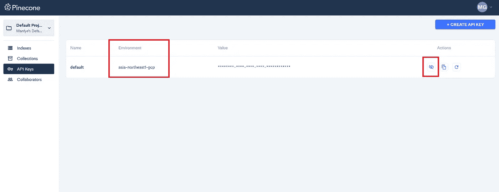

# 与 Pinecone 的 CRUD 操作

> 原文：[`towardsdatascience.com/crud-with-pinecone-ee6b6f8b54e8`](https://towardsdatascience.com/crud-with-pinecone-ee6b6f8b54e8)

## 向量数据库

## 从传统数据库的角度入门向量数据库的简易指南

[](https://manfyegoh.medium.com/?source=post_page-----ee6b6f8b54e8--------------------------------)[](https://towardsdatascience.com/?source=post_page-----ee6b6f8b54e8--------------------------------) [Manfye Goh](https://manfyegoh.medium.com/?source=post_page-----ee6b6f8b54e8--------------------------------)

·发表在 [Towards Data Science](https://towardsdatascience.com/?source=post_page-----ee6b6f8b54e8--------------------------------) ·7 分钟阅读·2023 年 5 月 8 日

--


图片来源于 Pexels 的 Brett Sayles

机器学习应用的快速增长和人工智能的进步推动了对专门数据存储解决方案的需求。

向量数据库由于能够执行高效的相似性搜索并支持复杂的数据结构，已经成为处理大规模高维数据的热门选择。[Pinecone](https://www.pinecone.io/) 最近在开发者和数据科学家中越来越受欢迎，作为一种可扩展且高效的向量数据库解决方案。

我发现有很多人教授如何使用 Pinecone，但没有人从传统数据库的角度描述它，比如如何与传统 SQL 数据库进行比较。

在本文中，我们将从传统数据库的角度清晰地理解 Pinecone 中的 CRUD（创建、读取、更新和删除）操作。我们将深入探讨向量数据库与传统数据库之间的差异，探讨如何利用向量数据库来优化现代应用中的数据管理。

> 本文的代码[可在这里获取](https://github.com/manfye/medium-publication/blob/main/Pinecone%20Medium%20Article.ipynb)

## 什么是向量数据库？

向量数据库是一种专门设计用于存储、管理和查询以向量表示的高维数据的数据库。这些数据库在需要高效相似性搜索的应用中非常有用，例如推荐系统、图像和文本搜索引擎，以及自然语言处理任务。

在向量数据库中，数据点表示为高维空间中的向量，它们之间的关系通过距离度量（如欧氏距离、余弦相似度或曼哈顿距离）来衡量。通过索引这些向量和优化搜索算法，向量数据库可以迅速执行相似性搜索，即使在庞大的数据集中。

与关注关系型或基于文档的存储的传统数据库不同，向量数据库强调数据点之间空间关系的重要性。这种独特的关注使得向量数据库能够在需要快速识别数据集内相似项的应用中提供高性能、准确的搜索结果。

要开始使用，这里有一个我们如何与向量数据库互动的示意图：


传统数据库与向量数据库的操作模式。图片由作者提供

## 开始使用 Pinecone

在你获得对 Pinecone 的访问权限后，使用以下设置创建新的索引：


创建新的索引。图片由作者提供

指定你的索引名称和所需的维度。在我的例子中，我将使用“manfye-test”以及维度为 300 的索引。点击“创建索引”，索引将如下所示：


创建的索引。图片由作者提供

> 索引就像 SQL 中的表格，你可以像在 SQL 中一样在索引中进行 CRUD 操作。

在开始我们的 CRUD 操作之前，让我们收集所有必需的资源：

安装所需的软件包，其中包括 pinecone-client（允许你与 pinecone 互动）和 sentence_transformers（帮助你对数据进行向量化）：

```py
!pip install pinecone-client
!pip install sentence_transformers
```

你可以通过 Pinecone 仪表盘中的“**API KEY**”标签获取你的 Pinecone **API 密钥**和**环境名称**。



获取 API 密钥和环境名称。图片由作者提供

## 使用 Pinecone 索引

在继续之前，你需要了解几个处理功能，就像设置 SQL 连接一样：

a) 连接到 Pinecone 服务器和索引

```py
import itertools
import pinecone

#Connecting to Pinecone Server
api_key = "YOUR_API_KEY"

pinecone.init(api_key=api_key, environment='YOUR_ENV_IN_DASHBOARD')

#Connect to your indexes
index_name = "manfye-test"

index = pinecone.Index(index_name=index_name)
```

b) 探索你的索引

```py
# Getting Index Details
pinecone.describe_index(index_name)

# Return:
# IndexDescription(name='manfye-test', metric='cosine', replicas=1, dimension=300.0, shards=1, pods=1, pod_type='s1.x1', status={'ready': True, 'state': 'Ready'}, metadata_config=None, source_collection='')

index.describe_index_stats()

# Return:
# {'dimension': 300,
# 'index_fullness': 0.0,
# 'namespaces': {},
# 'total_vector_count': 0}
```

*describe_index_stats* 在你想了解索引中有多少数据时非常有用。

## **数据集准备**

首先，我们将生成如下的投诉数据集，这将是我们操作的主要数据：

```py
import pandas as pd

data = {
    'ticketno': [1001, 1002, 1003, 1004, 1005, 1006, 1007, 1008, 1009, 1010],
    'complains': [
        'Broken navigation button on the website',
        'Incorrect pricing displayed for a product',
        'Unable to reset password',
        'App crashes on the latest iOS update',
        'Payment processing error during checkout',
        'Wrong product delivered',
        'Delayed response from customer support',
        'Excessive delivery time for an order',
        'Difficulty in finding a specific product',
        'Error in applying a discount coupon'
    ]
}

df = pd.DataFrame(data)
```

## C — 在索引中创建数据

为了在向量数据库中创建数据，我们首先需要通过一种称为向量嵌入的技术将数据转换为向量。向量嵌入有多种方法，其中一种著名的方法是使用 OpenAI 嵌入 API。

然而，为了不使本文变得复杂，我们将使用 SentenceTransformer 包来进行嵌入。该包会自动下载所需的模型“*average_word_embeddings_glove.6B.300d*”

```py
from sentence_transformers import SentenceTransformer

model = SentenceTransformer("average_word_embeddings_glove.6B.300d")

df["question_vector"] = df.complains.apply(lambda x: model.encode(str(x)).tolist())
```

代码将创建一个“question_vector”列，其中包含嵌入向量。请注意，所有的单词都被转换成了数字。


结果向量。图片由作者提供

最后，通过块上传数据（**upsert**）到索引中：

```py
def chunks(iterable, batch_size=100):
    it = iter(iterable)
    chunk = tuple(itertools.islice(it, batch_size))
    while chunk:
        yield chunk
        chunk = tuple(itertools.islice(it, batch_size))

for batch in chunks([(str(t), v) for t, v in zip(df.ticketno, df.question_vector)]):
    index.upsert(vectors=batch) 
```

现在用*index.describe_index_stats()*检查你的索引：

```py
index.describe_index_stats()

# Return:
# {'dimension': 300,
# 'index_fullness': 0.0,
# 'namespaces': {'': {'vector_count': 10}},
# 'total_vector_count': 10} 
```

请注意，向量数量已增加到 10，恭喜你将数据集上传到向量数据库中。

## R — 检索向量

读取向量上下文参考两个函数，第一个是读取函数，你传入数据的 ID，Pinecone 会返回存储的向量：

```py
index.fetch(["1010","1009"])
```

数据检索很简单，只需使用*index.fetch([<IDs List>])*，只需输入你要检索的 ID 列表，Pinecone 将返回相应的向量。

第二个操作包括返回与你的查询匹配的相似数据：

```py
query_questions = [
    "navigation button",
]

query_vectors = [model.encode(str(question)).tolist() for question in query_questions]

query_results = index.query(queries=query_vectors, top_k=5, include_values=False)
```

在上面的代码中，我让 Pinecone 查找“导航按钮”的相似结果，并返回前 5 个最相似的结果（top_k = 5），如下所示：


Pinecone 的查询结果。图片由作者提供

请注意，默认情况下，Pinecone 不会返回值，除非在*index.query()*参数中指定*include_values=True*。从上面的结果可以看出，相似度得分和前 5 个相似结果的 ID。

接下来的步骤是将结果转换成表格，并将其合并回主数据库。代码如下：

```py
# Extract matches and scores from the results
matches = []
scores = []
for match in query_results['results'][0]['matches']:
    matches.append(match['id'])
    scores.append(match['score'])

# Create DataFrame with only matches and scores
matches_df = pd.DataFrame({'id': matches, 'score': scores})

# Match the result dataframe to main dataframe
df["ticketno"] = df["ticketno"].astype(str)
matches_df.merge(df,left_on="id",right_on="ticketno")
```

结果匹配表如下所示，显然，投诉 1001 是关于导航按钮的，相似度得分为 0.81，其余的相似度得分较低，这可能是由于我们数据集的规模：


检索到的相似查询数据框。图片由作者提供

## U — 更新向量

要更新现有向量，只需重复创建步骤，并使用更新后的向量。用 upsert 函数覆盖相同 ID 的数据：

```py
 index.upsert(vectors=batch)
```

## D — 删除向量

按 ID 删除：

```py
index.delete(ids=["id-1", "id-2"], namespace='')
```

要删除所有内容并重新开始：

```py
index.delete(deleteAll='true', namespace="")
```

## Pinecone 的限制和替代方案

虽然 Pinecone 提供了一个易于使用的向量数据库，适合初学者，但重要的是要了解其局限性。免费层使用 p1 Pod，仅允许在 768 维向量中存储约 1,000,000 行数据。对于更大规模的应用程序或更具挑战性的用例，这可能不足够。

此外，Pinecone 的付费计划可能非常昂贵，这可能不适合所有用户。因此，你可能需要在决定付费计划或扩展应用程序之前，考虑其他替代方案，例如本地托管的[chroma](https://docs.trychroma.com/getting-started)或[Weaviate](https://weaviate.io/)。

## 作者的话

总之，本文提供了从传统数据库的角度理解和执行 Pinecone CRUD 操作的全面指南。

作为作者，我的目标是揭示与矢量数据库交互的过程，并强调矢量数据库独特的功能如何使其成为管理机器学习和 AI 应用中高维数据的强大而高效的解决方案。

通过带你了解创建、读取、更新和删除 Pinecone 索引中的数据的过程，我希望提供了有关如何有效管理和查询矢量数据库数据的宝贵见解。掌握这些知识后，希望你现在能够在自己的项目和应用中充分利用矢量数据库的强大功能。

最后，感谢阅读我的文章。如果你喜欢订阅 Medium 会员，请考虑使用下面的链接。这将为我提供极大的支持，使我能写更多的文章。

[## 使用我的推荐链接加入 Medium - Manfye Goh](https://manfyegoh.medium.com/membership?source=post_page-----ee6b6f8b54e8--------------------------------)

### 阅读 Manfye Goh 的每一个故事（以及 Medium 上成千上万其他作家的故事）。你的会员费直接支持…

[manfyegoh.medium.com](https://manfyegoh.medium.com/membership?source=post_page-----ee6b6f8b54e8--------------------------------)

如果你喜欢我的文章，这里有更多我的文章：

[## 使用 ChatGPT 创建美丽的图表](https://medium.com/geekculture/create-beautiful-diagrams-with-chatgpt-a91f479cdb27?source=post_page-----ee6b6f8b54e8--------------------------------)

### 使用 ChatGPT 和 Mermaid.js 创建和设计美丽的图表

[medium.com](https://medium.com/geekculture/create-beautiful-diagrams-with-chatgpt-a91f479cdb27?source=post_page-----ee6b6f8b54e8--------------------------------)

## 参考文献

1.  [Pinecone 文档](https://docs.pinecone.io/docs/query-data)
