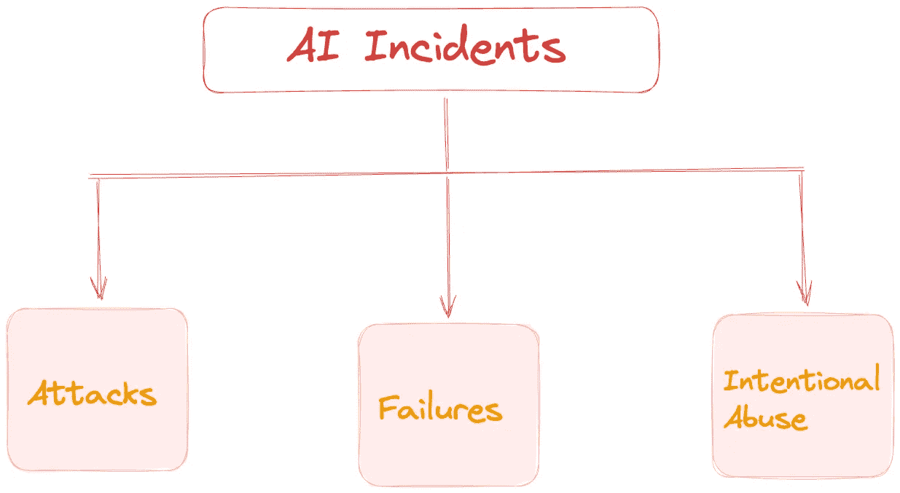
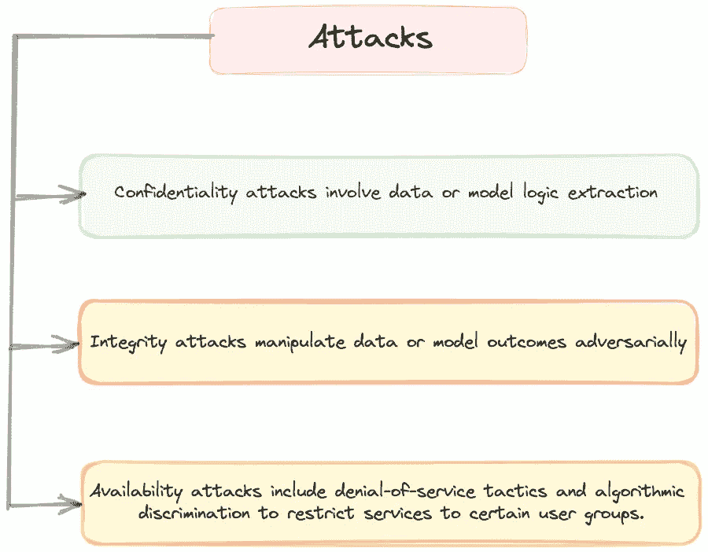
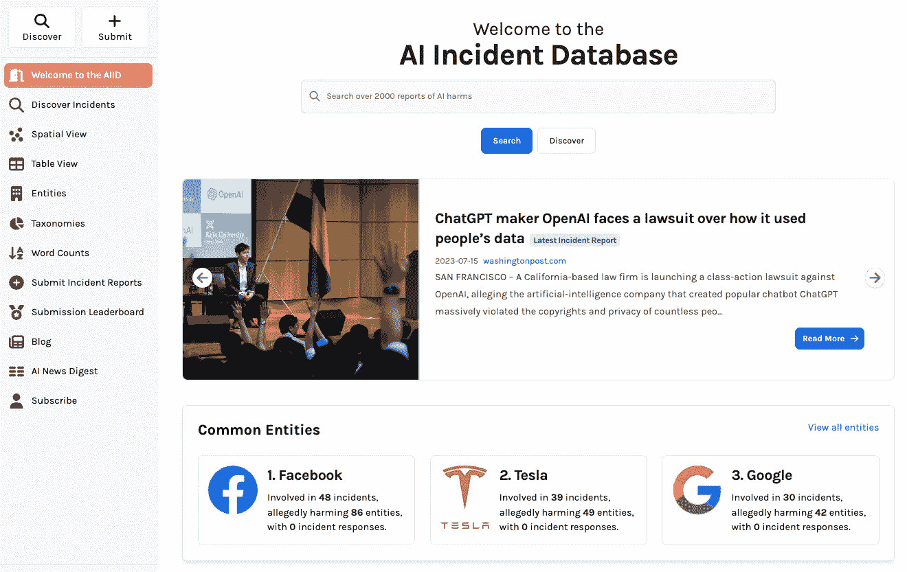
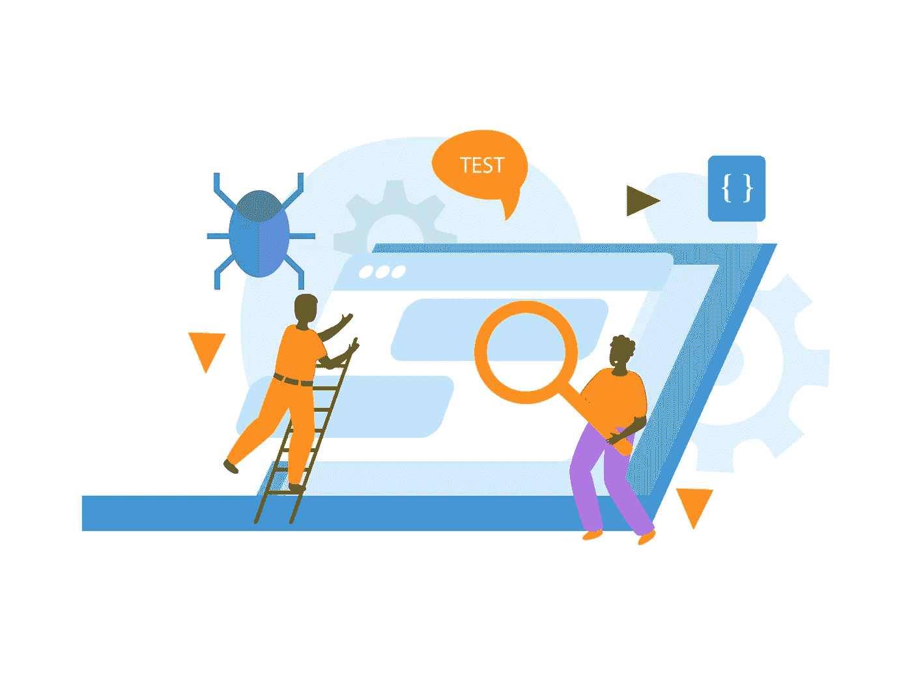

# 机器学习风险管理的文化能力

> 原文：[`towardsdatascience.com/cultural-competencies-for-machine-learning-risk-management-c38616c2ccdf`](https://towardsdatascience.com/cultural-competencies-for-machine-learning-risk-management-c38616c2ccdf)

## *组织文化是负责任的人工智能的一个重要方面。*

 [Parul Pandey](https://pandeyparul.medium.com/?source=post_page-----c38616c2ccdf--------------------------------)

·发表于 [Towards Data Science](https://towardsdatascience.com/?source=post_page-----c38616c2ccdf--------------------------------) ·阅读时间 8 分钟 ·2023 年 9 月 15 日

--

[由 Google DeepMind 提供的照片](https://www.pexels.com/photo/an-artist-s-illustration-of-artificial-intelligence-ai-this-image-depicts-ai-safety-research-to-prevent-the-misuse-and-encourage-beneficial-uses-it-was-created-by-artist-khyati-trehan-17485632/) 在 Pexels 上免费提供

> 在进步的竞赛中，我们必须小心翼翼，因为工程和数据科学上的匆忙可能会摧毁的不仅仅是代码。

想象一个人工智能（AI）系统可以万无一失的世界，它们能够无故障地完美执行任务。这听起来像是科幻梦，对吗？欢迎来到人工智能的现实世界，事情并不总是如计划般顺利。负责任的人工智能实践的一个核心部分涉及预防和处理我们称之为‘***人工智能事件***’的情况。本文讨论了可以防止和缓解人工智能事件的文化能力，重点在于推动负责任的人工智能实践。随后，我们将在未来的文章中探讨相关的业务流程，以提供对这一重要话题的全面视角。

## 关于这一系列的说明

> 在我们开始这一系列文章时，提供背景信息是重要的。我是‘[**高风险应用中的机器学习**](https://www.amazon.in/Machine-Learning-High-Risk-Applications-Responsible/dp/1098102436)’的共同作者之一，另外两位作者是 [Patrick Hall](https://medium.com/@jphall_22520) 和 [James Curtis](https://james-curtis.medium.com/)。这一系列旨在提供一本简洁、读者友好的书籍内容补充。每篇文章中，我们旨在提炼书中的关键见解、概念和实际策略，将其浓缩成易于消化的部分，使这些知识能够被更广泛的读者所接受。

# 定义人工智能事件

在深入探讨机器学习安全之前，处理人工智能事件至关重要，因为我们无法有效缓解我们不了解的情况。人工智能事件涵盖了任何可能造成伤害的人工智能系统的结果。这些事件的严重性自然会因造成的损害程度而异。这些事件可能从相对较小的不便，比如[购物中心安保机器人跌下楼梯](https://www.youtube.com/watch?v=4Pwx3U4vJKw)，到更为灾难性的事件，例如[无人驾驶汽车导致行人遇难](https://www.nytimes.com/2018/03/19/technology/uber-driverless-fatality.html)以及[大量医疗资源从急需者那里转移](https://www.nature.com/articles/d41586-019-03228-6)。

> 人工智能事件涵盖了任何可能造成伤害的人工智能系统的结果。

我们可以将人工智能事件分为三个主要类别：

*人工智能事件分类（作者根据"*[*AI 失败时该怎么办*](https://www.oreilly.com/radar/what-to-do-when-ai-fails/)*"进行调整，已获许可）*

+   **攻击 —** 机器学习系统的许多部分，如软件和预测工具，都容易受到网络攻击和内部攻击。一旦发生攻击，我们就会失去控制，攻击者可能有自己的目标，涉及准确性、偏见、隐私、可靠性等方面。研究人员已经广泛记录了这些攻击类别，即保密性、完整性和可用性攻击。

机器学习攻击类型 | 图片由作者提供

+   **失败 —** 失败指的是人工智能系统中的问题，通常包括算法偏见、安全和性能缺陷、数据隐私泄露、透明度不足或第三方系统组件的不足。

+   **滥用 —** 人工智能工具可能被具有恶意意图的人滥用。黑客经常利用人工智能来增强他们的攻击，例如在自主无人机袭击中。此外，一些政府将人工智能用于种族 Profiling，突显了人工智能技术的广泛滥用。

# 人工智能事件目录：人工智能事件数据库

人工智能事件可以作为推动公司负责任技术进步的催化剂。在开发机器学习系统时，至关重要的是将当前计划与过去的事件进行交叉检查，以主动防止潜在的未来事件。这与正在进行的努力的主要目标一致，即建立人工智能事件数据库及其相关出版物。一个很好的例子是[人工智能事件数据库](https://incidentdatabase.ai/)。

[`incidentdatabase.ai/`](https://incidentdatabase.ai/)

根据人工智能事件数据库网站的描述，他们的使命是明确的：

*“AI 事件数据库致力于索引人工智能系统部署在现实世界中造成的伤害或近乎伤害的集体历史。像航空和计算机安全领域的类似数据库一样，AI 事件数据库旨在从经验中学习，以便我们可以防止或减轻不良结果。”*

这里的基本思想是，像其他领域一样，AI 也可以通过从过去的错误中学习，以避免未来的重复。为了有效实现这一点，保持对这些失败的准确记录是至关重要的。

# 通过文化能力减轻机器学习风险

组织内部的文化在确保负责任的 AI 实践中发挥着关键作用。本文将主要探讨一些文化策略以实现这一目标。在接下来的文章中，我们还将介绍减轻 AI 相关风险的其他方法，包括业务流程和模型风险管理方面。验证、审计和事件响应团队在开发者之外也是至关重要的。

## *1\. 组织责任*

[图片由 vectorjuice 提供于 Freepik](https://www.freepik.com/free-vector/project-delivery-abstract-concept-illustration_20770433.htm#query=responsibility&position=4&from_view=search&track=sph)

在组织中实现负责任的 AI 实践依赖于问责制、文化以及对[**模型风险管理 (MRM)**](https://www.fdic.gov/news/financial-institution-letters/2017/fil17022a.pdf)的遵守（我们将在即将到来的文章中讨论）。如果对机器学习系统的失败、攻击或滥用没有后果，安全性和性能可能会被忽视。MRM 的关键文化原则包括书面政策和程序、独立专家的有效挑战、负责任的领导（如首席模型风险官），以及为负责任的机器学习实施而不是仅仅为了快速开发对齐激励措施。

小型组织可以指定个人或团队负责问责，以防止事件发生并奖励成功的系统。集体责任可能导致无人对机器学习风险和事件负责。

> *如果机器学习系统导致事件，重要的是有个人或团队承担责任，并在系统运行良好时给予奖励。如果组织假设每个人都对机器学习风险和人工智能事件负责，那么实际上没有人负责——《高风险应用的机器学习》，第一章。*

# 2\. 有效变革的文化

[图片由 jcomp 提供于 Freepik](https://www.freepik.com/free-photo/hand-word-chance-business_5598002.htm#query=Culture%20of%20Effective%20Change&position=3&from_view=search&track=ais)

强有力的有效变革文化涉及主动质疑和审查机器学习（ML）系统开发中的各个步骤。在更广泛的组织背景下，促进对机器学习系统设计的严肃探究文化至关重要。这种文化增加了开发成功的机器学习系统和产品的可能性，同时也防止问题升级为有害事件。值得注意的是，有效的挑战应始终具有建设性和尊重，适用于所有参与机器学习系统开发的人员。

> 有效的挑战推动创新并保障机器学习开发的进展

为了有效地实施挑战，需要有结构化的安排。这可能包括定期会议，可能是每周一次，在这些会议上对当前设计决策进行严肃审查，并认真考虑替代设计选择。这种结构化的方法有助于确保有效挑战的文化成为组织机器学习开发过程的核心部分。

# *3\. 多样化且经验丰富的团队*

照片由[Alexander Grey](https://unsplash.com/@sharonmccutcheon?utm_source=unsplash&utm_medium=referral&utm_content=creditCopyText)提供，来源于[Unsplash](https://unsplash.com/photos/sbE9zbcuiZs?utm_source=unsplash&utm_medium=referral&utm_content=creditCopyText)

多样化的团队对于在设计、开发和测试机器学习系统时获得新视角至关重要。许多例子表明，数据科学家忽视机器学习系统的人口多样性会导致不良结果。增加机器学习团队中的人口多样性是解决这些疏忽的一个潜在补救措施。

> 在多样性中我们发现创新，在专业知识中我们确保安全，两者共同指引负责任的人工智能进步。

忽视领域专家是一个危险的赌博，因为他们带来宝贵的见解，并充当安全网，避免因对领域特定数据或结果的误解而导致潜在灾难。社会科学专家也适用同样的原则。无数实例表明，忽视这些专家的危险，不论是试图[自动化需要专业知识的决策](https://www.wired.com/story/tech-needs-to-listen-to-actual-researchers/)还是[完全忽视他们的集体智慧](https://www.technologyreview.com/2020/06/23/1004333/ai-science-publishers-perpetuate-racist-face-recognition)。

# 4\. *自饮自酿*

[图像来源于 macrovector，Freepik](https://www.freepik.com/free-vector/qa-engineer-flat-concept-with-software-developer-symbols-flat-vector-illustration_37366036.htm#query=Testing&position=11&from_view=search&track=sph)

"**喝自己的香槟**" 是在组织内测试我们自己软件或产品的做法，类似于 "**吃自己的狗粮**"。这是一种预 Alpha 或预 Beta 测试方法，有助于在影响客户或公众之前发现部署复杂性。这种方法对识别像概念漂移、算法歧视、捷径学习和不足规范这些通常逃避标准机器学习开发过程的难题至关重要。

> 如果它不适合我们的组织，那么它可能还未准备好部署。这是上菜前的试饮。

# *5\. 快速行动与打破常规*

[图片来源：rawpixel.com，来自 Freepik](https://www.freepik.com/free-photo/caution-alert-critical-error-failure-notice_16482263.htm#query=careful&position=8&from_view=search&track=sph)

在工程和数据科学领域，"快速行动，打破常规"的口号通常占据中心位置。然而，这种方法可能很危险，特别是当它应用于关键的机器学习系统，如自动驾驶汽车、金融、医疗等领域时。即使是一个小故障也可能导致大规模的严重危害。

> 在进步的竞赛中，我们必须谨慎行事，因为在工程和数据科学中的急功近利可能会摧毁的不仅仅是代码。

我们必须转变思维方式，以避免这些风险。我们应该不仅关注模型的准确性，还要优先了解我们工作的影响和潜在风险。

# 结论

总结来说，我们对 AI 事件、文化能力和风险缓解策略的探索突显了负责任的 AI 开发的重要性。培养组织内有效挑战和问责制的文化，确保了在识别和纠正潜在陷阱时的积极姿态。此外，整合多样化且经验丰富的团队和严格的内部测试实践，强化了负责任 AI 实施的基础。最后，必须优先考虑全面的风险评估而非急功近利。这些措施共同指引我们走向一个 AI 系统不仅在技术上先进，而且在伦理上可靠的未来，为社会的进步提供有价值的工具。

***> 阅读本系列的下一篇文章 >***

 [## 机器学习风险管理的组织流程

### 组织流程是机器学习系统可靠性的关键非技术决定因素。

[## 跨域桥接：将金融、隐私和软件最佳实践融入机器学习风险管理](https://towardsdatascience.com/organizational-processes-for-machine-learning-risk-management-14f4444dd07f?source=post_page-----c38616c2ccdf--------------------------------) 

### 理解超越传统模型风险管理的策略

[## 跨域桥接：将金融、隐私和软件最佳实践融入机器学习风险管理](https://towardsdatascience.com/bridging-domains-infusing-financial-privacy-and-software-best-practices-into-ml-risk-management-3de1fa1e6dd2?source=post_page-----c38616c2ccdf--------------------------------)

# 参考资料与进一步阅读

+   [AI 失败时该怎么办](https://www.oreilly.com/radar/what-to-do-when-ai-fails/)

+   [迈向可信赖的 AI 开发：支持可验证声明的机制](https://arxiv.org/pdf/2004.07213.pdf)

+   [高风险应用的机器学习，第一章 — 现代机器学习风险管理](https://www.amazon.in/Machine-Learning-High-Risk-Applications-Responsible/dp/1098102436)
