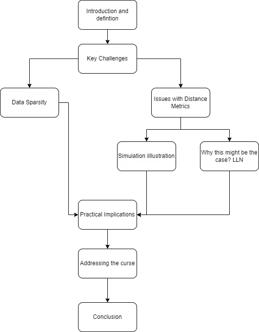
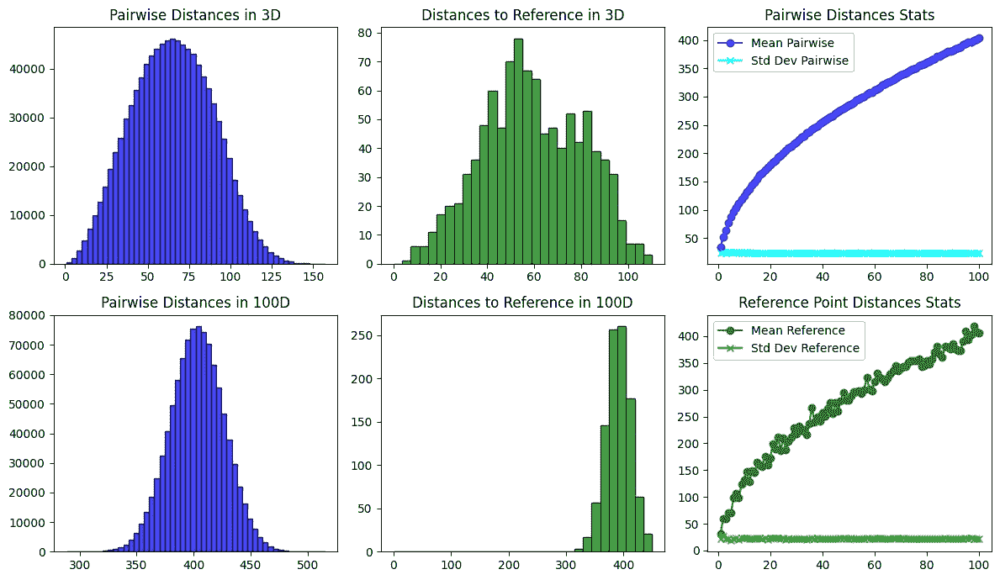
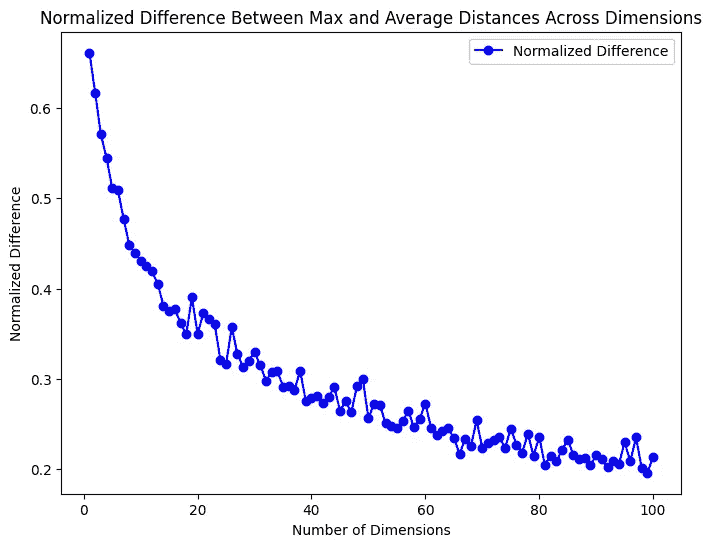
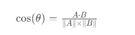

# **维度诅咒：直观探索**

> 原文：[`towardsdatascience.com/curse-of-dimensionality-an-intuitive-exploration-1fbf155e1411?source=collection_archive---------3-----------------------#2023-12-30`](https://towardsdatascience.com/curse-of-dimensionality-an-intuitive-exploration-1fbf155e1411?source=collection_archive---------3-----------------------#2023-12-30)

[](https://medium.com/@salih.salih?source=post_page-----1fbf155e1411--------------------------------)[](https://towardsdatascience.com/?source=post_page-----1fbf155e1411--------------------------------) [Salih Salih](https://medium.com/@salih.salih?source=post_page-----1fbf155e1411--------------------------------)

·

[关注](https://medium.com/m/signin?actionUrl=https%3A%2F%2Fmedium.com%2F_%2Fsubscribe%2Fuser%2F2037cbb08e24&operation=register&redirect=https%3A%2F%2Ftowardsdatascience.com%2Fcurse-of-dimensionality-an-intuitive-exploration-1fbf155e1411&user=Salih+Salih&userId=2037cbb08e24&source=post_page-2037cbb08e24----1fbf155e1411---------------------post_header-----------) 发表在 [Towards Data Science](https://towardsdatascience.com/?source=post_page-----1fbf155e1411--------------------------------) ·11 分钟阅读·2023 年 12 月 30 日[](https://medium.com/m/signin?actionUrl=https%3A%2F%2Fmedium.com%2F_%2Fvote%2Ftowards-data-science%2F1fbf155e1411&operation=register&redirect=https%3A%2F%2Ftowardsdatascience.com%2Fcurse-of-dimensionality-an-intuitive-exploration-1fbf155e1411&user=Salih+Salih&userId=2037cbb08e24&source=-----1fbf155e1411---------------------clap_footer-----------)

--

[](https://medium.com/m/signin?actionUrl=https%3A%2F%2Fmedium.com%2F_%2Fbookmark%2Fp%2F1fbf155e1411&operation=register&redirect=https%3A%2F%2Ftowardsdatascience.com%2Fcurse-of-dimensionality-an-intuitive-exploration-1fbf155e1411&source=-----1fbf155e1411---------------------bookmark_footer-----------)

照片由 Mathew Schwartz 提供，来源于 Unsplash

# **介绍**

在上一篇文章中，我们讨论了数据在高维空间中的惊人行为。我们发现体积在空间的角落里以一种奇怪的方式累积，我们模拟了一个内切在超立方体中的超球体来研究这一点，观察到随着维度的增加，它们的体积比有趣地减少了。展示多维思维优势的例子有 DVD 纸实验和支持向量机(SVM)中的核技巧。

今天，我们将探讨一些高维数据的难点，这些难点被称为维度诅咒。我们的目标是对这一概念及其实际影响有一个直观的理解。下图概述了我们文章的结构。



作者插图

## 理解维度诅咒

“维度诅咒”是由**理查德·E·贝尔曼**在 1960 年代首次使用的术语。它起初源于贝尔曼对动态优化的观点，后来成为理解高维空间复杂性的一个基本概念。

很好，但“维度诅咒”是什么？

> 这本质上是指在处理高维数据时遇到的困难和独特特性（在我们的案例中，这指的是数据集中具有许多特征、列或属性）。这些空间远远超出了我们在三维空间中的日常经验。

当我们增加数据集的维度时，它所占据的体积会以指数级扩展。这最初可能看起来是一个优势——更多的空间可能意味着更多的数据和可能更多的见解？然而，事实并非如此，因为维度的增加带来了许多挑战，这些挑战改变了我们处理和理解这些高维数据的方式。

# 主要挑战

从低维数据到高维数据的转变面临着几个严峻的挑战。其中两个尤为突出，因为它们的影响最大：1) 数据稀疏性；2) 距离度量问题。它们每一个都使高维数据的分析变得更加复杂。

## 数据稀疏性：空旷海洋中的小岛

高维空间中的数据稀疏性就像是辽阔海洋中的几个小岛。当维度增加时，在低维空间中彼此接近的数据点会变得越来越分离。这是因为每新增一个维度，空间的扩展量是指数级增长的。想象一下一个立方体变成一个超立方体；它的角落远离中心，使得内部变得更加空旷。这种不断增长的空旷感就是我们所称的数据稀疏性。

许多数据分析技术在面对稀疏性时都会遇到困难。例如，许多聚类算法依赖于相互接近的数据点来形成有意义的簇。然而，当数据点变得过于分散时，这些算法就会面临困难。

## 距离度量问题：当接近失去意义时

在高维空间中，距离度量遇到了显著的挑战。像欧几里得或曼哈顿距离这样的度量，在低维空间中用于测量数据点之间的接近度，但在这些扩展空间中，它们的效果减弱。距离开始趋于收敛。这意味着大多数点对之间的距离变得几乎相等，也与参考点的距离接近。这种收敛使得区分近邻和远点变得更加困难。

在分类等任务中，距离测量对新数据点的分类至关重要，这些度量在这种情况下效果会降低。因此，算法的性能下降，导致预测和分析的准确性降低。

为了更好地理解在高维空间中距离行为的变化，让我们进行一个简单的模拟。我们将生成低维和高维空间中的随机点。这将使我们能够观察和比较距离的分布，展示这些距离如何随着维度的增加而演变。

```py
import numpy as np
import matplotlib.pyplot as plt
from scipy.spatial.distance import pdist

def generate_points(dimensions, num_points, range_min, range_max):
    return np.random.uniform(range_min, range_max, (num_points, dimensions))

def calculate_pairwise_distances(points):
    distances = np.sqrt(((points[:, np.newaxis, :] - points[np.newaxis, :, :]) ** 2).sum(axis=-1))
    np.fill_diagonal(distances, np.nan)  # Ignore self-distances by setting them to NaN
    return distances

def calculate_distances_from_reference(points, reference_point):
    distances = np.sqrt(((points - reference_point) ** 2).sum(axis=1))
    return distances

def calculate_stats_for_dimensions(num_points, dimensions_range, range_min, range_max):
    means_pairwise = []
    stds_pairwise = []
    means_ref = []
    stds_ref = []

    for dim in dimensions_range:
        points = generate_points(dim, num_points, range_min, range_max)
        pairwise_distances = calculate_pairwise_distances(points)
        reference_point = generate_points(dim, 1, range_min, range_max)
        distances_from_ref = calculate_distances_from_reference(points, reference_point)

        means_pairwise.append(np.nanmean(pairwise_distances))
        stds_pairwise.append(np.nanstd(pairwise_distances))
        means_ref.append(np.mean(distances_from_ref))
        stds_ref.append(np.std(distances_from_ref))

    return means_pairwise, stds_pairwise, means_ref, stds_ref

def plot_histograms_and_stats(num_points, dimensions_range, range_min, range_max):
    fig, axs = plt.subplots(2, 3, figsize=(12, 7), tight_layout=True)

    # Plotting histograms for 3D and 100D
    for i, dim in enumerate([3, 100]):
        points = generate_points(dim, num_points, range_min, range_max)
        pairwise_distances = calculate_pairwise_distances(points)
        reference_point = generate_points(dim, 1, range_min, range_max)
        distances_from_ref = calculate_distances_from_reference(points, reference_point)

        axs[i, 0].hist(pairwise_distances[~np.isnan(pairwise_distances)], bins=50, alpha=0.7, color='blue', edgecolor='black')
        axs[i, 0].set_title(f'Pairwise Distances in {dim}D')
        axs[i, 1].hist(distances_from_ref, bins=30, alpha=0.7, color='green', edgecolor='black', range=(0, max(distances_from_ref)))
        axs[i, 1].set_title(f'Distances to Reference in {dim}D')

    # Calculating and plotting mean and std deviation trends across dimensions
    means_pairwise, stds_pairwise, means_ref, stds_ref = calculate_stats_for_dimensions(num_points, dimensions_range, range_min, range_max)

    # Plotting mean and std deviation graphs for pairwise distances
    axs[0, 2].plot(dimensions_range, means_pairwise, label='Mean Pairwise', marker='o', color='blue')
    axs[0, 2].plot(dimensions_range, stds_pairwise, label='Std Dev Pairwise', marker='x', color='cyan')
    axs[0, 2].set_title('Pairwise Distances Stats')

    # Plotting mean and std deviation graphs for distances to reference point
    axs[1, 2].plot(dimensions_range, means_ref, label='Mean Reference', marker='o', color='green')
    axs[1, 2].plot(dimensions_range, stds_ref, label='Std Dev Reference', marker='x', color='lime')
    axs[1, 2].set_title('Reference Point Distances Stats')

    axs[0, 2].legend()
    axs[1, 2].legend()

    plt.show()

plot_histograms_and_stats(1000, range(1, 101), 1, 100)
```



图片由作者提供

代码输出显示了维度间距离的变化。在 3D 中，点之间有不同的距离。在 100D 中，点之间的距离趋于相似。右侧的图表也显示，随着维度的增加，点之间的平均距离增大，但标准差与 2D 或 3D 空间中的大致相同。

另一个需要注意的是，随着维度的增加，点之间的平均距离变得更大，并接近最大距离。这是因为大部分空间集中在角落里。

为了更好地理解这一点，我们可以模拟高达 100 维的随机点。这将使我们能够比较平均距离与最大距离。

```py
import numpy as np
import matplotlib.pyplot as plt
from scipy.spatial.distance import pdist

def generate_points(dimensions, num_points, range_min, range_max):
    return np.random.uniform(range_min, range_max, (num_points, dimensions))

def calculate_distances_stats(points):
    # Compute pairwise distances
    distances = pdist(points)

    # Calculate average and maximum distance
    average_distance = np.mean(distances)
    max_distance = np.max(distances)

    return average_distance, max_distance
def plot_normalized_difference(num_points, dimensions_range, range_min, range_max):
    normalized_differences = []

    for dim in dimensions_range:
        points = generate_points(dim, num_points, range_min, range_max)
        average_distance, max_distance = calculate_distances_stats(points)
        normalized_difference = (max_distance - average_distance) / max_distance
        normalized_differences.append(normalized_difference)

    plt.figure(figsize=(8, 6))
    plt.plot(dimensions_range, normalized_differences, label='Normalized Difference', marker='o', color='blue')
    plt.xlabel('Number of Dimensions')
    plt.ylabel('Normalized Difference')
    plt.title('Normalized Difference Between Max and Average Distances Across Dimensions')
    plt.legend()
    plt.show()
plot_normalized_difference(500, range(1, 101), 0, 1)
```



图片由作者提供

图表显示，随着维度的增加，平均距离越来越接近最大距离。我们在这里使用了标准化以确保尺度的准确性。

> 理解绝对距离和相对距离之间的区别非常重要。虽然绝对距离通常随着维度的增加而增加，但相对差异更为重要。像 K-means 或 DBSCAN 这样的聚类算法通过查看点相对于彼此的位置来工作，而不是它们的确切距离。这使我们能够发现如果仅仅看距离可能会遗漏的模式和关系。

但这引出了一个有趣的问题：为什么在高维空间中，点对之间的距离在增加维度时趋于相同？是什么导致了这种情况的发生？


图片由 Aakash Dhage 提供，来源于 Unsplash

为了理解为什么高维空间中的点对变得等距，我们可以查看大数法则（LLN）。这一统计原理表明，随着样本大小或维度的增加，我们的观察平均值会越来越接近期望值。

让我们考虑一个公平的六面骰子的掷骰子例子。掷骰子的期望均值是 3.5，这是所有可能结果的平均值。最初，仅有几次掷骰子，比如 5 次或 10 次，平均值可能会因为随机性而与 3.5 有显著差异。但当我们将掷骰子的次数增加到几百次或几千次时，平均掷骰子值会逐渐接近 3.5。这一现象，即多次试验的平均值与期望值对齐，展示了大数法则（LLN）的本质。它表明，尽管单个结果是不可预测的，但在多次试验中，平均值变得非常可预测。

那么，这与高维空间中的距离有什么关系呢？

在 n 维空间中，两点之间的欧几里得距离是通过对每个维度的平方差进行求和来计算的。我们可以将每个平方差看作一个随机变量，类似于掷骰子。随着维度（或掷骰子次数）的增加，这些‘掷骰子’的总和会越来越接近一个期望值。

大数法则的一个关键要求是随机变量的独立性。在高维向量中，这种独立性可以通过一个有趣的几何属性来显示：**这些向量往往几乎是正交的。**

```py
import numpy as np

def test_orthogonality(dimensions, n_trials):
    for i in range(n_trials):
        # Generate two random vectors
        v1 = np.random.randn(dimensions)
        v2 = np.random.randn(dimensions)

        # Calculate dot product
        dot_product = np.dot(v1, v2)

        # Calculate magnitudes
        magnitude_v1 = np.linalg.norm(v1)
        magnitude_v2 = np.linalg.norm(v2)

        # Calculate the cosine of the angle
        cos_theta = dot_product / (magnitude_v1 * magnitude_v2)

        # Check if vectors are almost orthogonal
        if np.abs(cos_theta) < 0.1:  # Adjust this threshold as needed
            orthogonality = "Almost Orthogonal"
        else:
            orthogonality = "Not Orthogonal"

        # Calculate angle in degrees
        theta = np.arccos(cos_theta) * (180 / np.pi)  # Convert to degrees

        print(f"Trial {i+1}:")
        print(f"  Dot Product: {dot_product}")
        print(f"  Cosine of Angle: {cos_theta}")
        print(f"  Angle: {theta} degrees")
        print(f"  Status: {orthogonality}")
        print("--------------------------------")

# Try to edit this and notice the near-orthogonality of vectors in higher dimensions
dimensions = 100  # Number of dimensions
n_trials = 10     # Number of trials

test_orthogonality(dimensions, n_trials)
```

尝试运行上面的代码并调整维度/试验次数，你会发现高维空间中的向量几乎是正交的。

两个向量 A 和 B 之间的角度由角度的余弦值决定，这个余弦值来源于它们的点积和大小。公式表示为：



这里，*A*⋅*B*表示向量 A 和 B 的点积，∥*A*∥和∥*B*∥是它们各自的大小。为了使两个向量正交，它们之间的角度必须是 90 度，这使得 cos(*θ*)等于零。通常，这在低维空间中通过点积*A*⋅*B*等于零来实现。

然而，在高维空间中，出现了另一种现象。**点积与向量大小的比率变得如此之小，以至于我们可以认为这些向量是‘几乎正交’的。**

那么，在这个背景下，两个向量‘独立’是什么意思呢？

## 在网格城市中导航：高维独立性的类比

想象你在一个像曼哈顿街道那样的网格布局的城市中。设想你站在一个交叉口，试图到达城市中的另一个点。在这个类比中，每条街道代表高维空间中的一个维度。沿着街道移动就像在改变高维向量中的一个维度。沿着一条街道移动不会影响你在另一条街道上的位置，就像改变一个维度不会影响其他维度一样。

要到达一个特定的交叉口，你需要做出一系列独立的决策，就像在高维空间中计算距离一样。每个决策独立地做出，但最终将你引导到目的地。

这个类比也适用于高维向量中的正交性概念。当向量几乎正交时，它们沿着各自的路径移动，互相之间没有显著影响。这种条件补充了 LLN 对统计独立性的需求。

一个重要的说明：虽然这个 LLN 类比提供了一个有用的视角，但它可能无法捕捉到这种行为背后的所有思想或原因。然而，它作为一个有用的代理，提供了对点对几乎等距原因的理解**可能**。

# 实际意义

维度诅咒问题的一种表现是过拟合。过拟合发生在一个复杂的模型学习到的是噪声而不是数据中的模式。这在高维空间中特别明显，因为那里有很多特征。模型可能会做出虚假的连接或相关性，并在看到新数据时表现不佳（无法进行泛化）。

维度诅咒还使得在大数据集中寻找模式变得困难。高维数据分散且稀疏，因此传统分析方法难以找到有意义的见解。需要一些改变或专门的方法来导航和理解这种类型的数据。

另一个含义是处理高维数据需要大量的计算能力和内存。在低维度下表现良好的算法在维度增加时变得更加复杂和资源密集。这意味着要么需要更强大的硬件，要么需要优化算法以高效处理增加的计算负载。

# **如何应对维度诅咒？**

有几种策略可以应对维度诅咒。一种方法是降低维度，同时保留重要的信息（例如，PCA 算法）。另一种方法是流形学习（可以看作是一种降维方法），它揭示了高维数据中的结构。流形学习的关键思想是，许多高维数据集实际上位于高维空间中的低维流形上（例如，Isomaps）。

> 在这里需要注意的是，-一般来说- 传统的降维技术，如主成分分析（PCA），侧重于以线性方式保留全局数据结构和方差。相比之下，流形学习技术，如等距映射（Isomap），强调揭示数据的潜在非线性结构（流形），旨在保留局部关系和几何特征。

特征选择也是一个选项，通过选择相关特征来提高模型性能。正则化技术通过缩减不重要的特征来防止过拟合。增加样本量也可以有所帮助，尽管这可能并不总是可能的。这些方法可以帮助我们更准确和高效地分析高维数据。

# 结论

维度诅咒是数据科学和机器学习中最重要的问题之一。它发生在处理高维空间时。两个显著的挑战是数据稀疏性和距离度量的问题。这些挑战可能导致机器学习模型过拟合，并使计算变得更加复杂。为了解决这些挑战，可以使用降维、特征选择和正则化技术等策略。

如果你已经读到这里，我想感谢你花时间阅读这篇文章！我希望你觉得这个话题有趣，并且至少激发了你更深入了解高维数据的兴趣。请随时建议任何修改或指出任何错误或不准确之处。
