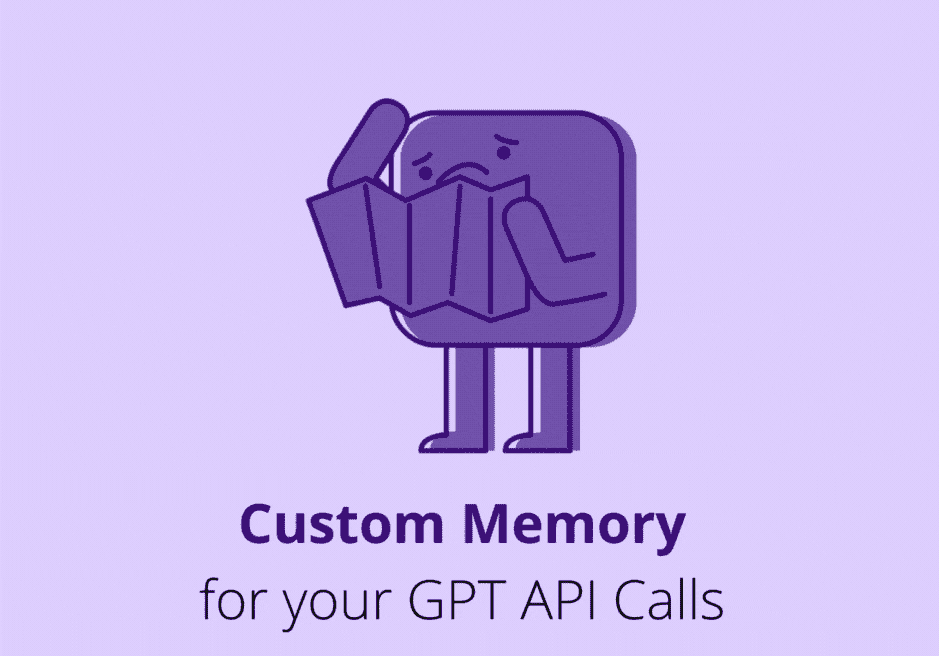
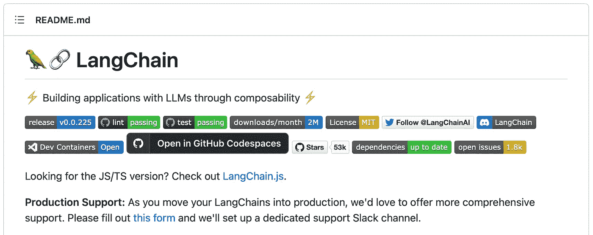

# 自定义 ChatGPT API 的记忆功能

> 原文：[`towardsdatascience.com/custom-memory-for-chatgpt-api-artificial-intelligence-python-722d627d4d6d`](https://towardsdatascience.com/custom-memory-for-chatgpt-api-artificial-intelligence-python-722d627d4d6d)

## LangChain 记忆类型的温和介绍

[](https://medium.com/@andvalenzuela?source=post_page-----722d627d4d6d--------------------------------)[](https://towardsdatascience.com/?source=post_page-----722d627d4d6d--------------------------------) [安德烈亚·巴伦苏埃拉](https://medium.com/@andvalenzuela?source=post_page-----722d627d4d6d--------------------------------)

·发布于 [数据科学前沿](https://towardsdatascience.com/?source=post_page-----722d627d4d6d--------------------------------) ·8 分钟阅读·2023 年 8 月 20 日

--



自制 gif。

如果你曾经使用过 OpenAI API，我相信你已经注意到这一点。

*明白了吗？*

*正确!* 每次调用 ChatGPT API 时，模型不会记住你之前的请求。换句话说：**每次 API 调用都是独立的交互**。

当你需要与模型进行后续交互时，这确实很烦人。聊天机器人就是一个需要后续交互的经典例子。

在本文中，我们将探讨如何在使用 OpenAI API 时为 ChatGPT 提供记忆，以便它记住我们之前的交互。

# 热身！

让我们进行一些与模型的交互，以体验这种默认的无记忆现象：

```py
prompt = "My name is Andrea"
response = chatgpt_call(prompt)
print(response)

# Output: Nice to meet you, Andrea! How can I assist you today?
```

但是当被问到后续问题时：

```py
prompt = "Do you remember my name?"
response = chatgpt_call(prompt)
print(response)

# Output: I'm sorry, as an AI language model, I don't have the ability 
# to remember specific information about individual users.
```

*对，* 实际上模型不会记住我的名字，即使它在第一次交互时被提到。

**注意：** 方法 `chatgpt_call()` 只是 OpenAI API 的一个封装。如果你想查看如何轻松调用 GPT 模型，我们在 [ChatGPT API 调用：温和介绍](https://medium.com/forcodesake/chatgpt-api-calls-introduction-chatgpt3-chatgpt4-ai-d19b79c49cc5) 中已经给出了示例！

有些人通常通过在每次进行新的 API 调用时，提前将之前的对话历史传递给模型来绕过这种无记忆的情况。然而，这种做法并未优化成本，并且对于长对话有一定的限制。

为了为 ChatGPT 创建记忆，使其能够意识到之前的交互，我们将使用流行的 `langchain` 框架。该框架允许你轻松管理 ChatGPT 对话历史，并通过选择适合应用程序的记忆类型来优化它。

# **LangChain 框架**

`langchain`框架的**目的是帮助开发人员构建由大语言模型（LLMs）驱动的应用程序。**



自制截图，来自官方 LangChain [GitHub 仓库](https://github.com/hwchase17/langchain)。

根据他们的[GitHub 描述](https://github.com/hwchase17/langchain)：

> 大语言模型（LLMs）作为一种变革性技术正在出现，使开发人员能够构建以前无法构建的应用程序。然而，仅孤立使用这些 LLMs 通常不足以创建真正强大的应用程序——真正的力量在于将它们与其他计算或知识来源结合起来。
> 
> 该库旨在协助开发这些类型的应用程序。

他们声称，仅使用 LLMs（大语言模型）构建应用程序可能是不够的。我们在仅使用 OpenAI API 与模型进行后续交互时也发现了这一点。

## 框架设置

在 Python 中启动并运行`langchain`库很简单。像任何其他 Python 库一样，我们可以使用`pip`安装它：

```py
pip install langchain
```

LangChain 在幕后调用 OpenAI API。因此，需要将你的 OpenAI API 密钥设置为名为`OPENAI_API_KEY`的环境变量。如果需要获取 OpenAI 密钥的指导，请查看[获取 API 密钥的逐步指南](https://medium.com/forcodesake/a-step-by-step-guide-to-getting-your-api-key-2f6ee1d3e197)。

## LangChain：基础调用

让我们首先设置一个使用 LangChain 调用 ChatGPT 的基本 API。

这个任务相当简单，因为模块`langchain.llms`已经提供了一个`OpenAI()`方法用于此目的：

```py
# Loads OpenAI key from the environment
from langchain.llms import OpenAI
chatgpt = OpenAI()
```

一旦加载了所需的模型，我们需要启动所谓的*对话链*。LangChain 也提供了一个用于此目的的模块：

```py
from langchain.chains import ConversationChain
conversation = ConversationChain(llm=chatgpt)
```

让我们将对话定义为`verbose=True`，以观察模型的推理过程。

最后，`langchain`提供了一个`.predict()`方法来将你想要的提示发送给 ChatGPT，并获取其完成结果。*让我们试试吧！*

```py
conversation.predict(input="Hello, we are ForCode'Sake! A Medium publication with the objective of democratizing the knowledge of data!")
```

*让我们进行一次后续交互！*

```py
conversation.predict(input="Do you remember our name?")

# Output: " Hi there! It's great to meet you. 
# I'm an AI that specializes in data analysis. 
# I'm excited to hear more about your mission in democratizing data knowledge.
# What inspired you to do this?"
```

我们可以看到，使用`**langchain**`时，**模型能够顺利处理后续交互**。

# LangChain 内存类型

正如我们观察到的，LangChain 对话链已经跟踪了声明的`conversation`的`.predict`调用。然而，**默认的对话链会存储我们与模型的每一个交互**。

正如我们在文章开头简要讨论的那样，存储与模型的所有交互可能会**迅速积累大量的令牌，以便每次提示模型时都需要处理**。需要记住的是，ChatGPT 每次交互都有令牌限制。

此外，**ChatGPT 的使用费用也取决于令牌的数量**。处理每次新交互中的所有对话历史记录可能会随着时间的推移变得非常昂贵。

为了克服这些限制，`langchain`实现了不同类型的内存以供您在应用程序中使用。

*让我们来探索它们吧！*

## #1\. 完整的交互

尽管 LangChain 的默认行为是存储所有过去的交互，但这种内存类型可以被显式声明。这就是所谓的`ConversationBufferMemory`，它简单地用我们所有的先前交互填充一个缓冲区：

```py
from langchain.memory import ConversationBufferMemory
memory=ConversationBufferMemory()
```

声明内存类型使我们能够对 ChatGPT 内存进行一些额外的控制。例如，我们可以随时使用`memory.buffer`或`memory.load_memory_variables({})`检查缓冲区内容。

此外，我们可以在缓冲区中添加额外的信息，而无需与模型进行实际交互：

```py
memory.save_context({"input": "Hi"},
                    {"output": "What's up"})
memory.save_context({"input": "Not much, just hanging"},
                    {"output": "Cool"})
```

如果您不需要在应用程序中操作缓冲区，您可以使用默认内存而不需要显式声明。**尽管我确实推荐用于调试目的！**

## #2\. 窗口中的交互

一种成本更低的替代方案是只存储与模型的某个数量的以前交互（`k`）。这就是所谓的*交互窗口*。

当对话变得足够大时，对于您的应用程序来说，模型只记住最近的交互可能已经足够。在这些情况下，`ConversationBufferWindowMemory`模块是可用的。

*让我们来探索它的行为吧！*

首先，我们需要加载`llm`模型和新的`memory`类型。在这种情况下，我们设置了`k=1`，这意味着只有前一次迭代会保存在内存中：

```py
# OpenAI key from environment
from langchain.llms import OpenAI
llm = OpenAI()
```

```py
from langchain.memory import ConversationBufferWindowMemory
memory = ConversationBufferWindowMemory(k=1)
```

其次，让我们像前面部分所示的那样为我们的对话添加一些上下文：

```py
memory.save_context({"input": "Hi"},
                    {"output": "What's up"})
memory.save_context({"input": "Not much, just hanging"},
                    {"output": "Cool"})
```

尽管我们在对话历史中存储了两个交互，由于我们设置了`k=1`，模型只会记住最后一次交互`{“input”: “Not much, just hanging”}, {“output”: “Cool”}`。

为了证明这一点，让我们检查一下模型内存中有什么：

```py
memory.load_memory_variables({})

# Output: {'history': 'Human: Not much, just hanging\nAI: Cool'}
```

我们可以通过设置`verbose=True`来提出后续问题，从而进一步证明这一点，这样我们可以观察存储的交互记录：

```py
conversation.predict(input="Can you tell me a joke?")
```

详细输出如下：

正如我们所观察到的，**模型只记住前一次交互**。

## #3\. 交互的总结

我相信你现在正在考虑，**完全删除与模型的旧交互对于某些应用程序可能有点风险**。

让我们想象一个客户服务聊天机器人，它首先询问用户的合同编号。无论交互的编号是多少，模型都不能忘记这个信息。

为此，有一种内存类型使用模型本身生成之前交互的总结。因此，模型仅将对话的总结存储在内存中。

这种优化的内存类型被称为`ConversationSummaryBufferMemory`。它还允许存储完整的最近交互，最多到达一个最大令牌数（由`max_token_limit`给定），以及之前交互的总结。

*让我们在实际操作中观察这种内存行为！*

```py
from langchain.memory import ConversationSummaryBufferMemory
```

让我们创建一个内容丰富的对话，以便我们可以探索总结能力：

```py
schedule = "There is a meeting at 8am with your product team. \
You will need your powerpoint presentation prepared. \
9am-12pm have time to work on your LangChain \
project which will go quickly because Langchain is such a powerful tool. \
At Noon, lunch at the Italian restaurant with a customer who is driving \
from over an hour away to meet you to understand the latest in AI. \
Be sure to bring your laptop to show the latest LLM demo."

memory = ConversationSummaryBufferMemory(llm=llm, max_token_limit=100)
memory.save_context({"input": "Hello"}, {"output": "What's up"})
memory.save_context({"input": "Not much, just hanging"},
                    {"output": "Cool"})
memory.save_context({"input": "What is on the schedule today?"}, 
                    {"output": f"{schedule}"})
```

现在，当检查内存内容时使用`memory.load_memory_variables({})`，我们将看到我们互动的实际总结：

```py
{
  'history': 'System: 
  \nThe human greets the AI and asks what is on the schedule for the day. 
  The AI responds with "Cool".\n
  AI: There is a meeting at 8am with your product team. 
  You will need your powerpoint presentation prepared. 
  9am-12pm have time to work on your LangChain project which will go quickly because Langchain is such a powerful tool. 
  At Noon, lunch at the italian resturant with a customer who is driving from over an hour away to meet you to understand the latest in AI. 
  Be sure to bring your laptop to show the latest LLM demo.'
}
```

*总结听起来很不错，不是吗？*

让我们进行一次新的互动！

```py
llm = OpenAI()

conversation = ConversationChain(
    llm=llm, 
    memory = memory,
    verbose=True
)
```

详细输出如下：

从示例中我们可以观察到，**这种内存类型允许模型保留重要信息，同时减少不相关的信息**，从而减少每次新互动中使用的 Token 数量。

# 总结

在本文中，我们已经看到**根据我们的需求创建 GPT 支持的应用程序内存的不同方式**。

通过**使用 LangChain 框架而不是直接调用 OpenAI API**，我们摆脱了简单的问题，比如让模型了解之前的互动。

尽管 LangChain 的默认内存类型可能已经足够满足你的应用需求，但我还是鼓励你估算一下对话的平均长度。这是一个很好的练习，可以将使用 summary 内存的平均 Token 数量——因此也是成本——进行比较。**你可以以最低成本获得模型的最佳性能！**

在我看来，LangChain 框架对 GPT 模型有很多贡献。*你是否已经发现了其他有用的功能？*

就这些！非常感谢阅读！

希望这篇文章能帮助你在**构建 ChatGPT 应用程序**时！

你也可以订阅我的 [**通讯**](https://medium.com/@andvalenzuela/subscribe) 以获取新内容更新。**特别是**，**如果你对关于 ChatGPT 的文章感兴趣**：

[链接 3](https://towardsdatascience.com/chatgpt-moderation-api-input-output-artificial-intelligence-chatgpt3-data-4754389ec9c8?source=post_page-----722d627d4d6d--------------------------------) [## ChatGPT 审核 API：输入/输出控制

### 使用 OpenAI 的审核端点实现负责任的 AI

[链接 4](https://towardsdatascience.com/chatgpt-tokenizer-chatgpt3-chatgpt4-artificial-intelligence-python-ai-27f78906ea54?source=post_page-----722d627d4d6d--------------------------------) [## 解锁 ChatGPT 分词器

### 实操！ChatGPT 如何管理 Token？

[链接 1](https://towardsdatascience.com/chatgpt-tokenizer-chatgpt3-chatgpt4-artificial-intelligence-python-ai-27f78906ea54?source=post_page-----722d627d4d6d--------------------------------) [链接 2](https://towardsdatascience.com/chatgpt-summarization-llms-chatgpt3-chatgpt4-artificial-intelligence-16cf0e3625ce?source=post_page-----722d627d4d6d--------------------------------) [## 精通 ChatGPT：利用 LLMs 进行有效总结

### 如何提示 ChatGPT 以获取高质量的总结

[链接 5](https://towardsdatascience.com/chatgpt-summarization-llms-chatgpt3-chatgpt4-artificial-intelligence-16cf0e3625ce?source=post_page-----722d627d4d6d--------------------------------)

同样，朝着**负责任的 AI**迈进：

[](/what-chatgpt-knows-about-you-openai-towards-data-privacy-science-ai-b0fa2376a5f6?source=post_page-----722d627d4d6d--------------------------------) ## ChatGPT 对你的了解：OpenAI 数据隐私之旅

### 管理 ChatGPT 中个人数据的新方法

towardsdatascience.com
