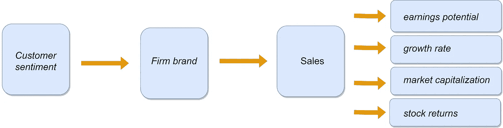

# 使用 N-gram 和情感分析的客户满意度测量

> 原文：[`towardsdatascience.com/customer-satisfaction-measurement-with-n-gram-and-sentiment-analysis-547e291c13a6?source=collection_archive---------13-----------------------#2023-04-10`](https://towardsdatascience.com/customer-satisfaction-measurement-with-n-gram-and-sentiment-analysis-547e291c13a6?source=collection_archive---------13-----------------------#2023-04-10)

## 产品评价是制定有效管理决策的优秀信息来源。了解更多关于正确的文本挖掘技术。

 [Petr Korab](https://petrkorab.medium.com/?source=post_page-----547e291c13a6--------------------------------)

·

[关注](https://medium.com/m/signin?actionUrl=https%3A%2F%2Fmedium.com%2F_%2Fsubscribe%2Fuser%2F13a053cbaad9&operation=register&redirect=https%3A%2F%2Ftowardsdatascience.com%2Fcustomer-satisfaction-measurement-with-n-gram-and-sentiment-analysis-547e291c13a6&user=Petr+Korab&userId=13a053cbaad9&source=post_page-13a053cbaad9----547e291c13a6---------------------post_header-----------) 发表在 [Towards Data Science](https://towardsdatascience.com/?source=post_page-----547e291c13a6--------------------------------) ·7 min read·2023 年 4 月 10 日

--

图片由 Freepik 提供，来源于 [Freepik](https://www.freepik.com/free-photo/collage-customer-experience-concept_25053683.htm#query=customer%20satisfaction%20data&position=5&from_view=search&track=ais)

# 介绍

满意的客户推动公司增长。这句五字的短句解释了我们为什么竭尽全力提升客户满意度。产品评价是大型公司如[Amazon](https://www.amazon.com/gp/help/customer/display.html?nodeId=GL4WJF8BGV8VL6B8)和[Apple](https://www.apple.com/contact/feedback/#:~:text=To%20comment%20on%20a%20particular,and%20select%20the%20appropriate%20link.)、中型出口商如[Lentiamo](https://www.trustpilot.com/review/lentiamo.nl)以及经营 Facebook 页面的本地公司等收集的主要数据来源之一。评价通常会随着时间的推移不断收集，而质量变化、营销传播和客户服务友好度等因素会影响客户表达的情感。

注：图片由作者提供，基于 Karim（2011）、Baker 和 Wurgler（2006）、Merrin 等（2013）以及 Eachempat 等（2022）的研究。

商业智能（BI）的角色应当是分析产品评价、识别潜在问题，并提出解决这些问题的假设。在下一阶段，这些建议会根据公司结构由其他部门进行审查。***本文将更详细地解释客户满意度测量的分析方法***…
