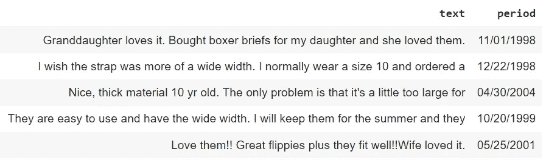
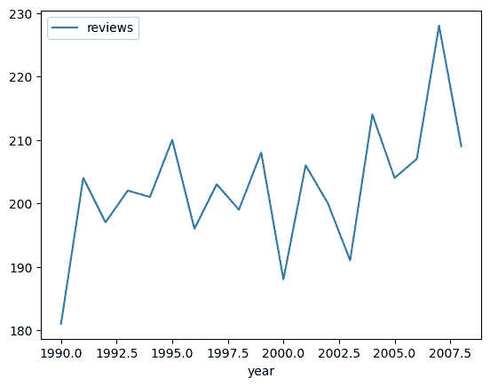
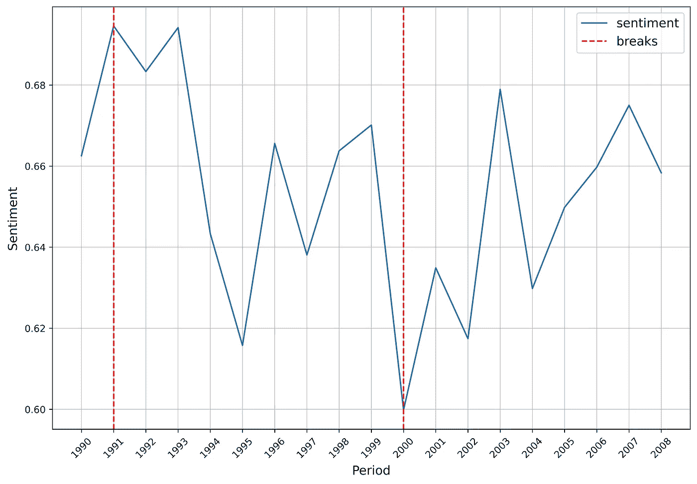
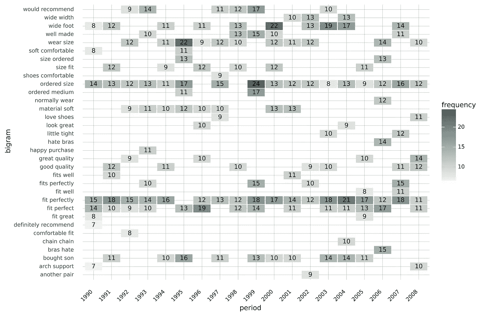

# 客户满意度测量与 N-gram 和情感分析

> 原文：[`towardsdatascience.com/customer-satisfaction-measurement-with-n-gram-and-sentiment-analysis-547e291c13a6`](https://towardsdatascience.com/customer-satisfaction-measurement-with-n-gram-and-sentiment-analysis-547e291c13a6)

## 产品评论是进行高质量管理决策的极佳信息来源。了解更多关于正确的文本挖掘技术。

[](https://petrkorab.medium.com/?source=post_page-----547e291c13a6--------------------------------)[](https://towardsdatascience.com/?source=post_page-----547e291c13a6--------------------------------) [Petr Korab](https://petrkorab.medium.com/?source=post_page-----547e291c13a6--------------------------------)

·发布于[Towards Data Science](https://towardsdatascience.com/?source=post_page-----547e291c13a6--------------------------------) ·阅读时间 7 分钟·2023 年 4 月 10 日

--


图片来源：Freepik，链接：[Freepik](https://www.freepik.com/free-photo/collage-customer-experience-concept_25053683.htm#query=customer%20satisfaction%20data&position=5&from_view=search&track=ais)

# 引言

满意的客户推动公司增长。这句五个字的句子解释了我们为何竭尽全力以最大化客户满意度。产品评论是大型公司（如[Amazon](https://www.amazon.com/gp/help/customer/display.html?nodeId=GL4WJF8BGV8VL6B8)和[Apple](https://www.apple.com/contact/feedback/#:~:text=To%20comment%20on%20a%20particular,and%20select%20the%20appropriate%20link.)）、中型出口商（包括[Lentiamo](https://www.trustpilot.com/review/lentiamo.nl)）以及运营其 Facebook 页面的本地公司收集的主要数据来源之一。评论通常会随着时间的推移而重复收集，质量变化、市场营销沟通和客户服务友好度等因素都会影响客户表达的情感。


注：图像由作者提供，基于 Karim（2011 年）、Baker 和 Wurgler（2006 年）、Merrin 等（2013 年）和 Eachempat 等（2022 年）的审阅

商业智能（BI）角色应该是分析产品评论，识别潜在问题，并提出假设以解决这些问题。在下一阶段，这些建议会根据公司结构被其他部门审查。***本文将更详细地解释基于产品评论数据的客户满意度分析。***

端到端的过程包括：

+   如何对时间序列产品评论进行探索性分析

+   如何快速评估随时间变化的产品评论情感

+   如何显示随时间变化的最常见满意度因素

我们将使用 Python，这是大多数 BI 和数据分析师常用的工具。

# 2\. 数据

获取具有灵活数据许可证的未抓取产品评论数据通常很困难。此情况下，[**虚假评论数据集**](https://osf.io/tyue9/)的合成数据，按照[Attribution 4.0 International license](https://creativecommons.org/licenses/by/4.0/)分发，是一个极好的选择。

数据如下所示：



图像 1\. 虚假评论数据集

*文本*列包含产品评论，*期间*标记评论日期。我们将使用的子集包含 3848 条关于服装、鞋子和珠宝产品的评论。

# 3\. 探索性数据分析（EDA）

这种类型的数据集的探索性数据分析（EDA）应该发现每个关注期的数据集的**完整性**以及**噪声的存在**，即不带来有价值信息的噪声——数字和特殊字符。我们尽量避免数据集极度不平衡的情况，即某些期间只有很少的评论和噪声数据集包含过多的数字和特殊字符（/，@，&，;，？，等等）。

**3.1\. 检查数据完整性**

首先，让我们检查每个期间的数据完整性。我们进行年度比较，因此汇总每年的评论：

```py
import pandas as pd

# Calculate review frequencies by year
data['year'] = pd.DatetimeIndex(data['period']).year
rows_count = data.groupby('year', as_index=False).year.value_counts()
rows_count.columns=['year','reviews']

import matplotlib.pyplot as plt

# Generate a line plot
rows_count.plot.line(x='year',y = 'reviews')
plt.show()
```

一个简单的折线图展示了年度回顾频率。这里不需要进行任何图形格式化：



图像 2\. 年度产品评论频率。图像来源于作者。

> 数据集没有严重不平衡。我们每年有大约 200 条以上的评论，这使得数据集适合情感和 n-gram 分析。

**3.2\. 计算字母与其他字符的比率**

接下来，让我们检查数据是否主要由数字和特殊字符组成，这可能会偏向后续的文本挖掘过程。

```py
import re

# Convert product reviews to a string
text = pd.Series.to_string(data['text'], index = False)

# Remove newline characters
text = re.sub('\n', '', text)

# Calculate sum of numbers, letters, and spaces
numbers = sum(c.isdigit() for c in text)
letters = sum(c.isalpha() for c in text)
spaces  = sum(c.isspace() for c in text)
others  = len(text) - numbers - letters - spaces
```

我们计算*清洁度*和*脏污度*（相反的度量），它们显示了字母与其他字符（数字、空格和特殊字符）的比率：

```py
# Calculate metrics
dirtiness = ((numbers + others) / len(text)) * 100
cleanness = ((letters + spaces) / len(text)) * 100

print(dirtiness)
print(cleanness)
```

打印输出为：

+   脏污度为 8.77%

+   清洁度为 91.22%

> 数据中大约有 9%的数字和特殊字符。这种噪声量不应在后续阶段偏向情感分析。

# 4\. 客户满意度测量

文本挖掘尝试找出：（1）客户情绪随时间的变化情况，以及（2）哪些因素导致了客户满意度的变化。我们将使用[Arabica](https://pypi.org/project/arabica/)，这是一个用于时间序列文本挖掘的 Python 库，来探索这两点。

***EDIT Jul 2023****: Arabica 已更新。请查看* [***文档***](https://arabica.readthedocs.io/en/latest/index.html) *以获取完整参数列表。*

## 4.1\. 情感分析

Arabica 提供 `coffee_break` 模块用于情感和断点分析。其[文档](https://arabica.readthedocs.io/en/latest/Breakpoint%20identification.html)提供了有关情感评估模型和方法的更多细节。

这段代码从标点符号和数字中清理数据，移除其他冗余字符串（*“<br />”、 “/n”* 和 *“Another Long String”* 作为示例），计算每条评论的情感，按年汇总情感，并识别情感时间序列中的两个主要断点：

```py
from arabica import coffee_break

coffee_break(text = data['text'],
             time = data['period'],
             date_format = 'us',     # Use US-style date format to read dates
             preprocess = True,      # Clean data - digits and punctuation
             skip = ['<br />',       # Remove additional stop words
                     '/n',
             'Another Long String'],
             n_breaks = 2,           # 2 breakpoints identified
             time_freq = 'Y')        # Yearly aggregation
```

带有情感和断点的折线图：



图片 3\. 带有断点的情感分析。图片来源：作者。

我们可以看到情感随时间的波动。这些变化并不迅速，因为情感波动在 [0.6: 0.7] 之间。情感值越高，客户对产品的评价越好（反之亦然）。

> 在 1991 年和 2000 年，情感中出现了正向和负向断点。在下一阶段，让我们检查造成这些变化的原因。

## 4.2\. 驱动客户满意度的因素

我们将使用 `cappuccino` 模块的 n-gram 频率热图来直观地推导出影响客户情感的因素。请阅读[文档](https://arabica.readthedocs.io/en/latest/Heatmap.html)以获取更多技术细节。

这段代码绘制了每年最频繁的八个双词组（即两个连续的词）的热图。数据预处理包括清理英文停用词、数字和三个不需要的字符串（*“<br />”、 “/n”* 和 *“Another Long String”*）。标点符号和空行会被自动移除：

```py
from arabica import cappuccino

cappuccino(text = data['text'],
           time = data['period'],
           date_format = 'us',       # Use US-style date format to parse dates
           plot = 'heatmap',
           ngram = 2,                # N-gram size, 1 = unigram, 2 = bigram
           time_freq = 'Y',          # Aggregation period, 'M' = monthly, 'Y' = yearly
           max_words = 8,            # Display 8 most frequent bigrams for each period
           stopwords = ['english'],  # Remove English stopwords
           skip = ['<br />',         # Remove additional stop words
                   '/n',
           'Another Long String'],
           numbers = True,           # Remove numbers
           lower_case = True)        # Lowercase text
```

双词组热图：



图片 4\. 双词组热图。图片来源：作者。

双词组频率表明：

+   ***2000 年代下降***（缺少 *“would recommend”、 “fits perfectly”* 和 *“fit perfect”* 在前 8 名中），以及 *“wide foot”* 和 *“size fit”* 的高频率表明，我们可能在向不适合他们脚尺寸的客户销售产品。请注意，我们已移除像 *“don’t”* 这样的停用词。

# 结论

这种类型的文本挖掘分析应有助于做出合格的**数据驱动决策**，并提高我们产品和服务的质量。根据分析结果，我们确定一套关于可能存在问题的假设以及改进空间。

从本文的文本挖掘分析中，我们可以看到产品质量潜在的问题。产品与我们客户当前的需求不太匹配。收到 2001 年的评论后，分析师应制定一套问题假设，例如：

+   *新鞋穿着不舒适。*

+   *我们不销售宽脚鞋，但客户需要这些鞋。*

+   *新产品生产存在质量问题。*

由于你比任何人都更了解你的产品，许多其他潜在问题假设会出现。其他部门（市场营销、客户关怀、物流等）应找出问题所在，然后采取具体改进措施并解决问题。响应，当然，取决于公司的规模和结构以及其他特定公司的因素。

带有代码和数据的 Jupyter Notebook 在我的 [GitHub](https://github.com/PetrKorab/Customer-Satisfaction-Measurement-with-N-gram-and-Sentiment-Analysis) 上。

*你喜欢这篇文章吗？你可以邀请我* [*喝咖啡*](https://www.buymeacoffee.com/petrkorab) *并支持我的写作。你也可以订阅我的* [*电子邮件列表*](https://medium.com/subscribe/@petrkorab) *以获取新文章的通知。谢谢！*

# 参考文献

Baker, M., Wurgler, J., 2006\. 投资者情绪与股票收益的横截面。*金融杂志* 61 (4)。

Eachempati, P., Srivastava, P. R., Kumar A., Munoz, J., Dursun D., 2022\. [客户情感能否影响公司价值？](https://www.sciencedirect.com/science/article/abs/pii/S0040162521006995?via%3Dihub=) 一种综合文本挖掘方法。*技术预测与社会变革* 174 (1)。

Karim, B., 2011\. 企业名称变更与股东财富效应：法国股票市场的实证证据。*资产管理杂志* 12 (3)。

Merrin, R. P., Hoffmann, A. O., Pennings, J. M., 2013\. 顾客满意度作为对抗情感股票价格修正的缓冲器。*营销信函* 24 (1)。
