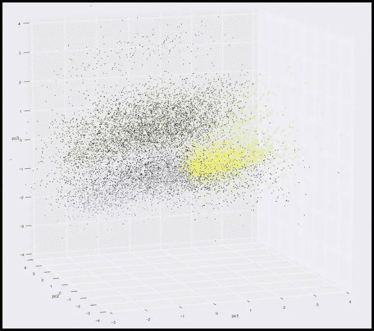
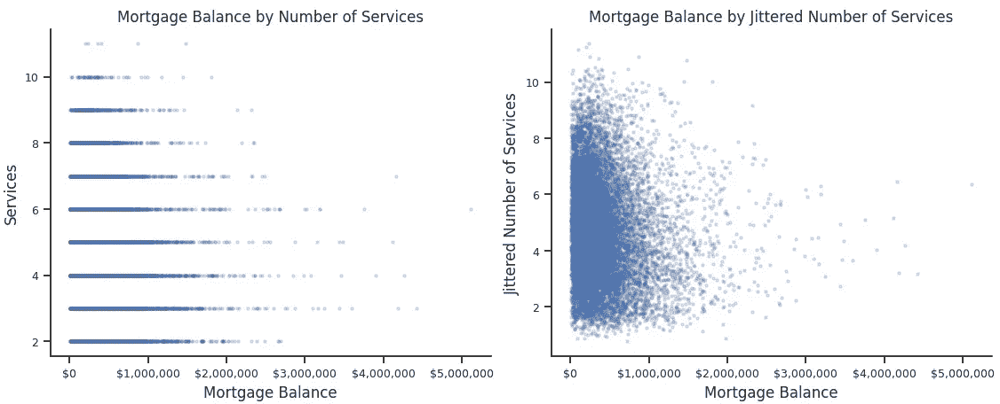
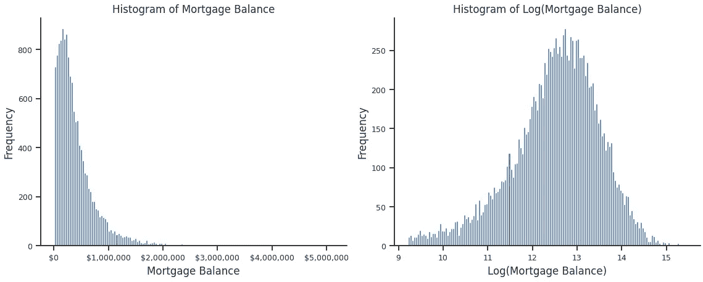
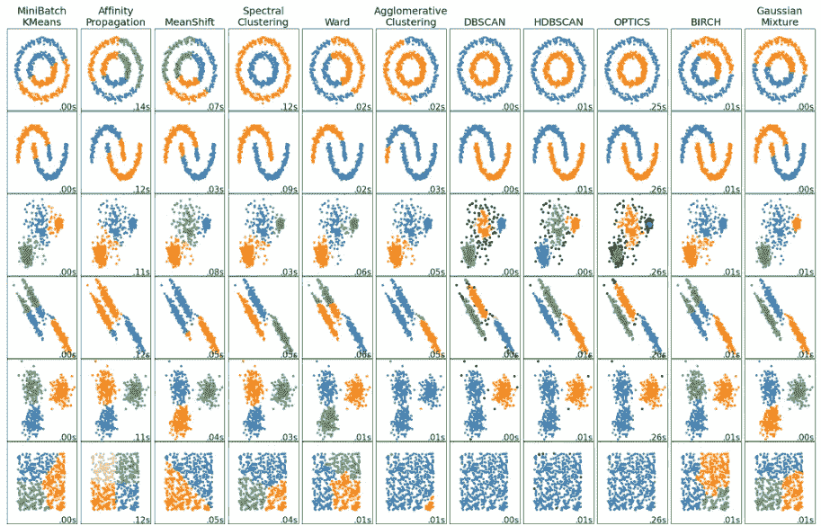
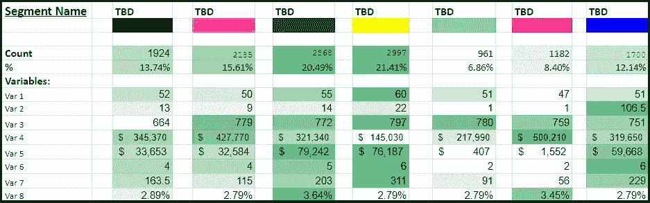
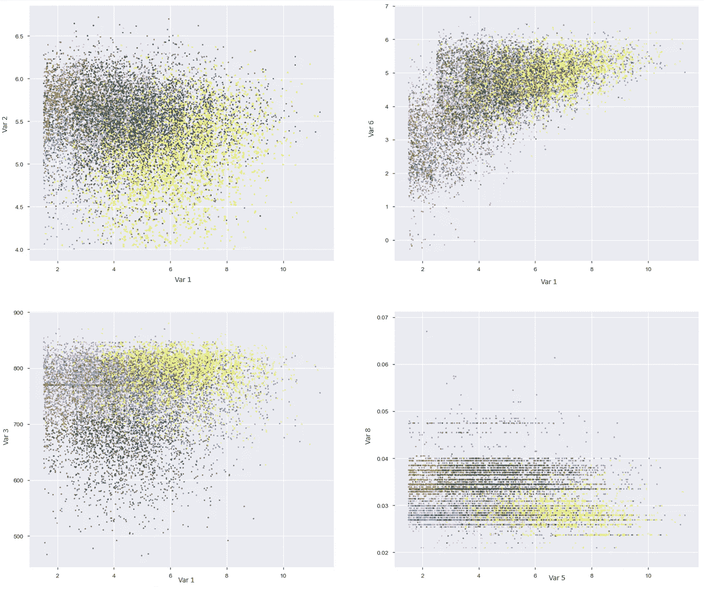
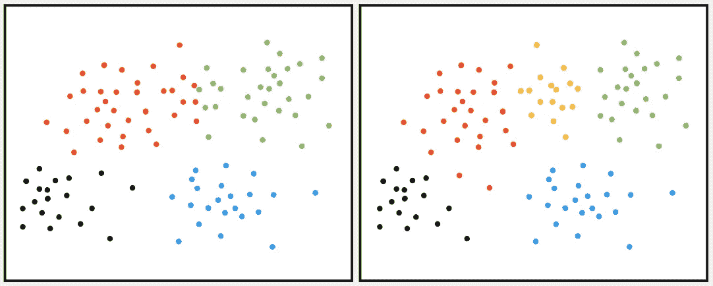
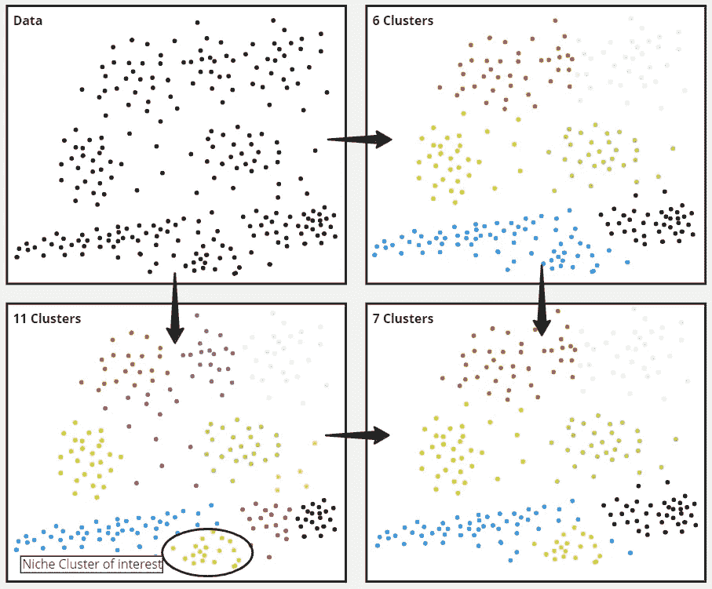
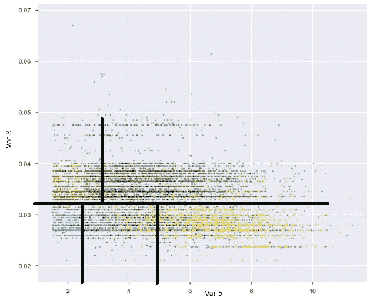

# 客户细分：不仅仅是聚类

> 原文：[`towardsdatascience.com/customer-segmentation-more-than-clustering-a7226a9ff138`](https://towardsdatascience.com/customer-segmentation-more-than-clustering-a7226a9ff138)

## 一个帮助你的客户细分被业务采纳的框架

[](https://medium.com/@guillaume.colley?source=post_page-----a7226a9ff138--------------------------------)[](https://towardsdatascience.com/?source=post_page-----a7226a9ff138--------------------------------) [Guillaume Colley](https://medium.com/@guillaume.colley?source=post_page-----a7226a9ff138--------------------------------)

·发表于 [Towards Data Science](https://towardsdatascience.com/?source=post_page-----a7226a9ff138--------------------------------) ·14 分钟阅读·2023 年 12 月 15 日

--



作者提供的图片

当数据科学团队需要构建客户细分模型时，通常是业务的要求，或者更少见的是数据科学家主动提出的决策。在这两种情况下，需求是相同的：对客户基础有更深入的理解，以便对每个细分进行更精细、差异化的决策。

然而，我看到许多聚类工作未被业务采用，因为产生的细分结果没有引起共鸣或无法被业务利益相关者采取。在这篇文章中，我将概述关键步骤和策略，以最大化业务对你细分结果的采纳。

+   工作声明

+   整理你的数据

+   确定你的算法

+   理解你的聚类

+   多少个聚类？

+   检查稳定性

+   转化为业务规则（或不转化）

由于本文关注的是“应用数据科学”而非“技术机器学习”，因此不会深入探讨各种聚类算法的复杂细节，因为有丰富的资源可以让那些寻求更深理解的人了解（h[ere](https://medium.com/ai-made-simple/introduction-to-clustering-2ffc22673b5a) 或 [here](https://medium.com/lunartechai/a-comprehensive-guide-to-clustering-in-python-f9fb36a94a05)）。

言归正传，让我们开始吧！


图片由 [Ralph Katieb](https://unsplash.com/@rkatieb?utm_source=medium&utm_medium=referral) 提供，来源于 [Unsplash](https://unsplash.com/?utm_source=medium&utm_medium=referral)

# **1 — 工作声明：目标、维度、时机**

与每一项工作一样，你需要在深入技术工作之前回答一些重要问题。

## 细分的业务目标是什么？

**→ 确定我们试图了解的客户信息。**

有许多不同的方法来观察客户，例如，我们可以研究主要的**交易行为**（例如在零售中：是否具有季节性，他们的产品种类、交易的价值和频率……），或者我们可以研究他们购买的**产品类型**（例如在食品中：他们是购买便利产品还是新鲜的大包装家庭装、优质和有机产品……），或者我们可以研究客户的**参与度**（例如在银行中：拥有多少基本服务，他们拥有多少资产，以及与银行的活跃度）。

对于细分而言，不要试图一次性回答所有问题。与其有一个包罗万象的细分，不如构建（并向业务传达）几个以不同方式观察客户的细分，然后在需要时将它们结合起来。

## 你感兴趣的维度是什么？

**→ 确定你希望将细分集中于哪些概念**

一旦你知道你想通过细分回答什么样的问题，你需要确定你的细分将基于哪些维度。作为一个具备商业敏锐性的数据科学家，你应该已经有了一个大致的想法——但在这个步骤中，重要的是要与相关利益相关者沟通，并利用他们的专业知识。这可以确保细分将反映不同团队的需求和视角，同时在整个开发过程中获得利益相关者的支持。

在这个上下文中，我所指的“维度”并非具体的变量或数据元素。我提到的维度体现了诸如“活动”、“忠诚度”、“风险”和“价值”等抽象概念。正式化这些维度至关重要——它们将是你的业务利益相关者能够理解的语言。

然后你需要找到能代表这些维度的数据元素，例如：

+   活动 → 过去一个月的交易数量

+   忠诚度 → 在银行的年数

+   风险 → 最新信用评分

+   价值 → 过去 12 个月的总支出

## 你想使用什么时间范围？

**→ 数据将基于什么时间段来代表你的客户？**

是一个月？一周？一年？这取决于数据的性质、频率以及是否存在季节性。例如，超市可能通过 2 到 3 个月的购买数据就能收集到足够有意义的客户信息。另一方面，在线服装零售商面临强烈的年度季节性（黑色星期五+假期赠品），需要考虑 12 个月的时间段。

**→ 你会多久重新评分客户（分配细分）？**

为了让细分保持可操作性，分配给特定客户的细分必须准确反映其行为或资料的最新变化。重新计算这些细分的频率取决于相关维度变化的速度。对于每周多次购物的超市来说，每周重新计算细分可能更有意义——尤其是当这与每周的营销活动和决策相一致时。对于每年仅购物几次的在线零售商来说，每月更新一次细分可能更合适。

**→ 你会多频繁地重新训练你的模型？**

你的细分模型的目标是捕捉客户的档案，这些档案在时间上是建立和稳定的，因此通常不需要频繁更新模型。

除非有明显和近期的行为变化或关键数据点的可用性可以提升模型，否则你的细分模型可以有效使用较长时间，可能长达几年。


照片由[Alex Block](https://unsplash.com/@alexblock?utm_source=medium&utm_medium=referral)提供，来源于[Unsplash](https://unsplash.com/?utm_source=medium&utm_medium=referral)

# **2 — 整理你的数据**

你可能已经意识到数据准备对聚类项目的重要性，许多资源可供参考，包括[这里](https://docs.displayr.com/wiki/Data_Preparation_for_Cluster-Based_Segmentation)和[这里](https://www.analyticsvidhya.com/blog/2020/07/types-of-feature-transformation-and-scaling/)。以下是进行归一化之前的两个有益的变换：

**抖动**



图片由作者提供

这种变换对小范围的整数数据点最为有用。例如，考虑变量“银行服务数量”，通常范围从 1 到十几。实施这种变换将增强你聚类的可视化效果。

通过在原始值上添加`]-0.5,0.5[`的随机噪声来进行抖动：

```py
df=df.assign(Jittered_Services=df['Services']
        +np.random.normal(scale=0.49, size=len(df)))
```

**对数变换**

表示财务值的数据通常呈现偏斜分布，其中少数个体拥有大量资产或债务。偏斜数据可能对机器学习模型的性能产生不利影响。因此，应用对数变换有助于减轻偏斜的影响并提高模型的稳健性：



图片由作者提供

```py
import numpy as np

df= df.assign(Log_Mortgage_Balance=np.log(df['Mortgage_Balance']))
```

这种变换——如同抖动——显著提高了图表的可读性，尤其是在你熟悉对数刻度的解释之后。

# 3 — 确定你的算法

这篇文章并不是深入探讨各种聚类算法，因为外面有很多很好的资源，特别是[Scikit Learn](https://scikit-learn.org/stable/modules/clustering.html)。



来源：Scikit-Learn（BSD 许可证）

进入下一步骤前，我们假设你已经使用最佳聚类算法和优化参数运行完毕，现在所有客户都已标记了特定的集群编号。


图片由作者提供

# **4 — 了解你的集群**

不幸的是，聚类算法不懂商业语言（至少现在还不懂——我在看你们，LLMs）。

算法本质上使数据能够传达这样的信息：“集群 X 中的客户在彼此之间的共性比与其他集群的客户更多。” 你需要深入探讨细节并解读定义集群 X 的特定行为或特征。

集群画像可以通过**描述性**方法或**预测性**方法实现。

## 集群画像——描述性方法

我发现同时使用下面这两个简单工具对于获得集群的商业理解效果很好。

**汇总统计**与条件格式

利用带有条件格式的汇总统计涉及将集群的汇总统计并排展示，并通过格式化突出高低点。这种方法使新出现的特征变得明显。在下面的示例中，我使用了中位数，但你可以选择你喜欢的汇总统计：



图片由作者提供

在上述示例中，很明显集群“青色”和“红色”具有相似的特征，显示出最低的 Var2、Var5、Var6 和 Var7。它们之间的区别在于 Var4 和 Var8。

此外，集群“深蓝色”在 Var2 上具有最高值，而将集群“黑色”与其他集群区分开来的关键变量是 Var3，其中它表现出最低值。

**所有输入变量组合的散点图**

生成所有输入变量组合的散点图提供了一个视觉表示，帮助突出区分不同集群的维度。这种方法允许清晰地识别出哪些维度分隔了特定集群。



图片由作者提供

散点图显示，Var8 是区分集群“红色”和“绿色”与其他集群的因素（右下角图）。同时，底部左侧图中确认了 Var3 作为区分集群“黑色”的标志。

这个过程是迭代的：在汇总统计和散点图之间切换，你可以完善对集群的理解，并提取出获得深入了解其特征所需的见解。

**早期命名你的集群**

随着你在这个分析过程中的进展——考虑为你的聚类分配描述性名称。这将迫使你在此阶段找出每个聚类的差异特征，并有助于后续的利益相关者认可。在后续阶段（第 5 步和第 6 步之后），你甚至可以邀请利益相关者参与一个有趣的活动来命名聚类。这不仅会产生与业务相符的名称，还能帮助利益相关者接受这些划分。

成功找到有效的名称是将你的聚类从单纯的分组提升到有意义的业务细分的关键。

## 聚类分析——预测方式

另一种对聚类进行分析的方法是利用多分类预测模型。如果将聚类数量视为分类变量进行预测，可以使用这些变量作为特征来拟合模型。

查看特征重要性将告知你哪些变量影响了每个聚类。

如果你拟合一个相对简单的决策树，检查分支和树结构将准确告诉你使用了哪些变量和分割值。这是一个很好的示例。

在实践中，我尚未采用预测方法，因为我已经通过描述性方法获得了对聚类概况的良好理解。此外，利用汇总统计数据对于向利益相关者传达聚类差异至关重要，因此它们是该方法的重要组成部分。

# **5 — 多少个聚类？**

我们都熟悉[肘部法则和轮廓法](https://medium.com/towards-artificial-intelligence/k-means-clustering-techniques-to-find-the-optimal-clusters-7eea5431a4fb)。

但是如果这些方法建议 2 个聚类？或 18 个？这些配置对业务是否有用或可操作？

聚类数量过少（3 个或更少）可能无法提供我们最初所期望的客户深度理解。另一方面，聚类数量过多（9 个或更多）可能使得推广、解释和实施变得困难。

我发现有用的是从上述方法开始，实际上执行算法并尝试不同数量的聚类。如果肘部法则给出了 6 个聚类（并且你已经对它们进行了分析以理解它们），那么 5 个聚类会是什么样的？7 个聚类？8 个聚类？哪些聚类被合并或分裂（表明行为更接近），哪些聚类保持不变（表明行为更独特）？

这种迭代探索有助于微调聚类解决方案，并提供对数据中潜在模式的细致理解。

在下面的示例中，从 4 个集群过渡到 5 个集群并不会影响黑色和蓝色集群，但它揭示了一个新集群，黄色集群，位于红色和绿色之间。问题是：从业务角度来看，将这些客户分为三个组而不是两个是否有意义？



作者提供的图片

这个决定取决于具体的业务目标和集群的可解释性。评估黄色集群中行为差异的显著性以及细化是否带来了可操作的洞察是关键考虑因素。

使用更多集群数量的算法，比如 12 个或 15 个，可以探索是否会出现与业务相关的独特行为。

识别这些只有在使用更多集群时才会显现的小但潜在重要的集群可能是有价值的。在这种情况下，你可以根据从细分分析中得出的业务规则将这些客户分配到特定的细分市场（见下文第七部分）。

在下面的示例中，一个对业务至关重要的客户档案只有在数据被拆分为 11 个细分（左下角的浅绿色集群）时才会被聚类揭示。由于其余的 11 个细分过于细化，最终的细分可能是一个 6 集群细分加上这个非常重要的利基客户细分：



作者提供的图片

**对你的集群保持灵活性**

聚类是一个重要的工具——但它仍然只是一个工具，不一定要当作唯一依据。

将业务知识注入到你的集群中是确保它们与行业细节或特定用例紧密对齐的宝贵步骤。

如果你对整体集群感到满意，但发现有两个集群实际上传达了相同的业务含义，可以考虑将它们合并为一个。例如，你可能会发现两个具有非活跃档案的不同集群——一个没有交易，另一个交易非常少。从业务角度来看，这两个集群可能需要采取相同的措施，从而 justify 它们的合并。这种人工干预可以精炼聚类结果，提高其在实际业务场景中的相关性和适用性。

在某些情况下，定义集群的属性可能在概念上是适当的，但具体定义可能与既定标准不一致。例如，在银行细分中以信用评分来衡量“风险”维度。虽然这可能导致一个“高风险”集群，但客户成为该组的一部分的标准可能不完全符合风险客户的严格商业定义，比如“信用评分<640”。在这种情况下，考虑合并或拆分集群以更好地符合定义的业务规则可能是有益的。


图片由作者提供

# 6 — 检查稳定性

想象一下你得到了一种极好的细分，深化了你组织对客户的理解，并用于定向和个性化营销。然而，仅仅几个月后，某些细分的规模大幅增加，而其他细分几乎减少到可以忽略的程度，使得细分失效。细分在时间上不稳定！

如果你的数据存在季节性，请确保你在涵盖季节性事件前、中、后的数据集上实施了细分。为了全面评估，考虑将细分应用于整年甚至两年的数据。

下面是评估细分稳定性的两种方法：

## 细分稳定性

从高层次来看，检查每个细分的规模及其随时间的变化是有价值的

+   细分规模在不同时间段是否发生了变化？

+   你对观察到的尺寸变化感到满意吗？

虽然某些波动可能是合理的并且具有特定背景（例如在超市环境中，可能“传统烹饪”细分在感恩节和假日期间比平时更大），但细分规模的剧烈或长期变化可能需要重新评估你的方法。在这种情况下，重新审视你的输入数据的时间范围并扩展它可能是必要的，以确保细分的稳定性和可靠性。

## 客户迁移

研究客户迁移到个体层面提供了更详细的视角：

+   每个个体客户在特定时期内（例如一年）变化细分的次数是多少？

+   哪些具体细分经历了最多的迁移？

虽然反映出更接近行为的细分之间有限的迁移可能是可以接受的，但大量迁移可能表明不稳定。在这种情况下，可能需要扩展客户数据收集的时间窗口，以捕捉更稳定的概况。

# 7 — 转化为业务规则（或不转化）

在一个商业环境中，如果利益相关者可能更倾向于透明度而非黑箱模型，一种可行的方法是将集群或细分转化为明确的业务规则。

一旦你了解了细分的概况，你可以在你的维度空间中描绘出最接近这些细分的界线。这些界线实际上成为定义和描述每个细分的业务规则。将这些规则转化为业务规则不仅提升了解释性，还为利益相关者提供了一个清晰易懂的细分识别和分析框架。



图片由作者提供

在上述提供的示例中，业务规则可以表述如下：

绿色集群：Var8 < 0.032 且 Var5 < 2.4

红色集群：Var8 ≥ 0.032 且 Var5 < 3


图片由作者提供

# 最终步骤 - 宣传你的细分

如果你已经达到这个阶段，说明你成功识别了具有不同特征和行为的细分群体，并且这与你的业务参数一致。细分群体的特征一致性及其对业务的相关性很明显，你已经确认了这些细分群体在时间上的稳定性。

你也很可能帮助了你的直接业务利益相关者，根据每个细分群体量身定制他们需要采取的行动。

现在，是否还有其他细分的应用场景可以带来业务价值？

+   **仪表盘** — 是否有一些指标和关键绩效指标可以从细分的角度进行查看？

+   **报告** — 是否有每月或每季度的业务报告和分析，细分可以为客户基础提供更深入的见解？

+   **临时分析** — 是否有任何分析使用了细分，能够揭示更细化的结果或建议？

是否有不同的渠道可以利用你的细分来个性化某些行动？

+   电子邮件或推送通知活动

+   电话营销活动

+   首页着陆体验

+   付费搜索和付费媒体渠道

# 结论

我希望现在已经明确，有效的客户细分不仅仅是聚类算法的技术层面。

细分模型的成功可以从以下几个方面总结：

> - 与业务目标的一致性，
> 
> - 定义维度的清晰性
> 
> - 对时机的深思熟虑
> 
> - 适应业务目标的集群灵活性
> 
> - 时间上的稳定性

最终，成功的细分创建了一个全面且有影响力的框架，用于理解和与不同的客户群体互动。

我很想知道你是否觉得这个框架有用。你在开始客户细分项目时认为还需要注意哪些关键点？我遗漏了什么？你会有什么不同的做法？

# 参考文献：

[1] R. Yehoshua, 《聚类介绍》（2023），[`medium.com/ai-made-simple/introduction-to-clustering-2ffc22673b5a`](https://medium.com/ai-made-simple/introduction-to-clustering-2ffc22673b5a)

[2] T.K. Aslanyan, 《Python 中聚类的全面指南》（2023），[`medium.com/lunartechai/a-comprehensive-guide-to-clustering-in-python-f9fb36a94a05`](https://medium.com/lunartechai/a-comprehensive-guide-to-clustering-in-python-f9fb36a94a05)

[3] DisplayR, 《基于集群的细分的数据准备》（2017），[`docs.displayr.com/wiki/Data_Preparation_for_Cluster-Based_Segmentation`](https://docs.displayr.com/wiki/Data_Preparation_for_Cluster-Based_Segmentation)

[4] P. Huilgol, 《特征变换和缩放技术以提升模型性能》（2020），[`www.analyticsvidhya.com/blog/2020/07/types-of-feature-transformation-and-scaling/`](https://www.analyticsvidhya.com/blog/2020/07/types-of-feature-transformation-and-scaling/)

[5] Scikit Learn, 聚类方法概述（2023），[`scikit-learn.org/stable/modules/clustering.html`](https://scikit-learn.org/stable/modules/clustering.html)

[6] I. Cohen, 可解释人工智能（XAI）与 SHAP - 多类分类问题（2021），[`towardsdatascience.com/explainable-ai-xai-with-shap-multi-class-classification-problem-64dd30f97cea`](https://towardsdatascience.com/explainable-ai-xai-with-shap-multi-class-classification-problem-64dd30f97cea)

[7] E. Zuccarelli, 可解释的聚类（2020），[`towardsdatascience.com/interpretable-clustering-39b120f95a45`](https://towardsdatascience.com/interpretable-clustering-39b120f95a45)

[8] R. Khandelwal, K-Means 聚类：寻找最佳簇的技术（2021），[`pub.towardsai.net/k-means-clustering-techniques-to-find-the-optimal-clusters-7eea5431a4fb`](https://pub.towardsai.net/k-means-clustering-techniques-to-find-the-optimal-clusters-7eea5431a4fb)

# 我其他的应用数据科学文章：

[](/decoding-the-data-scientist-hierarchy-from-junior-to-senior-what-sets-them-apart-566158a0d5ff?source=post_page-----a7226a9ff138--------------------------------) ## 解码数据科学家层级：从初级到高级——什么让他们与众不同？

### 揭示了初级、中级和高级数据科学家的工作期望范围

towardsdatascience.com [](/elevate-your-data-science-career-how-to-become-a-senior-data-scientist-5d7546d060e2?source=post_page-----a7226a9ff138--------------------------------) ## 提升你的数据科学职业生涯：如何成为高级数据科学家

### 作者概述了五种策略，这些策略将把你的数据科学实践提升到高级角色。

towardsdatascience.com [](/5-ideas-to-foster-data-scientists-analysts-engagement-without-suffocating-in-meetings-a57db1e2aa34?source=post_page-----a7226a9ff138--------------------------------) ## 促进数据科学家/分析师参与的五个想法，而不会在会议中窒息

### 作者分享了他们成功实现这一平衡的策略

towardsdatascience.com
