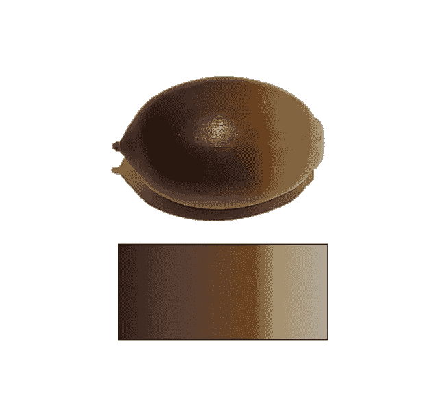

# 使用 Matplotlib 自定义色彩图

> 原文：[`towardsdatascience.com/customize-colormaps-with-matplotlib-df5b37d14662?source=collection_archive---------6-----------------------#2023-12-06`](https://towardsdatascience.com/customize-colormaps-with-matplotlib-df5b37d14662?source=collection_archive---------6-----------------------#2023-12-06)

## 快速成功的数据科学

## 将您的颜色与主题匹配

 [李·沃恩](https://medium.com/@lee_vaughan?source=post_page-----df5b37d14662--------------------------------)

·

[关注](https://medium.com/m/signin?actionUrl=https%3A%2F%2Fmedium.com%2F_%2Fsubscribe%2Fuser%2F5d604015c08b&operation=register&redirect=https%3A%2F%2Ftowardsdatascience.com%2Fcustomize-colormaps-with-matplotlib-df5b37d14662&user=Lee+Vaughan&userId=5d604015c08b&source=post_page-5d604015c08b----df5b37d14662---------------------post_header-----------) 发表在 [面向数据科学](https://towardsdatascience.com/?source=post_page-----df5b37d14662--------------------------------) · 10 分钟阅读 · 2023 年 12 月 6 日

--

一颗橡果及其色彩图（作者提供）

专业图形的一个特征是一个贯穿始终的*主题*，将所有元素联系在一起。这包括字体、符号，最重要的是色彩方案。

以下是 [美国国家公园管理局](https://www.nps.gov/orgs/1207/06-11-20-nps-visitor-spending-generates-economic-impact-of-more-than-41-billion.htm) 的一个示例。注意这些和谐的地球色调如何协作，唤起大自然的感觉。这张图不仅仅是*传达*信息，它是*以风格传达的*！

美国国家公园管理局信息图（由 [nps.gov](https://www.nps.gov/aboutus/publications.htm#:~:text=Government%20information%20on%20NPS%20websites%20is%20generally%20in,National%20Park%20Service%20information%20be%20given%20appropriate%20acknowledgement.) 提供）

Python 的 Matplotlib 绘图库使用 *颜色映射* 来定义可视化的 *颜色方案*。颜色映射是将像素数据映射到实际颜色值的颜色数组。

虽然 Matplotlib 提供了许多内置的 [颜色](https://matplotlib.org/stable/gallery/color/named_colors.html) 和 [颜色方案](https://matplotlib.org/stable/gallery/color/colormap_reference.html)，但它们无法涵盖所有可能的场景。有时你会想要根据特定的主题或概念来个性化你的颜色。

在这个 *快速成功数据科学* 项目中，我们将探讨如何选择自定义颜色，并将其转化为可以在 Matplotlib、seaborn、pandas、geopandas 以及其他 Python 兼容的绘图库中使用的颜色映射…
