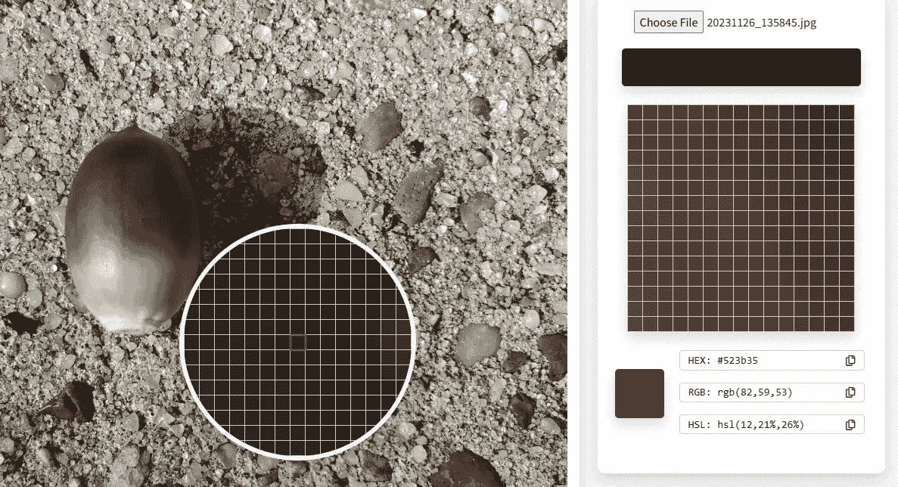
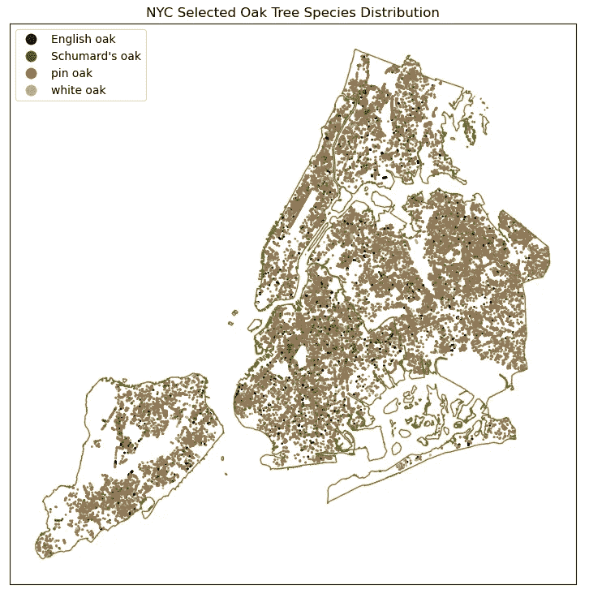

# 使用 Matplotlib 自定义颜色图

> 原文：[`towardsdatascience.com/customize-colormaps-with-matplotlib-df5b37d14662`](https://towardsdatascience.com/customize-colormaps-with-matplotlib-df5b37d14662)

## 快速成功的数据科学

## 使你的颜色与主题相匹配

[](https://medium.com/@lee_vaughan?source=post_page-----df5b37d14662--------------------------------)[](https://towardsdatascience.com/?source=post_page-----df5b37d14662--------------------------------) [Lee Vaughan](https://medium.com/@lee_vaughan?source=post_page-----df5b37d14662--------------------------------)

·发表于 [Towards Data Science](https://towardsdatascience.com/?source=post_page-----df5b37d14662--------------------------------) ·10 分钟阅读·2023 年 12 月 6 日

--


一颗橡子及其颜色图（作者提供）

专业图形的一个特征是贯穿其中的*主题*，它将一切联系在一起。这包括字体、符号，最重要的是颜色调色板。

下面是一个来自[美国国家公园管理局](https://www.nps.gov/orgs/1207/06-11-20-nps-visitor-spending-generates-economic-impact-of-more-than-41-billion.htm)的例子。注意这些和谐的土壤色调如何协作以唤起户外的感觉。这个图形不仅仅是*传达*信息，它是*以风格传达信息的！*


美国国家公园管理局信息图（感谢 [nps.gov](https://www.nps.gov/aboutus/publications.htm#:~:text=Government%20information%20on%20NPS%20websites%20is%20generally%20in,National%20Park%20Service%20information%20be%20given%20appropriate%20acknowledgement.)）

Python 的 Matplotlib 绘图库使用*颜色图*来定义可视化的*颜色方案*。颜色图是用于将像素数据映射到实际颜色值的颜色数组。

虽然 Matplotlib 提供了许多内置的[颜色](https://matplotlib.org/stable/gallery/color/named_colors.html)和[颜色方案](https://matplotlib.org/stable/gallery/color/colormap_reference.html)，但它们可能无法覆盖所有可能的场景。有时你可能希望将颜色特别定制以符合某个特定的主题或概念。

在这个*快速成功的数据科学*项目中，我们将探讨如何选择自定义颜色并将其转化为可以在 Matplotlib、seaborn、pandas、geopandas 和其他兼容 Python 的绘图库中使用的颜色图。然后，我们将使用这些颜色图绘制纽约市橡树的位置。

# 橡子，橡子，橡子！

尽管今年德州发生了严重的干旱，但我们仍然到处都是橡子。除了数量丰富外，它们还特别有色彩，拥有只有大自然知道如何制造的拿铁色和紫棕色。这个星期在欣赏一个时，我不禁想知道它会成为一个优秀的色彩图。作为一个 Python 爱好者，我立即付诸实践。


橡子（照片由[Ksenia Makagonova](https://unsplash.com/@dearseymour?utm_content=creditCopyText&utm_medium=referral&utm_source=unsplash)在[Unsplash](https://unsplash.com/photos/person-holding-wallnuts-_d3GuRIHMaE?utm_content=creditCopyText&utm_medium=referral&utm_source=unsplash)拍摄）

> 如果你来自一个没有橡子的地方，它们是橡树生产的坚果。

# 捕捉橡子的颜色

捕捉物体颜色所需的只是数字照片。虽然有很多关于如何真实捕捉颜色的科学（你可以在[这里](https://snapshot.canon-asia.com/article/eng/4-ways-to-capture-colours-more-accurately-in-photography)找到一些技巧），我只是拍了一张在阴天的橡子的手机照片。

我随后使用[*Image Color Picker*](https://www.imgcolorpicker.com/)从图片中提取颜色。这个免费的应用程序允许你上传图片文件并使用光标选择和采样像素颜色。对于这个项目，我们将使用 RGB（红-绿-蓝）值，范围从 0 到 255。



**Image Color Picker**屏幕（作者提供）

为了构建橡子的色彩图，我进行了两组测量。第一组包括四个测量点，从深棕色的尖端到蛋白色的底部均匀间隔。第二组是以相同方式进行的五个测量点。每个测量的值直接从应用程序的 RGB 输出框中使用“复制”图标复制出来。


颜色样本位置（作者提供）

我进行了*两*组测量，以查看是否有差别。根据采样的结果，没有差别。

# 色彩图代码

以下代码，使用 JupyterLab 编写，利用 Matplotlib 创建了*离散*（分类）和*连续*色彩图。然后使用热图显示测试这些色彩图。

## 创建色彩图

基于*插值方法*，Matplotlib 中有两种类型的色彩图：

一个***列举色彩图***是一个颜色列表。它是一个*离散*色彩图，具有预定义的颜色集，并且不在颜色之间进行插值。

一个***线性分段色彩图***使用*插值*在存储在字典中的颜色*锚点*之间。这创建了一个*连续*色彩图*。

离散色彩图适合用于由名称或符号表示的*分类*数据。连续色彩图在颜色之间平滑过渡。它们通常用于表示*范围*的值，比如绘制温度或降水量数据时。

## 创建列出颜色图

我们将使用 *四* 个橡实测量值来生成列出颜色图。代码如下：

```py
import numpy as np
import matplotlib.pyplot as plt
from matplotlib.colors import ListedColormap

# Normalize the RGB colors (RGB color tuples in comments):
colors = [(42/255, 34/255, 31/255),    # (42, 34, 31)
          (82/255, 59/255, 53/255),    # (82, 59, 53)
          (112/255, 69/255, 37/255),   # (112, 69, 37)
          (187/255, 164/255, 132/255)  # (187, 164, 132)
         ]

# Create a ListedColormap (discrete colors):
custom_cmap_discrete = ListedColormap(colors)

# Display a colorbar with the custom colormap:
fig, ax = plt.subplots(figsize=(6, 1))
plt.imshow([[i for i in range(len(colors))]], 
           cmap=custom_cmap_discrete, 
           aspect='auto')
plt.xticks([]), plt.yticks([]);  # Turn off tickmarks
# plt.show()
```

我们只需要 Matplotlib 库即可，但我们添加了 NumPy 以生成一些虚拟测试数据。

Matplotlib 的 `[ListedColormap()](https://matplotlib.org/stable/users/explain/colors/colormap-manipulation.html#listedcolormap)` 类将值在 0 和 1 之间映射到颜色。这些颜色存储在 `.colors` 属性中。

因为 `ListedColormap()` 类使用 0 到 1 之间的值，我们必须将橡实的 RGB 值除以 255 以规范化输出（Python 从 0 开始计数，所以 256 种颜色的最大值是 255）。之后，我们只需将这个类的 `colors` 列表传入以创建自定义颜色图。

为了将颜色图作为颜色 *条* 查看，我们可以使用 `plt.imshow()` 将其绘制为图像。结果如下：


离散的颜色图（作者）

请注意，你也可以通过提供 Matplotlib 官方的 [颜色名称](https://matplotlib.org/stable/gallery/color/named_colors.html) 列表来创建颜色图。例如：

```py
cmap = ListedColormap(["darkorange", "gold", "lawngreen", "lightseagreen"])
```

欲了解更多信息，请参见官方 [文档](https://matplotlib.org/stable/users/explain/colors/colors.html#colors-def)。

## 测试列出颜色图

为了在 Matplotlib 图中测试列出颜色图，我们将使用从随机数据集构建的热图。代码如下：

```py
# Create randomized data with NumPy:
data = np.random.rand(10, 10)

# Plot using the custom colormap:
plt.imshow(data, cmap=custom_cmap_discrete)
plt.colorbar();
# plt.show()
```

结果如下：


使用离散颜色图构建的热图（作者）

我说得对；橡实确实是很棒的颜色图！这个图看起来像是一个美丽的“屠夫块”切菜板。

## 创建线性分段颜色图

我们现在将使用 *五* 个橡实测量值来生成线性分段颜色图。代码如下：

```py
import numpy as np
import matplotlib.pyplot as plt
from matplotlib.colors import LinearSegmentedColormap

# Normalize RGB colors (RGB color tuples in comments):
colors = [(42/255, 34/255, 31/255),     # (42, 34, 31)
          (82/255, 59/255, 53/255),     # (82, 59, 53)
          (112/255, 69/255, 37/255),    # (112, 69, 37)
          (167/255, 143/255, 105/255),  # (187, 164, 132)
          (177/255, 166/255, 150/255)   # (177, 166, 150)
         ]

# Create a list of positions for each color in the colormap:
positions = [0.0, 0.25, 0.5, 0.75, 1.0]

# Create a LinearSegmentedColormap (continuous colors):
custom_cmap = LinearSegmentedColormap.from_list('custom_colormap', 
                                                list(zip(positions, colors)))

# Display a colorbar with the custom colormap:
fig, ax = plt.subplots(figsize=(6, 1))
plt.imshow([[i for i in range(256)]], 
           cmap=custom_cmap, 
           aspect='auto', 
           vmin=0, 
           vmax=255)
plt.xticks([]), plt.yticks([]);
# plt.show()
```

在这种情况下，我们导入了 Matplotlib 的 `[LinearSegmentedColormap()](https://matplotlib.org/stable/api/_as_gen/matplotlib.colors.LinearSegmentedColormap.html#matplotlib.colors.LinearSegmentedColormap)` 类，而不是 `[ListedColormap()](https://matplotlib.org/stable/users/explain/colors/colormap-manipulation.html#listedcolormap)` 类。这个类通过在 RGB(A) 值之间的 *锚点* 进行 *插值* 来指定颜色图。也就是说，它基于查找表生成颜色图 *对象*，使用 *线性* 分段。它为每个主色生成查找表，0–1 域被划分为任意数量的分段。

结果如下：


连续颜色图（作者）

这段代码的一个关键部分是 `positions` 变量。请注意，我使用了 *均匀间隔* 的分段（例如 0.25 到 0.75 到 1.0），但你可以“拉伸”或“压缩”一个区间。例如，要制作这篇文章标题图中的颜色图，我使用了 `[0.0, 0.25, 0.65, 0.75, 1.0]` 定义的非对称分段。

## 测试线性分段颜色图

为了在 Matplotlib 图中测试线性分段色彩图，我们将再次使用从随机数据集中构建的热图。代码如下：

```py
# Create randomized data:
data = np.random.rand(10, 10)

# Plot using the custom colormap:
plt.imshow(data, cmap=custom_cmap)
plt.colorbar();
# plt.show()
```

这是结果：


使用连续色彩图构建的热图（作者提供）

如果你将此热图与使用*列出的*色彩图生成的热图进行比较，你会发现颜色变化更多，因为线性分段色彩图是*连续*的，并允许使用多于四种颜色。

好了，这就是你需要了解的关于使用 Matplotlib 构建自定义色彩图的大部分内容。有关更多细节，请查看 [文档](https://matplotlib.org/stable/users/explain/colors/colormap-manipulation.html)。

# 纽约市橡树的绘图

现在，让我们使用带有实际*地图*的连续色彩图。为了体现橡子主题，我们将绘制纽约市橡树的位置。

尽管在城市中识别出了至少十三种橡树，但我们将使用四种类型的子集：*英国橡树*、*舒马德橡树*、*针叶橡树*和*白橡树*。我们需要限制类型，因为我们的色彩图虽然吸引人，但对于解决大量类别并不实用。

## **数据集**

树木位置来自 [*NYC OpenData*](https://data.cityofnewyork.us/Environment/2015-Street-Tree-Census-Tree-Data/uvpi-gqnh) 门户。该门户提供了 [纽约市机构及其他合作伙伴发布的免费公共数据](https://opendata.cityofnewyork.us/)。我已将数据过滤到四种橡树类型的名称和经纬度位置，并将其存储为 CSV 文件，保存在此 [Gist](https://gist.github.com/rlvaugh/02d4c318af2744dc9c3489ba9dc8eae2) 中。

我们将使用 pandas 加载此文件，然后使用 geopandas 在地图上投影位置。*Geopandas* 生成一个 *GeoDataFrame*，它类似于 pandas 的 DataFrame，但具有一个特殊的“geometry”列，将几何*类型*（如“POINT”）与可绘制的坐标绑定在一起。

```py
import matplotlib.pyplot as plt
import pandas as pd
import geopandas as gpd

# Load the CSV file into a pandas DataFrame:
df = pd.read_csv('https://bit.ly/3t3Vbx7')

# Create a GeoDataFrame with Point geometries:
gdf = gpd.GeoDataFrame(df, 
                       geometry=gpd.points_from_xy(df['longitude'], 
                                                   df['latitude']), 
                       crs='EPSG:4326')

gdf.head(3)
```


GeoDataFrame 的前三行（作者提供）

## **绘制位置地图**

接下来，我们将使用 geopandas 的内置绘图功能绘制点，该功能基于 Matplotlib。Geopandas 还配备了实用的内置数据集，如“nybb”用于“纽约市区边界”。我们将以 `olivedrab` 绘制这些市政边界，以匹配整体颜色主题。

我们还将设置树木位置 GeoDataFrame (`gdf`) 的地理*坐标参考系统*（*crs*）为用于区界 GeoDataFrame (`gdf_nyc`) 的系统。这确保了两个数据集的一致投影。

```py
# Plot tree locations along with NYC borough boundaries:
path_to_data = gpd.datasets.get_path("nybb")
gdf_nyc = gpd.read_file(path_to_data)

# Extract the boundaries GeoSeries:
borough_boundaries = gdf_nyc.boundary

# Plot the boundaries with no fill:
ax = borough_boundaries.plot(figsize=(9, 9), 
                             linewidth=1, 
                             edgecolor='olivedrab')

# Convert the tree gdf crs to the boroughs crs:
gdf = gdf.to_crs(gdf_nyc.crs)

# Plot the tree locations in the same figure:
gdf.plot(column='common', 
         ax=ax, 
         legend=True, 
         markersize=1, 
         cmap=custom_cmap)

# Customize the plot:
plt.title('NYC Selected Oak Tree Species Distribution')
plt.xticks([]), plt.yticks([]);

# Show the plot
# plt.show()
```

这是结果：



纽约市橡树位置的地图（作者和 [NYC OpenData](https://opendata.cityofnewyork.us/) 提供）

需要注意的一点是，即使我们绘制了*离散*数据（树的*名称*），我们也能够使用*连续*色图。如果你使用*离散*色图，你会得到稍微不同的结果，因为两个色图的锚点不同。

无论你使用哪种色图，你都会看到针叶栎是纽约市主要的橡树类型，至少在已绘制的物种中是如此。

## 绘制 KDE 地图

正如你在之前的图表中可能注意到的，我们的色图范围狭窄，使得很难在视觉上解析多个离散类别。它更适合用于*连续*分布，如 KDE 地图所产生的。

*KDE*（*核密度估计*）*地图*是一种可视化点分布（如橡树）在地理区域中分布的方法。它基于一种统计技术，用于估计一组样本的潜在连续概率分布。

由于 KDE 地图提供了*平滑*的*出现密度*表示，它非常适合突出显示高浓度或低浓度区域。通常，*较高*的浓度由*较暗*或*较暖*的颜色表示。

要制作 KDE 地图，我们需要反转我们的色图，使得较暗的颜色表示较大的值，并使用*Geoplot*来制作地图*。* Geoplot 是一个高级开源地理空间绘图库，声称是“地理空间中的 seaborn”。这意味着它建立在底层库上，如 GeoPandas，使得映射变得简单。

你可以用以下命令安装 Geoplot（conda 或 pip）：

`conda install -c conda-forge geoplot`

`pip install geoplot`

这是代码。请注意，我们在以前的工作基础上构建，而*不是*重新加载数据库。

```py
from matplotlib.colors import LinearSegmentedColormap
import geoplot as gplt
import geoplot.crs as gcrs

# Reverse colormap so darkest = most dense for KDE plot:
colors = [(177/255, 166/255, 150/255),  # (177, 166, 150)
          (167/255, 143/255, 105/255),  # (187, 164, 132)
          (112/255, 69/255, 37/255),  # (112, 69, 37)
          (82/255, 59/255, 53/255),   # (82, 59, 53)
          (42/255, 34/255, 31/255)  # (42, 34, 31)
         ]

# Create a list of positions for each color in the colormap
positions = [0.0, 0.25, 0.50, 0.75, 1.0]

# Create a LinearSegmentedColormap
custom_cmap_r = LinearSegmentedColormap.from_list('custom_colormap', 
                                                  list(zip(positions, colors)))

# Get the borough boundaries:
boroughs = gpd.read_file(gplt.datasets.get_path('nyc_boroughs'))
boroughs = boroughs.to_crs('EPSG:4326')

# Reset the gdf's crs:
gdf = gdf.to_crs('EPSG:4326')

# Plot the KDE map:
ax = gplt.kdeplot(gdf, cmap=custom_cmap_r, fill=True, clip=boroughs)
gplt.polyplot(boroughs, zorder=1, ax=ax);
```

这是结果：


由作者和[NYC OpenData](https://opendata.cityofnewyork.us/)提供的 4 种橡树类型的 KDE 图

现在有一张地图，让你想喝杯咖啡！

# 色盲的自定义色图

请注意，自定义色图可能不适合 5%到 10%患有色盲的人群。不幸的是，我们的橡子色图可能不合适，特别是在将橡树位置绘制为单个点时。

适应色盲的策略包括：

+   使用高对比度颜色，

+   包括图案、纹理或符号，

+   使用单色渐变（如我们的 KDE 地图），

+   使用颜色选择工具，如[Vischeck](http://www.vischeck.com/)和 C[olorbrewer](https://colorbrewer2.org/#type=sequential&scheme=BuGn&n=3)。

要查看各种图表类型中“色盲安全”颜色的示例，请查看[Matplotlib gallery](https://matplotlib.org/stable/gallery/style_sheets/style_sheets_reference.html)中的*seaborn-colorblind 样式表*。

# 总结

将你可视化的*颜色映射*与数据的*主题*匹配，可以让你的读者更感兴趣。如果 Matplotlib 提供的颜色映射不够，你可以随时生成自己的。

像*图像颜色提取器*这样的应用程序可以帮助你从图像中提取颜色代码。Matplotlib 提供了两个类，`ListedColormap()`和`LinearSegmentColormap()`，让你轻松将这些*颜色代码*转化为*颜色映射*，适用于统计图和地理空间图。

# 谢谢！

感谢阅读，请关注我，获取未来更多的*快速成功数据科学*项目。
