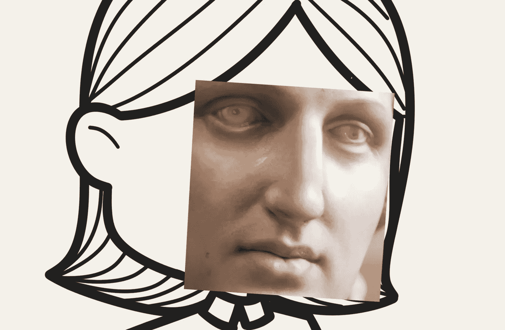

# Cutout、Mixup 和 Cutmix：在 PyTorch 中实现现代图像增强

> 原文：[`towardsdatascience.com/cutout-mixup-and-cutmix-implementing-modern-image-augmentations-in-pytorch-a9d7db3074ad?source=collection_archive---------7-----------------------#2023-04-14`](https://towardsdatascience.com/cutout-mixup-and-cutmix-implementing-modern-image-augmentations-in-pytorch-a9d7db3074ad?source=collection_archive---------7-----------------------#2023-04-14)

## 用 Python 实现的计算机视觉数据增强技术

 [Leonie Monigatti](https://medium.com/@iamleonie?source=post_page-----a9d7db3074ad--------------------------------)

·

[关注](https://medium.com/m/signin?actionUrl=https%3A%2F%2Fmedium.com%2F_%2Fsubscribe%2Fuser%2F3a38da70d8dc&operation=register&redirect=https%3A%2F%2Ftowardsdatascience.com%2Fcutout-mixup-and-cutmix-implementing-modern-image-augmentations-in-pytorch-a9d7db3074ad&user=Leonie+Monigatti&userId=3a38da70d8dc&source=post_page-3a38da70d8dc----a9d7db3074ad---------------------post_header-----------) 发表在 [Towards Data Science](https://towardsdatascience.com/?source=post_page-----a9d7db3074ad--------------------------------) ·9 分钟阅读·2023 年 4 月 14 日

--

Cutmix 图像增强（背景图像由作者绘制，使用 DALLE 生成的人工雕像照片）

几乎可以保证，应用数据增强技术会提高神经网络的性能。增强是一种正则化技术，它通过人工扩展训练数据，帮助你的深度学习模型更好地泛化。因此，图像增强可以提高模型的性能。

> 图像增强可以提高模型性能

用于计算机视觉中卷积神经网络的经典图像增强技术包括缩放、裁剪、翻转或旋转图像。

在一篇关于中级深度学习技术的最新文章中，我们了解到，除了经典技术之外，最有效的图像增强技术包括：

+   Cutout [2]

+   Mixup [4]

+   Cutmix [3]

数据增强技术：Mixup、Cutout、Cutmix

本文将简要描述上述图像增强技术及其在 PyTorch 中的 Python 实现。
