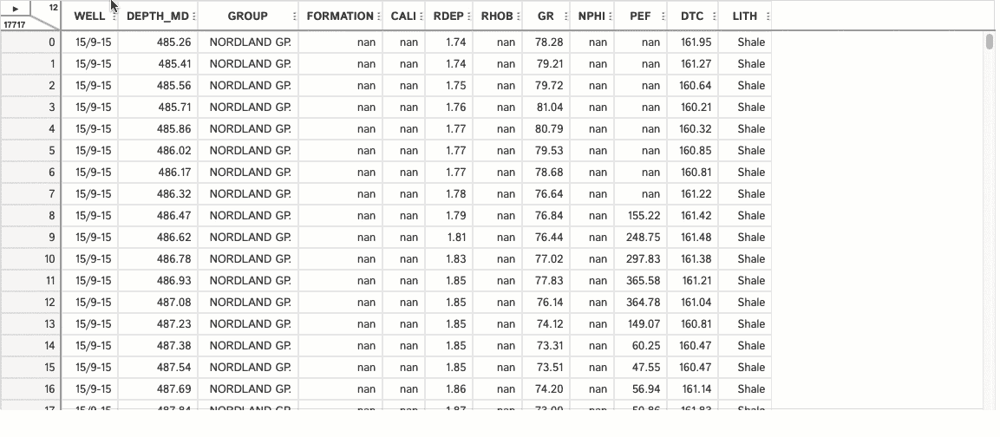

# 使用 D-Tale 快速轻松地进行井日志数据的探索性数据分析

> 原文：[`towardsdatascience.com/d-tale-for-fast-and-easy-exploratory-data-analysis-of-well-log-data-a2ffca5295b6`](https://towardsdatascience.com/d-tale-for-fast-and-easy-exploratory-data-analysis-of-well-log-data-a2ffca5295b6)

## 使用 D-Tale Python 库加速探索性数据分析工作流

[](https://andymcdonaldgeo.medium.com/?source=post_page-----a2ffca5295b6--------------------------------)[](https://towardsdatascience.com/?source=post_page-----a2ffca5295b6--------------------------------) [Andy McDonald](https://andymcdonaldgeo.medium.com/?source=post_page-----a2ffca5295b6--------------------------------)

·发表于 [Towards Data Science](https://towardsdatascience.com/?source=post_page-----a2ffca5295b6--------------------------------) ·阅读时间 9 分钟·2023 年 2 月 13 日

--


图片由 [Photo Mix](https://pixabay.com/users/photomix-company-1546875/?utm_source=link-attribution&utm_medium=referral&utm_campaign=image&utm_content=1433427) 提供，来源于 [Pixabay](https://pixabay.com//?utm_source=link-attribution&utm_medium=referral&utm_campaign=image&utm_content=1433427)

探索性数据分析（EDA）可能是数据科学和机器学习工作流中耗时但至关重要的一部分。通过这个过程，我们可以熟悉我们的数据集，了解其内容，概览数据的统计信息等等。我们在许多项目中大部分时间都花在这个阶段。[在某些情况下，这可能占到可用项目时间的 90%](https://www.researchgate.net/publication/357867454_Data_Quality_Considerations_for_Petrophysical_Machine-Learning_Models)。

在 Python 中进行 EDA 时，我们通常依赖像 pandas 和 matplotlib 这样的库来探索数据。通常，这会导致编写大量代码以将绘图显示为我们希望的方式。例如，[使用 matplotlib 创建井日志图需要花费时间来处理和正确显示数据。](https://medium.com/@andymcdonaldgeo/loading-and-displaying-well-log-data-b9568efd1d8)

有几个 Python 库可以显著加快项目的 EDA 阶段。其中之一是 [D-Tale](https://pypi.org/project/dtale/)。

[D-Tale](https://pypi.org/project/dtale/)是一个强大的探索性数据分析 Python 库，它使您能够方便地以交互方式查看、分析和编辑 pandas 数据框中的数据。如果您想在不下载的情况下探索 D-Tale 的功能，可以查看这个[实时示例](http://alphatechadmin.pythonanywhere.com/dtale/main/1)。

要在您自己的系统上开始使用 D-Tale，您需要通过终端安装它，并运行以下命令。

```py
pip install dtale
```

如果您使用的是 Anaconda，您需要使用以下命令：

```py
conda install dtale
```

# 导入库和加载数据

任何 Python 项目的第一步是导入我们将要使用的库。在这种情况下，我们只需要[pandas](https://pandas.pydata.org/)来从 CSV 文件中加载数据，以及[D-Tale](https://pypi.org/project/dtale/)来进行分析。

```py
import pandas as pd
import dtale
```

一旦导入了库，我们就可以导入数据。以这个例子为例，我们将使用从挪威海岸的多个石油和天然气井中获取的测井数据。我们为本教程使用的数据集是 Xeek 和 FORCE 2020 机器学习竞赛使用的训练数据集的一个子集*(Bormann et al., 2020)*。该数据集在挪威政府的 NOLD 2.0 许可证下发布，详细信息可以在这里找到：[挪威开放政府数据许可证（NLOD）2.0](https://data.norge.no/nlod/en/2.0/)。完整的数据集可以在[这里](https://doi.org/10.5281/zenodo.4351155)访问。

要读取数据，我们调用以下内容：

```py
df = pd.read_csv('Data/Xeek_Well_15-9-15.csv')
```

# 将数据加载到 D-Tale 中

一旦数据加载完成，我们就可以开始探索数据集。通常在处理数据时，我们会使用几个 pandas 函数。然而，使用 D-Tale 时，我们只需调用以下内容：

```py
dtale.show(df)
```

一旦我们调用`dtale.show(df)`，我们将看到一个类似下面的交互式数据表。这提供了比我们习惯使用的基本 pandas 函数更好的、更友好的体验。


D-Tale 创建的测井数据交互数据框。图片来源：作者。

在显示的左上角，我们可以看到两个数字。底部的数字（17717）表示数据框中存在的行数，右侧的数字（12）表示列数。


D-Tale 的行和列计数信息。图片来源：作者。

如果我们点击指向右侧的三角形，我们将看到以下菜单，该菜单提供了许多功能来简化数据分析。


D-Tale 中的菜单选项。图片来源：作者。

由于 D-Tale 中有许多选项，我们将只关注其中的一些。

# 使用 D-Tale 的数据摘要

使用 [pandas](https://pandas.pydata.org/) 时，我们经常调用 `[.describe()](https://pandas.pydata.org/docs/reference/api/pandas.DataFrame.describe.html)` [方法](https://pandas.pydata.org/docs/reference/api/pandas.DataFrame.describe.html) 来获取数据集的一些总结统计信息。通过 D-Tale，我们也可以做到这一点，但同时会获得更多的信息。

从上面的菜单中，我们只需选择“描述”。这将打开一个新页面，显示摘要信息。

在下面的示例中，我们可以看到，当选择 WELL 列时，我们得到关于该列内容的信息。由于该列的数据类型为字符串，我们可以获得关于字符、字符串长度以及该列中唯一值的详细信息。

如果你处理的是包含多个井信息的 CSV 文件，并且需要知道这些井是什么，那么这个功能尤其方便。


使用 D-Tale 创建的列摘要。图片由作者提供。

如果我们查看 LITH 列，我们将看到相同类型的摘要，但现在我们会看到该列中所有存在的岩性。

再次说明，当我们探索井日志数据时，这个功能很有用，因为我们通常对某些岩性感兴趣，用于岩石物理和井日志分析。


使用 D-Tale 创建的岩性列摘要。图片由作者提供。

我们可以通过点击“值计数”按钮，进一步探索 LITH 数据。这将展示一个漂亮的条形图，说明数据集中每种岩性的出现次数。


D-Tale 中的条形图，显示井中不同岩性的出现情况。图片由作者提供。

如果我们对数值数据做相同的处理，我们可以获得一些额外的选项来可视化我们的数据集。

例如，如果我们查看数据集中的 DTC（声波压缩慢度）列，我们可以获得关于数据的关键统计信息，包括均值、百分位数、标准差等。

我们还可以得到一个漂亮的箱线图，显示数据的分布情况。

在摘要底部，我们有该列中唯一值的信息，以及查看任何异常值的选项。


使用 D-Tale 创建的数值曲线数据摘要。图片由作者提供。

如果我们点击直方图按钮，我们可以在一个组合的直方图和 KDE 图上查看 DTC 列的值分布。这是一种非常常见的数据可视化方式，可以让我们查看数据的分布情况。在下面的示例中，我们有一个双峰分布，第一个峰值大约为 85 us/ft，第二个峰值大约为 157 us/ft。

在这个页面上，我们还可以选择更改直方图的箱数。如果我们想增加或减少查看的细节层次，这个功能非常有用。


D-Tale Describe 模块中的交互式直方图。图像由作者提供。

D-Tale 的 Describe 部分的一个很棒的功能是按类别查看值的能力。

在进行岩石物理或井眼日志分析时，我们通常希望查看不同地质层或岩性的值如何不同。这个图表提供了部分功能，使我们能够快速理解每组中的值。


通过岩性或地质层等类别轻松可视化数据。图像由作者提供。

## 使用 D-Tale 可视化数据完整性

在处理数据集时，[在开始应用高级分析或机器学习之前考虑数据集的完整性是至关重要的](https://medium.com/towards-data-science/data-quality-considerations-for-machine-learning-models-dcbe9cab34cb)。有一些可用的库；我最喜欢的之一是[missingno](https://github.com/ResidentMario/missingno) — 这是一个简单易用的 Python 库，已经集成到 D-Tale 中。

如果我们进入菜单并选择 Visualise，然后选择 Missing Analysis，我们将能够查看[missingno](https://github.com/ResidentMario/missingno)图表。



使用 D-Tale 分析和理解井眼日志数据集的数据完整性。图像由作者提供。

有关这些图表的更多信息，请查看下方我的文章，其中我探讨了这个库的功能。

## 使用 missingno Python 库在机器学习之前识别和可视化缺失数据

### 使用岩石物理井眼日志测量的示例

[towardsdatascience.com

# 使用 D-Tale 的交互式图表可视化数据

数据科学和岩石物理学的一个关键方面是可视化数据。这使你可以感觉到数据，而不是仅仅查看表中的原始数字。

要访问这些图表，我们需要导航到 D-Tale 菜单中的 Visualise → Charts。选择后，将打开一个新的浏览器标签页。

从这里开始，我们有大量选项可以选择。

## 创建折线图

在岩石物理学中，一个关键的图表是日志图。这本质上是一个折线图，其中一个轴上绘制了深度，另一个轴上绘制了记录的测量值。这使我们能够可视化测量值在井眼中的变化，从而可以解读所钻探的地质。


使用 D-Tale 中的折线图生成的简单日志图。图片由作者提供。

我们甚至可以在每个折线图中绘制多个曲线并控制它们的比例。这对于创建密度-中子折线图非常有用。不幸的是，我们无法对该图表应用岩性阴影，但这只是一个小问题。


使用 D-Tale 创建的密度-中子日志绘图轨迹。图片由作者提供。

然而，一个非常有用的功能是能够按类别为线着色。这在尝试理解不同地层内的日志响应时尤其有用。


使用 D-Tale 创建的日志绘图轨迹/折线图显示了按不同地层着色的体积密度日志。图片由作者提供。

## 使用 D-Tale 创建散点图（交叉图）

散点图（在岩石物理学中也称为交叉图）允许我们将两个变量相互对比。这使我们能够识别趋势、岩石物理方程的关键解释参数，以及数据之间的关系。

在 D-Tale 中，我们可以轻松创建非常常见的岩石物理图。密度-中子交叉图。

D-Tale 提供了大量选项来自定义绘制的数据。一旦选择了 x 轴和 y 轴变量，我们还可以选择第三个变量来为图表着色。


散点图显示了在 D-Tale 的 Charts 模块中密度和中子孔隙度数据。图片由作者提供。

这个界面的一大优点是我们可以去除不希望绘制的组，以便集中关注重要的组。


散点图显示了在 D-Tale 的 Charts 模块中，去除某些组后的密度和中子孔隙度数据。图片由作者提供。

这个设置的一个小问题是我们无法控制标记的大小或形状。能够使标记更小，以便看到更多的数据点将是很好的。

# 使用 D-Tale 的 Pearson 相关矩阵

在构建用于岩石物理属性预测的机器学习模型时，我们希望识别任何我们将使用的预测变量是否彼此之间高度相关——这是一个称为多重共线性的问题。我们还希望能够识别出在模型中预测目标变量最合适的变量。

要显示相关性矩阵，我们可以进入菜单并选择相关性。这将返回一个热图，显示每个数值变量的 Pearson 相关系数。


使用 D-Tale 的井日志测量之间的相关性。图片由作者提供。

从返回的表格中，我们可以看到一些测井测量值之间具有较高的相关性。例如，RHOB 和 DTC 之间有很强的负相关，这也是预期的。岩石孔隙度越高，密度（RHOB）值越低，声波压缩慢度（DTC）越高。

# 总结

D-Tale Python 库在探索性数据分析方面非常强大，对于测井数据的质量控制和早期分析也非常有用。本文仅覆盖了 D-Tale 内部功能的一小部分，但它们非常强大，能够显著加快测井数据集中的数据 QC 和探索阶段。这是你数据科学工具包中应该拥有的一个库。

*感谢阅读。在你离开之前，你应该订阅我的内容，以便在你的收件箱中获取我的文章。* [***你可以在这里做到这一点！***](https://andymcdonaldgeo.medium.com/subscribe)*或者，你可以* [***注册我的新闻通讯***](https://fabulous-founder-2965.ck.page/2ca286e572) *，以免费获取额外内容。*

*其次，你可以通过注册会员来获得完整的 Medium 体验，支持数千位其他作者和我。只需每月 $5，你就可以访问所有精彩的 Medium 文章，还可以通过你的写作赚取收入。*

*如果你通过* [***我的链接***](https://andymcdonaldgeo.medium.com/membership)***注册***，*你将直接支持我，并且这不会增加你的费用。如果你这样做，非常感谢你的支持。*
