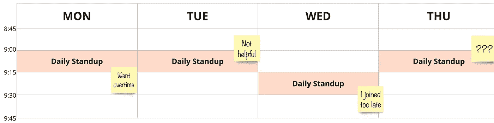

# 日常站会可能不会提升团队的敏捷性

> 原文：[`towardsdatascience.com/daily-standups-may-not-improve-your-teams-agility-87da475ff57c`](https://towardsdatascience.com/daily-standups-may-not-improve-your-teams-agility-87da475ff57c)

## 如果你觉得日常站会对你的数据科学团队没有帮助，你可能是对的

 [Benjamin Thürer](https://medium.com/@benjamin.thuerer?source=post_page-----87da475ff57c--------------------------------)

·发表于[Towards Data Science](https://towardsdatascience.com/?source=post_page-----87da475ff57c--------------------------------) ·阅读时间 5 分钟·2023 年 6 月 7 日

--

敏捷团队最常见的会议或仪式之一是日常站会。它通常很简短（最多 15 分钟），大多数时候在一天中的相同时间举行，并且每个团队成员都必须参加。从理论上讲，这个会议可以是对齐团队的一个很好的方式，确保每个团队成员都知道其他人当前在做什么，并暴露他们面临的挑战。这使得日常站会也成为数据团队的畅销书。到目前为止，一切都很好，如果你觉得站会对你的数据团队有很大的帮助并使你高效，那么没有必要继续阅读，因为“永远不要改变一个正在运行的系统”。

> “…许多团队进行日常站会只是因为有人告诉他们这样做，或者因为它们一直被这样做。”

# 日常站会的常见问题

然而，在实践中，日常站会通常并不像上面描述的那样有益。我认识的大多数数据团队都难以遵守时间表，其他团队则在让每个人始终参与或做好准备方面遇到困难。所有这些都是团队需要更深入讨论的明显迹象，或者他们没有看到站会的巨大价值。即使对于那些没有这些问题且按书本进行专业站会的团队，由于时间短，站会通常处于较高层次，更像是一个报告工具，而不是帮助团队完成工作的工具。我确实相信许多团队进行日常站会只是因为有人告诉他们这样做，或者因为它们一直被这样做。

这导致数据团队每天都开不必要的会议，每周每个团队成员浪费约 1.15 小时的宝贵时间。当然，一个解决方案是更严格地遵循常见的敏捷和 Scrum 建议。但还有另一个选择：重新考虑你实际上想通过这些会议解决什么。接下来，我将向你展示如何轻松地用替代方案取代每日站会，并利用节省下来的时间进行每周的*团队时间*，以深入支持你的数据科学家和数据分析师的需求。

5 人团队每天进行 15 分钟站会的预计年度“成本”（估算每人每小时 300 美元，年工作 45 周）。

# 你应该什么时候重新考虑每日站会？

既然每日站会已被证明是有用的，并不意味着所有数据团队现在都应该停止这一做法。然而，对于某些团队来说，尝试其他仪式可能会有很大的好处。一种方法是直接与团队开诚相见。某些团队成员可能已经对这个话题有很强的看法。否则，我会给你提供一个列表，如果以下至少一个点成立，我会考虑采取新的方法：

+   你之所以进行站会，仅仅是因为其他人也这样做

+   你之所以进行站会，仅仅是因为在你加入团队之前就已经这样做了

+   你的站会经常超时

+   在你的站会上，团队通常讨论私人话题

+   团队成员经常缺席站会

+   大多数团队成员没有准备好或没有要提出的事项

+   站会更像是向团队领导汇报，而不是帮助团队成员

# 替代方案有哪些？

如果上述一个或多个点成立，你的团队可能会从不同的方法中受益。然而，关于替代方案的问题很大程度上取决于基本问题的答案：“站会应该改善你团队的什么？”当你找到这个问题的答案时，提出替代方案可以变得很直接。对我来说，每日站会的目的有三重，我会分别解决这三个目的。这三个目的分别是：

1.  **团队更新**：向团队通报每个人目前在做什么以及面临哪些挑战。

1.  **支持**：从团队成员那里获得帮助，以解决复杂的问题。

1.  **社交**：作为一个团队聚在一起，培养团队精神。

使用 Geekbot 在 Slack 中的自动站会示例。此处未显示的额外问题是“今天有任何障碍吗？”。

(**1**) 为了向团队更新现有工作和挑战，可能完全可以选择不召开会议。这种更新是在一个非常高层次上，可以很容易通过虚拟站会离线完成。例如，我们使用一个[geekbot](http://www.geekbot.com)来配合[slack](http://www.slack.com)，它会要求所有团队成员提供简短的更新。其他替代方案可以是使用[技术图纸](https://medium.com/towards-data-science/success-in-ml-projects-through-technical-drawings-69dd8d2744a4)或敏捷工作管理工具，并确保每个团队成员每天更新他们的任务/卡片。

使用[技术图纸](https://medium.com/towards-data-science/success-in-ml-projects-through-technical-drawings-69dd8d2744a4)来更新数据科学团队的工作流程。

(**2**) 为了确保每个团队成员得到他们需要的支持，我强烈推荐每周至少召开一次较长时间的团队会议，我们称之为“*团队时间*”。这次会议应该持续 30-45 分钟，并确保有足够的时间真正搞清楚问题并找到解决方案。每个团队成员都可以提出一个主题，团队一起讨论。如果没有需要讨论的挑战，这也是其他知识分享方式的绝佳论坛。当你总结这些成本时，你会发现它们和每日站会的成本相似甚至更高，但这些会议实际上是有帮助的，因为它们允许团队解决问题并分享知识，从而取代其他会议，使工作更加高效。

(**3**) 社交方面是一个很少被提及的每日站会的需求。但对我而言，这是一个误解。一个健康且具有社交性的团队将永远是一个高效的团队。发展良好的团队氛围和精神应是每个人的关键利益。上述提到的*团队时间*可以服务于这一目的，但除此之外，还应该定期举行社交活动或其他形式的社交互动。

回顾过去，进行专门的会议并利用这段时间进行更长时间的深入*团队时间*会议，是我团队过去做出的最佳决策之一。实际上，我们每周有 2 次*团队时间*。

# **总结**

如果你的数据团队没有看到定期站会的必要，这可能表明其他替代方案更为有效。高层次的团队更新可以通过自动聊天工具完成，深入讨论的主题可以在专门的团队会议中讨论，而社交活动可以确保团队精神。根据团队的需求，这些替代方案可能需要相同的时间，但从长远来看，会使团队更高效。

*除非另有说明，否则所有图片均为作者提供。*
