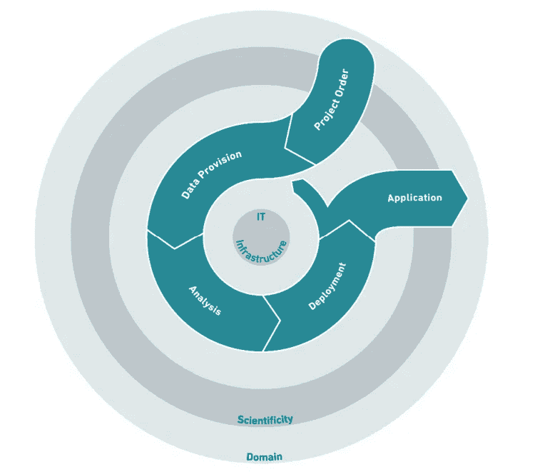
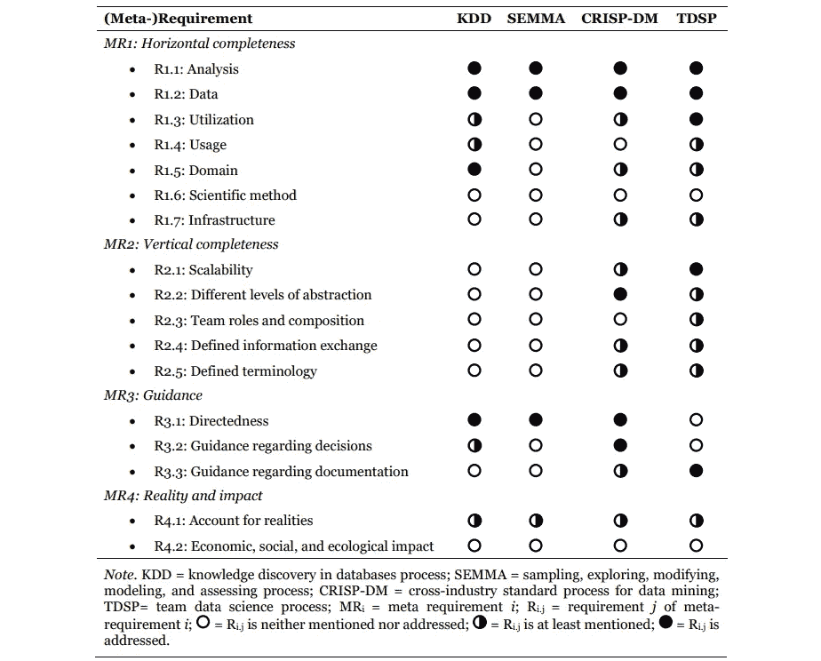
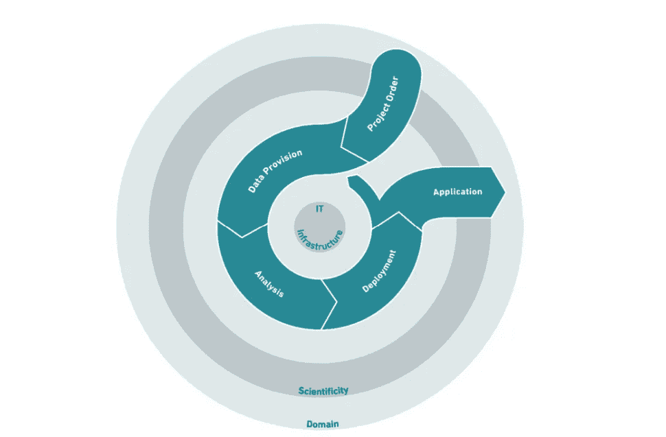
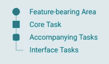
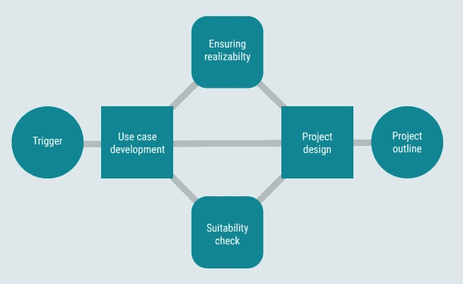
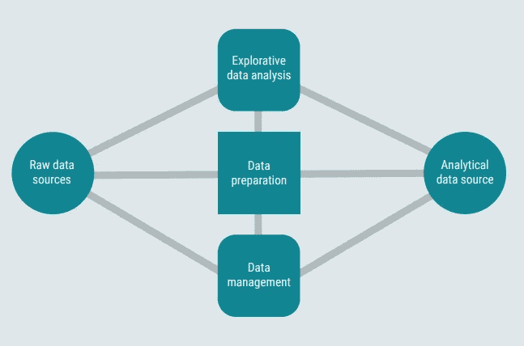
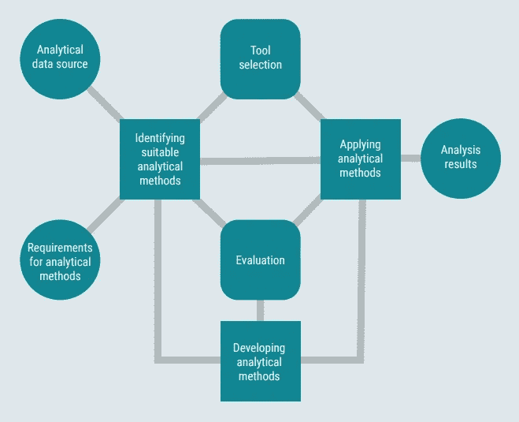
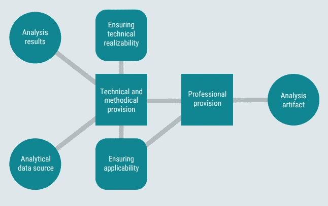
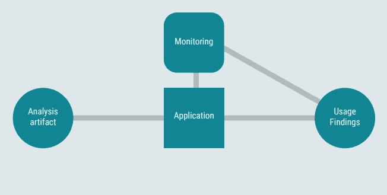

# DASC-PM：数据科学项目的新型流程模型

> 原文：[`towardsdatascience.com/dasc-pm-a-novel-process-model-for-data-science-projects-9f872f2534b1?source=collection_archive---------8-----------------------#2023-02-07`](https://towardsdatascience.com/dasc-pm-a-novel-process-model-for-data-science-projects-9f872f2534b1?source=collection_archive---------8-----------------------#2023-02-07)

## 引入 CRISP-DM 流行方法的一种替代方法

 [Jonas Dieckmann](https://medium.com/@jonas_dieckmann?source=post_page-----9f872f2534b1--------------------------------)

·

[关注](https://medium.com/m/signin?actionUrl=https%3A%2F%2Fmedium.com%2F_%2Fsubscribe%2Fuser%2F1c8d1cf684f2&operation=register&redirect=https%3A%2F%2Ftowardsdatascience.com%2Fdasc-pm-a-novel-process-model-for-data-science-projects-9f872f2534b1&user=Jonas+Dieckmann&userId=1c8d1cf684f2&source=post_page-1c8d1cf684f2----9f872f2534b1---------------------post_header-----------) 发表在 [Towards Data Science](https://towardsdatascience.com/?source=post_page-----9f872f2534b1--------------------------------) ·8 分钟阅读·2023 年 2 月 7 日

--

有了对数据的轻松获取，计算能力的增加和用户友好的分析软件，各行各业的数据科学项目数量急剧增加。尽管早期的感觉就像是西部荒野一样，但现在更常见（也更推荐）为与数据相关的项目遵循特定的框架。

**过程模型**为定义和组织项目生命周期中的任务、活动和可交付成果提供了清晰和结构化的方法。通过实施一致的过程，团队可以确保实现所有项目目标，并且最终的可交付成果具有较高的质量。此外，过程模型有助于减少延迟、错误和预算超支的风险，使其成为数据科学项目管理的必要组成部分。

> 请注意，整篇文章只是对框架的快速介绍和简要总结，该框架是由一个**较大的作者团队**制作的，而我是 DASC-PM v1.1 的合著者之一。
> 
> ***Schulz 等人（2022 年）：*** *“*[*DASC-PM v1.1 — 用于数据科学项目的过程模型*](https://www.researchgate.net/publication/361428426_DASC-PM_v11_-_A_Process_Model_for_Data_Science_Projects)*”**(2022)， 出版商：NORDAKADEMIE gAG Hochschule der Wirtschaft, ISBN：978–3–00–064898–4, DOI：*[*10.25673/32872.2*](http://dx.doi.org/10.25673/32872.2)

数据科学过程模型 DASC-PM（Schulz 等，2022 年）

**DA**ta **SC**ience **-** **P**rocess **M**odel（[DASC-PM](https://www.researchgate.net/publication/361428426_DASC-PM_v11_-_A_Process_Model_for_Data_Science_Projects)）是一个描述与项目相关的关键领域和待完成阶段的新颖的数据科学项目过程模型。它解释了各个阶段内的典型任务，并描绘了涉及的项目角色和所需的能力。以下文章旨在介绍主要概念，并阐明与已知概念（如[CRISP-DM](https://www.researchgate.net/publication/239585378_CRISP-DM_Towards_a_standard_process_model_for_data_mining)）、[TDSP](https://docs.microsoft.com/en-us/azure/architecture/data-science-process/lifecycle)、[KDD](http://www2.cs.uregina.ca/~dbd/cs831/notes/kdd/1_kdd.html)或[SEMMA](https://www.datascience-pm.com/semma/)）的优势。

# 一种新方法的兴起

基于跨行业标准数据挖掘过程（CRISP-DM），已经存在一个众所周知的“独立于行业部门和所使用的技术的数据挖掘项目执行框架。” [4] 除此之外，其他相关概念如 TDSP、SEMMA 或 KDD 旨在提供在几个细节上相互超越的可比较模型。然而，有兴趣退后一步来识别对数据科学过程模型有关的（元）需求。这些需求是通过 2019 年 4 月至 2020 年 2 月的调查收集而来，涵盖了科学和实践两个方面，因此回答了第一个研究问题 [2]：

> 对数据科学过程模型施加了哪些理论和实际要求？

数据收集在一个由 22 名专家组成的工作组中进行，包括 9 名教授以及 13 名具有相关理论和实践经验的数据科学从业者和科学家。在此基础上，研究了相关流程模型在多大程度上满足先前收集的要求。下面的表格提供了根据具体要求和流程模型对调查结果的概述。填充的 Harvey 球表示一个要求被相应的流程模型满足，半填充的表示一个要求至少被提及，空白的表示一个要求既未提及也未满足。[2]

（元）数据科学流程模型的要求（Schulz 等，2020）

认识到相关的知名流程模型没有一个能够满足对数据科学项目流程模型提出的 17 项要求，*Schulz 等* 开发了一种新的数据科学流程模型，称为 DASC-PM，以解决第二个研究问题 [2]：

> 如何构思一个与相关理论和实践要求对齐的数据科学流程模型？

# 五个 DASC-PM 阶段的简要介绍

在接下来的部分，我们将简要介绍新创建的流程模型中的五个核心阶段的主要思想：项目订单、数据提供、分析、部署和应用。[3]

数据科学流程模型 DASC-PM（Schulz 等，2022）

*相应的领域和任务将以以下方式可视化：*

阶段表示图例（Schulz 等，2022）

## 阶段 1：项目订单

领域内存在的问题触发了用例开发。随后，有前景的用例被配置为数据科学项目概要。所有相关任务都在项目订单阶段反映。通过对项目的早期、相对全面的考虑，这里也常常需要几乎所有技能领域的全面能力。[3]

阶段 1：项目订单（Schulz 等，2022）

## 阶段 2：数据提供

在数据提供阶段，所有可以分配到数据关键领域的活动都被总结，因此使用的术语被广泛地表述。该阶段包括数据准备（从记录到存储）、数据管理和探索性数据分析。该阶段产生一个适合进一步分析的数据源。[3]

阶段 2：数据提供（Schulz 等，2022）

## 阶段 3：分析

在数据科学项目中，可以使用现有的程序或开发新的程序，相关决策本身是一个独立的挑战。因此，这个短语不仅包括执行分析，还包括相关活动。该阶段的工件是经过方法论和技术评估的分析结果。[3]

第三阶段：分析（Schulz 等，2022）

## 第四阶段：部署

在部署阶段，创建分析结果的适用形式。根据项目的不同，这可能需要全面考虑技术、方法论和专业任务——或者可以以务实的方式处理。分析工件可以包括结果、模型或过程，并以各种形式提供给目标受众。[3]

第四阶段：部署（Schulz 等，2022）

## 第五阶段：应用

项目执行后使用工件并不是数据科学项目的主要部分。然而，监控是必要的，以检查模型在应用中的持续适用性，并从应用中获得用于持续和新发展的发现（包括用于迭代方法的开发）。[3]

第五阶段：应用（Schulz 等，2022）

# 覆盖关键领域

除了这五个过程步骤之外，该模型还包含三个覆盖所有项目阶段的关键领域：

## 领域

在数据科学过程中的许多环节，都需要广泛的领域背景知识。例如，分析目标的识别或对数据及其来源、质量和联系的正确理解。其他例子包括在应用中的分析结果的评估和分类，以及随后的实际使用。领域“Domain”还包括对现有解决方案的优缺点评估、需求分析、模型参数化的支持，以及最终的项目成功评估。数据科学项目的法律、社会和伦理方面也将在这里讨论。[1]

## 科学性

数据科学项目虽然本质上是科学的，但并不意味着它们声称是完整的、正式的、学术的或一致以研究为导向的。虽然这可能确实适用于研究项目，但在商业环境中的科学性主要指的是一个稳固的方法论：这是科学工作的通常预期特征或最低要求。[1]

所定义的项目顺序必须在每个项目阶段中系统化处理。在这里，特别需要提到的是项目管理和通过使用过程模式突出的结构化处理。必须在考虑项目情况和领域特定内容的同时，明确所需的科学性程度。[1]

## IT 基础设施

数据科学项目的所有步骤都依赖于基础 IT 基础设施；然而，实际的 IT 支持范围应针对每个项目进行单独评估。即使特定的硬件和软件的使用在组织内经常被确定，也必须在所有项目阶段中考虑 IT 基础设施的限制性和赋能特征（以及在适用情况下扩展基础设施的可能性）。[1]

# 摘要

DASC-PM 是一种科学方法的结果，用于收集、结构化和处理数据科学领域中的（元）需求。由于所有现有的、知名的模型都未能满足所有定义的要求，因此有必要引入一种新颖的概念，使研究人员和商业及工业实践者能够使用 DASC-PM 以阶段导向的方式结构化数据科学项目。然而，作者声称 DASC-PM 不应被视为一个完成的交付物，而应被视为一个可以通过科学和实践讨论不断改进的框架。

 [## Jonas Dieckmann - Medium

### 阅读 Jonas Dieckmann 在 Medium 上的文章。分析经理 & 产品负责人 @ Philips | 热情地写作和谈论……

medium.com](https://medium.com/@jonas_dieckmann?source=post_page-----9f872f2534b1--------------------------------)

希望你觉得这很有趣。告诉我你的想法，并随时在 LinkedIn [`www.linkedin.com/in/jonas-dieckmann`](https://www.linkedin.com/in/jonas-dieckmann/) 上与我联系，或在 Medium 上关注我。

# 另见我其他的一些文章：

 ## 案例研究：将数据科学过程模型应用于实际场景

### 为供应链中的材料规划开发机器学习模型

towardsdatascience.com  ## 人工智能中的伦理：偏见算法的潜在根本原因

### 理解数据偏差的替代方法

towardsdatascience.com

# 参考文献

*整个文章是对以下框架的简要总结：*

[1] **Schulz et al. (2022):** *“*[DASC-PM v1.1 — A Process Model for Data Science Projects](https://www.researchgate.net/publication/361428426_DASC-PM_v11_-_A_Process_Model_for_Data_Science_Projects)”* (2022)，出版商：NORDAKADEMIE gAG Hochschule der Wirtschaft，ISBN：978–3–00–064898–4，DOI：[10.25673/32872.2](http://dx.doi.org/10.25673/32872.2)

*以及介绍部分：*

[2] **Schulz et al. (2020):** “Introducing DASC-PM: A Data Science Process Model” (2020)。ACIS 2020 会议论文集，45\. [`aisel.aisnet.org/acis2020/45`](https://aisel.aisnet.org/acis2020/45)

*另一个可引用的来源在以下书籍中提供：*

[3] **Kuehnel, S., Neuhaus, U., Kaufmann, J., Schulz, M., Alekozai, E.M. (2023)**。“Using the Data Science Process Model Version 1.1 (DASC-PM v1.1) for Executing Data Science Projects: Procedures, Competencies, and Roles。”在：Barton, T., Müller, C. (编) 应用数据科学。Springer Vieweg，维斯巴登。 [`doi.org/10.1007/978-3-658-38798-3_8`](https://doi.org/10.1007/978-3-658-38798-3_8)

其他参考文献：

[4] **Wirth, R., Hipp, J. (2000)** “CRISP-DM: Towards a Standard Process Model for Data Mining”，第 4 届国际知识发现与数据挖掘应用会议论文集，第 29–39 页。
